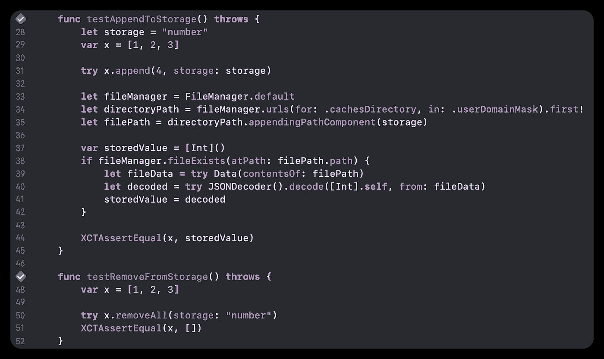
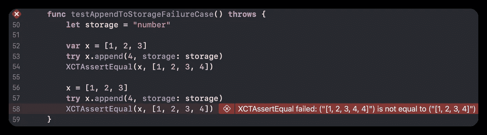
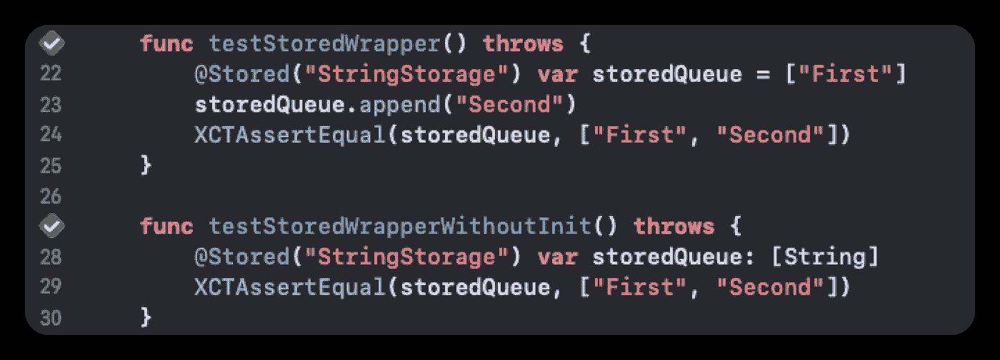
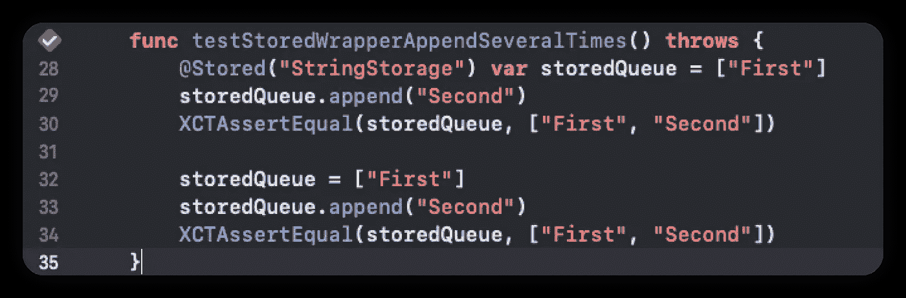
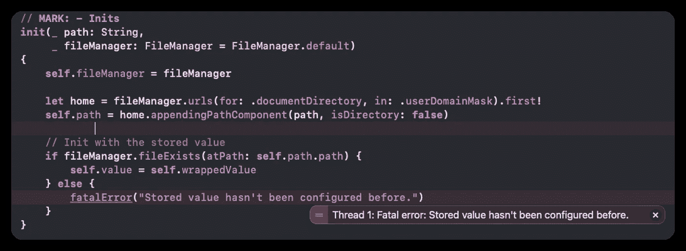

# 简化磁盘 SwiftUI 数据管理的 3 种简单方法

> 原文：<https://betterprogramming.pub/swift-3-ways-to-make-managing-on-disk-data-effortless-d42e1bc2cdd4>

## 应用存储、自定义扩展、自定义属性包装


照片由[马腾·范·登·霍维尔](https://unsplash.com/@mvdheuvel?utm_source=medium&utm_medium=referral)在 [Unsplash](https://unsplash.com?utm_source=medium&utm_medium=referral) 上拍摄

有几种方法可以在 iOS 环境中管理磁盘上的数据，比如像 [CoreData](https://www.google.com/url?sa=t&rct=j&q=&esrc=s&source=web&cd=&ved=2ahUKEwjSkYPGnZr4AhUSZd4KHZ5KDSoQFnoECA0QAQ&url=https%3A%2F%2Fdeveloper.apple.com%2Fdocumentation%2Fcoredata&usg=AOvVaw2FxOgffO2RE0YsrYYTlBME) 和 [Realm](https://www.google.com/url?sa=t&rct=j&q=&esrc=s&source=web&cd=&ved=2ahUKEwjB94K4nZr4AhUWEYgKHbtwAVAQFnoECAgQAQ&url=https%3A%2F%2Frealm.io%2F&usg=AOvVaw15npDRZX982bltpEvaLAV0) 这样的库。此外，那些使用简单项目或轻量级应用程序的人可以很容易地想到其他的选择:`UserDefaults`和`FileManager`。

`UserDefaults`和`FileManager`是流行的本地 API，可能足以满足大多数期望的规范。然而，除了它的可及性，还有一个不容忽视的问题。

**用起来很恐怖。**

想象一下你不断从磁盘中保存和加载一个`array`的情况。每次向`array`添加一个元素，都要遵循加载、解码、追加、编码并最终保存数据的例程。太麻烦了。

通过这篇文章，我将向你展示我是如何处理这种枯燥、重复的工作，并使我的代码更加干净和健壮的。

那我们开始吧！

# 摘要

1.  原生功能:`AppStorage` (iOS 14+)
2.  自定义`extension`
3.  自定义属性包装

# 应用存储(iOS 14 以上版本)

事实上，我们已经有了一个很好的解决方案`[AppStorage](https://developer.apple.com/documentation/swiftui/appstorage)`。随着 iOS 14 的发布，苹果带来了一个名为`AppStorage`的属性包装器，它简化了很大一部分磁盘数据处理。

这是一个简单的例子，展示了一个根据存储值`isFirst`的状态而变化的 UI 组件。

我需要做的就是用`@Appstorage`包装一个变量，并给它一个唯一的字符串键。然后，它将为我们处理大多数烦人的 I/O 任务，最终，即使在应用程序被终止后，数据也可以持续存在。

它似乎是一个伟大的解决方案，带来了`UserDefault`的所有优点，并消除了大部分缺陷。然而，在使用它之前有一些信息要知道。

**仅支持**`**Int**`**`**Double**`**`**String**`**`**URL**`**`**Data**`**(含可选)。**表示如果要保存`struct`、`class`或`array`，还是要再做`encoding`、`decoding`。********

******从 iOS 14 开始支持。这就是我们一直以来所遭受的痛苦。另外，还得用 **SwiftUI** 才能使用。******

# **自定义扩展**

**自定义扩展的概念是尽可能保持方法最初编写的方式。为此，我们需要能够向磁盘存储的数组添加一个元素，例如:**

```
var testArray = [Int]()
testArray.append(3, storage: "testArrayKey")
```

**实现如下:**

**我重载了两个常用的方法`append`和`removeAll`。与原始版本的唯一区别是它有一个额外的参数`storage`，该参数将用于`FileManager`存储的路径。**

**以下是测试代码的简单用法:**

****

**他们似乎没有问题。然而，有几个问题很容易被忽略。**

****第一，预测初值比较混乱。**我们来看一个这次的失败案例。**

****

**这个例子表明，当你试图改变一个已经在某处初始化的变量的值时，你可能会得到意外的错误。发生这种情况是因为它忽略新值并加载保存的数据，而不是用新值重新定义变量。`AppStorage`也有同样的问题。**

**要解决这个问题，您可以选择请求更多的参数，或者只是警告用户将要发生错误。**

****第二个**，**你要把你需要的东西都一一实现。**我这次只写了`Codable`数组的代码，但是如果你想要更多的方法，比如`filter`、`map`甚至`struct`、`class`，你应该重复同样的事情来写大量的代码。**

# **自定义属性包装**

**为了解决这些挑战，我想出了一个新的解决方案:**属性包装器。****

**以下是测试代码的一些用法:**

****

**相比`extension`，它有三个优点。**

****首先**，你不必重载所有你需要的方法。用`Stored`包装一个变量，你将得到一个持久存储，它拥有该类型最初拥有的所有特性，因为它使用了泛型类型。**

****第二个**，它防止我们得到在定制`extension`中看到的“不可预测的初始值误差”。下面是验证它的测试代码。**

****

**解决了！**

****第三个**，因此变得更加健壮。我们可以通过引发异常来处理特定错误。例如，当试图使用未初始化的值时，我们可以使应用程序崩溃。**

```
func testStoredWrapperNotStoredBefore() throws {
    [@Stored](http://twitter.com/Stored)("NotInitialized") var storedQueue: [String]
} // Throws fatalError
```

****

**这又取决于你是否通过在其他地方抛出和捕捉错误来给第二次机会，或者只是保持严格限制应用程序不可接受的行为的策略。**