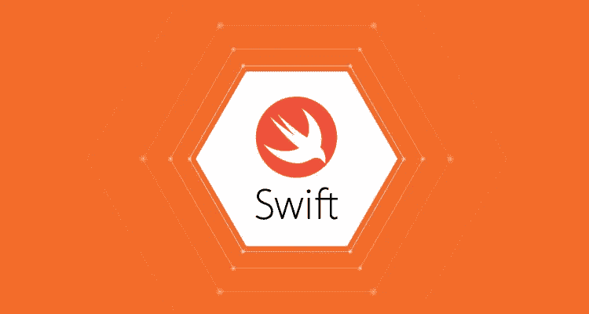

# Swift 5 中的@escaping 关键字是什么？

> 原文：<https://betterprogramming.pub/swift-5-escaping-explained-96051695530>

## 新的和改进的完成处理程序



理解的先决条件:

*   基本 Swift 5 语法。
*   关闭。
*   异步数据处理。

为了完全掌握`@escaping`关键字的作用，我们必须首先理解什么是完成处理程序。

让我们考虑下面的函数:

```
func fetchData(url: String){ print("Fetching data...")
  print("Data has been fetched!")}
```

这是一个非常基本的功能，除了打印到控制台之外什么也不做。到目前为止还没有异步请求。

关于函数，你需要了解的第一件事是它有一个函数作用域。这意味着，当线程执行完这个函数时，这个函数将被丢弃。

你可以把它想象成功能已经被扔掉了。在这种情况下，该函数将在该行之后被丢弃:

```
print("Data has been fetched!")
```

意味着该功能及其范围不再存在。

现在，假设您想要传入一个函数(闭包)在`fetchData`函数执行完毕后执行。通常被称为“完成处理器”我们应该这样写:

```
func fetchData(url: String, completionHandler: () -> ()){ print("Fetching data...")
  print("Data has been fetched!")
  completionHandler()}
```

现在，当我们调用这个方法时，我们作为`completionHandler`的值传入的参数将在函数结束时执行。

记住，在这个例子中，在调用了`completionHandler`之后，函数的作用域仍然被丢弃。

如果你好奇，你可以这样调用这个函数:

```
fetchData("https://www.google.com") { print("Code has finished executing!")}
```

或者:

```
fetchData("https://www.google.com", { () in print("Hello") } )
```

现在，让我们介绍一个揭示`@escaping`含义的问题。

假设在`fetchData`中，我们构建了一个获取数据的请求，一旦数据被返回，我们希望调用我们的完成处理程序。

这看起来是这样的:

现在，在我们的函数中，我们实际上是在函数作用域被破坏后调用我们传入的`completionHandler`闭包。

发生这种情况是因为主线程将执行`URLSession.shared.dataTask()`方法，当它等待响应时，它将继续执行函数的其余部分。

因此，当它仍在等待响应时，它将打印到控制台:“我们的函数作用域即将被销毁”，然后该函数将被丢弃…同时它仍在等待请求的响应。

要解决这个问题，我们需要以某种方式告诉函数:“嘿，当你执行完了，我仍然需要这个完成处理程序，所以不要因为你执行完了就丢弃它。”

这就是`@escaping`发挥作用的地方…

通过将关键字`@escaping`添加到函数定义的`completionHandler`参数中，我们确切地告诉函数:“在这个闭包被执行之前，不要放弃自己。”

让我们看看它的语法:

很简单。

唯一的区别是我们在闭包前添加了`@escaping`。现在，该函数知道在调用`completionHandler`参数之前不要丢弃自己。

所以，让我们称我们的方法为…

```
fetchData("https://www.google.com") { print("Completion Handler called")}
```

现在，打印语句序列将成功记录如下:

```
Function started
Our function scope is going to remain open
Completion Handler called
```

希望你今天学到了一些东西。

干杯。