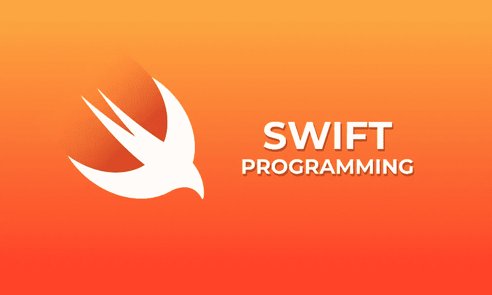

# Swift 5 的懒惰关键字解释

> 原文：<https://betterprogramming.pub/swift-5-lazy-keyword-explained-484cc00f600d>

## 当你准备好的时候，如何运行你的类的代码



理解的先决条件:

*   Swift 5 语法

你可能看到过别人的 Swift 代码中包含关键字`lazy`，但这是什么意思呢？`lazy`关键字用于解决处理速度的问题。

假设我们有一个结构:

```
struct Person { var age: Int = 16}
```

这是一个非常简单的结构。如果我们想访问一个`Person`实例的年龄属性，速度会非常快。我的意思是…我们所做的只是返回一个值。

所以，让我们这样做:

```
let person: Person = Person()
print(person.age)
```

这里没有问题…

现在，如果我们在这个结构中有一个极难计算的属性呢？如果仅仅计算这个属性就花了 6 秒钟呢？

让我们看看实例化实例时实际发生了什么。

当我们将`person`变量赋给一个新的`Person()`时，属性的值被计算并赋值。然后，当我们想要访问它们时，就从它们在内存中的位置检索它们。

让我们使用常见的斐波那契算法来介绍这个问题，这是一种众所周知会引入“计算时间”问题的算法。

我们现在在我们的`Person`结构上有了一个属性，这可能会给我们带来一些问题。

问题是:每次实例化一个类时，都要计算属性来产生实例。

这意味着每次我们只想这样走:

```
let person: Person = Person()
```

我们的代码将计算`fibonacciOfAge`属性。

因为这种递归算法可能会在初始化时造成一点延迟，我们基本上想告诉我们的类如下:“嘿，不要在初始化时计算那个`fibonacciOfAge`属性，只有在我要求时才计算它。”

这就是我们使用`lazy`关键字的目的。让我们解决我们的问题:

通过向该属性添加`lazy`，我们告诉我们的结构不要计算该属性，除非我们特别需要它。

这是将要发生的事情:

```
let person: Person = Person() // fibonacciOfAge NOT computed
print(person.fibonacciOfAge) // fibonacciOfAge IS computed
```

这是一个强大的工具。假设我们想要用十亿人来填充一个游戏，他们都拥有`fibonacciOfAge`属性。当我们开始游戏时，我们不想花费大量的时间来计算他们所有的`fibonacciOfAge`属性。

我们只想实例化所有的人，并且在逐个案例的基础上只计算一个人的`fibonacciOfAge`。

现在，你可能会问这样一个问题:“为什么不是所有东西都是懒惰变量呢？”

我们不把所有东西都分配为惰性变量的原因是，我们仍然希望简单变量有闪电般的响应时间。

如果每次我们想要访问一个属性时，我们都必须计算它，我们的游戏会运行得更慢。

希望这对一些人有帮助！

快乐编码。

干杯。