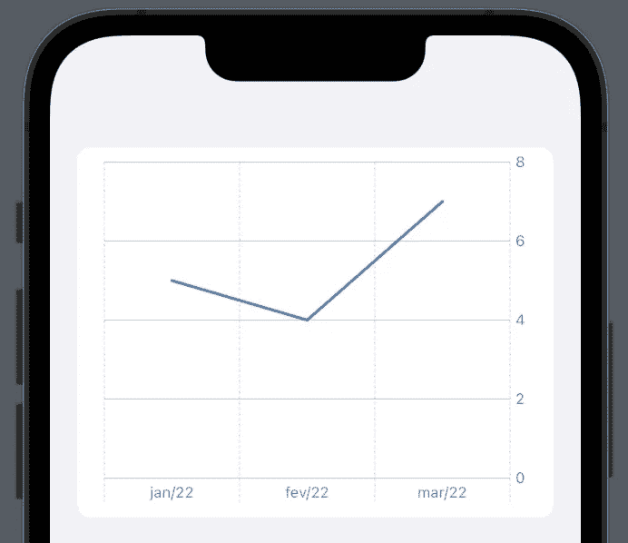
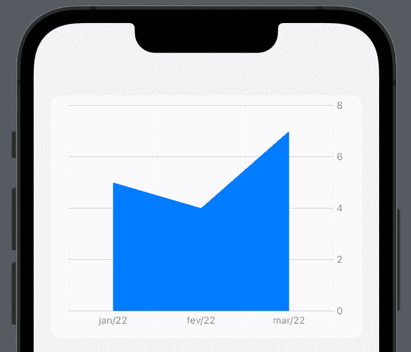
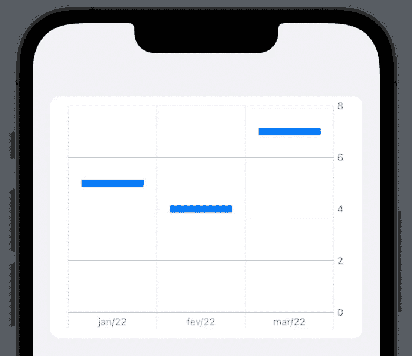
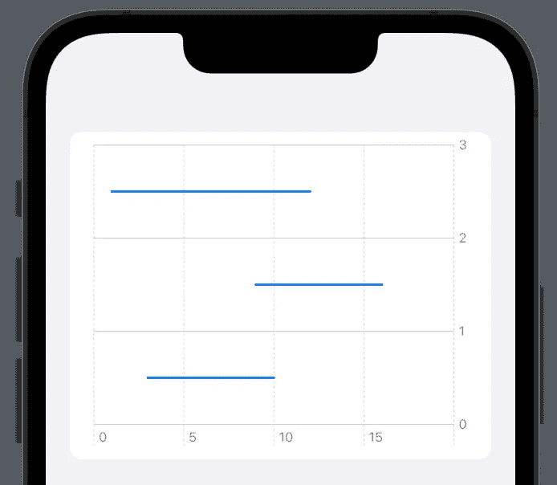
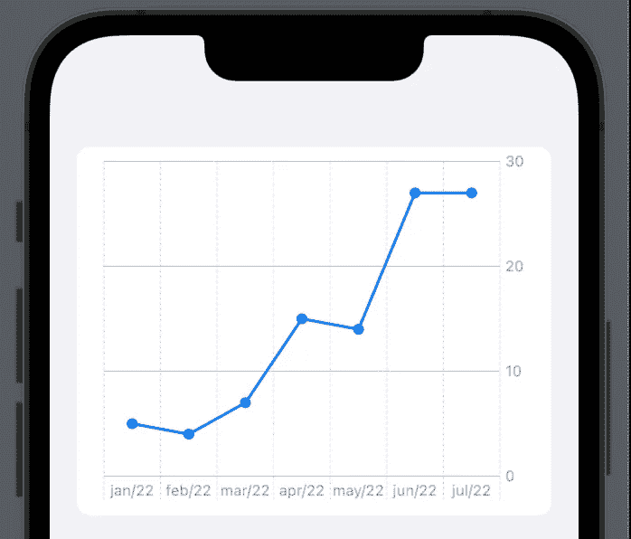
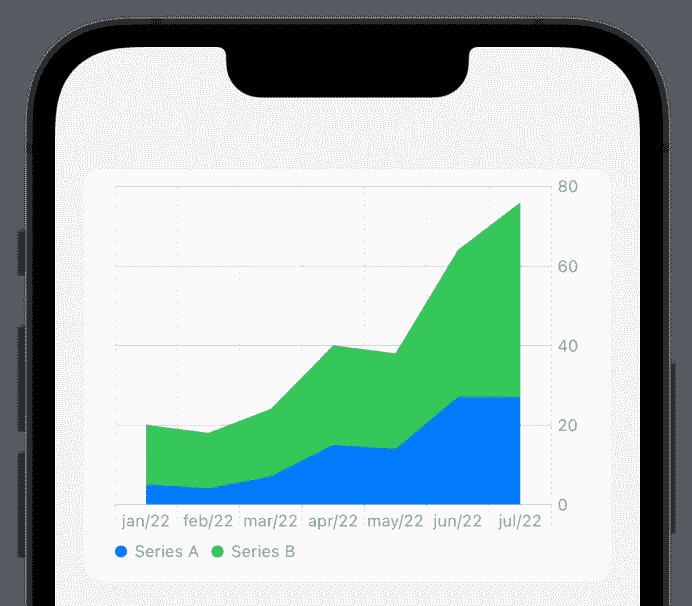

# 你好 Swift 图表—为 iOS 16 创建 SwiftUI 图表

> 原文：<https://betterprogramming.pub/swift-charts-swiftui-ac246151480e>

## 组合多个图表以构建新图表

[https://developer.apple.com/documentation/charts](https://developer.apple.com/documentation/charts)

在 WWDC 2022 上，苹果向 Swift Charts 问好，这是一个使用 SwiftUI 创建图表的强大框架。

# 目录

1.  [图表](#6c2a)
2.  [标记](#da73)
3.  [可绘制值](#9ff3)
4.  [标记示例](#5808)
5.  [将数据列表绘制成图表的快捷方式](#df1f)
6.  [组合标记创建自定义图表](#15ae)
7.  [合并多个数据类别](#c8b0)

要创建一个图表，我们需要记住三个基本的东西，[图表](#6c2a)、[标记](#da73)和`[PlottableValues](#9ff3)`。

# 1.图表

只是一个[图表](https://developer.apple.com/documentation/charts/chart)视图。将此添加到视图中，您会发现没有任何变化。

# 2.标记

这里事情开始变得有趣，马克是我们在聊天中看到的，我们有很多类型:

*   酒吧标志
*   [标线](#d727)
*   [点标记](#bfbd)
*   [区域标记](#158a)
*   [矩形标记](#4cc2)
*   [规则标记](#c55d)

您可以看到下面的[示例](#5808)

# 3.可绘图值

[plotable value](https://developer.apple.com/documentation/charts/plottablevalue)是我们用来标记和传递数据给标记的结构

# 4.标记示例

让我们通过一些例子来看看它是如何工作的。

## 条形标记

## 行标记

## 点标记

## 区域标记

## 矩形标记

## 标尺标记

# 5.将数据列表绘制到图表中的快捷方式

在现实生活中，需要显示一系列数据是很常见的，为了简化我们的生活，我们不会手动创建`Marks`。`Chart`初始化器可以接收一个`Identifiable`对象列表，并用`ForEach`循环逃离闭包。

# 6.组合标记以创建自定义图表

Swift 图表最强大的功能之一是可以组合多个标记来创建自定义视图。

让我们看一个结合`LineMark`和`Point`的例子:

# 7.组合多个数据类别

继续上面的例子，我们也可以在同一个图表中组合多个数据类别。

为此，我们需要向 chart know 提供一些信息，以了解如何在多个图表中拆分数据。简单的方法是使用`foregroundStyle(by:)`修改器传递一个`PlottableValue`来创建`categories`。

使用 Xcode 14.0 Beta 1 (14A5228q)创建的示例

感谢阅读。