# Swift 联合运营商:核心运营商以及何时应用

> 原文：<https://betterprogramming.pub/swift-combine-operators-the-core-ones-and-when-apply-82d6dd310aa5>

## 转换、过滤、调度

由 [Karl Abuid](https://unsplash.com/@spongzy?utm_source=medium&utm_medium=referral) 在 [Unsplash](https://unsplash.com?utm_source=medium&utm_medium=referral) 上拍摄的照片

正如我们在上一篇[文章](https://pedroalvarez-29395.medium.com/combine-publishers-subscriptions-and-subscribers-implementations-under-the-hood-fe308fb9f7f6)中所说，Combine 由异步数据流组成，这些数据流来自`Publishers`作为输出，由`Subscribers`作为输入处理，后者通过`Subscription`接收这些数据流，并跟踪变化。

其中最重要的一个细节是发布者和订阅者必须始终相互兼容，这意味着来自`Publisher`的`Output`关联类型应该与来自`Subscriber`的`Input`关联类型相同。组合这些流就像玩拼图一样，为了连接两个部分，它们需要匹配。

你一定在想:“好吧，那么在这种情况下，我只需要一个订阅者来操作输入值，把它转换成我们需要的任何其他类型，一切都很好！”。好吧，亲爱的读者，这当然是可行的，但是正如我们之前所讨论的，Combine 的核心思想是使用反应式和声明式的范例来处理一切，而不需要任何会增加我们任务复杂性的命令。

我们希望避免任何类型的分配变量、执行`if then else`语句的传统代码行，以及任何类型的循环和其他验证。“好吧，但是我们怎么可能做到呢？”。组合的存在正是为了这个目的，里面有一种神奇的东西，我们可爱地称之为`Operators`。

本文旨在向您介绍关于操作符的主要概念，并列出您将在一个反应式项目中面临的最重要的概念，以及每个概念的实际例子。

# 组合运算符定义

基本上，操作符就像接受一个或多个`Publishers`作为输入并返回一个包含我们想要的确切行为的新函数。例如，如果我们的发布者发出一个`integers`流，而我们有一个期望浮点数或者字符串的`Subscriber`，我们可能有一个操作符负责将其输出转换成我们期望的类型。如果我们只想处理某些特定的输出，我们可以依赖一个只挑选我们实际需要的输出的操作符。

如果我们不需要如此接近的发布值，我们也可以延迟一些值的发布。简而言之，操作员负责应用我们将执行的任何额外的命令性任务:

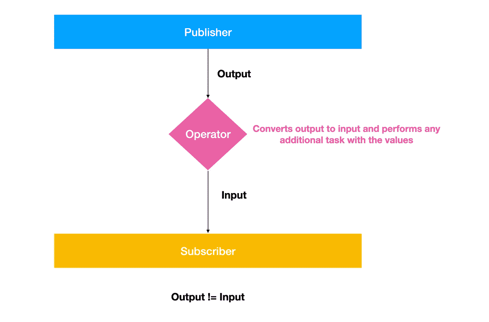

这是从原始发布者到最终目的地:订阅者的管道

所以，真正发生的是，我们有一个原始发布者，我们的文献称之为上游发布者(作为输入注入到操作符的所有内容)，他发布一些值，并通过操作符将它们转换为下游发布者，后者发布与订阅者的`Input`关联类型相同类型的值，并向其添加任何附加行为。这样，我们就有了一个完美的管道，以适当的格式将价值从来源(`Publisher`)传递到目的地(`Subscriber`)。

我想澄清一下，操作符根本不修改值，因为您可能会将它与 Swift `Arrays`操作符进行比较。Combine 操作符只是将上游发布器转换成一个新的发布器，它实际上发布了我们想要的带有任何附加行为的值的类型，就是这样。

# **操作员类型**

正如我们上面所说的，合并操作符可能会执行一系列不同的任务，我们可以用命令式命令完美地完成这些任务，但是正如我们传统上对方法所做的那样，请允许我为您提供我们将拥有的每一种操作符:

*   **转换操作符**:创建一个新的发布器，它从上游获取输出，并将它们转换成新的值，以便从下游发布。我们可以说我们的输出长度是相同的
*   **过滤操作符**:创建一个新的发布器，只取上游发布的一些值。我们可以说我们下游的长度小于上游的长度。
*   **组合运算符**:取两个或多个发布者，根据上游发布者的输出发出一些值。
*   **同步操作符**:仅当某些条件被验证时，负责从上游发布者传递值。
*   **加法操作符**:创建一个新的发布器，除了上游的输出之外，它还发出一些额外的输出。
*   **元数据操作符**:返回一个包含上游发布者信息的输出
*   **调度操作符**:控制上游发射值的定时

我们将详细讨论每种类型，以我们在上一篇[文章](https://pedroalvarez-29395.medium.com/combine-publishers-subscriptions-and-subscribers-implementations-under-the-hood-fe308fb9f7f6)中实现的`HoldValue`publisher 为例。

# 转换运算符

## 1.地图

当每个值从上游发布时，这个值被转换成一个新类型(或者可能相同)的新值。类似于`Array`的地图操作符:

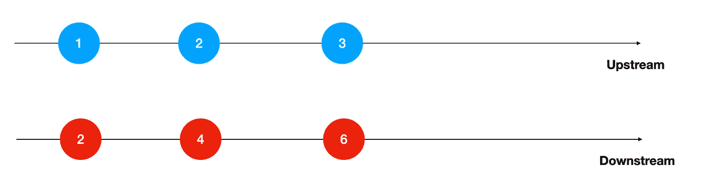

主要用例:转换数据模型。

## 2.收集

从上游获取所有值并将其转换为数组，该数组将由下游发出。

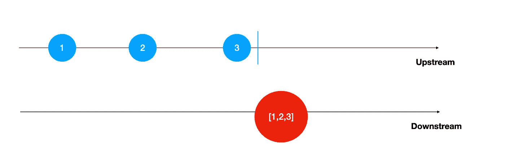

请注意一个细节:您可能会想“嘿，运营商实际上什么时候收集这些上游值？”。答案是逻辑:就在上游发布者发出收尾事件的时候。

主要用例:将所有发布的值合并到一个对象中。

## 3.平面地图

这个运算符可能是所有运算符中最复杂的一个。`flatMap`的想法基本上是从上游获取输出，并以某种方式映射到另一个发布者，从以前的输出中创建。

在下面的例子中发生的事情类似于我们有一个数组的数组。假设您有一些类型作为自定义发布者的输出，并且这个类型内部有另一个发布者。`flatMap`操作符所做的是将这个结构类型作为输出的原始发布者转换为实际发出内部发布者的值的发布者。迷茫？查看下图:

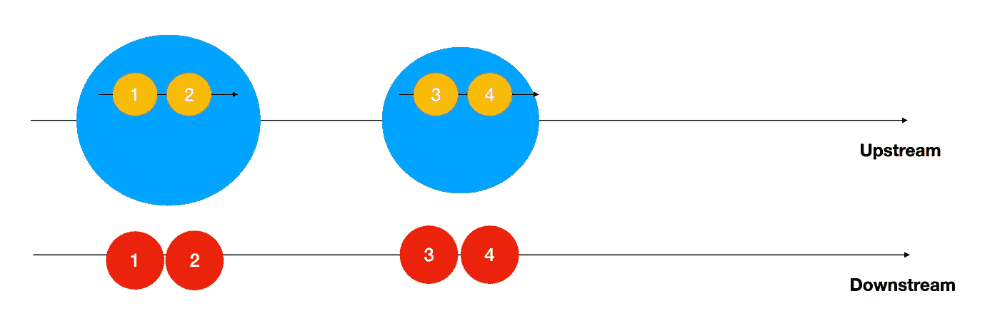

修复我们有一个上游发布者发出一些值，里面包含另一个发布者，他也发布一些值。我们正在做的是创建一个新的发布器，它从刚刚发布的值中发布来自内部发布器的值:

我们创建一个包含发布者的结构 **S** ，然后我们实例化它两次。

之后，我们创建一个新的主题，将 **S** 作为输出类型。我们首先发布 S 的第一个实例，然后让它的内部发布者发布两个值，分别是 1 和 2。来自`flatMap`的结果发布者将发布这两个值作为输出，因为它实际上依赖于内部发布者。

之后，我们发布第二个**的**实例，并使其内部发布者发出两个新值，这两个值将由外部主体发布。太好了！现在，我们将我们的发布者映射到内部发布者，并发出它的值，不管外部发布者的输出是什么

最常见的用例:我们进行两次连续的 API 调用，第二次调用将第一次调用的输出作为参数。

## 4 .ReplaceNil

有时，我们的发布者可能会发出零值，而我们的订阅者需要处理现有的输入。`ReplaceNil`是将`nil`转换成有效输入的可靠解决方案，就像我们处理`nil-coalescing`一样:

在这种情况下，我们将 HoldValue 的值更改为可选的 Int，正如我们对其发布者和订阅者所做的那样

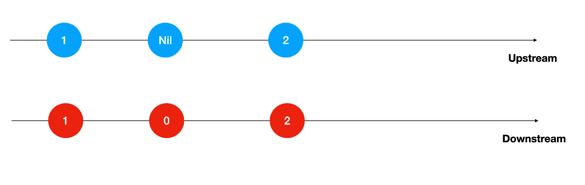

## 5.紧凑地图

与`map`相同，但也作为过滤操作，因为它忽略了所有的`nil`值:

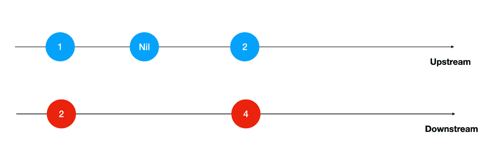

## 6.扫描

这个操作符的工作方式与我们处理的`Arrays`操作非常相似。每当我们发布一个新值时，这个值就用以前输出的累积结果进行运算，并发出一个新值。要使用这个操作符，我们需要传递一个初始累积值和一个二进制闭包:

对于我们发布的每个值，它都被添加到我们的累积值中，最后一个值被发布，一个新值被发出。

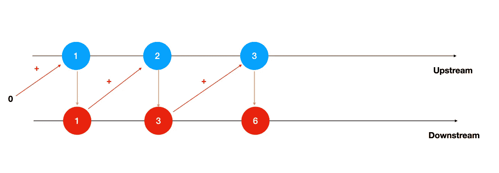

主要用例:我们希望在商店销售新商品时发布其总销售额。

6.减少

类似于`scan`，但是我们不发出任何中间值。相反，我们只发布最终的累计值。它只在 upstream 的管道完成时发布。因为我们实际上没有办法在我们的定制发布器中发送`finish`完成，所以我们在下面的例子中依赖于`PassthroughSubject`:

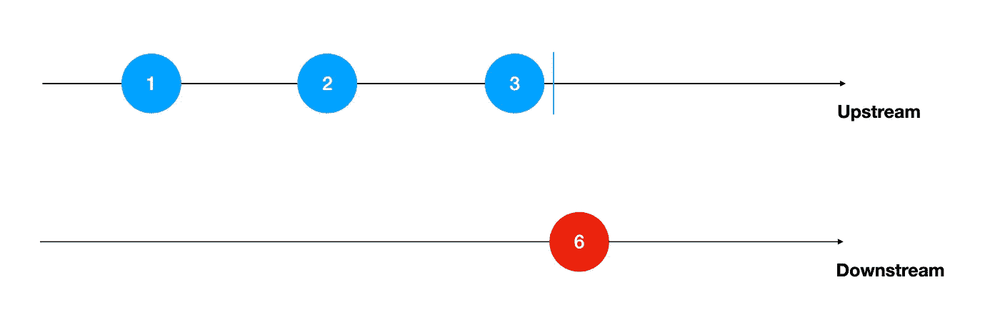

用例:我们只需要计算一天结束时的累计销售额。

# 过滤运算符

## 1.过滤器

采用上游发布器，仅发布其遵循某个谓词的输出值:

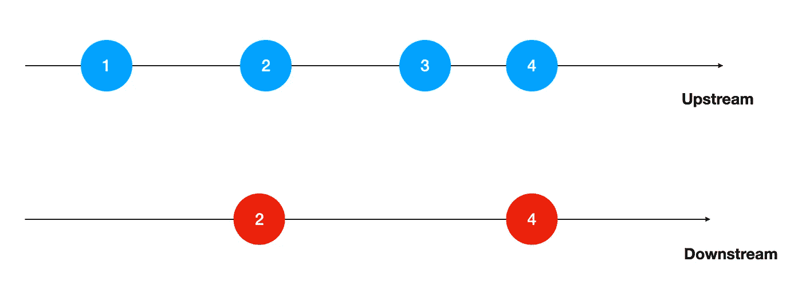

## 2 .删除重复项

该操作符仅在新值与上游的前一个值不匹配时发布新值。

记住这一点很重要，它不会删除不在当前元素之前的重复元素。正如您所看到的，1 被打印了两次，因为它只在作为第一个元素之后的末尾发出。它删除连续的重复。

示例用例:您正在收听一个文本字段，您不想发布立即相等的文本

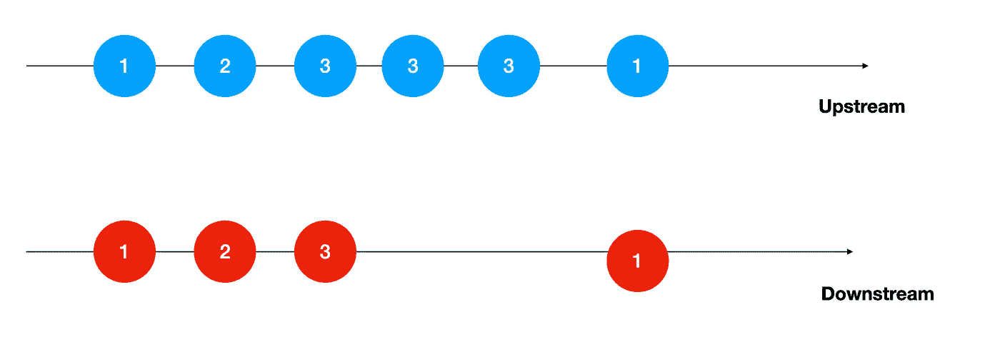

## 3.忽略输出

该操作符丢弃来自上游发布者的所有输出值，只发出其完成事件。

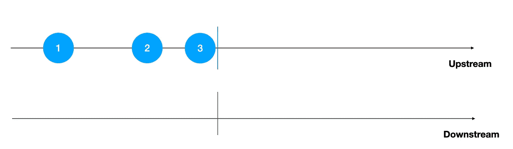

## 4.首先(其中:)

该操作符使下游仅发出上游符合某些条件的第一个输出值。

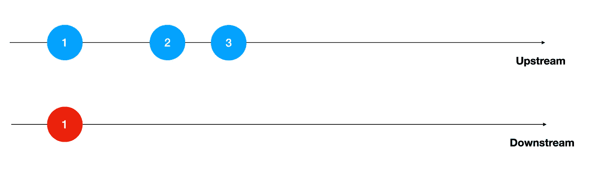

## 5.第一

下游仅发布上游的第一个元素，没有任何特定条件。

## 6.最后(其中:)

与`First(where:)`相同的逻辑，但是您将获取该条件之后的最后一个发布的元素，并且它只在上游完成时发出。

## 7.最后的

与`First`相同的逻辑，但是一旦上游完成，您将从流中取出最后一个元素。

## 8.DropFirst 和变体

下游从上游发出相同的元素，除了第一个元素关于一些条件或可能一些计数。检查它的变化:

## 8.1.丢弃(当:)

删除符合某个条件的第一个元素，直到找到不再符合该谓词的元素。

示例用例:在我们的百货商店中，所有开始出现的包含一些特定重复代码的产品都是有问题的，在我们看到第一个不包含该代码的产品后，我们将认为所有产品都是有效的。

## 8.2.DropFirst(计数:)

删除作为 count 传递的前 n 个元素。

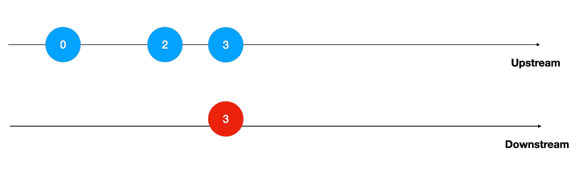

下降(2)

## 8.3.Drop(untilOutputFrom)

丢弃上游的所有元素，直到其他发布者开始发出值。

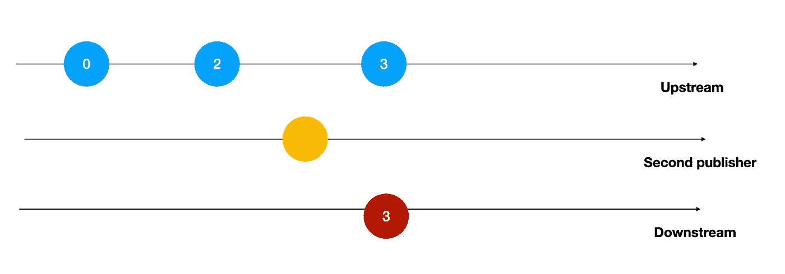

示例用例:我们正在检查我们百货商店的产品，但我们只应在经理(第二出版商)下订单时开始上市。

## 9.前缀

我不会涵盖`prefix`的例子，因为我唯一要说的是，这与`drop`完全相反。我们只考虑上游公布值的第一部分，而不是丢弃它们:

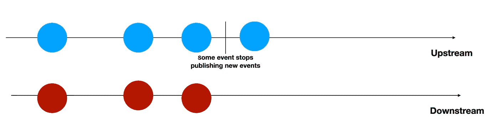

# **组合运算符**

好吧，我知道这个名字似乎有些多余，但这种运营商做了一些以前的运营商没有做的事情:它将多个上游出版商合并成一个单一的下游出版商。有时，您可能有不同的异步数据源，并且您实际上想要一种将它们的结果组合到一个流中的方法。恢复这个想法的短语是:“我只想要结果，不管它们来自哪里”。

## 1.活力

该操作符接受两个或更多的发布者，并将它们的输出作为一个元组返回，这意味着只有当所有的上游发布者都已经发布了一个值时，下游才发布一个新值。

让我们考虑一下我们有三个上游`HoldValue`出版商。每个元组一次发布一个值，但是一旦所有元组都发布了它们的第一个输出，下游将只发布一个新的元组:

在这种情况下，来自三个发布者的第一个值以三个整数的元组一起发布。当所有发布者发出它的第二个值时，`zip`发布者发布它的第二个元组。如果您注意最后两行，这些值没有发布，因为第三个发布者还没有发布它的第三个元素。

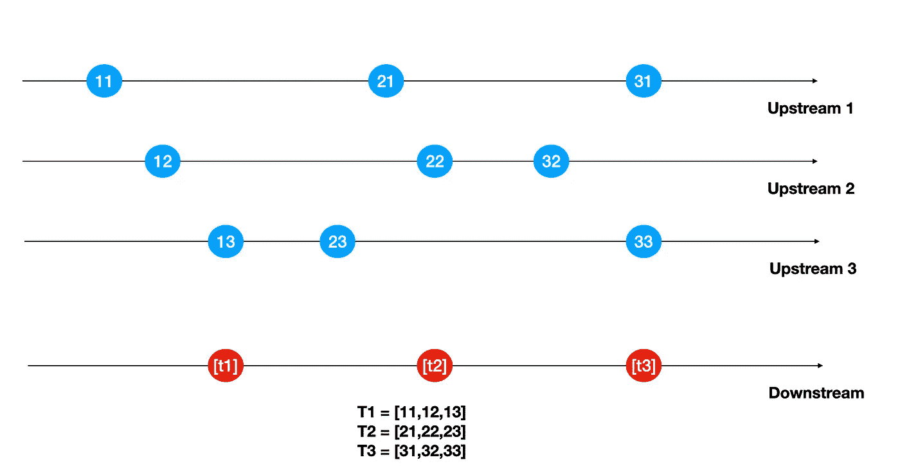

下游的第 n 个元素仅在所有最后的上游发布其第 n 个元素时发布

用例:假设你要使用 iPhone 上的相机、音频和照片库进行一些操作。在这种情况下，您将要求对所有这些资源进行授权。因为只有在提供了所有授权的情况下，您才被授权访问该特性，所以组合来自三个来源的授权状态的`zip`发布者将是合适的。

## 2.组合测试

与`zip`类似，但是在这种情况下，每当上游发布一个值时，下游发布者就发布一个值。结果元组将由刚刚发出的元素以及其他元素的所有最后元素组成:

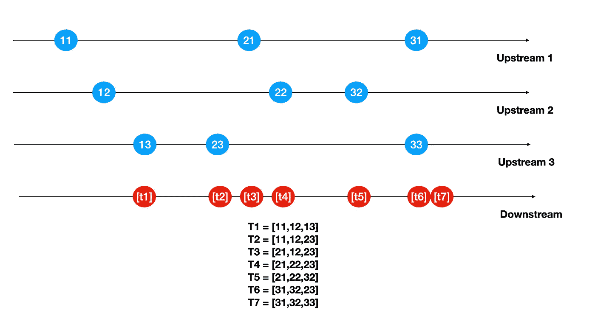

值得注意的是，尽管下游发布了带有最新元素的新元素，但是如果所有上游都已经发布了某个元素，那么它只会发布第一个输出，因为没有任何内容可以与流的第一个元素一起发出。

示例用例:假设您有一些发布者来跟踪文本字段的值。您希望将它们全部组合起来，以文本字段中所有内容的元组的形式输出。如果您更改了其中的一个，输出应该用其他内容的当前内容进行验证，因为我们对当前值感兴趣。

## 3.合并

该操作符通过发出来自三个源的所有值来组合必须具有相同输出类型的发布者。每当一些发布者发出一些值时，这个值就被向下游发布。

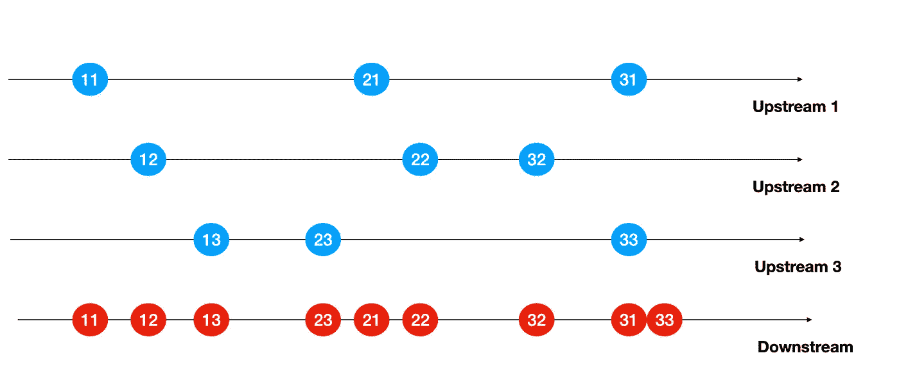

用例:假设你正在获取一些来自不同 API 的用户。所有获取的对象都有相同的格式，所以您可以将它们解码成相同的`Decodable`数据模型。每个用户都是发布者的输出。因为所有的用户不管来自哪里都有相同的意思，我们可以完美地将所有的发布者组合成一个`Merge`，最终将用户放在一个数组中。

## 4.switchToLatest

这个操作符基本上使一个发布者的发布者变平，我们希望跟踪从最后一个发布者发送的值。看一下这段代码:

`Subject`是发布发布整数的`PassthroughSubject`发布者。当我们应用`switchToLatest`时，我们实际上对`subject`发布的最新发布者发布的值感兴趣。当我们发送`s1`时，我们只对`s1`发布的值感兴趣，其他发布者发布的任何值都将被丢弃。

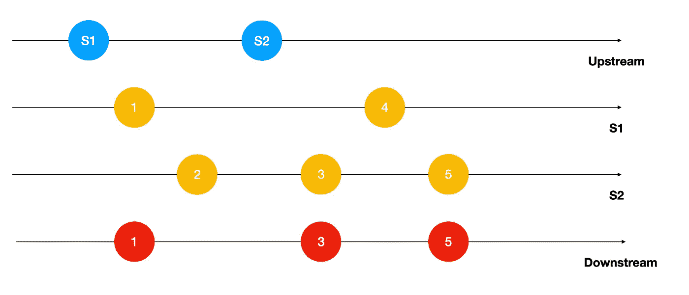

用例:假设你有一个带有三个屏幕的标签栏，每个屏幕对应一个标签。这些 viewControllers 中的每一个都有一个`HoldValue`发布器，它不断地发出值，但是我们只想跟踪由所选选项卡发布的值。我们必须在`UITabBarController`前面的小警告上显示数值。最合适的解决方案是依赖一个发布器，一旦它出现，它就从相应的 ViewController 发出发布器，然后通过`switchLatest`操作符，我们跟踪来自所选屏幕的值。

# 附加发布者

这种发布者意味着在上游价值之外增加新的价值。

最常见的用例:您希望将来自命令性源代码的输出包含到我们的发布者的输出中。

## 1.预先考虑

在所有发布的值之前添加初始值

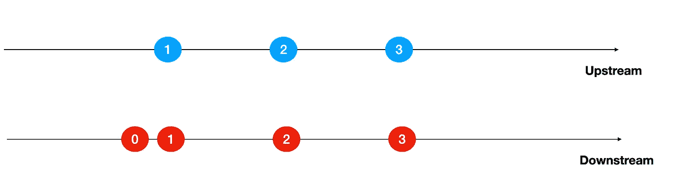

## 2.附加

完成后，在上游结束时添加新值。

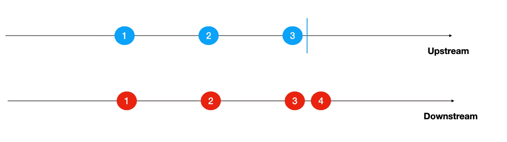

# 元数据运算符

## 1.数数

返回向上发布了多少个值。仅在上游完成时发出一个值。

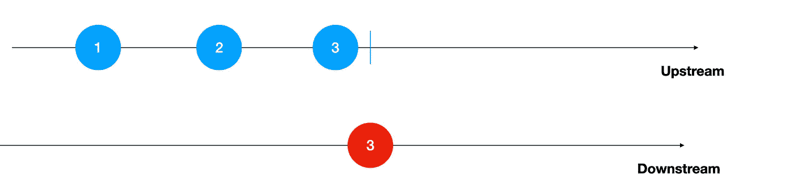

## 2.输出(在:)

一旦元素存在，就在给定位置发布该元素:

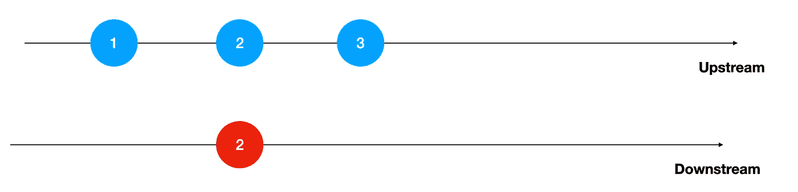

## 3.输出(输入:)

发布上游在给定范围内发布的所有值

## 4.包含

下游发布一个 bool，指示上游的值是否包含某个特定值，或者在某个特定值之后有某个值`condition(contains(where:))`。

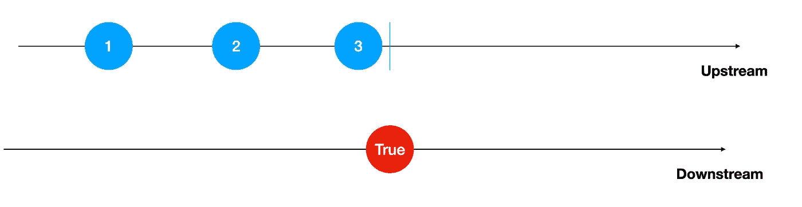

## 5.全部满足

发布一个布尔值，该值定义上游的所有值是否都符合某个条件。仅在上游完成后发布。

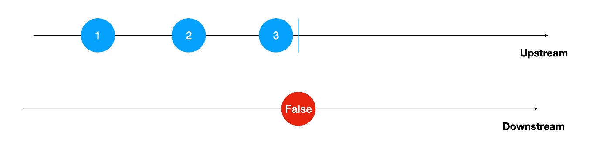

# 计划发布者

## 1.耽搁

仅在延迟一段时间后，才开始从上游(或完成事件)发布值

在这个例子中，我们告诉我们的下游发布者只在主线程计数 2 秒后发出上游值

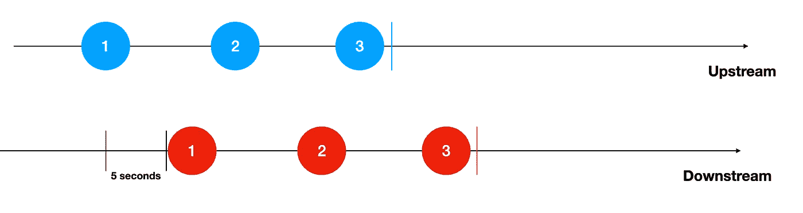

## 2.去抖

当我们不希望在太短的时间间隔内发出事件时，可以使用这个操作符。这一次，让我们来看一个 UI 示例:假设您有一个 SwiftUI 场景，其中您显示一个与标签`Text`垂直对齐的`TextField`。我们依靠一个`ContentViewModel`类作为`ContentView`的`StateObject`和其中的两个已发布属性:一个`firstName`字符串，我们将它的绑定注入到我们的`TextField`中，另一个`label`将显示在`Text`上:

当我们构建我们的组合流时，每次`firstName`包装的 publisher 发出一个新字符串，这将被分配给我们的`label`内容，它也包装另一个 publisher，当更新时，在我们的 SwiftUI 场景中向我们的`Text`标签显示一个新文本。

修复我们的`Text`在输入一些新内容到我们的`TextField`后会立即更新，因为我们正在监听我们的`firstName`发布者。

但是在我们的应用程序中，我们不想让所有东西都完全同步。想象一下，我们希望在 1 秒钟后就有最新的内容。为此，我们将依靠`debounce`来等待适当的时机发布任何更改:

这是我们的结果:

一秒钟后，最新的更改就会发布。

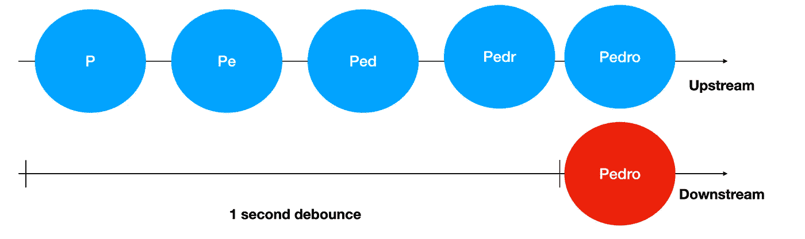

这就是正在发生的事情

## 3.喉咙

该操作符使下游在每个定义的时间间隔发布一个元素。例如，如果我们在前面的例子中应用它，我们的`label` publisher 将每秒发出一个事件，作为上游的第一个元素或最新的元素(您可以定义)。如果没有发布新值，最后一个值将在下游重新发布:

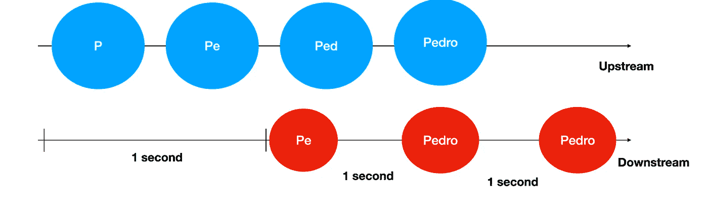

# 结论

因此，我尽了很大努力列出了在构建异步流以在不同流之间传递数据时很重要的所有组合操作符。

有时您需要将一些输出值转换成合适的格式，以便连接到您的订阅者，有时您只需要来自上游的一些特定值，也许您需要一些关于发布者的重要信息，甚至是控制发布时间的方法。

所有这些结合在一起，成为跨多个对象广播数据的最强大的机制之一，使委托、闭包、通知中心和 RxSwift 过时了(仅仅是我的观点！).

我希望这有助于您了解更多关于组合和反应式编程的知识，并将这些概念应用到您自己的移动项目中。