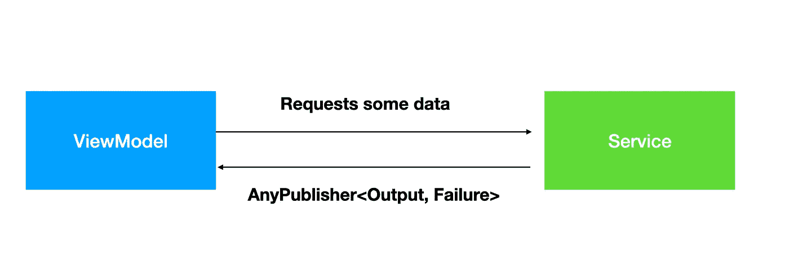
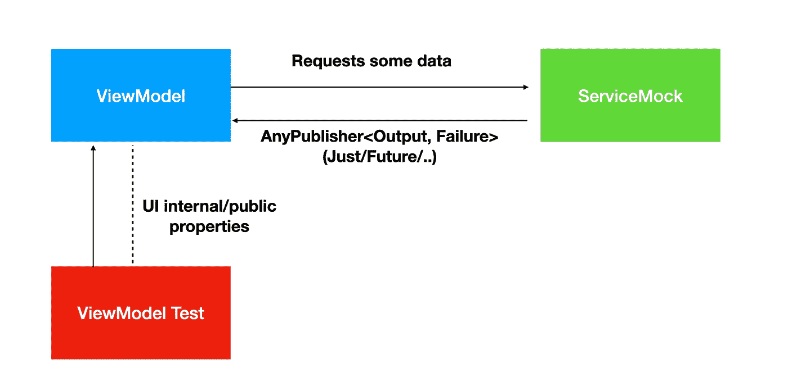

# Swift 联合框架测试指南

> 原文：<https://betterprogramming.pub/swift-combine-testing-guide-198a25af0445>

## 在处理声明性 API 时执行单元测试

[盛 L](https://unsplash.com/@parachutel_?utm_source=medium&utm_medium=referral) 在 [Unsplash](https://unsplash.com?utm_source=medium&utm_medium=referral) 上拍照

正如我们已经讨论的，组合实体(发布者、订阅者和订阅者)[如何在幕后相互关联](/combine-publishers-subscriptions-and-subscribers-implementations-under-the-hood-fe308fb9f7f6)以及数据流如何通过[操作符](https://medium.com/better-programming/swift-combine-operators-the-core-ones-and-when-apply-82d6dd310aa5)形成，是时候理解执行单元测试的最佳方式了，以便保护我们逻辑的完整性。首先，我们来谈谈模仿:

# 出版商嘲讽

**发布者**只是产生一些输出值的实体，或者可能是由`Subscribers`处理的失败案例。我们可能有实际上来自上游的发布者，我们甚至不知道数据是如何创建的，甚至不知道它通过哪个操作者来获得我们的结果。思考软件架构——让我们以 MVVM 场景为例:

在这个场景中发生的是，我们的`ViewModel`通过我们的`Service`层触发一个 API 请求，作为回报，`ViewModel`获得一个`Publisher`，它发出我们想要的值类型(输出)或自定义错误(失败)。然后，我们的`ViewModel`创建一个订阅者来处理即将到来的输出值，并对其执行一些操作(可能分配给一个 UI 属性？).

我们实际上不知道我们的`Service`正在返回哪个发布者，因为`ViewModel`实际上正在接收一个`AnyPublisher`，它包装了另一个具有相同输出和故障类型的发布者。它可以是一个`URLSession`发布者，一个`Just`发布者，也可能是一个`Future`发布者，但这并不重要，因为我们只对输出感兴趣，而不是发布者的实现。`AnyPublisher`类型只是由一个抽象组成。

鉴于此，由于我们不希望我们的服务逻辑干扰我们的测试，我们需要一种模拟我们的服务的方法。看看我们的服务类别，看看我们需要做什么:

我们有另一个`API`层，它通过一个包含所有必需数据的具体端点对象来执行本地 API 调用。它可能会执行一个`URLSession`调用，我们的`Service`层负责将结果处理放到主线程中，然后它将发布者转换成一个`AnyPublisher`包装器，以便封装我们的实现。

因为如果我们要测试我们的视图模型，我们需要模拟这个类，所以让我们创建一个新的模拟类:

正如你所看到的，我们重新实现了我们的上游发布者，只是返回了我们的`PokemonDetailsModel`的存根实例，并设置了适当的错误类型，然后删除了`AnyPublisher`，因为我们需要包装器类型。所以我们创建了我们的嘲讽类。查看我们的存根代表什么:

我们也可以采用一个`Future`发布器，因为我们只想让一个发布器发出一个没有任何逻辑的输出:

# 实现我们的视图模型

让我们展示一下我们的`ViewModel`是如何实现的:

基本上，它由一个用于口袋妖怪细节的`ViewModel`组成。它有一些属性可以作为文本放入 SwiftUI 视图和一个将从`Service`调用输出填充的模型。

修复我们正在建立一些异步流，并通过将其字段转换为适合接口变量的格式，如`image`、`baseExperience`和`height`，为我们的`Published`模型放置多个订户。我们想要测试的输出条件是这些变量的值。

现在我们有了前置和后置条件:我们想从我们的`DetailsViewModelClass`中测试`onAppear`方法，并且`Service`将返回一个发布者，该发布者将发出一个特定的值，该值将由视图模型处理并通过操作符和订阅者转换成我们的接口变量`name`、`weight`、`height`、`baseExperience`、`types`和`image`。说到这里，让我们创建我们的测试类。

# 判例案件

当我们被用来测试 UIKit 项目中的`ViewModel`、`Interactor`或`Presenter`时，我们不仅瞄准了模仿的概念，还瞄准了间谍的概念，以便获得测试用例输出并检查它们。这很重要，因为我们不能直接访问`ViewModel`中的 UI 属性，它们是通过委托和闭包传递给 ViewController 的。既然我们依赖于作为`ObservedObject`和`StateObject`的`ObservableObject`类型(在这篇[文章](https://pedroalvarez-29395.medium.com/swiftui-meet-the-most-important-property-wrappers-for-a-views-data-refresh-d5c6b7d2f87c)中检查它们之间的区别)，一旦属性值在我们的`ViewModel`层中改变，我们的场景就会被渲染，所以我们只需要访问我们的`ViewModel` UI 属性:

因此，就像在以前的测试类中一样，我们将一个模拟的`Service`实例注入到可测试的`ViewModel`中，然后他们通过我们的测试类应用用例:

现在，我们可以在我们的视图模型中触发我们的任何用例，这将从我们的`ServiceMock`中获得我们需要的确切回报，然后我们将我们的`ViewModel`属性与预期结果进行比较。

# 测试错误案例

当单元测试时，我们感兴趣的是测试所有可能的场景，包括失败。为此，我们的模拟应该知道我们期望哪个输出。同样，我们可以模仿我们期望的数据模型，我们也应该模仿原始的错误代码。检查我的解决方案:

与任何其他模拟测试一样，我们可以通过一个枚举类型来模拟每个用例需要的场景，相应的方法将返回适当的数据。

# 结论

在本文中，我们研究了在处理像 Combine 这样的声明式 API 时如何执行单元测试。

基本上，我们总是在处理`Publishers`，由于`AnyPublisher`包装器，我们不知道它的数据源。因为我们只对输出值感兴趣，所以在模仿时，我们可能会返回一个仅发出简单原始数据的`Publisher`，比如`Just`，如果处理集合则返回数组发布者，如果我们想要失败场景，则返回`Future`或`Fail`。这样，我们可以接收任何我们想要的数据，并定制我们的测试。

感谢阅读。