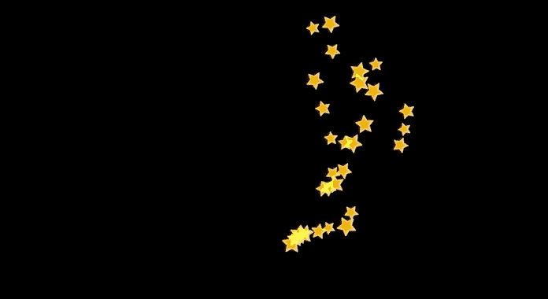
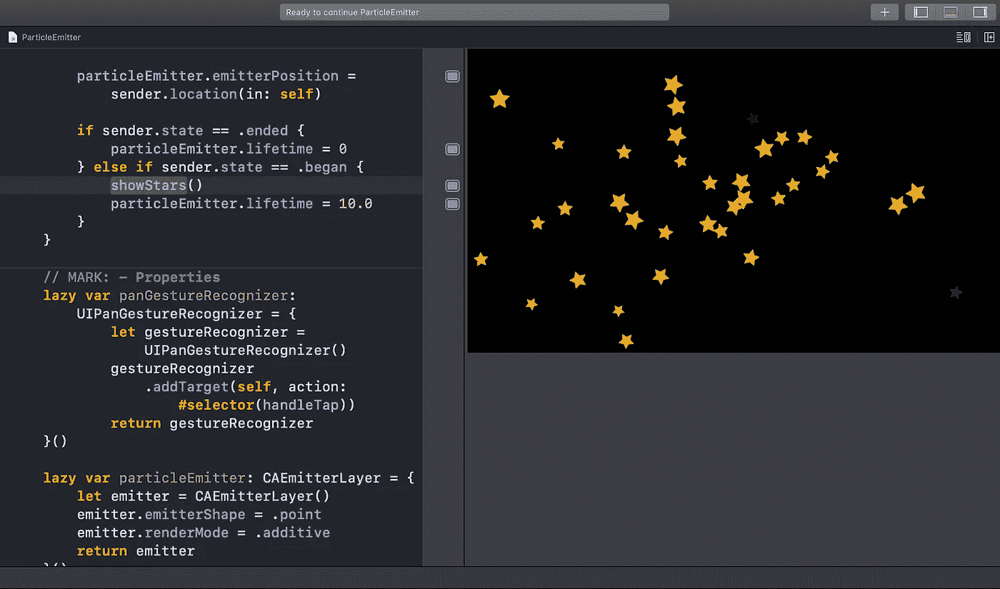

# 斯威夫特:使用粒子发射器创建一个美丽的恒星轨迹

> 原文：<https://betterprogramming.pub/swift-create-a-beautiful-star-trail-using-a-particle-emitter-6bafc5112e41>

## 使用简单的 UIPanGestureRecognizer 实现

[星形图标](https://icons8.com/icons/set/star-emoji)由[图标 8](https://icons8.com) 组成

在这个简短的教程中，我们将学习如何在 Swift 中创建星形轨迹。我们将使用 Xcode 操场，因为这是快速构建和测试东西的好方法。

项目的[源代码可以在 GitHub 上获得。](https://github.com/zafarivaev/StarTrail-ParticleEmitter)

# 我们开始吧

首先，我们需要创建一个动画发生的基地`UIView`:

我们需要将`PlaygroundPage.current.liveView = SceneView()`设置为能够在点击蓝色的“播放”按钮时看到实时视图。

现在让我们创建我们的恒星粒子:

以下是每个属性的描述:

*   `birthRate`定义每秒发射的粒子数。
*   `lifetime`定义一个粒子在屏幕上可见的秒数。
*   `velocity`定义了粒子的初始速度。
*   `velocityRange`描述速度的变化量。
*   `emissionLongitude`定义发射的角度。
*   `emissionRange`定义发射角度的变化量。
*   `spinRange`定义粒子自旋的变化量。
*   `scale`对粒子进行放大。
*   `scaleRange`定义放大倍率的范围。
*   `alphaSpeed`是粒子的 alpha 属性在其生命周期中的变化量。
*   `contents`描述粒子的图像。在我们的例子中，它是一个星形图标。

# 添加星粒子

将`starParticle`属性添加到`SceneView`中:

`let starParticle = StarParticle()`

我们现在需要创建一个`CAEmitterLayer`并将`starParticle`添加到`showStars()`方法中的`emitterCells`数组属性中:

我们已经实现了我们的星形粒子发射器。现在，我们需要根据平移手势发射星星。让我们创建一个`UIPanGestureRecognizer`并将其添加到`SceneView`中:

剩下的就是缺少的`handleTap()`方法:

最后，我们可以运行我们的`Playground`，点击并移动光标到`SceneView`，眼冒金星被发射出来:

感谢阅读！