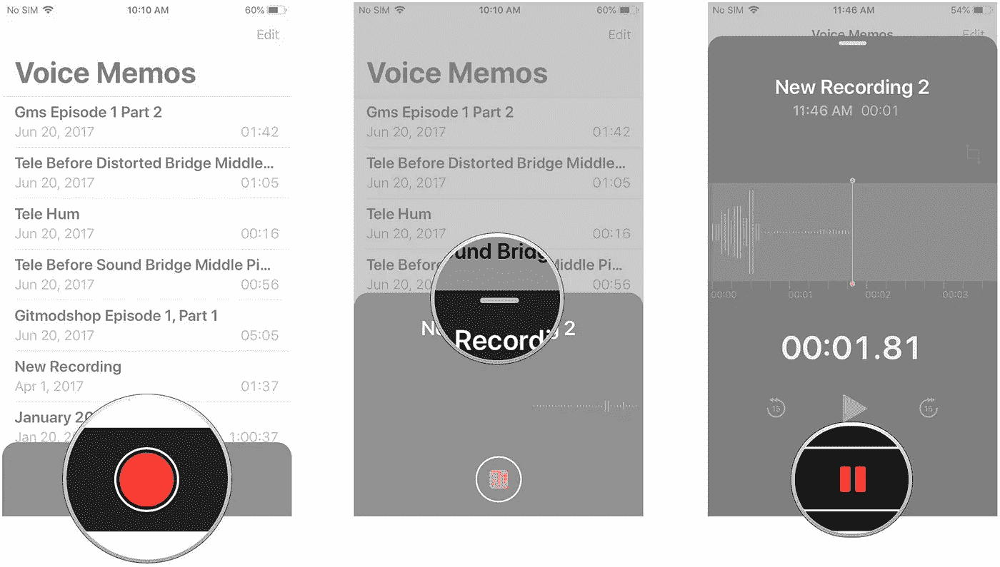
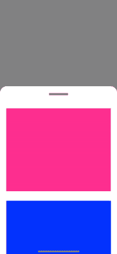
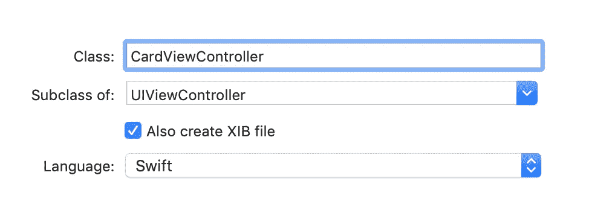
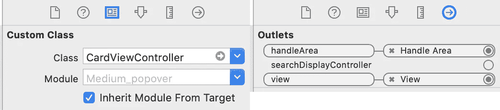
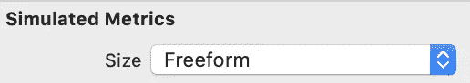
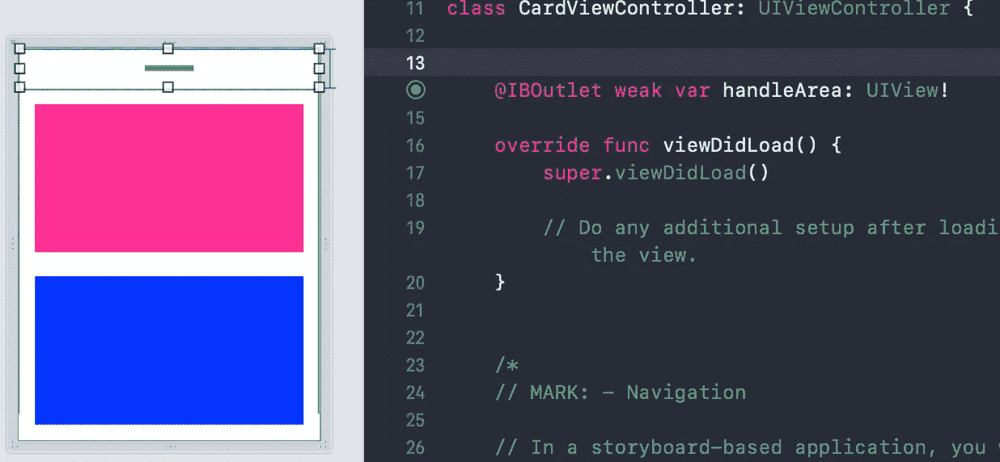

# Swift —创建动态 Popover 卡视图

> 原文：<https://betterprogramming.pub/swift-create-a-dynamic-popover-card-view-d6f274be0c6b>

## 如何在你的 iOS 应用中实现可拖动的弹出窗口

IOS 语音备忘录应用

iOS 12 中的很多系统应用，比如语音备忘录，都包含了可拖动的弹出式视图。这些视图允许用户扩展或隐藏前景中的信息，同时模糊背景中的信息。在 iOS 12 中，没有内置的框架来支持这些视图，尽管它们在系统应用程序中很常见。然而，一旦实现，这些视图不仅易于使用，而且对于一个完美的 iOS 应用程序是必不可少的。

弹出视图

# 设置视图

首先，创建一个新的 XIB 视图和名为 CardViewController 的 UIViewController，这可以通过在创建新的视图控制器时选择“同时创建 XIB 文件”来实现。这些将用于设置卡片视图的故事板和代码。

CardViewController 视图大小需要设置为 freeform，这样它就可以在不继承 IOS 设备属性的情况下作为独立视图调整大小。文件所有者类也被设置为 CardViewController，并且文件所有者视图被连接到 UIView。

该视图是用连接到 ViewController 的 HandleView 设置的，并将用于调整视图的大小。出于所需目的，可以将任何其他对象添加到视图中。在我们的示例中，将使用两个盒子来演示弹出器:

# 设置主视图控制器

在主 ViewController 类中，设置了卡片视图，并使用一个枚举在卡片视图的折叠和展开状态之间切换。卡片的下一个状态由 next state 变量决定，这将用于展开或折叠卡片。设置的其他属性和变量包括 CardViewController、UIVisualEffectsView 和 UIViewPropertyAnimator 数组。

接下来，在主视图控制器中设置 XIB 视图，使用视图的高度确定开始和结束卡片的高度。子视图以编程方式添加到视图的底部，并添加视觉效果视图。

点击和平移手势识别器被添加到 CardViewController 的句柄区域。点击手势的功能是识别手柄何时被触摸，并在需要时通知卡片激活。平移手势识别器检测被拖动的手柄区域，并相应地将卡片动画调整为扩展的卡片大小的一部分。

# 设置动画

popover 视图使用 UIViewPropertyAnimator 进行动态动画。其工作原理是使用平移手势识别器来确定弹出框完成了多少，并将其转换为百分比，以便动画可以根据弹出框完成的程度进行更新。通过使用点击识别器，当释放时，弹出框会吸附到位。该动画将线性动画用于弹出效果，将弯曲动画用于弹出的圆角。使用的代码可以在下面或者 GitHub 库中看到。

# 开源代码库

 [## 亨利-古德温/波普沃-观点

### 在 GitHub 上创建一个帐户，为 henry-goodwin/Popover-View 开发做出贡献。

github.com](https://github.com/henry-goodwin/Popover-View) 

# 资源

 [## 处理平移手势

### 每当用户在屏幕上移动一个或多个手指时，都会出现平移手势。屏幕边缘平移手势是一种…

developer.apple.com](https://developer.apple.com/documentation/uikit/touches_presses_and_gestures/handling_uikit_gestures/handling_pan_gestures)  [## 处理点击手势| Apple 开发者文档

### 点击手势检测一个或多个手指短暂触摸屏幕。这些手势所涉及的手指不得…

developer.apple.com](https://developer.apple.com/documentation/uikit/touches_presses_and_gestures/handling_uikit_gestures/handling_tap_gestures)  [## UIViewPropertyAnimator

### 声明一个 UIViewPropertyAnimator 对象可以让你动态的修改视图和动态的修改你的动画…

developer.apple.com](https://developer.apple.com/documentation/uikit/uiviewpropertyanimator)