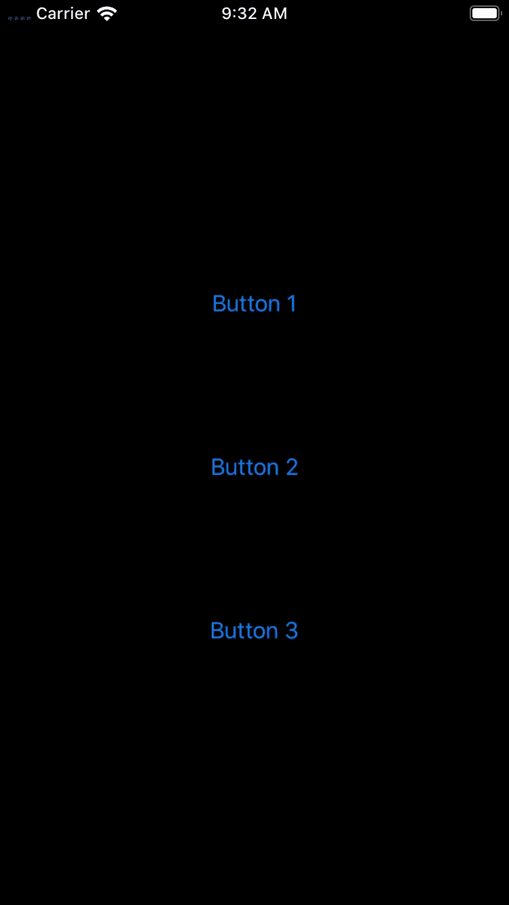
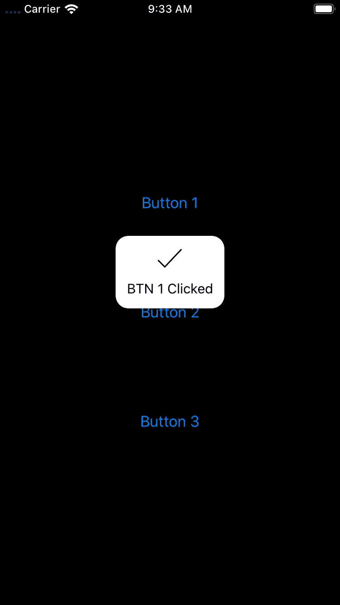

# Swift 设计模式:门面模式

> 原文：<https://betterprogramming.pub/swift-design-patterns-facade-d12280f61b34>

## Facade 模式可用于使您的代码更加模块化、可重用和易于更改

[粘土堤](https://unsplash.com/@claybanks?utm_source=unsplash&utm_medium=referral&utm_content=creditCopyText)在 [Unsplash](https://unsplash.com/s/photos/store-facade?utm_source=unsplash&utm_medium=referral&utm_content=creditCopyText) 上拍照

就像商店门面一样，它的同名编程模式通常指的是作为前端接口的对象，并屏蔽更复杂的底层或结构代码。

在实践中，Facade 模式是一个非常重要的工具，可以用来使您的代码模块化、可重用和易于更改。

例如，假设您的应用程序需要在每次用户点击以下屏幕中的三个按钮之一时呈现一个平视显示(`HUD`):

用户每次点击其中一个按钮时，应用程序将显示一个 HUD 的示例屏幕。

要预设那个`HUD`，您可以在 SwiftUI 视图中实现下面这段代码:

这是一个在 SwiftUI 视图中使用 HUD 的非常 noob 的实现，它包含了大量的代码重复！

如您所见，有四行代码重复了三次:

初始化和调用 HUD 库的代码块`SVProgressHUD`

我们肯定能做得更好！这里要做的最明显的事情是在我们的`ContentView`中创建一个私有方法，称为`func showSuccessHUD(withStatus status: String, delay: TimeInterval = 2)`:

在 SwiftUI 视图中更好地实现了 HUD 的使用，消除了类中大量的代码重复。

这避免了在`ContentView`类中的大量代码重复，但是我们实际上还没有创建一个专门的类来处理我们的`HUD`。

拥有一个专门的`HUD`服务会让我们受益匪浅，因为我们不仅可以在整个项目中避免代码重复，而且用另一个库或者甚至是我们自己的定制实现来替换我们的`SVProgressHUD`也会容易得多。

这样，无论何时需要，我们都可以很容易地调整我们的项目。

让我们来看看`HUD`外观会是什么样子:

最后，Facade 模式用于配置和呈现一个简单的`HUD`

通过调用`HUD.showSuccessHUD(withStatus: "Your message here")`，这可以在我们代码的任何地方使用。

为什么这样更好？您的代码变得适应性很强，因为`HUD`服务中的任何更改都(可能)需要更新一个文件:文件`HUD.swift`。

除此之外，这种代码可以轻松地在您的项目中重用，从而显著提高您的生产率和代码质量！

# 好处:面向协议的编程+门面

我个人喜欢将 Facade 模式与面向协议编程(PoP)结合使用。

这样，你所有的代码*看起来都是本地的*，你可以明确地限制哪种类型的类可以调用它。例如，`HUD`方法应该只在`SwiftUI.View`类中显示，所以我们可以使用 PoP 来执行这条规则:

通过面向协议的编程实现的 HUD 外观

有了这个 PoP，每次你想从一个`View`调用方法`showSuccessHUD`，你可以显式地采用那个`View`中的`HUD`协议，并通过`self.showSuccessHUD`调用它:

HUD 正面通过 PoP 结构使用。

是不是很牛逼？继续尝试吧！

PoP + Facade 使用的一些其他例子是组织诸如动画、可达性观察器、警告视图、字符串本地化和单元可重用性之类的东西。