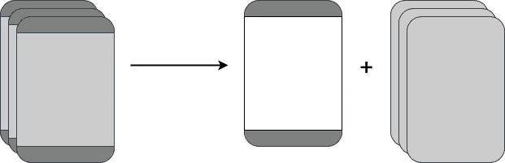
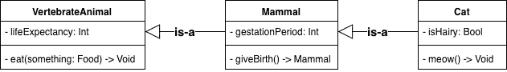

# 斯威夫特:偏爱组合胜过继承。BaseViewController 案例。

> 原文：<https://betterprogramming.pub/swift-favor-composition-over-inheritance-the-baseviewcontroller-case-f598064bda6>

由 [Max Nelson](https://unsplash.com/@maxcodes?utm_source=unsplash&utm_medium=referral&utm_content=creditCopyText) 在 [Unsplash](https://unsplash.com/s/photos/swift?utm_source=unsplash&utm_medium=referral&utm_content=creditCopyText) 上拍摄的照片

在过去的一篇文章中，我使用了 OOP 原则*优先于继承*作为在 Swift 中避免使用协议默认实现的原因之一。我不想说得太详细，因为那太长了。

在本文中，我将使用一个熟悉的例子来展示我们如何使用复合而不是继承，以及为什么当目标是重用代码时，它是一个更好的方法。

# BaseViewController

我在 iOS 项目中见过的重用代码的继承的最流行用法之一是拥有一个`BaseViewController`。项目中的每一个`UIViewController`都是这个`BaseViewController`的子类，因此它们获得共享的行为、功能、组件、依赖等。

类似于这样的东西:

好吧，那么这里有什么问题呢？

# 从 BaseViewController 到 BaseViewContainer

`BaseViewController`快速成为两个或更多子类正在使用(或将潜在使用)的方法的容器。这很难维护，并且打破了实体的*单一责任原则*。

> 每个模块或类应该对软件提供的功能的一个部分负责。

# 连接

`BaseViewController`属性和方法/功能不一定被每个`UIViewController`子类使用。这意味着子类可能依赖于他们不需要或不使用的代码。你可以在功能 1 和功能 2 中看到一个例子。

根据 OOP 原则:*你不应该依赖你不使用的方法。*

使用组合，您可以通过定义和符合小协议来使用控制反转和接口分离。然而，继承不允许你这样做。

# 包装

封装指的是对象应该管理它们自己的行为和状态，这样它们的合作者就不需要关心对象的内部工作。

`BaseViewController`打破封装有不同的方式:

*   `BaseViewController` ↔︎ *子类* (I):如果任何`BaseViewController`子类被允许访问从其继承的成员，那么`BaseViewController`中的变化可能也需要维护子类。
*   `BaseViewController` ↔︎ *子类* (II):如果任何`BaseViewController`子类被允许覆盖从它继承的成员(只要它们是非 final 的)，那么`BaseViewController`方法的覆盖可能会改变它的行为。
*   `ChildViewControllers` ↔︎ *客户端*:由于 Swift 不像 Java 那样为子类提供 [*受保护的*访问器](https://www.geeksforgeeks.org/access-modifiers-java/)，因此`BaseViewController`共享方法和属性需要是公共的或内部的。子类继承那些具有相同可见性的公共/内部成员。假设这些成员中的一些是私有的，那么任何客户端都可以公开访问它们的内部工作。

# 灵活性

首先，`BaseViewController`方法/功能不能在运行时改变或注入，因为它可以通过使用组合来完成。这是因为`UIViewControllers`依赖于具体的实现，而不是抽象。

其次，那些方法/功能不能在不是`UIViewController`的类中重用，除非你想使用`UIViewController`作为对它的依赖🤯。

# 单元测试

假设您正在为您的代码编写测试，您可能想要注入和模拟单元测试的所有依赖项。在这一点上应该很清楚，子类化`BaseViewController`不允许你对继承的方法/功能这样做。

# 普通页眉、页脚或背景

这篇文章的目的是解释当谈到共享代码时，为什么你应该选择组合而不是继承**的一些原因。**

但是你可能认为你仍然可以使用`BaseViewController`在几个`UIViewController`中设置一些公共的页眉、页脚或背景，而不需要重复代码。

我认为你最终会陷入一些以前的问题，因为你可以用另一种方法来实现。

如果你共享不同`UIViewController`的页眉、页脚或背景，你可以考虑使用 **ChildViewControllers** ，这样你就可以将**容器**从你实际的`UIViewController`中分离出来。这样每个组件都有自己的职责，另外，你的`UIViewController`可以被注入不同的容器。

# 继承语义学

我把这个话题留到了最后，因为它更多的是概念性的，而不是实践性的，而且可能有争议。所以拜托，就当是额外的主观原因吧。

在这种情况下，类继承，或者如果你想的话，子类型化是一种在两个类之间建立关系的机制。

不管这个图的正确性和完整性如何，这里我们可以看到，每一个`Cat`都是一个`Mammal`，每一个`Mammal`都是一个`VertebrateAnimal`。在这个分类法中，每个*类*都定义了属于它所代表的概念的属性和方法。

在`BaseViewController`的情况下，考虑到它可能不会被用作实际的`UIViewController`，我们不能说我们有 is-a 关系。`BaseViewController`永远不会被实例化，它可能会为此用`fatalErrors`覆盖`init` 方法。

如果`BaseViewController`不是`UIViewController`，我们可能会破坏这里的继承语义。`BaseViewController`不是一个`UIViewController`。我们这样做只是为了重用代码。

Swift 不提供多重继承，因此，在这一点上，你可以考虑通过将*子类化*转移到*来解决这个问题，使* a `BaseViewControllerProtocol` 与*默认实现*保持一致，但这可能会更糟，因为你可以在这里阅读。

# 还是用构图吧！

让我们看看如何使用 composition 重写第一个示例:

*   这里我们只在需要的类中注入`Functionality1`和`Functionality2`。
*   我们只依赖于我们需要或使用的方法。
*   我们可以在运行时注入任何符合`Functionality1Protocol` / `Functionality2Protocol`的类来改变实现。
*   `Functionality1Protocol`和`Functionality2Protocol`可以由两个类来整合，也可以由一个类来整合。
*   我们封装了依赖性。
*   我们可以为单元测试注入符合`Functionality1Protocol`和`Functionality2Protocol`的模拟。

感谢您的阅读！如果你喜欢这篇文章，请鼓掌:)