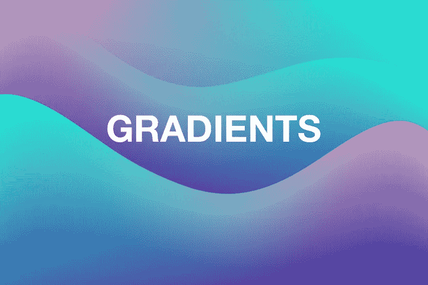
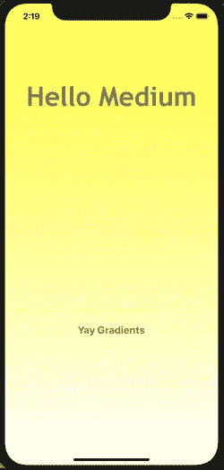

# 4 行代码中的快速渐变

> 原文：<https://betterprogramming.pub/swift-gradient-in-4-lines-of-code-6f81809da741>

## 抛弃那些单调的背景色，在你的视图中使用渐变



渐变很好看，不是吗？

我喜欢写一点代码来完成很多事情。前几天，我开始了一个新的 Xcode 项目，想在我的应用程序的登陆屏幕上使用两种颜色创建一个简单的渐变。我知道 Swift 有一个相对容易使用的渐变系统，因为我读过很多文章，人们在文章中解释了 Swift 渐变的来龙去脉。唯一的问题是，每个人对快速渐变的实现都比我需要的要复杂得多。因此，经过几次谷歌搜索和 30 分钟试图找出一个恼人的错误，我终于让我的双色渐变登陆屏幕在 4 行代码中工作。

我是这样做的:

```
**let** gradientLayer = CAGradientLayer()gradientLayer.frame = **self**.view.boundsgradientLayer.colors = [UIColor.yellow.cgColor, UIColor.white.cgColor]**self**.view.layer.insertSublayer(gradientLayer, at: 0)
```

因此，就复杂代码而言，这在列表中并不靠前，但还是让我们一行一行地看。

**第 1 行**初始化你的`gradientLayer`变量。这是您将设置所有渐变选项的变量，并最终将其添加到您的视图中。

**Line 2** 设置`gradientLayer`的帧大小，以匹配您正在添加渐变的视图的大小。

**第 3 行**是有趣的一行(反正对我来说是)。`gradientLayer.colors`采用一组颜色组成渐变。你可以添加任意多的颜色到你的渐变中，只要确保在添加更多颜色时遵循数组语法。

第 4 行是魔法实际发生的地方。这里，我们所做的就是向当前视图添加一个子层，并将该子层设置为我们在第 1–3 行中设置的`gradientLayer` 。

就是这样！现在只需编译并运行 Xcode 项目中的代码，你的屏幕就会呈现出性感的黄色渐变。

# Bug 警报！

当我第一次尝试给我的登陆屏幕添加渐变时，我遇到了一个奇怪的错误，我的渐变显示出来了，但它隐藏了我在屏幕上的所有标签和按钮。我认为这和梯度的位置有关。结果是，我的`gradientLayer`被添加到了我在应用程序屏幕上的所有内容之上，修复在第 4 行。

```
**self**.view.layer.insertSublayer(gradientLayer, at: 0)
```

将`at: 0`添加到 insertSublayer 函数告诉 Swift 将该子层设置在视图的索引 0 处。这将渐变推到了所有屏幕内容的后面，让我可以看到之前被渐变隐藏的所有内容。我花了比我想承认的更长的时间来解决这个问题，但是如果你遇到同样的问题，希望我可以帮你节省 30 分钟的谷歌搜索时间。

# 结局！

上面的四行代码在我的应用程序中生成了下面的屏幕(除去标签，我是通过故事板添加的)。



最终性感的黄色渐变

虽然有更多的方式可以使用和定制渐变，但我会让你自己去研究和解决。对于任何需要简单渐变的屏幕/标签/按钮等。希望这篇文章对你有用，感谢阅读！