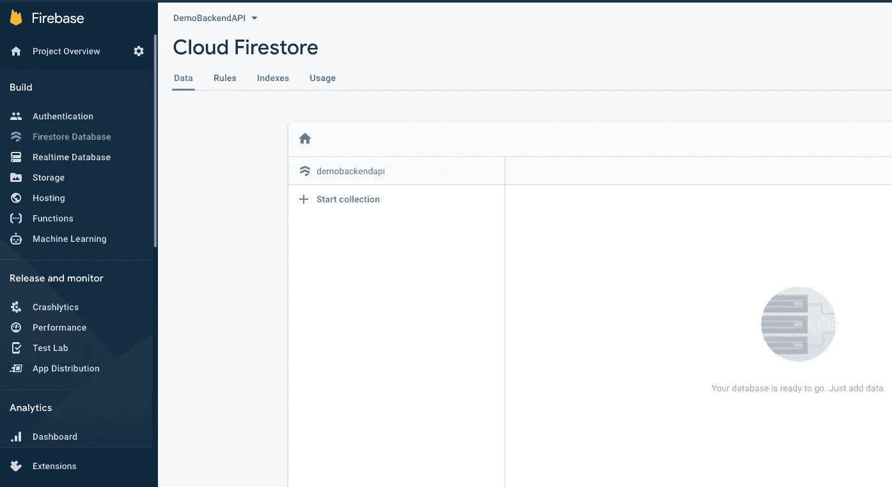
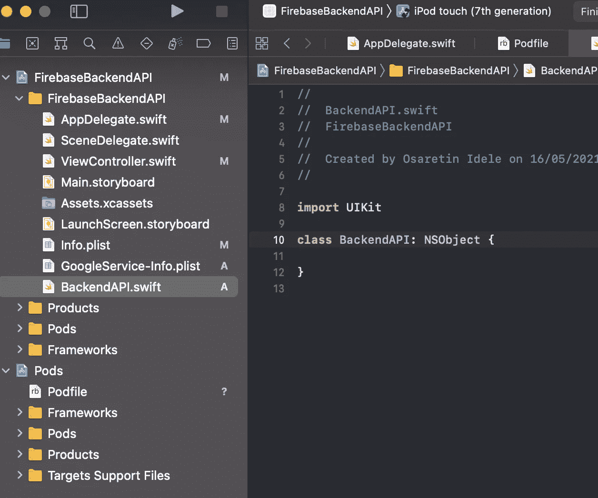
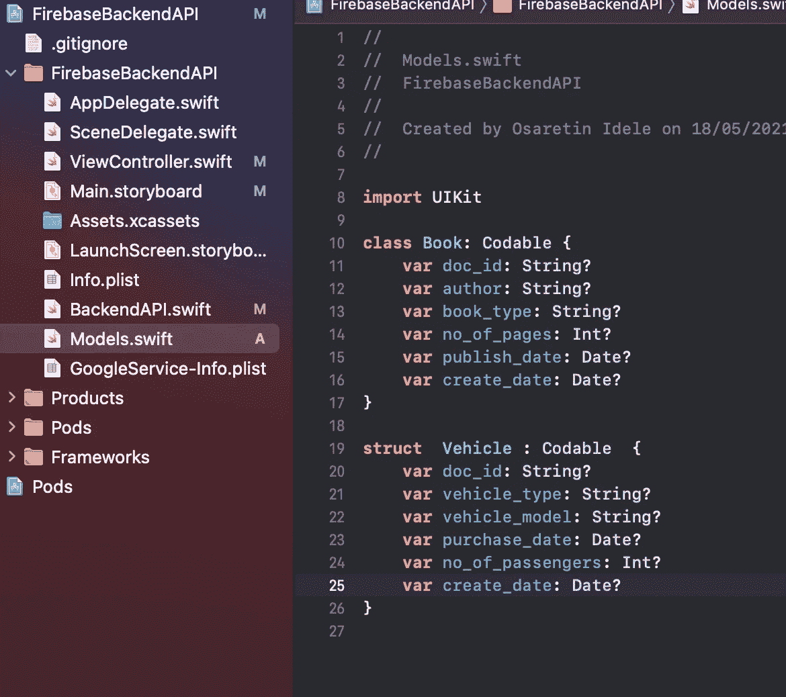
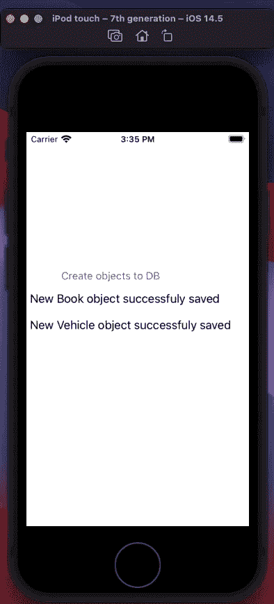
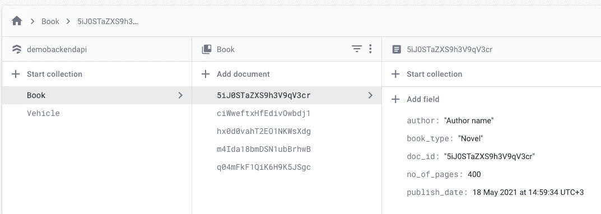

# 如何在 Swift 中创建通用后端 Firebase API

> 原文：<https://betterprogramming.pub/swift-how-to-create-a-generic-backend-firebase-api-b6396208f460>

## 使用 Swift 泛型和反射来创建单个 API 端点，以便为任何对象类型执行 Firebase CRUD 操作


安妮·斯普拉特在 [Unsplash](https://unsplash.com?utm_source=medium&utm_medium=referral) 上的照片

开发基于 Swift 并带有 [Firebase](https://firebase.google.com/) 后端的 iOS 应用程序时，一种常见的方法是创建一个 repository 类，用于处理从您的应用程序创建、读取、更新和删除(CRUD)Firebase Firestore 存储库对象的任务。通常，每当有新类型引入到您的应用程序中，并且为新类型实现了所有 CRUD 操作时，repository 类都会更新。这些新实现中的大多数都是样板代码，在不同类型的实现中重复使用。

处理这种情况的一个更好的方法可能是使用 Swift generics 创建一个基本后端类，该类可以处理将来创建的任何符合指定协议的类，而无需为新类型复制存储库实现。

本文提供了一种可行的最小代码方法来实现 Firebase 后端操作，可以插入到任何新的或现有的 iOS 项目中。本文还使用 Swift reflection 实现了一种在将定制对象保存为 Firebase 文档时处理对象主键的方法。

# 介绍

在本文中，我们将开发一个带有后端 API 的 iOS 演示应用程序，它将执行和演示以下任务:

*   将新对象保存到 Firebase Firestore 存储库中。该方法将从 Firebase 生成一个`documentID`,并使用这个 id 作为对象的惟一键以及保存的文档的名称。要做到这一点，我们需要能够在运行时查询任何类型的属性和该类实例的属性数据。为了实现这一点，我们利用了[快速反射](https://www.swiftbysundell.com/articles/reflection-in-swift/)。
*   通过提供唯一的主键，从 Firestore 存储库中检索保存的对象
*   根据按字段和字段值提供的条件检索对象数组
*   更新存储库中已经存在的对象
*   从存储库中删除基于唯一主键的现有对象

# 先决条件

该解决方案要求您已经配置了 Firebase，创建了一个项目，并将 Firebase 添加到您的 iOS 应用程序中。按照[官方文档](https://firebase.google.com/docs/ios/setup)创建一个新的 Firebase 项目，并将 Firebase 添加到您的应用程序中。

在这个阶段，您应该在云中有一个空的 Firebase Firestore 项目，已经创建了您的 Podfile，并且已经使用 pod install 初始化了您的 Xcode 项目。



空 Firestore 数据库

Swift 版本的反射允许我们查询一个类型的实例，查看所有存储的属性，并访问每个属性的数据。不幸的是，Swift 实现只提供对这些元数据的只读访问。我们不能使用快速反射来改变任何属性值。对于这篇文章，我们需要这种能力。幸运的是，有一个第三方包， [Runtime](https://github.com/wickwirew/Runtime) ，正好提供了我们需要的这种能力。

将下面一行添加到您的 pod 文件中，并再次执行 pod 安装。

```
pod ‘Runtime’
```

设置所需的先决条件后，将执行以下步骤:

*   添加`backendAPI`类型
*   测试 API

# 添加 backendAPI 类型

在您的 iOS 项目中，添加一个新的 Cocoa Touch Swift 文件。(右键单击项目导航器中的根组，并选择 New File。)

将文件命名为`BackendAPI.swift`(T2 的一个子类)。



我们需要这个类能够与任何类一起工作。为此，我们必须将该类转换为泛型类型。我们在类型定义中包含了一个类型参数`T`，如下所示

`T`为类型提供一个占位符名称，稍后调用`backendAPI`类型时提供。

我们包含一个类型约束，要求`T`符合`Codable`类型。`Codable`是一个类型别名，它结合了`Encodable`和`Decodable`两个协议，使对象能够很容易地序列化为外部格式。我们会要求传递给`backendAPI`的所有定制对象都符合这些协议。

## 实现保存方法

要实现 Save 方法，请将以下代码添加到`BackendAPI`类中。

上述代码执行以下任务:

*   定义一个方法签名，并通过完成处理程序传递一个类型为`T`的通用类型 obj
*   初始化几个局部变量——将 obj 通用类型转换为 var，以启用唯一键更新，所有要保存的自定义类型都需要唯一键名`doc_id`。该值可以根据需要进行更改。
*   还将 var 初始化为运行时传递给该方法的泛型类的名称。
*   使用反射(运行时)来查询泛型类型并检查该类型是否包含已定义的唯一键
*   如果类型中存在唯一的键属性，则从 Firestore 后端初始化一个文档引用对象，以获得一个新的`documentID`
*   使用反射(运行时)用 obj 中返回的`documentID`更新唯一键属性
*   用`documentID`作为文档键保存对象到 Firebase

## 实现 Get 方法

我们将实现两个重载的 Get 方法。第一种方法将惟一键作为一个字符串(在我们的例子中是`doc_id`),并通过一个完成处理程序在 Firebase Firestore 中返回一个带有等价惟一键的单一对象。

第二个 Get 方法接受两个字符串参数，`getByField`和`getByValue`，并使用这些参数查询 Firestore 中的任何特定字段。第二个 Get 方法根据完成处理程序中提供的字段和值返回匹配文档的数组。

在这两种情况下，与前面的 Save 方法一样，Firebase 文档的名称是通过调用泛型类型的字符串表示形式自动确定的。

两个 Get 方法的代码:

该代码执行以下任务:

*   通过类型的字符串表示形式获取泛型类型的名称
*   通过第一个 Get 方法中的唯一键 id 或第二个 Get 方法中提供的字段和值，使用类型名初始化对 Firebase 的查询
*   如果返回任何文档，将返回的文档转换为泛型类型表示，并通过完成处理程序将类型返回给调用代码

## 实现更新和删除方法

实现 Update 和 Delete 方法非常简单，与其他方法的实现一致。

对于 Update 方法，更新的类型被传递给该方法。该方法首先检查类型属性，以确认类型的结构是否符合预期(通过检查唯一 id 字段的存在)。一旦类型结构被确认，该方法调用 Firestore `setData`方法来执行实际的文档更新。

更新操作的结果通过完成处理程序返回给调用方法。

对于 Delete 方法，惟一的键 id ( `doc_id`)被传递给该方法，并用于检索相应的 Firebase 文档。然后通过引用句柄从 Firebase Firestore 中删除该文档。

更新和删除方法的代码:

# 测试 API

为了测试 API，我们创建一些样本类型(类和结构)并将这些类型的实例传递给`backendAPI`对象实例。

*   在您的 Xcode 项目中，添加一个新的 Swift 文件(`Models.swift`)，并包含以下代码来定义两种类型:`Book`和 `Vehicle`。注意，每种类型都有一个名为`doc_id`的属性。



*   在主情节提要中，添加一个按钮和两个标签，如图所示。设置所有必要的约束，并分别设置`@IBAction``@IBOutlet`*方法和连接，到`ViewController.swift`文件中的按钮和标签。*
*   *将以下代码添加到上面创建的`@IBAction`方法中。*

*   *当您创建要保存的类型的对象时，您不需要为唯一键(`doc_id`)提供值。让它空着。该值将作为`documentID`从 Firebase 系统中生成。*
*   *要调用 API，您需要使用定义的语法(在方括号<>之间)提供类型的名称作为泛型类型的参数*
*   *测试闭包中返回的布尔对象，并相应地执行任何操作。*

**

*   *新数据现已成功保存到 Firebase Firestore。*

**

*   *注意，文档是用 Firebase 生成的`documentID`保存的。*
*   *实现其他操作(获取、更新和删除)的代码也非常相似。*

# *结论*

*在本文中，我们已经能够演示一个高效且极简的代码库的实现，该代码库可以用作 API 端节点，用于将任何类型的对象保存到 Firebase Firestore 后端存储。*

*通过使用 Swift 泛型和反射，我们能够在处理多个对象的保存时避免低效的代码重复。*

*这个代码库可以作为任何基于 Swift 的 iOS 应用程序项目的基础或灵感。*

*[FirebaseBackendAPI](https://github.com/oidele/FirebaseBackendAPI) 的源代码在 GitHub 上。*

*感谢您花时间阅读我的文章。*

# *参考*

*   *[迅捷的反射](https://www.swiftbysundell.com/articles/reflection-in-swift/)*
*   *[Firebase 文档](https://firebase.google.com/docs/ios/setup)*
*   *[运行时](https://github.com/wickwirew/Runtime)包*