# Swift 101:用 CloudKit 开发待办事项应用

> 原文：<https://betterprogramming.pub/swift-it-yourself-develop-a-to-do-app-with-cloudkit-e029e820df43>

## 通过在 Apple 的 CloudKit 上构建经典的待办事项应用程序来学习 Swift

要开发一个允许数据和文件在不同设备之间共享和同步的应用程序，我们需要一个后端服务来执行这些任务。对于装有 iOS 或 macOS 的设备，我们可以使用 CloudKit。在本文中，我们将了解如何使用 CloudKit 开发任务应用程序。

# 什么是 CloudKit？

`[CloudKit](https://developer.apple.com/icloud/cloudkit/)`是 Apple 的存储服务，允许您的应用程序远程保存数据和文件。苹果在 2014 年 [WWDC 大会](https://developer.apple.com/videos/wwdc2014/)上推出了`CloudKit`，作为一个允许与 iCloud 服务器通信的新库。

有了`CloudKit`和 Swift，我们可以免费存储任何类型的数据和文件——高达 10gb 的文件存储、100 MB 的数据库存储、2 GB 的数据传输和每秒 40 个请求。但我们可以免费获得更大的容量，具体取决于添加的用户数量(1 PB 的文件存储、10 TB 的数据库、200 TB 的数据传输和每秒 400 个请求)。


我们可以将`CloudKit`与其他 BaaS(后端即服务)解决方案进行比较，比如 [Firebase](https://firebase.google.com/) 。

通过`CloudKit`，苹果还提供:

*   用于在设备和 iCloud 之间通信和传输数据的 API。
*   管理苹果服务器上存储的数据、测量用户活动或带宽消耗的桌面。

# 使用云工具包

要使用 CloudKit，我们必须牢记:

*   您必须在 iOS 开发者计划中注册才能使用`CloudKit`。
*   由于数据不是保存在本地，而是在苹果服务器上，如果没有互联网连接，使用`CloudKit`的应用程序是没有用的。
*   用户数据受到保护，因为开发人员只能访问他们自己的数据库，而不能访问私人用户数据。
*   Apple 建议在出现错误时通知用户(例如在保存过程中发现错误)，以便他们知道数据可能已经丢失或尚未保存。

# CloudKit 数据库

使用`CloudKit`时，我们必须记住，就像每个应用程序都有自己的`sandbox`一样，`icloud`中的每个应用程序都有一个容器(如果我们已经为它注册了应用程序，我们将在后面看到)。`CloudKit`定义了三种类型的数据库:

*   私人的
*   公共
*   共享的

## 私有数据库

应用程序的每个用户(如果已经注册使用`iCloud`)在 iCloud 容器中都有一个私有数据库，只要用户登录到他们的`iCloud`帐户。由于是私有的，开发者不能访问存储在这个数据库中的数据。

## 公共数据库

一个`iCloud`容器也包含一个公共数据库，但是在这种情况下，它的数据可以被应用程序的所有用户读取，即使他们没有使用他们的`iCloud`帐户登录。请注意，由于`CloudKit`日志总是有一个所有者，所以只有登录到`iCloud`的用户能够将数据写入公共数据库。

## 共享数据库

与私人数据库一样，共享数据库只有在您登录 iCloud 后才能访问。它用于与应用程序的其他用户共享用户私有数据库中的记录。

# 要考虑的概念

使用`CloudKit`时，我们必须考虑一些概念:

*   **集装箱。如我们所见，这些是存储用户数据的`CKContainer`类的实例。我们可以访问应用程序的默认容器(`default`)或我们已经创建的容器:**

```
let defaultContainer = CKContainer.default()
let customContainer = CKContainer(identifier: "{YOUR_CONTAINER_IDENTIFIER}")
```

*   **数据库。如我们所见，在`CloudKit`中有三个数据库:公共的、私有的和共享的。它们由类型`CKDatabase`的对象表示。**
*   **注册表。**这些是类型`CKRecord`的对象。我们可以把它们看作字典，其中的关键字是数据库中表的字段。
*   **地带。**这些由`CKZone`类型的对象表示。这是保存数据的地方。在`CloudKit`中，所有数据库都有一个默认区域，但是我们也可以创建自定义区域，尽管只是在私有数据库中。

# TodoList 项目

我们要创建一个待办事项 app，`TodoList`，保存在`iCloud`。你可以从 [GitHub](https://github.com/raulferrerdev/TodoList) 下载这个项目。

首先，我们使用*单视图应用*模板在 Xcode 中创建新项目:

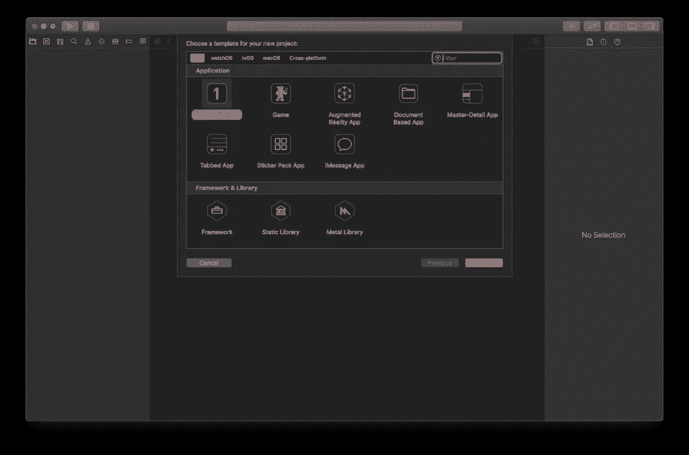

接下来，我们输入项目数据并选择*使用核心数据*和*使用 CloudKit* 选项。

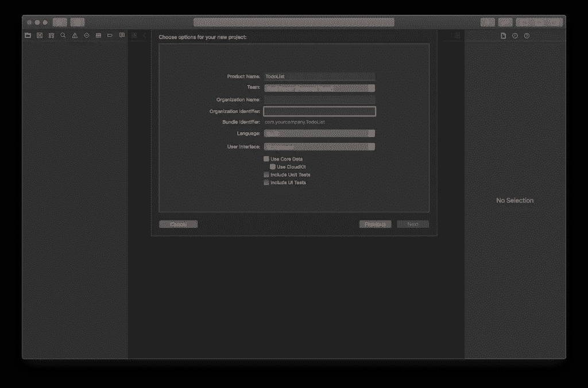

现在我们必须在项目中添加使用 *iCloud* 的功能。为此，我们在*目标*中选择应用程序，然后选择*签名&功能*选项卡，最后选择*+功能*选项。将出现一个菜单，从中我们可以选择 *iCloud* 选项。

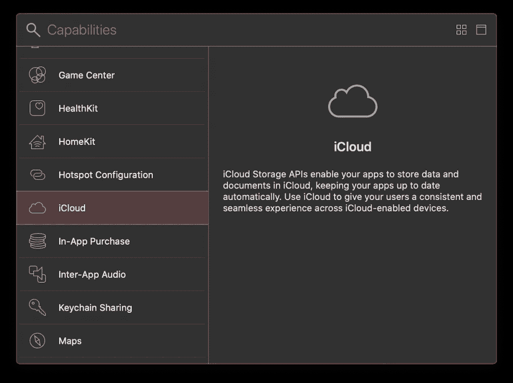

## CloudKit 仪表板

现在我们已经创建了项目和容器，我们必须为我们将在应用程序中使用的数据创建记录。我们可以从 *CloudKit* 桌面上完成这项工作。为此，我们单击 *CloudKit 仪表盘*按钮。

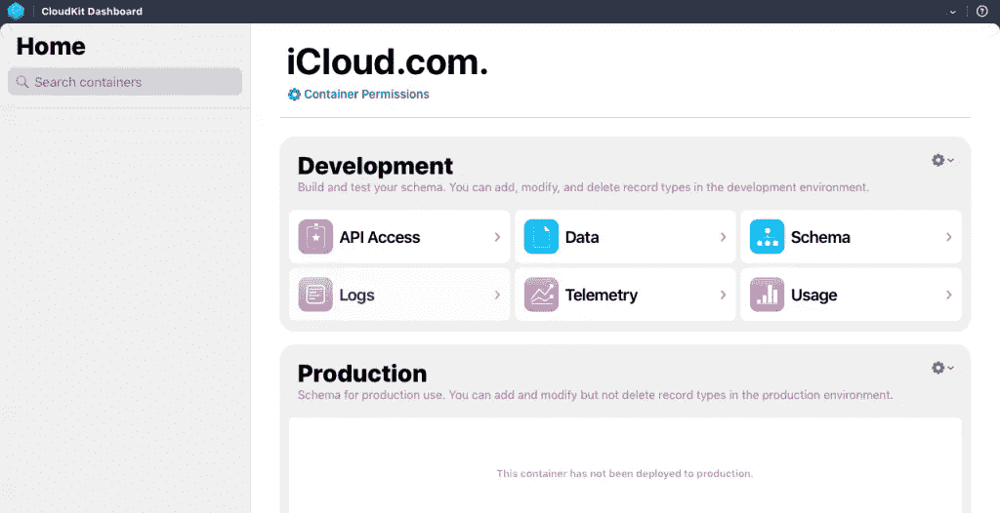

如上图所示， *CloudKit* 桌面有六个部分:

*   **API 访问。**管理允许调用 web 服务的 API 令牌和服务器到服务器密钥。
*   **数据。**管理公共、私有和共享数据库中的记录及其类型、索引、订阅和安全性。
*   **图式。**在这里我们可以找到*注册类型、*索引、*安全角色*和*订阅类型*的选项。
*   **日志。**显示服务器活动或通知的历史和实时数据。
*   **遥测。**显示使用数据库时服务器端使用情况和性能的图表，以及通知事件。
*   **用法。**显示有关活动用户、每秒请求数或数据存储的信息。

## 从 CloudKit 仪表板创建数据库

正如我们之前所评论的，我们将创建一个简单的应用程序，允许我们管理一系列任务，我们将在 *iCloud* 中同步这些任务。由于这是一个简单的例子，我们将创建一个数据库，其中包含一个保存任务的表，该表具有以下属性:标题、创建日期、修改日期以及是否完成。

从 CloudKit 桌面选择 *Schema >记录类型>新类型*，并将其命名为*任务*。

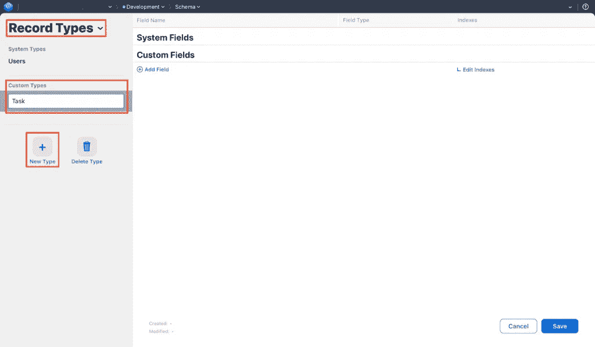

一旦创建了这种类型的记录，我们选择它并开始添加字段(添加完之后，点击*保存*):

*   **标题**(类型*串*)
*   **创建日期**(类型*日期*)
*   **修改日期**(类型*日期*)
*   **已检查**(类型 *Int64* ，因为没有布尔值)

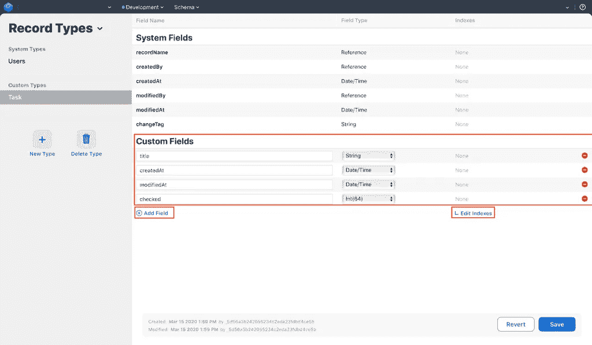

数据可以有以下任何一种基本类型(你也可以把这些数据做成数组， *List* ):

*   **资产。**它是一个与记录相关联的文件，尽管它是独立存储的(它有 1 MB 的限制)。
*   日期/时间。一个日期和时间数据。
*   **Int(64)。**64 位整数。
*   **替身。**一个**一个**双数。
*   **字节。**存储在注册表本身的字节缓冲区。
*   **弦。**一个文本字符串。
*   **地点。**为地理位置数据。
*   **参考。**对另一个表的引用，以便在它们之间创建关系。

最后，我们选择*编辑索引*并添加三个:

*   *可排序类型的 createdAt* (这将允许我们按创建日期对结果进行排序)。
*   *选中类型为可查询的*(以确定任务是否标记为完成)。
*   可查询类型的记录名(检索记录)。

这样，我们得到了下面的图像:

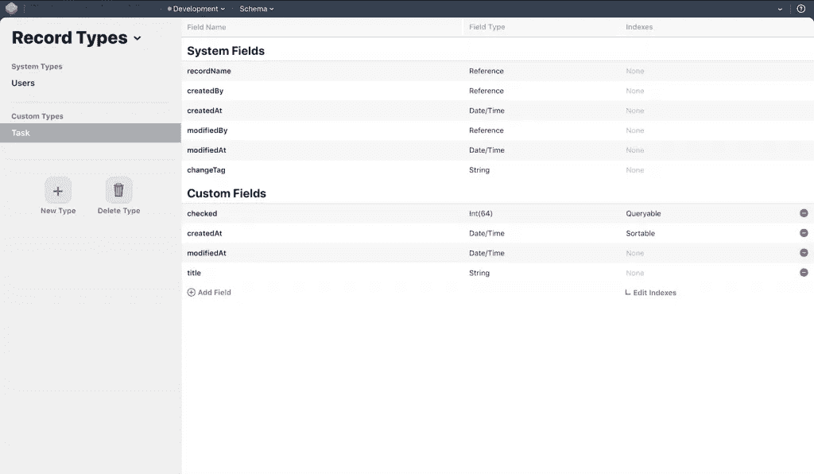

## 添加样本数据

一旦创建了*任务*表，我们就可以从 CloudKit 桌面添加一些示例数据。为此，我们从下拉菜单中选择*数据*选项。

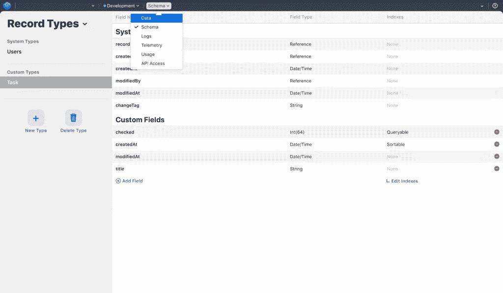

接下来，在左侧面板中，我们从*数据库*菜单中选择*公共数据库*，在*区域*菜单中，我们选择 *_defaultZone* (这是包含应用程序公共记录的区域)。然后，在*类型*菜单中我们选择*任务*(表名)，然后点击*新记录*按钮添加数据。

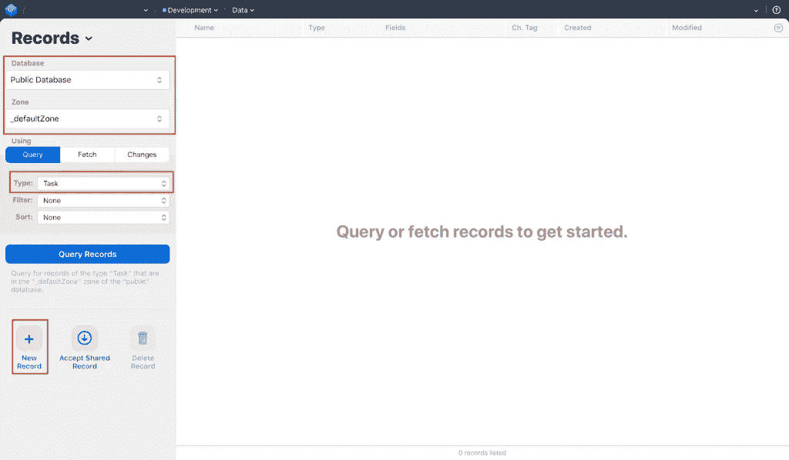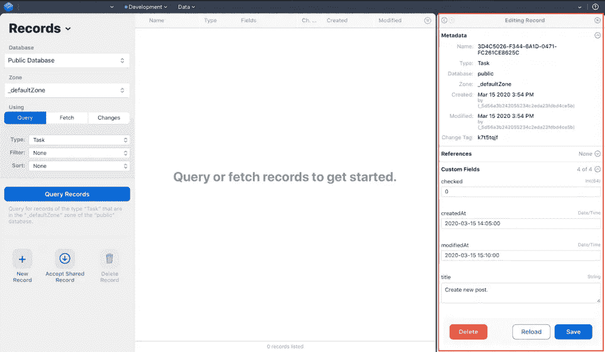

# 有点快

一旦我们输入了几个样本记录，我们就开始开发一个简单的应用程序。这个项目可以在 [GitHub](https://github.com/raulferrerdev/TodoList) 上找到全文。

## UI 设计

这个项目由一个`UITableView`组件组成，它将显示任务。这个表格的每个单元格都是一个任务，带有标题、创建日期和一个图标来指示任务是否已经完成。

该表将位于工具栏中的一个`UINavigationController`组件内，我们将在该组件中放置标题和一个添加任务的按钮。在这个项目中，所有这些都将通过代码来完成，不使用故事板或。xib 文件。

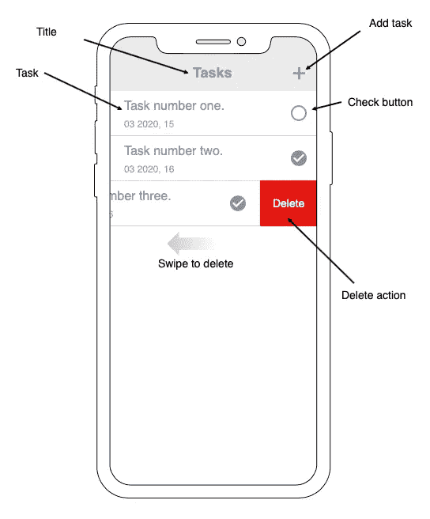

## 项目创建

在 Xcode 11 中建立项目时，要在没有故事板的情况下工作，我们必须在创建项目后采取一些步骤:

*   我们删除文件 Main.storyboard
*   在*常规*选项卡(*目标*)中，我们转到*主* *界面*选择器并删除*主*，将该字段留空。


最后，在信息选项卡(*目标*)中，我们转到*应用* *场景清单>场景配置>应用会话角色>项目 0(默认配置)*并删除*故事板名称*字段。


由于我们将不再调用 *Main.storyboard* 来启动项目，我们转到 *SceneDelegate.swift* 文件，并在`function scene(_ scene: UIScene, willConnectTo session: UISceneSession, options connectionOptions: UIScene.ConnectionOptions)`中将其内容替换为以下代码:

```
guard let windowScene = (scene as? UIWindowScene) else { return }
window = UIWindow(frame: UIScreen.main.bounds)
let viewController = ViewController()
let navigationController = UINavigationController()
navigationController.viewControllers = [viewController]
window?.rootViewController = navigationController
window?.makeKeyAndVisible()
window?.windowScene = windowScene
```

这段代码创建了一个 UINavigationController，并向其中添加了`ViewController`控制器。然后将其指定为`rootViewController`。

## 创建记录管理器

接下来，我们创建一个管理器，它将执行与`CloudKit`相关的任务(检索记录，保存它们……)。我们打算称它为`CloudKitManager.swift`。首先，我们将添加检索`iCloud`日志的功能:

```
import Foundation
import CloudKit

enum FetchError {
    case fetchingError, noRecords, none
}

struct CloudKitManager {

    private let RecordType = "Task"

    func fetchTasks(completion: @escaping ([CKRecord]?, FetchError) -> Void) {
        let publicDatabase = CKContainer(identifier: "{YOUR_CONTAINER_IDENTIFIER}").publicCloudDatabase
        let query = CKQuery(recordType: RecordType, predicate: NSPredicate(value: true))
        query.sortDescriptors = [NSSortDescriptor(key: "createdAt", ascending: false)]

        publicDatabase.perform(query, inZoneWith: CKRecordZone.default().zoneID, completionHandler: { (records, error) -> Void in
            self.processQueryResponseWith(records: records, error: error as NSError?, completion: { fetchedRecords, fetchError in
                completion(fetchedRecords, fetchError)
            })
        })
    }

    private func processQueryResponseWith(records: [CKRecord]?, error: NSError?, completion: @escaping ([CKRecord]?, FetchError) -> Void) {
        guard error == nil else {
            completion(nil, .fetchingError)
            return
        }

        guard let records = records, records.count > 0 else {
            completion(nil, .noRecords)
            return
        }

        completion(records, .none)
    }
}
```

在`fetchTasks(completion: @escaping ([CKRecord] ?, FetchError) -> Void)`中，我们做的第一件事是从我们给它的标识符( *iCloud.com…* )中检索我们应用程序的容器(类型`CKContainer`),然后我们得到公共数据库，这是我们先前创建演示记录的地方。

然后，我们创建一个搜索(*查询*，类型为 *CKQuery* )，其中我们指出了我们在 *iCloud* ( *任务*)中创建的表的名称，并为获得的记录添加了一个排序标准——在这种情况下，它将根据创建日期(`createdAt`)从最新到最早(`ascending: false`)对记录进行排序。

接下来，我们根据`publicDatabase.perform(<query: CKQuery, inZoneWith: CKRecordZone.ID?, completionHandler: ([CKRecord]?, Error?) -> Void>)`方法在公共数据库中执行查询，因为我们引入了我们创建的查询、区域标识符(这是默认区域，*默认*，以及我们在 *iCloud* 中创建表时选择的区域)。

当执行查询时，我们得到两个参数作为响应:一个记录列表(`CKRecord`)和一个错误(这两种情况都是有条件的，因为它们可以有值`nil`)。

这个响应在`processQueryResponseWith`方法中被处理，在这个方法中，我们检查在执行查询时是否有错误，是否有任何记录被返回，以及这些记录是什么。为了便于错误的处理，创建了`enum FetchError` ，收集了可能出现的错误。

## 创建 UITableView 组件

UITableView 组件很简单，我们唯一要定制的是单元格可以有可变的高度，以显示最多三行(`TasksTableViewController.swift`)的任务标题:

```
import UIKit
import CloudKit

class TasksTableViewController: UITableViewController {

    private var tasks = [CKRecord]()

    init() {
        super.init(style: .plain)
    }

    required init?(coder: NSCoder) {
        fatalError("init(coder:) has not been implemented")
    }

    override func viewDidLoad() {
        super.viewDidLoad()

        configureTableView()
    }

    private func configureTableView() {
        tableView.backgroundColor = .white
        tableView.separatorStyle = .singleLine
        tableView.register(TaskCell.self, forCellReuseIdentifier: TaskCell.reuseID)
        tableView.delegate = self
        tableView.dataSource = self
        tableView.bounces = false
        tableView.showsVerticalScrollIndicator = false
        tableView.rowHeight = 72
        tableView.estimatedRowHeight = UITableView.automaticDimension
        tableView.translatesAutoresizingMaskIntoConstraints = false
        tableView.contentInsetAdjustmentBehavior = .never
    }

    func set(tasks: [CKRecord]) {
        self.tasks = tasks
        tableView.reloadData()
    }
}

// MARK: - Table view data source
extension TasksTableViewController {

    override func numberOfSections(in tableView: UITableView) -> Int {
        return 1
    }

    override func tableView(_ tableView: UITableView, numberOfRowsInSection section: Int) -> Int {
        return tasks.count
    }

    override func tableView(_ tableView: UITableView, cellForRowAt indexPath: IndexPath) -> UITableViewCell {
        let cell = tableView.dequeueReusableCell(withIdentifier: TaskCell.reuseID, for: indexPath) as! TaskCell
        cell.set(record: tasks[indexPath.row])

        return cell
    }

    override func tableView(_ tableView: UITableView, heightForRowAt indexPath: IndexPath) -> CGFloat {
        return UITableView.automaticDimension
    }

    override func tableView(_ tableView: UITableView, estimatedHeightForRowAt indexPath: IndexPath) -> CGFloat {
        return UITableView.automaticDimension
    }

    override func tableView(_ tableView: UITableView, canEditRowAt indexPath: IndexPath) -> Bool {
        return true
    }
}
```

我们还创建了一个自定义单元格(`TaskCell.swift`):

```
import UIKit
import CloudKit

class TaskCell: UITableViewCell {

    static let reuseID = "TaskCell"

    private var record: CKRecord?
    private var taskTitleLabel = UILabel(frame: .zero)
    private var createdAtLabel = UILabel(frame: .zero)
    private var checkedButton = UIButton(frame: .zero)
    private var isChecked: Bool = false

    private let uncheckedIcon = UIImage(systemName: "circle")!

    private let checkedIcon = UIImage(systemName: "checkmark.circle")!
    weak var delegate: TaskCheckDelegate?

    override init(style: UITableViewCell.CellStyle, reuseIdentifier: String?) {
        super.init(style: style, reuseIdentifier: reuseIdentifier)
        configure()
    }

    required init?(coder: NSCoder) {
        fatalError("init(coder:) has not been implemented")
    }

    override func prepareForReuse() {
        self.record = nil
        self.isChecked = false
    }

    private func configure() {
        selectionStyle = .none

        configureTitleLabel()
        configureCreatedAtLabel()
        configureCheckedButton()
        layoutUI()
    }

    func set(record: CKRecord) {
        self.record = record

        taskTitleLabel.text = record.object(forKey: "title") as? String ?? ""
        if let createdDate = record.object(forKey: "createdAt") as? Date {
            createdAtLabel.text = createdDate.convertToMonthYearDayFormat()
        } else {
            createdAtLabel.text = ""
        }

        if let checked = record.object(forKey: "checked") as? Int64 {
            self.isChecked = checked == 0 ? false : true
            checkedButton.setBackgroundImage(self.isChecked ? checkedIcon : uncheckedIcon, for: .normal)
        } else {
            self.isChecked = false
            checkedButton.setBackgroundImage(uncheckedIcon, for: .normal)
        }
    }

    private func configureTitleLabel() {
        taskTitleLabel.translatesAutoresizingMaskIntoConstraints = false
        taskTitleLabel.font = .systemFont(ofSize: 16)
        taskTitleLabel.textColor = .systemGray2
        taskTitleLabel.textAlignment = .left
        taskTitleLabel.numberOfLines = 3
        taskTitleLabel.lineBreakMode = .byTruncatingTail
    }

    private func configureCreatedAtLabel() {
        createdAtLabel.translatesAutoresizingMaskIntoConstraints = false
        createdAtLabel.font = .systemFont(ofSize: 12)
        createdAtLabel.textColor = .systemGray3
        createdAtLabel.textAlignment = .left
        createdAtLabel.numberOfLines = 1
    }

    private func configureCheckedButton() {
        checkedButton.translatesAutoresizingMaskIntoConstraints = false
        checkedButton.setBackgroundImage(uncheckedIcon, for: .normal)
        checkedButton.tintColor = .systemGray
        checkedButton.addTarget(self, action: #selector(toggleChecked), for: .touchUpInside)
    }

    private func layoutUI() {
        contentView.addSubview(taskTitleLabel)
        contentView.addSubview(createdAtLabel)
        contentView.addSubview(checkedButton)

        NSLayoutConstraint.activate([
            checkedButton.centerYAnchor.constraint(equalTo: contentView.centerYAnchor),
            checkedButton.trailingAnchor.constraint(equalTo: contentView.trailingAnchor, constant: -10),
            checkedButton.heightAnchor.constraint(equalToConstant: 20),
            checkedButton.widthAnchor.constraint(equalToConstant: 20),

            taskTitleLabel.topAnchor.constraint(equalTo: contentView.topAnchor, constant: 5),
            taskTitleLabel.leadingAnchor.constraint(equalTo: contentView.leadingAnchor, constant: 10),
            taskTitleLabel.trailingAnchor.constraint(equalTo: checkedButton.leadingAnchor, constant: -10),
            taskTitleLabel.bottomAnchor.constraint(equalTo: contentView.bottomAnchor, constant: -30),

            createdAtLabel.leadingAnchor.constraint(equalTo: contentView.leadingAnchor, constant: 10),
            createdAtLabel.trailingAnchor.constraint(equalTo: checkedButton.leadingAnchor, constant: 10),
            createdAtLabel.topAnchor.constraint(equalTo: taskTitleLabel.bottomAnchor, constant: 5)
        ])

        taskTitleLabel.setContentHuggingPriority(.required, for: .vertical)
    }

    @objc private func toggleChecked() {
        guard let record = record else { return }
        isChecked.toggle()
        checkedButton.setBackgroundImage(isChecked ? checkedIcon : uncheckedIcon, for: .normal)
        checkedButton.tintColor = isChecked ? .systemGreen : .systemGray
    }
}
```

其中`toggleChecked()`方法允许你改变目前已完成任务图标的状态。

现在在`ViewController.swift`类中，我们已经可以显示表格并执行`iCloud`调用。

```
import UIKit

class ViewController: UIViewController {

    private let tableView = TasksTableViewController()
    private let manager = CloudKitManager()

    override func viewDidLoad() {
        super.viewDidLoad()

        self.title = "Tasks"

        layoutUI()
        fetchRecords()
    }

    private func layoutUI() {
        view.addSubview(tableView.view)

        NSLayoutConstraint.activate([
            tableView.view.topAnchor.constraint(equalTo: view.safeAreaLayoutGuide.topAnchor),
            tableView.view.bottomAnchor.constraint(equalTo: view.bottomAnchor),
            tableView.view.centerXAnchor.constraint(equalTo: view.centerXAnchor),
            tableView.view.widthAnchor.constraint(equalTo: view.widthAnchor)
        ])
    }

    private func fetchRecords() {
        manager.fetchTasks(completion: { (records, error) in
            guard error == .none, let records = records else {
                // Deal with error
                return
            }

            DispatchQueue.main.async {
                self.tableView.set(tasks: records)
            }
        })
    }
}
```

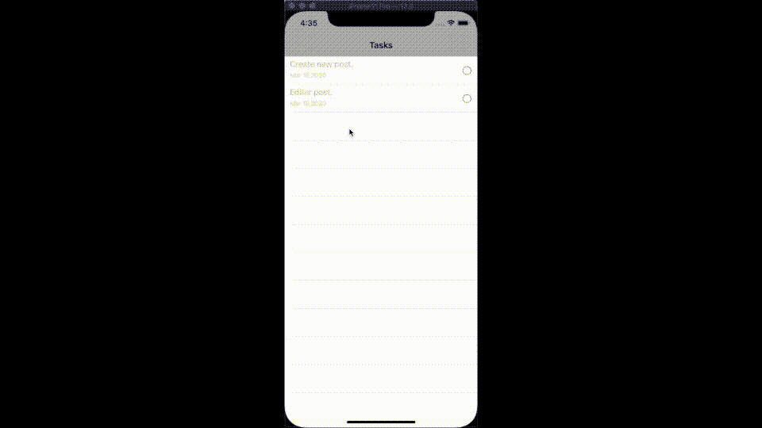

## 记录删除

为了删除记录，我们启用了单元格拖动，以便删除选项出现。我们通过向`TasksTableViewController` 类添加以下方法来实现这一点:

```
override func tableView(_ tableView: UITableView, commit editingStyle: UITableViewCell.EditingStyle, forRowAt indexPath: IndexPath) {
    if (editingStyle == .delete) {

    }
}
```

我们还修改了这个类，注入了一个`CloudKitManager` *的实例。*

```
private var manager: CloudKitManager!

init(manager: CloudKitManager) {
    super.init(style: .plain)

    self.manager = manager
}
view raw
```

在`ViewController`类中，我们更改了`TasksTableViewController`类的实例，因为现在我们将注入`CloudKitManager`实例:

```
private var tableView: TasksTableViewController!
private let manager = CloudKitManager()

override func viewDidLoad() {
    super.viewDidLoad()

    self.title = "Tasks"

    configureTableView()
    layoutUI()
    fetchRecords()
}

private func configureTableView() {
    tableView = TasksTableViewController(manager: manager)
}
```

在`CloudKitManager`中，我们添加这些方法来删除记录，并将`deletingError`案例添加到`FetchError enum`:

```
func deleteRecord(record: CKRecord) {
    let publicDatabase = CKContainer(identifier: "{YOUR_CONTAINER_IDENTIFIER}").publicCloudDatabase

    publicDatabase.delete(withRecordID: record.recordID) { (recordID, error) -> Void in
        guard let _ = error else {
          completionHandler(.none)
          return
        }

        completionHandler(.deletingError)
    }
}
```

在 TasksTableViewController 类中，我们修改了最后一个方法:

```
override func tableView(_ tableView: UITableView, commit editingStyle: UITableViewCell.EditingStyle, forRowAt indexPath: IndexPath) {
    if (editingStyle == .delete) {
        manager.deleteRecord(record: tasks[indexPath.row], completionHandler: { error in
            guard error == .none else {
                // Deal with error
                return
            }

            self.tasks.remove(at: indexPath.row)

            DispatchQueue.main.async {
                self.tableView.deleteRows(at: [indexPath], with: .right)
            }
        })
    }
}
```

现在我们可以测试任务的删除。

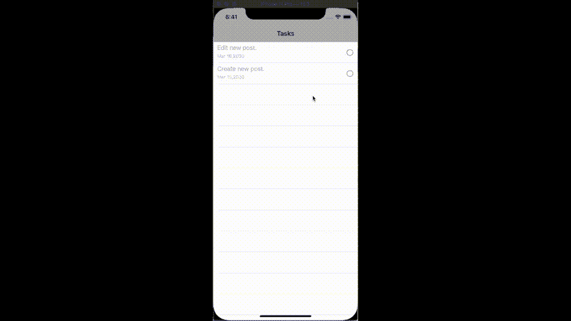

删除记录。

## 添加任务

为了创建一个任务，我们将创建一个`UIViewController`，我们将通过单击导航栏中的“+”按钮导航到该任务。这个新的`UIViewController`，我们称之为`AddTaskController`，将简单地由一个`UITextField`组件和一个`UIButton`组件组成，我们将在其中引入任务文本，并添加它。

```
import UIKit
import CloudKit

protocol TasksDelegate: class {
    func addedTask(_ task: CKRecord?, error: FetchError)
}

class AddTaskController: UIViewController {

    private let textField = UITextField(frame: .zero)
    private let addButton = UIButton(frame: .zero)

    private var manager: CloudKitManager!

    weak var delegate: TasksDelegate?

    init(manager: CloudKitManager) {
        super.init(nibName: nil, bundle: nil)

        self.manager = manager
    }

    required init?(coder: NSCoder) {
        fatalError("init(coder:) has not been implemented")
    }

    override func viewDidLoad() {
        super.viewDidLoad()

        view.backgroundColor = .white

        configureTextField()
        configureAddButton()
        layoutUI()
    }

    private func configureTextField() {
        textField.translatesAutoresizingMaskIntoConstraints = false
        textField.placeholder = "Add a task"
        textField.borderStyle = UITextField.BorderStyle.line
        textField.textColor = .systemGray2
        textField.font = .systemFont(ofSize: 16)
        textField.contentVerticalAlignment = .top
    }

    private func configureAddButton() {
        addButton.translatesAutoresizingMaskIntoConstraints = false
        addButton.setTitle("Add task", for: .normal)
        addButton.setTitleColor(.systemTeal, for: .normal)
        addButton.titleLabel?.font = .boldSystemFont(ofSize: 16)
        addButton.addTarget(self, action: #selector(addTask), for: .touchUpInside)
    }

    private func layoutUI() {
        view.addSubview(textField)
        view.addSubview(addButton)

        NSLayoutConstraint.activate([
            textField.topAnchor.constraint(equalTo: view.safeAreaLayoutGuide.topAnchor, constant: 20),
            textField.leadingAnchor.constraint(equalTo: view.leadingAnchor, constant: 10),
            textField.trailingAnchor.constraint(equalTo: view.trailingAnchor, constant: -10),
            textField.heightAnchor.constraint(equalToConstant: 300),

            addButton.topAnchor.constraint(equalTo: textField.bottomAnchor, constant: 40),
            addButton.centerXAnchor.constraint(equalTo: view.centerXAnchor),
            addButton.widthAnchor.constraint(equalToConstant: 200),
            addButton.heightAnchor.constraint(equalToConstant: 50)
        ])
    }

    @objc private func addTask() {
        guard let task = textField.text, !task.isEmpty else {
            delegate?.addedTask(nil, error: .addingError)
            self.navigationController?.popViewController(animated: false)
            return
        }

        manager.addTask(task, completionHandler: { (record, error) in
            self.delegate?.addedTask(record, error: .none)
            DispatchQueue.main.async {
                self.navigationController?.popViewController(animated: false)
            }
            return
        })
    }
}
```

在这段代码中有几个要点:

*   `init`方法注入一个`CloudKitManager`实例，以便管理记录的添加。
*   与“*添加任务”*按钮关联的方法被称为`CloudKitManager`的`addTask`方法，它将管理新记录的添加。在`CloudKitManager`中为该案例添加的代码为(新案例`addingError`，也已在`FetchError enum`中添加):

```
func addTask(_ task: String, completionHandler: @escaping (CKRecord?, FetchError) -> Void) {
    let publicDatabase = CKContainer(identifier: "{YOUR_CONTAINER_IDENTIFIER}").publicCloudDatabase
    let record = CKRecord(recordType: RecordType)

    record.setObject(task as __CKRecordObjCValue, forKey: "title")
    record.setObject(Date() as __CKRecordObjCValue, forKey: "createdAt")
    record.setObject(0 as __CKRecordObjCValue, forKey: "checked")

    publicDatabase.save(record, completionHandler: { (record, error) in
        guard let _ = error else {
            completionHandler(record, .none)
            return
        }

        completionHandler(nil, .addingError)
    })
}
```

已经创建了一个协议来将创建的记录传递给`ViewController`。最后，启动控制器(`*ViewController*`)被导航。

为了调用`AddTaskController`类，我们在导航栏上添加了一个按钮。我们使用`UIBarButtonItem`组件来实现这一点，并将其与`addTask`方法关联起来。在这个方法中，我们实例化控制器，定义委托并推送新的控制器。

```
private func configureAddButton() {
    let addButton = UIBarButtonItem(barButtonSystemItem: .add, target: self, action: #selector(addTask))
    navigationItem.rightBarButtonItems = [addButton]
}

@objc private func addTask() {
    let controller = AddTaskController(manager: manager)
    controller.delegate = self
    navigationController?.pushViewController(controller, animated: false)
}
```

既然我们已经为`ViewController`定义了代表，我们必须让`ViewController`采用这个协议的方法。我们使用一个`ViewController`扩展(来组织代码)来做到这一点:

```
extension ViewController: TasksDelegate {
    func addedTask(_ task: CKRecord?, error: FetchError) {
        guard error == .none, let task = task else {
            // Deal with error
            return
        }
        DispatchQueue.main.async {
            self.tableView.add(task: task)
        }
    }
}
```

在 addedTask 方法的这个实现中，任何可能的错误都会被处理，如果一切都是正确的，那么创建的记录将被发送到我们将在`TasksTableViewController`类中创建的新的`add(task: CKRecord)`方法:

```
func add(task: CKRecord) {
    self.tasks.insert(task, at: 0)
    tableView.reloadData()
}
```

这个方法的作用是将新记录添加到记录列表的开头(它是最新的)，然后从表中重新加载数据。

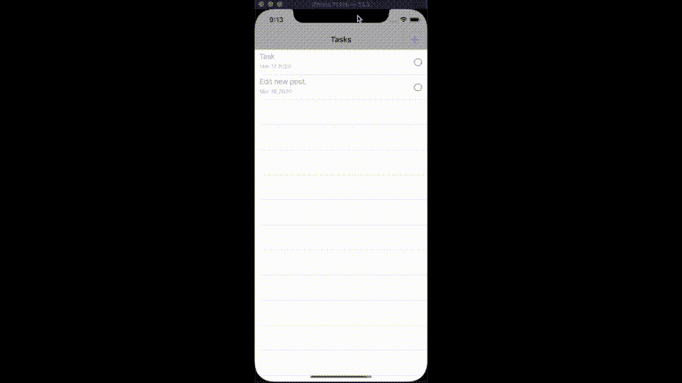

添加新记录。

## 更新任务

我们已经看到了如何用`CloudKit`恢复、删除或创建记录。现在我们将看看如何在`CloudKit`中更新注册表。为此，我们将使用一个简单的案例，它对应于完成一个任务并将其标记为已完成。

首先我们在`CloudKitManager`中添加一个新方法:

```
func updateTask(_ task: CKRecord, completionHandler: @escaping (CKRecord?, FetchError) -> Void) {
    let publicDatabase = CKContainer(identifier: "{YOUR_CONTAINER_IDENTIFIER}").publicCloudDatabase

    publicDatabase.save(task, completionHandler: { (record, error) in
        guard let _ = error else {
            completionHandler(record, .none)
            return
        }

        completionHandler(nil, .addingError)
    })
}
```

当传递一个已经存在的对象并将其保存在`CloudKit`中时，其值被更新。为了在我们将任务标记为完成时调用这个方法，我们创建了一个协议，允许将修改后的记录从单元格传递给`TasksTableViewController`类:

```
protocol TaskCheckDelegate: class {
    func updateTask(_ record: CKRecord)
}
```

现在，在`TasksTableViewController`类中，我们将委托添加到单元格中:

```
override func tableView(_ tableView: UITableView, cellForRowAt indexPath: IndexPath) -> UITableViewCell {
    let cell = tableView.dequeueReusableCell(withIdentifier: TaskCell.reuseID, for: indexPath) as! TaskCell
    cell.set(record: tasks[indexPath.row])
    cell.delegate = self

    return cell
}
```

然后我们让`TasksTableViewController`类采用协议:

```
extension TasksTableViewController: TaskCheckDelegate {
    func updateTask(_ record: CKRecord) {
        manager.updateTask(record, completionHandler: { (record, error) in
          // Deal with error if there is one
        })
    }
}
```

如果我们将一个记录标记为完成，然后关闭应用程序并重新加载，我们会看到该记录在 *iCloud:* 中被修改

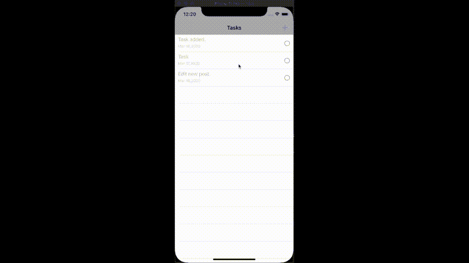

更新记录。

# 结论

我们已经看到了如何创建一个使用 *CloudKit* 与 *iCloud* 同步数据的应用程序。在这个应用程序中，我们集成了数据库的基本 CRUD 方法(*创建*、*读取*、*更新*、*删除*)。你可以从 [GitHub](https://github.com/raulferrerdev/TodoList) 下载完整的项目。