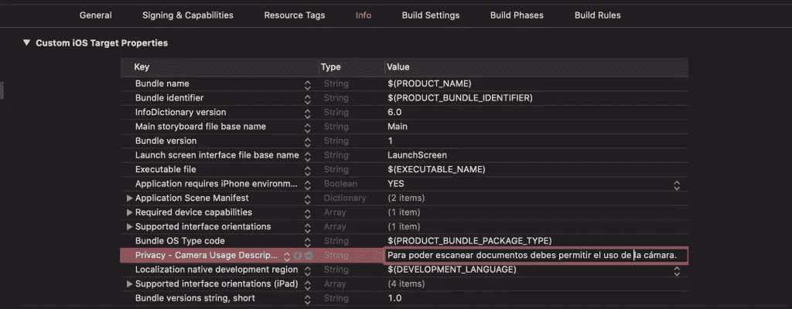
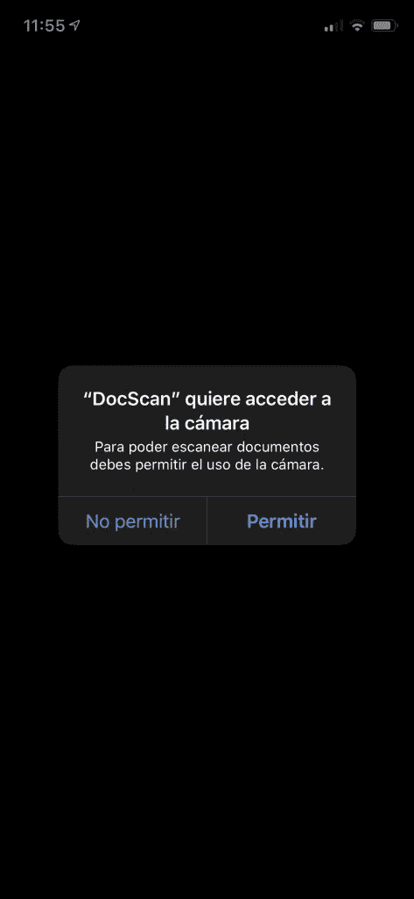
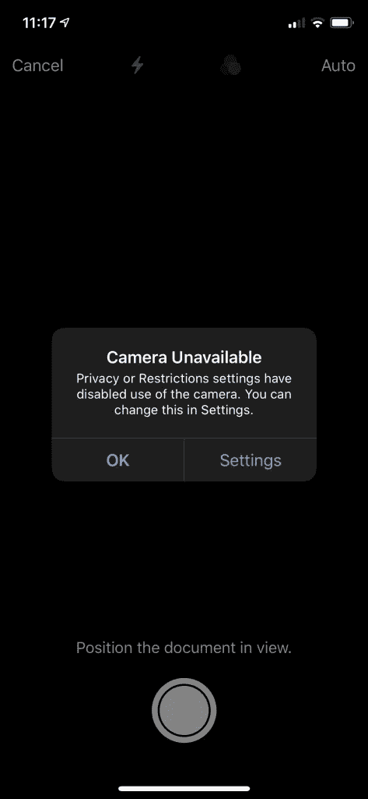
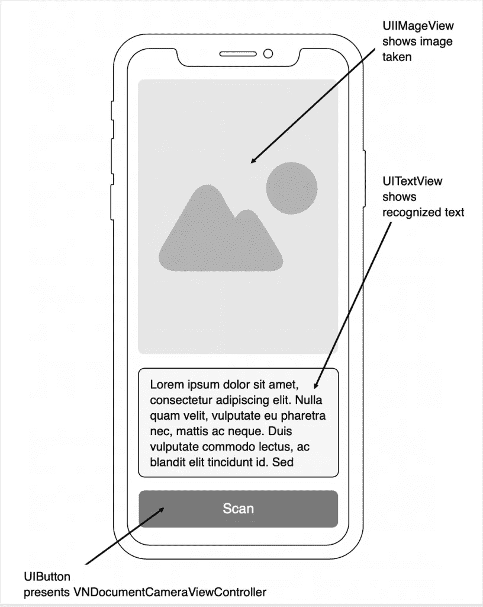
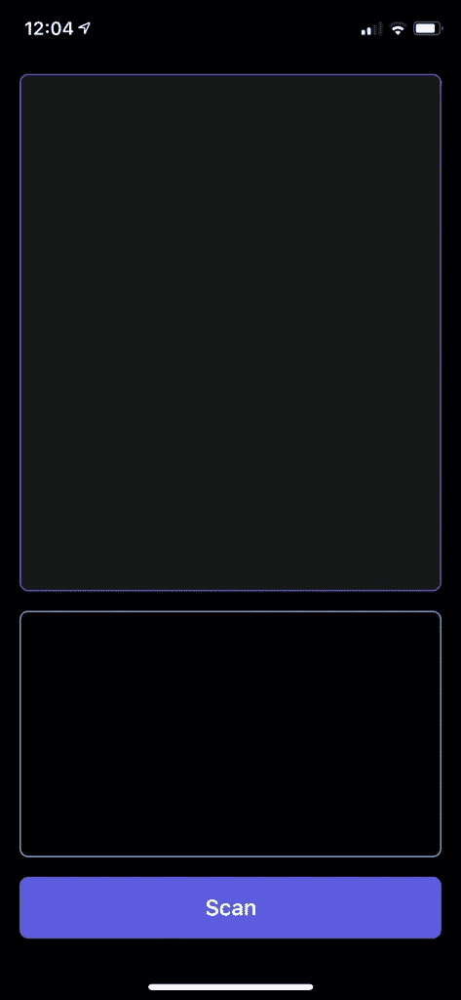
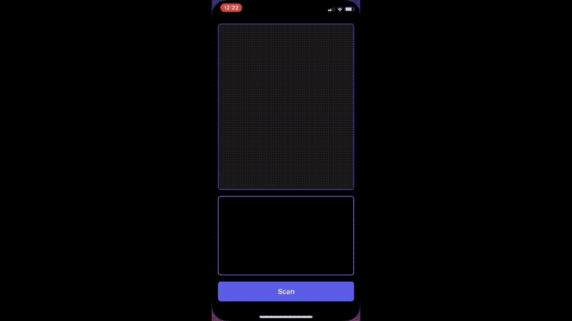

# Swift It Yourself 使用 VisionKit 在 iOS 13 上开发您自己的 OCR

> 原文：<https://betterprogramming.pub/swift-it-yourself-siy-develop-your-own-ocr-on-ios-13-with-visionkit-800b34c792ed>

## 用 Swift 和苹果的眼光去阅读和解读身边的文字


照片由[🇨🇭·克劳迪奥·施瓦茨| @purzlbaum](https://unsplash.com/@purzlbaum?utm_source=unsplash&utm_medium=referral&utm_content=creditCopyText) 在 [Unsplash](https://unsplash.com/s/photos/scan?utm_source=unsplash&utm_medium=referral&utm_content=creditCopyText) 上拍摄

在 iOS 11 中，苹果集成了一个名为 [*Vision*](https://developer.apple.com/documentation/vision/) 的库。该库使用算法对图像和视频执行一系列任务(文本检测、条形码等)。).

现在，在 iOS 13 中，苹果发布了一个新的库， [*VisionKit*](https://developer.apple.com/documentation/visionkit) ，可以让你使用系统本身的文档扫描仪(使用 Notes 应用的同一个)。

让我们来看看如何用 VisionKit 在 iOS 13 中开发自己的 OCR。

# 项目开始

为了检查我们如何扫描文档并识别其内容，我们在 Xcode 11 中创建了一个项目(记住 VisionKit 只能在 iOS 13+上工作)。这个项目可以在 [GitHub](https://github.com/raulferrerdev/DocScan) 上找到全文。

由于我们将使用设备的摄像头扫描文档，操作系统将向我们显示一条消息，要求我们允许使用该摄像头。如果我们不希望出现错误和应用程序被关闭，我们必须通知应用程序我们将需要摄像机。

为此，我们在`Info.plist`文件中添加了密钥`Privacy — Camera Usage Description`，以及一个文本，当用户请求许可时，该文本将显示给用户。

比如:`To be able to scan documents you must allow the use of the camera.`



添加了相机使用请求密钥的 Info.plist。



请求许可。

如果权限被拒绝，当我们想要扫描时，会出现以下消息:



# 接口设计

这个项目基本上由一个`UIImageView`组件组成，其中我们将显示带有识别文本的扫描文档，一个`UITextView`组件显示扫描仪已经识别的文本，一个`UIButton`组件激活文档扫描。

在这个项目中，我将通过代码来完成这一切，而不使用故事板或`.xib`文件。



项目界面设计。

# 界面编程

首先，我们创建了`ScanButton`组件:

```
import UIKit

class ScanButton: UIButton {

    override init(frame: CGRect) {
        super.init(frame: frame)
        configure()
    }

    required init?(coder: NSCoder) {
        fatalError("init(coder:) has not been implemented")
    }

    private func configure() {
        translatesAutoresizingMaskIntoConstraints = false
        setTitle("Scan document", for: .normal)
        titleLabel?.font = UIFont.boldSystemFont(ofSize: 18.0)
        titleLabel?.textColor = .white
        layer.cornerRadius = 7.0
        backgroundColor = UIColor.systemIndigo
    }
}
```

然后，`ScanImageView`组件:

```
import UIKit

class ScanImageView: UIImageView {

    override init(frame: CGRect) {
        super.init(frame: frame)
        configure()
    }

    required init?(coder: NSCoder) {
        fatalError("init(coder:) has not been implemented")
    }

    private func configure() {
        translatesAutoresizingMaskIntoConstraints = false
        layer.cornerRadius = 7.0
        layer.borderWidth = 1.0
        layer.borderColor = UIColor.systemIndigo.cgColor
        backgroundColor = UIColor.init(white: 1.0, alpha: 0.1)
        clipsToBounds = true
    }
}
```

最后，`OcrTextView`组件:

```
import UIKit

class OcrTextView: UITextView {

    override init(frame: CGRect, textContainer: NSTextContainer?) {
        super.init(frame: .zero, textContainer: textContainer)

        configure()
    }

    required init?(coder: NSCoder) {
        fatalError("init(coder:) has not been implemented")
    }

    private func configure() {
        translatesAutoresizingMaskIntoConstraints = false
        layer.cornerRadius = 7.0
        layer.borderWidth = 1.0
        layer.borderColor = UIColor.systemTeal.cgColor
        font = .systemFont(ofSize: 16.0)
    }
}
```

现在我们从`ViewController`中调用它们，并将它们定位在屏幕上:

```
import UIKit

class ViewController: UIViewController {

    private var scanButton = ScanButton(frame: .zero)
    private var scanImageView = ScanImageView(frame: .zero)
    private var ocrTextView = OcrTextView(frame: .zero, textContainer: nil)

    override func viewDidLoad() {
        super.viewDidLoad()

        configure()
    }

    private func configure() {
        view.addSubview(scanImageView)
        view.addSubview(scanButton)
        view.addSubview(scanButton)

        let padding: CGFloat = 16
        NSLayoutConstraint.activate([
            scanButton.leadingAnchor.constraint(equalTo: view.safeAreaLayoutGuide.leadingAnchor, constant: padding),
            scanButton.trailingAnchor.constraint(equalTo: view.safeAreaLayoutGuide.trailingAnchor, constant: -padding),
            scanButton.bottomAnchor.constraint(equalTo: view.safeAreaLayoutGuide.bottomAnchor, constant: -padding),
            scanButton.heightAnchor.constraint(equalToConstant: 50),

            ocrTextView.leadingAnchor.constraint(equalTo: view.safeAreaLayoutGuide.leadingAnchor, constant: padding),
            ocrTextView.trailingAnchor.constraint(equalTo: view.safeAreaLayoutGuide.trailingAnchor, constant: -padding),
            ocrTextView.bottomAnchor.constraint(equalTo: scanButton.topAnchor, constant: -padding),
            ocrTextView.heightAnchor.constraint(equalToConstant: 200),

            scanImageView.leadingAnchor.constraint(equalTo: view.safeAreaLayoutGuide.leadingAnchor, constant: padding),
            scanImageView.topAnchor.constraint(equalTo: view.safeAreaLayoutGuide.topAnchor, constant: padding),
            scanImageView.trailingAnchor.constraint(equalTo: view.safeAreaLayoutGuide.trailingAnchor, constant: -padding),
            scanImageView.bottomAnchor.constraint(equalTo: ocrTextView.topAnchor, constant: -padding)
        ])
    }
}
```



# 扫描控制器演示—VNDocumentCameraViewController

为了呈现允许我们扫描文档的控制器，我们必须创建并呈现一个`VNDocumentCameraViewController`类的实例。

在 configure 方法的末尾，我们添加了下面的代码，它允许我们调用`scanDocument()`方法:

```
scanButton.addTarget(self, action: #selector(scanDocument), for: .touchUpInside)
```

在`configure()`方法之后，我们创建了`scanDocument()`方法:

```
@objc private func scanDocument() {
    let scanVC = VNDocumentCameraViewController()
    scanVC.delegate = self
    present(scanVC, animated: true)
}
```

可以看到，`@objc`已经加在函数前面了，因为虽然我们是用 Swift 编程，`#selector`是 Objective-C 的一个方法。

此外，`VNDocumentCameraViewController`类提供了`VNDocumentCameraViewControllerDelegate`协议(我们已经在`scanVC.delegate = self`中调用过了)，所以我们可以实现它的方法。

我们在`ViewController`类的扩展中这样做，所以我们的代码更有条理:

```
extension ViewController: VNDocumentCameraViewControllerDelegate {
    func documentCameraViewController(_ controller: VNDocumentCameraViewController, didFinishWith scan: VNDocumentCameraScan) {
        guard scan.pageCount >= 1 else {
            controller.dismiss(animated: true)
            return
        }

        scanImageView.image = scan.imageOfPage(at: 0)
        // Here will be the code for text recognition

        controller.dismiss(animated: true)
    }

    func documentCameraViewController(_ controller: VNDocumentCameraViewController, didFailWithError error: Error) {
        //Handle properly error
        controller.dismiss(animated: true)
    }

    func documentCameraViewControllerDidCancel(_ controller: VNDocumentCameraViewController) {
        controller.dismiss(animated: true)
    }
}
```

第一种方法是`documentCameraViewController (_ controller: VNDocumentCameraViewController, didFinishWith scan: VNDocumentCameraScan)`，当我们扫描完一页或多页并保存它们时调用(*先保持扫描*，然后*保存*)。

`scan`对象(`VNDocumentCameraScan`)包含三个参数:

*   `pageCount` —扫描的(`Int`)页数。
*   `imageOfPage(at index: Int)` —指定索引中页面的图像(`UIImage`)。
*   `title` —扫描文件的标题(`String`)。一旦我们确认一份或多份文件已被扫描，在移除控制器之前，我们会将扫描图像传送至`scanImageView`组件。

第二种方法是`documentCameraViewController (_ controller: VNDocumentCameraViewController, didFailWithError error: Error)`，在扫描文档时发生错误时调用，因此此时我们必须执行一些错误管理操作。

例如，如果错误是由于用户没有给出使用摄像机的许可，我们可以显示一条警告消息，要求激活许可。

当点击`VNDocumentCameraViewController`控制器的`Cancel`按钮时，调用第三个方法`documentCameraViewControllerDidCancel (_ controller: VNDocumentCameraViewController)`。在这里，我们将只解除控制器。

# 文本识别

现在，为了识别和提取我们扫描的文档的文本，我们将使用已经集成到 iOS 11 中的 Apple [Vision](https://developer.apple.com/documentation/vision) 框架。具体来说，我们将使用`[VNRecognizeTextRequest](https://developer.apple.com/documentation/vision/vnrecognizetextrequest)`类。

如文档所示，这个类搜索并识别图像中的文本。

对于这个过程，我们需要一个请求(`VNRecognizeTextRequest`类的实例),在其中我们可以定义文本识别参数:

*   `customWords` —我们定义的一组单词，用于补充字典中的单词，并将在识别阶段使用(例如，名称、标记等)。).
*   `minimumTextHeight` —文本的最小高度(相对于图像的高度)，从该高度开始识别文本。正如苹果在其文档中指出的:

> 增加大小可以减少内存消耗并加快识别速度，但代价是忽略小于最小高度的文本。默认值是 1/32，即 0.03125。

在本项目中，我们将应用一些参数作为示例:

```
var ocrRequest = VNRecognizeTextRequest(completionHandler: nil)
ocrRequest.recognitionLevel = .accurate
ocrRequest.recognitionLanguages = ["en-US", "en-GB"]
ocrRequest.usesLanguageCorrection = true
```

此时，我们创建了`configureOCR()`函数，它将包含分析、识别和从图像中提取文本的功能:

```
private func configureOCR() {
    ocrRequest = VNRecognizeTextRequest { (request, error) in
    guard let observations = request.results as? [VNRecognizedTextObservation] else { return }

    var ocrText = ""
        for observation in observations {
            guard let topCandidate = observation.topCandidates(1).first else { return }

            ocrText += topCandidate.string + "\n"
        }

        DispatchQueue.main.async {
            self.ocrTextView.text = ocrText
            self.scanButton.isEnabled = true
        }
    }

    ocrRequest.recognitionLevel = .accurate
    ocrRequest.recognitionLanguages = ["en-US", "en-GB"]
    ocrRequest.usesLanguageCorrection = true
}
```

我们将在`configure()`方法之后的`viewDidLoad()`中调用这个函数。

我们在这个函数中所做的是创建一个只包含一个参数`completionHandler`的`VNRecognizeTextRequest`实例，每次在图像中检测到文本时都会调用这个实例。

此时，发生的过程是:

*   首先，我们检查`request.results`是否包含一个观察列表(类型为`VNRecognizedTextObservation`)，它对应于视觉库已经检测到的行和句子。
*   接下来，我们迭代这个观察列表。这些观察结果中的每一个都由一系列可能的候选文本组成，每个候选文本都有一定的可信度。我们选择第一个候选项，并将其添加到文本字符串中。
*   最后，我们在`OcrTextView`元素中显示我们已经创建了文本所获得的原则(记住要在主线程中完成，这就是我们使用`Dispatch.main.async`的原因)。

# 图像处理

最后，我们只需要处理扫描仪捕获的图像。

对于它们，我们创建一个函数，该函数将接受一个类型为`UIImage`(捕获的图像)的参数，并将创建一个类型为`VNImageRequestHandler`的实例，在这里我们将传递我们在开始时创建的`ocrRequest`实例:

```
private func processImage(_ image: UIImage) {
    guard let cgImage = image.cgImage else { return }

    ocrTextView.text = ""
    scanButton.isEnabled = false

    let requestHandler = VNImageRequestHandler(cgImage: cgImage, options: [:])
    do {
        try requestHandler.perform([self.ocrRequest])
    } catch let error {
        print(error)
    }
}
```

正如[文档](https://developer.apple.com/documentation/vision/vnimagerequesthandler)所指出的，要实例化这种类型，我们需要使用`CGImage`而不是`UIImage`(因为它与[核心图形](https://developer.apple.com/documentation/coregraphics)一起工作)，所以我们从传递的图像中获取参数。

我们还可以传递一个`VNImageOption`类型的选项列表(描述图像的特定属性或者应该如何处理)，尽管在这种情况下，我们不会传递任何选项。

最后，我们应用文本识别请求(`ocrRequest`)。

该方法`processImage (_ image: UIImage)`将在`documentCameraViewController (_ controller: VNDocumentCameraViewController, didFinishWith scan: VNDocumentCameraScan)`方法结束时调用，并在用`controller.dismiss(animated: true)`关闭控制器之前调用。

```
func documentCameraViewController(_ controller: VNDocumentCameraViewController, didFinishWith scan: VNDocumentCameraScan) {
    guard scan.pageCount >= 1 else {
        controller.dismiss(animated: true)
        return
    }

    scanImageView.image = scan.imageOfPage(at: 0)

    processImage(scan.imageOfPage(at: 0))

    controller.dismiss(animated: true)
}
```

# 扫描仪测试

现在我们可以测试应用程序了。为此，我们打开它并捕捉图像。



正如你所看到的，它完美地识别了图像的文本。

# 结论

正如我们所见，由于有了 [Vision](https://developer.apple.com/documentation/vision/) 和 [VisionKit](https://developer.apple.com/documentation/visionkit) 库，我们可以在手机上轻松构建自己的文档扫描仪。记住你可以在 GitHub 上下载整个项目。