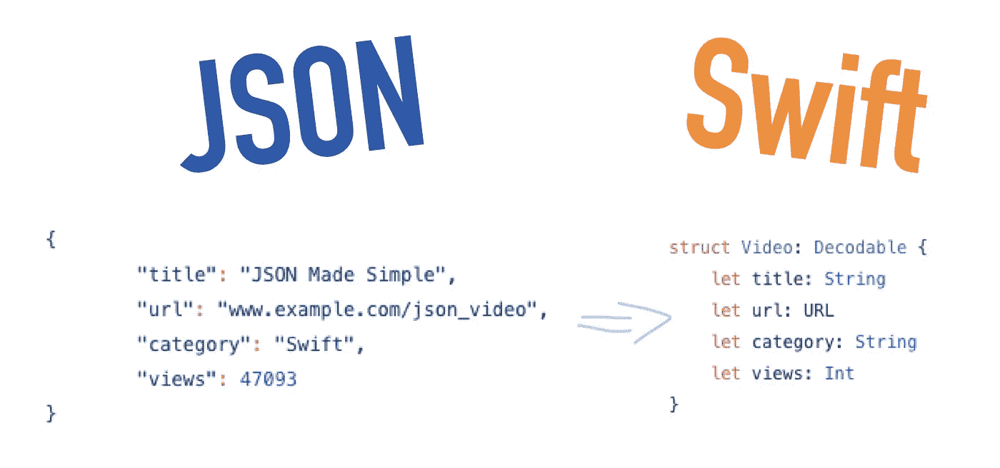
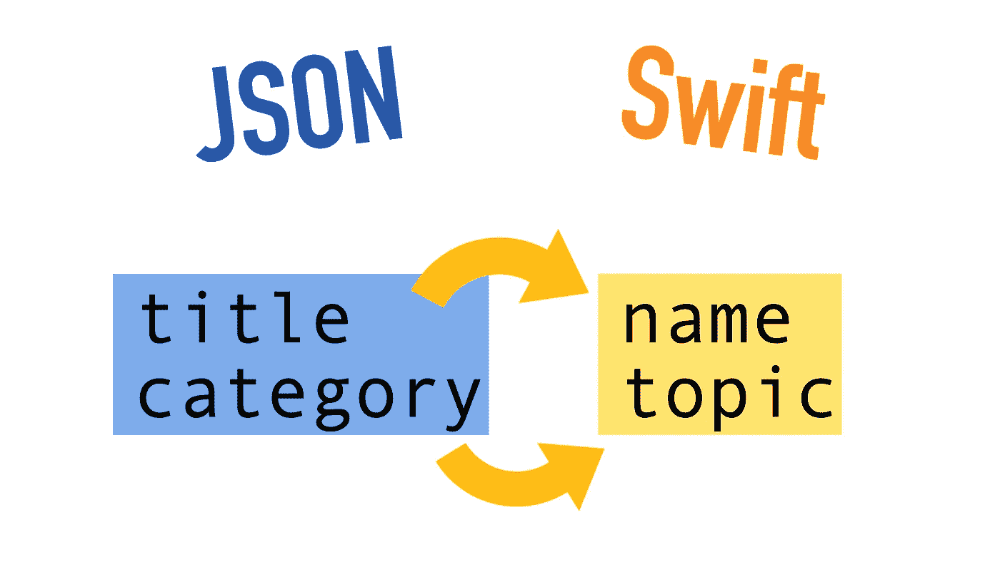
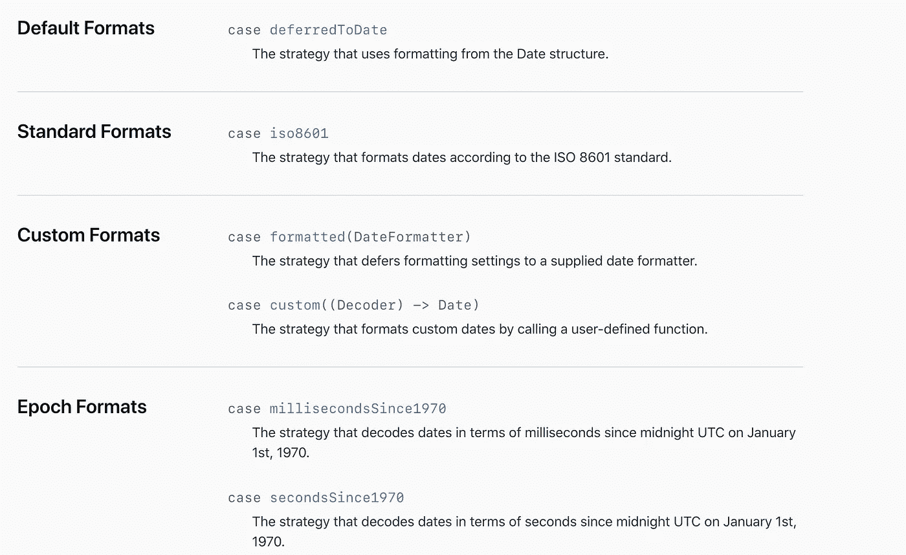

# Swift JSON 解析

> 原文：<https://betterprogramming.pub/swift-json-parsing-made-easy-931dc8fee27f>

## 将最流行的数据格式与 Swift 相结合


图片来源:作者

[JSON](/learn-json-in-5-minutes-49c0a0bfd845) 代表 JavaScript 对象符号。这是一种流行的基于文本的数据格式，在任何地方都被用来表示结构化数据。几乎每种编程语言都支持它，Swift 也不例外。在您的职业生涯中，您将会大量使用 JSON，所以请确保您不会错过。

在 Swift 中，解析 JSON 是一种常见的需要。幸运的是，在 Swift 中使用 JSON 很容易。它甚至不需要设置任何外部依赖。



将 JSON 转换为 Swift 的示例

让我们开始吧。

# Swift 中的 JSON 解码

例如，假设您执行一个网络请求，从一个网站检索一些视频。作为响应，您会得到一个 JSON 对象:

在您的应用程序中，您希望将这个 JSON 转换成一个 Swift 对象。为此，让我们将这个 JSON 数据存储在一个结构中。

首先，让我们创建一个符合`Decodable`协议的结构来存储 JSON 数据中列出的所有属性:

现在，您可以通过结合使用上述结构和内置的`JSONDecoder()`来解析 JSON 数据:

这就是全部了。祝贺您——现在您已经了解了 Swift 中 JSON 解析的基础知识。

接下来，我们来看一些你需要理解的常见用例。

# 不要定义每个属性

您不需要定义 JSON 数据附带的每个属性。在前面的例子中，您可以将 JSON 响应转换成一个具有这种简单结构的`Video`对象:

```
**struct** Video: Decodable {
    **let** title: String
}
```

这样，解码器只从 JSON 数据中解析出`title`,而丢弃其他所有东西。

# 可选的额外属性

有时你可能不确定某些财产是否被归还。例如，想象一些视频有转录，一些没有。为了安全地解析这些数据，您可以定义一个属性为`optional`,让`JSONDecoder`处理剩下的事情:

无论数据中是否缺少`transcription`,程序都会运行。

# 在 Swift 中解码 JSON 数组

大多数时候，JSON 数据不是一个 JSON 对象。通常，返回的是 JSON 对象的数组。

例如，您可以通过一个以 JSON 数组形式返回视频的请求来检索一个频道的视频:

从 example.com 的视频服务器中检索到 3 个虚拟视频作为 JSON 数据

要成功解析这个 JSON 数组，您需要做的唯一改变是将可解码类型定义为`[Video].self`而不是`Video.self`，突出显示 JSON *数组*被转换:

(这里是本例的[完整代码](https://gist.github.com/artturijalli/87030c62f4c580da62097fdf51c5e066)。)

# 自定义 JSON 属性名

您不需要总是使用完全相同的名称来复制 JSON 数据。例如，您可能希望将视频的`title`和`name`分别更改为`category`和`topic`:



在 Swift 端，将标题和类别从 JSON 数据分别改为名称和主题。

要创建一个*自定义名称映射*，您需要通过添加一个`CodingKeys`枚举来修改`Video`结构。在此枚举中，您可以指定如何更改属性名:

在 Swift 方面，将“标题”称为“名称”,将“类别”称为“主题”。

注意你如何需要让*所有的键*出现在`CodingKeys`枚举中——甚至那些名字保持不变的键。

如果你错过了什么，[在这里查看完整代码](https://gist.github.com/artturijalli/ca597f3cca01b3f53c63d8e34fe22ec0)。

# 在驼色表壳和蛇形表壳之间转换

更改属性名称的一个常见用例是在*转换用例*时。

例如，一个 JSON 响应可能有一个属性`number_of_views`。然而，在 Swift 中，您可能希望去掉下划线，将单独的单词大写:`numberOfViews`。

您可能已经知道:

*   `number_of_views`是在所谓的*蛇案*中
*   `numberOfViews`是在*骆驼案*中

Swift 也知道这一点，因此您实际上不需要自己创建自定义映射。相反，你可以将 JSON 解码器的`keyEncodingStrategy`属性配置为`.convertFromSnakeCase`。

例如，假设您的 JSON 响应如下所示:

现在，为了成功地编码这些数据，尤其是`number_of_views`，您需要将 JSON 解码器的`keyDecodingStrategy`更新为`.convertFromSnakeCase`:

```
**let** decoder = JSONDecoder()
decoder.keyDecodingStrategy = .convertFromSnakeCase**let** jsonData = JSON.data(using: .utf8)!
**let** video: Video = **try!** decoder.decode(Video.self, from: jsonData)
```

如果您遗漏了什么，请检查该零件的[完整代码](https://gist.github.com/artturijalli/87030c62f4c580da62097fdf51c5e066)。

# 解析 JSON 日期

在 JSON 数据中遇到[日期](/how-to-work-with-dates-in-swift-99f445a6179d)是非常常见的，因此学习如何解析日期是值得的。

JSON 中的日期被定义为字符串或时间间隔。与前面的例子类似，您可以为 JSON 解码器设置一个策略来处理解析日期。

例如，假设这次你的视频的 JSON 数据是这样的:

```
{
    "title": "JSON Made Simple",
    "date": "2021-05-13T11:23:31Z"
}
```

让我们创建一个`Video`结构来存储这些数据:

```
**struct** BlogPost: Decodable {
    **let** title: String
    **let** date: Date
}
```

请记住，在这种情况下，`date`遵循格式:`yyyy-MM-dd'T'HH:mm:ss`。为了准确解码这个日期，您需要为这个格式创建一个定制的`DateFormatter`对象:

```
**let** dateFormatter = DateFormatter()
dateFormatter.dateFormat = "yyyy-MM-dd'T'HH:mm:ssZ"
```

然后定义 JSON 解码器的`dateDecodingStrategy`，并对其使用`dateFormatter`对象:

```
let decoder = JSONDecoder()
decoder.dateDecodingStrategy = .formatted(dateFormatter)
```

最后，您可以将 JSON 数据解码成一个`Video`对象，并正确解析日期:

```
**let** jsonData = JSON.data(using: .utf8)!
**let** video: Video = **try!** decoder.decode(Video.self, from: jsonData)print(video.date)
```

输出:

```
2021-05-13T11:23:31Z
```

*根据苹果，还有其他* [*日期格式化策略可用*](https://developer.apple.com/documentation/foundation/jsondecoder/datedecodingstrategy) *太:*



如果你错过了什么，检查这个例子的[完整代码](https://gist.github.com/artturijalli/77ea7fc42d1f9c877f7bc876a66f2a98)。

# 结论

JSON 代表 JavaScript 对象符号。JSON 是一种流行的、对人友好的表示结构化数据的方法。大多数编程语言本身都支持 JSON 解析。

在你作为一名 iOS 开发人员的职业生涯中，你几乎会在你使用的每个应用中遇到 JSON。确保你准备充分。

感谢阅读——快乐编码！

# 你可能会发现这些见解深刻

[](/how-to-work-with-dates-in-swift-99f445a6179d) [## 如何在 Swift 中处理日期

### 关于在 Swift 中处理日期，您需要了解的一切

better 编程. pub](/how-to-work-with-dates-in-swift-99f445a6179d) [](/50-swift-interview-questions-and-answers-for-2021-8911c2768a51) [## 2021 年 50 个 Swift 面试问题和答案

### 通过了解这些基本问题的答案，赢得 iOS 开发人员的面试

better 编程. pub](/50-swift-interview-questions-and-answers-for-2021-8911c2768a51) [](/5-useful-swift-one-liners-to-write-concise-code-e63f75337a53) [## 编写简洁代码的 5 个有用的 Swift 一行程序

### 学习一些一行程序来提高代码的可读性

better 编程. pub](/5-useful-swift-one-liners-to-write-concise-code-e63f75337a53)