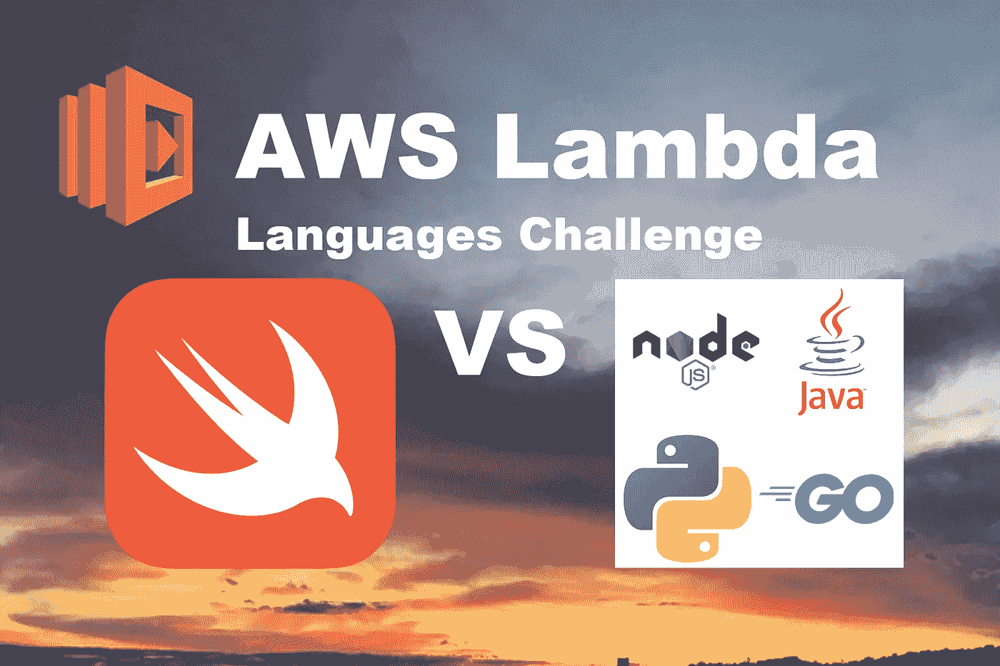
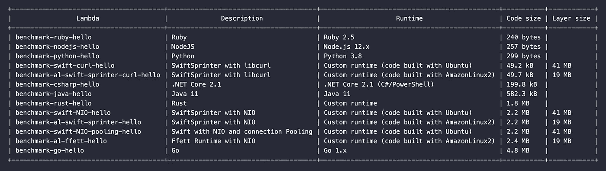
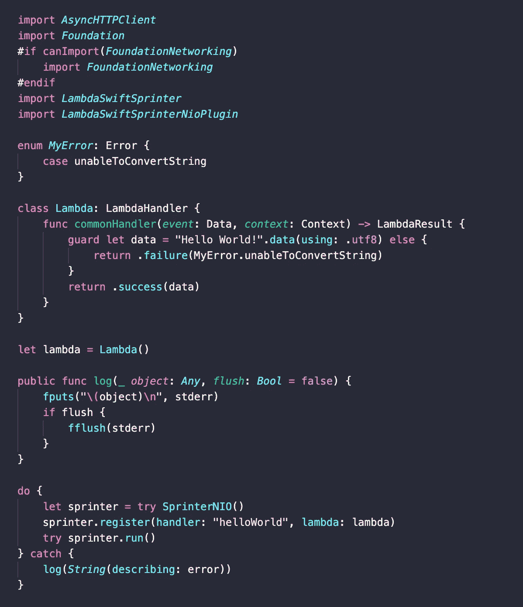
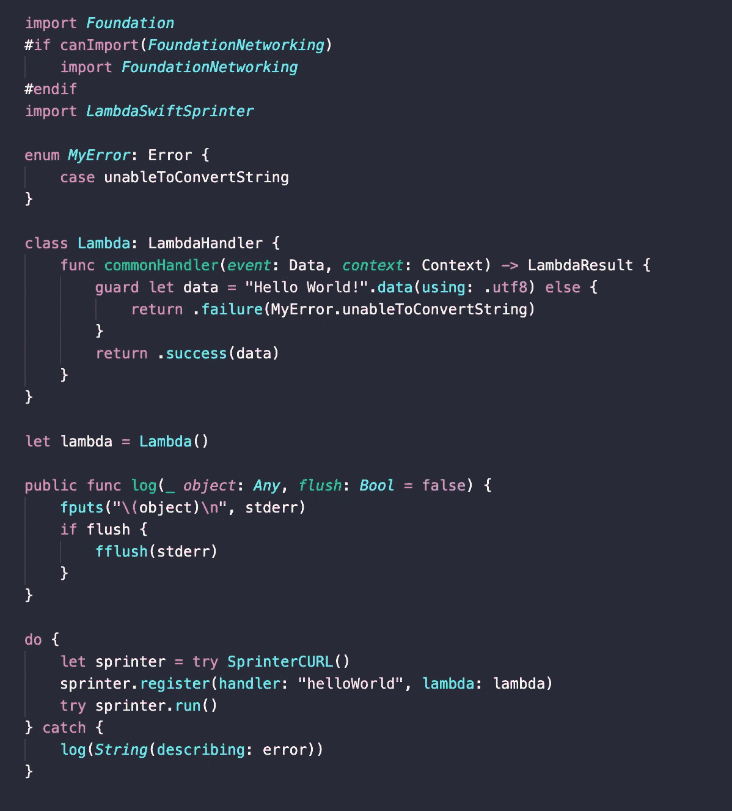
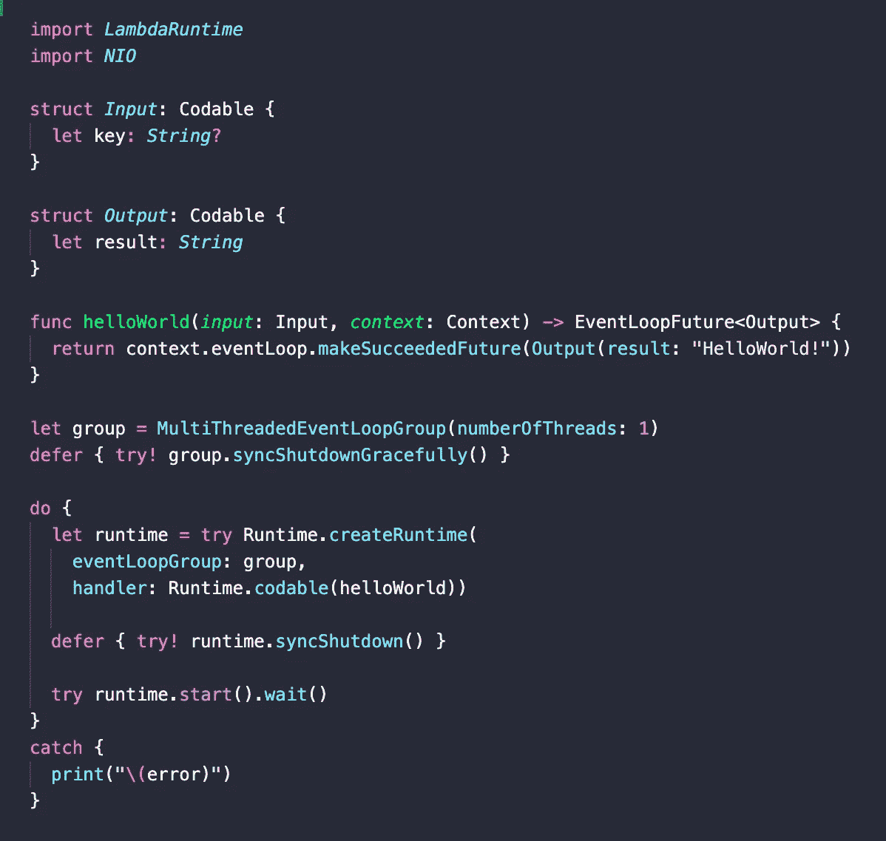
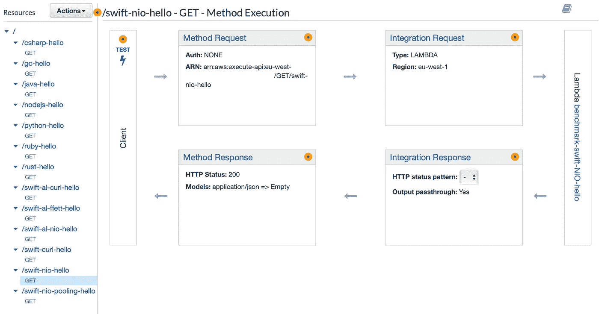
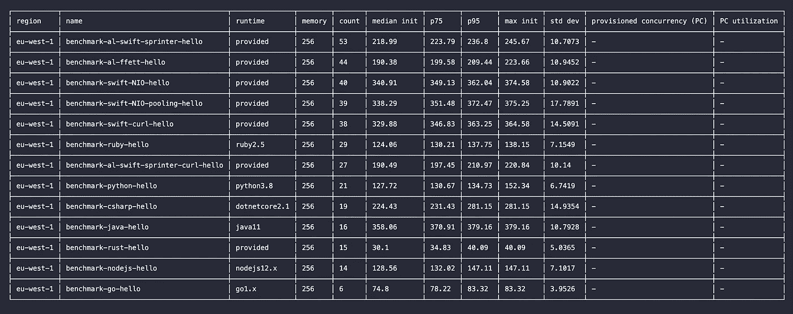
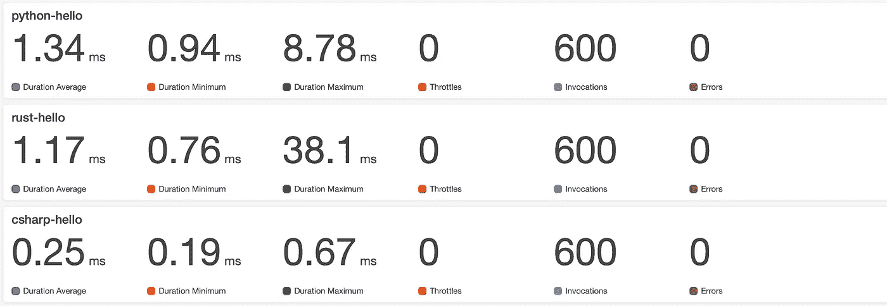
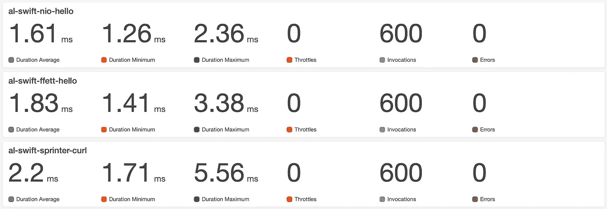

# AWS Lambda 上的 Swift 使用 Swift-Sprinter，表现类似于 Node 和 Python

> 原文：<https://betterprogramming.pub/swift-on-aws-lambda-performs-like-node-and-python-using-swift-sprinter-d920521130f1>

## 针对 Swift 的 AWS 定制运行时基准测试



无服务器环境中的性能调优是保持后端响应和低成本的关键。

本文将通过几个性能测试来理解使用框架 [Swift-Sprinter](https://github.com/swift-sprinter/aws-lambda-swift-sprinter) 用 Swift 编写的 AWS Lambda 的行为，并将其与流行语言和不同的配置和选项进行比较。

# 什么是λ？

Lambda 是 AWS 资源提供功能即服务(FAAS)计算能力。它充当更广泛服务类别的构建模块，众所周知的是*无服务器*。

与其他无服务器模块一样，它具有以下特性:

*   它是被管理的。
*   这是自动缩放。
*   它是高度可用的。
*   它是按使用付费的。

除了常见的无服务器功能，Lambda:

*   包含运行所需的代码。
*   是事件驱动的。
*   支持在兼容的 Linux 上运行多种语言。
*   它运行的时间最长。

# AWS Lambda 如何工作

基于 EC2 VM 之上的[鞭炮](https://aws.amazon.com/blogs/aws/firecracker-lightweight-virtualization-for-serverless-computing/)的 AWS Lambda 架构，已经被构建为可自动伸缩的。

## **冷启动**

第一次调用 Lambda 时，通过复制、初始化和运行代码来准备一个新的 worker 实例。

这个过程被称为*冷启动*，每次 Lambda 环境添加一个新的 worker 实例来扩展时都会发生。一旦 worker 启动，它就接收事件，处理它，然后对下一个处于等待状态的事件执行请求。

## **热启动**

一旦 Lambda worker 启动，下一次执行就是对即将到来的事件进行纯粹的处理，因为不再需要设置 worker。

最终，几分钟后，工作人员没有收到任何事件，而是倾向于缩小规模并释放未使用的计算资源。

## **计算性能**

Lambda 计算性能取决于所使用的语言/运行时、代码和所提供的内存量，这些也决定了底层 CPU 的能力。

内存—函数在执行过程中可用的内存量。在 128 MB 和 3,008 MB 之间选择一个容量[，增量为 64 MB。](https://docs.aws.amazon.com/lambda/latest/dg/limits.html)

Lambda 根据配置的内存量线性分配 CPU 能力。在 1，792 MB 时，一个函数相当于一个完整的 vCPU(每秒一个 vCPU-秒信用)。

为了在相同的条件下进行性能评估，所有的 Lambdas 都设置了 256 MB 的内存。这种配置给出了 vCPU 的 1/7 的λ。

## **调配并发**

为了减少冷启动的次数，可以利用一个名为 [*的新功能，提供并发*](https://docs.aws.amazon.com/lambda/latest/dg/configuration-concurrency.html#configuration-concurrency-provisioned) ，使一些 Lambdas 始终保持温暖。

# 如何评估绩效

Lambda 性能非常重要，因为这项服务是以“按使用付费”的方式出售的。保持较低的执行时间和内存使用量有助于减少 AWS Lambda 的持续[成本](https://aws.amazon.com/lambda/pricing/)。

AWS Lambda 上的语言性能定义如下:

*   要执行的代码的大小。
*   使用的内存量。
*   执行速度。

一个简单的“Hello，World”的执行给出了该语言如何执行一个非常基本的任务的粗略想法，并且在评估该语言的 AWS Lambda 运行时时非常准确。

繁重的计算任务可能会极大地改变“Hello，World”基准测试的结果，因为在这种情况下，测试将在处理计算复杂性方面利用语言效率，而不是 AWS Lambda 运行时。

为了简单起见，本文将只考虑“Hello，World”基准测试，将验证其他工作负载效率的任务留给读者。

# 代码和尺寸

为了与 Swift 的性能进行比较，Hello World 示例已经用不同的语言实现。



上表中是用于测试的配置。

## Swift 与其他语言

首先要注意的是，AWS 为 Ruby、Node.js、Python、Java、 [Go](https://golang.org/) 和[提供了运行时。网芯 2.1](https://dotnet.microsoft.com/download/dotnet-core/2.1) 。这给了这些语言一个优势，因为它们没有额外加载代码的自定义运行时的开销。

Hello World 示例非常简单，随着代码添加更多的依赖项，代码大小可能会完全不同。

用于 Node.js、Python、Go、Ruby、Java、C#和 [Rust](https://www.rust-lang.org/) 的代码与文章[*Benchmarking AWS Lambda runtimes 2019*](https://medium.com/the-theam-journey/benchmarking-aws-lambda-runtimes-in-2019-part-i-b1ee459a293d)提供的代码相同，只是增加了 Swift 示例。

## 快速构建和运行时

Swift 中添加了许多版本的 Hello World 代码，以比较以下各项的性能:

*   带有[异步客户端](https://github.com/swift-server/async-http-client)和 [libcurl](https://curl.haxx.se/libcurl/) 的 Swift 运行时。
*   异步客户端与[带连接池的异步客户端](https://github.com/swift-server/async-http-client/pull/105)。
*   [Swift-Sprinter](https://github.com/swift-sprinter)vs[Swift-Lambda-Runtime](https://github.com/fabianfett/swift-lambda-runtime)。
*   用[Ubuntu](https://github.com/swift-sprinter/aws-lambda-swift-sprinter)vs[亚马逊 Linux 2](https://fabianfett.de/amazonlinux-swift) 构建的 Swift 代码。



benchmark-swift-NIO-hello —带 NIO 异步客户端的 SwiftSprinter



benchmark-swift-curl-hello-swift sprinter with libCURL



benchmark-al-ffett-hello —带 NIO 的 LambdaSwiftRuntime

# 工作量

工作负载已按照最后引用的文章进行了准备。

工具[火炮](https://artillery.io)已经被用来测试兰姆达斯。API 网关已配置为将 Lambdas 发布为 HTTPS 端点。



调用之后，所有的指标都存储在 [AWS CloudWatch](https://aws.amazon.com/cloudwatch) 中。

# 冷启动性能

使用 [lumigo-CLI](https://github.com/lumigo-io/lumigo-CLI) 收集冷启动性能。

```
lumigo-cli analyze-lambda-cold-starts
```



冷启动性能

*   Rust(~ 30 毫秒)和 Go(~ 75 毫秒)的冷启动性能最好，其次是 Ruby(124 毫秒)、Python(~ 127 毫秒)和 Node.js (~128 毫秒)。
*   第二组包含使用 Amazon Linux 2(~ 190 毫秒/~ 219 毫秒)和 C#构建的 Swift。网芯(~224ms)。
*   最后一组包含用 Ubuntu (~329ms/~338ms)和 Java (~358ms)构建的 Swift。
*   用 Amazon Linux 2 和 Ubuntu 构建的 Swift 之间的区别是大约 20 MB 的包大小，它在冷启动时支付大约 140 ms。

# 热启动性能

为了展示热启动性能，我们在 CloudWatch 上使用了一个自定义仪表盘:


Java/Go/Ruby



Python/Rust/C#



使用亚马逊 Linux 2 构建的 Swift


用 Ubuntu 构建的 C#/NodeJS/Swift

平均而言，最佳性能由 C#提供。Net (~0.26 ms)和 Go (~0.44 ms)。

性能在 1 毫秒左右，我们有 node . js(~ 1.06 毫秒)、Java (~1.16 毫秒)、Rust (~1.17 毫秒)、Swift with NIO 和用 Ubuntu 构建的连接池(~ 1.19 毫秒)、Python (~1.34)、Swift with NIO (~1.56 毫秒)。

## 快速构建比较

*   带 [AsyncHTTPClient](https://github.com/swift-server/async-http-client) NIO 的 Swift 运行时比带 libcurl 的 Swift 性能更好，优势约为 0.65 毫秒。
*   [带连接池的 AsyncHTTPClient NIO](https://github.com/swift-server/async-http-client/pull/105)是性能最好的，在没有连接池的相同版本上优势约为 0.30 ms，整体性能约为 1.19ms，与 Node.js、Java 和 Python 相当。
*   [Swift-Sprinter](https://github.com/swift-sprinter) 比 [Swift-Lambda-Runtime](https://github.com/fabianfett/swift-lambda-runtime) 表现稍好，相差约 0.20 毫秒
*   使用 [Ubuntu](https://github.com/swift-sprinter/aws-lambda-swift-sprinter) 与 [Amazon Linux 2](https://fabianfett.de/amazonlinux-swift) 构建的 Swift 代码在热启动时的执行时间相似。

# 我为什么要在 AWS Lambda 上使用 Swift？

Swift 于 2015 年 12 月被苹果开源，已经从 iOS 和 Mac 上的移动开发发展到 Ubuntu 等 Linux 服务器平台。

任何来自 iOS 的人都知道，这种语言[安全、快速、富于表现力](https://swift.org/about/)。与 Node.js 和 Python 等脚本语言相比，Swift 增强了安全性和性能，避免了因语言未定义行为和缺乏类型检查而产生的恶意副作用。

与 Go 或 Rust 等相对较新的语言相比，Swift 增加了大量移动开发者和爱好者社区的优势。

苹果在 [Swift NIO](https://github.com/apple/swift-nio/) 上的投资和 [Swift 包管理器](https://swift.org/package-manager/)的可用性推动了许多[服务器端](https://swift.org/server/)项目和库的开发，包括 [HTTP 客户端](https://github.com/swift-server/async-http-client)、 [Postgres 客户端](https://github.com/vapor/nio-postgres)、 [Redis 客户端](https://github.com/mordil/swift-redis-nio-client)、 [AWS SDK Swift](https://github.com/swift-aws/aws-sdk-swift) 、 [MongoDB Swift 驱动程序](https://github.com/mongodb/mongo-swift-driver)、[gRPC Swift](https://github.com/grpc/grpc-swift/tree/nio)……等等。

[Swift-Sprinter](https://github.com/swift-sprinter/aws-lambda-swift-sprinter) 存储库为 Swift 提供了 AWS Lambda 定制运行时，并基于 Ubuntu，以保证构建过程和定义良好的管道。该存储库包含使用和持续集成的示例。

对于任何想尝试的人来说，库 [Swift-Lambda-Runtime](https://github.com/fabianfett/swift-lambda-runtime) 提供了一个基于亚马逊 Linux 2 的 Swift 版本。

Swift 在无服务器框架如 [AWS](https://github.com/swift-sprinter/aws-lambda-swift-sprinter-core) 、[open whish](https://github.com/apache/openwhisk-runtime-swift)和 [Azure](https://github.com/SalehAlbuga/azure-functions-swift) 上的可用性，以及在虚拟机、Docker、Kubernetes 和本地硬件上的传统 API/web 框架如 [Vapor](https://vapor.codes) 、 [Kitura](https://github.com/IBM-Swift/Kitura) 和 [Perfect](https://perfect.org) 的可用性开启了全栈 Swift 开发之路。

本文并不涵盖特定云提供商的选择，因为这取决于不同的业务原因，而不是技术考虑。

在 AWS Lambda 上使用 Swift 比在容器上使用 Swift 的优势是有效的，当使用它构建的应用程序没有恒定的工作负载，并且需要可伸缩性，同时保持低成本时。无服务器和容器并不是灵丹妙药，需要根据每个用例进行评估。

# 考虑

AWS Lambda 运行时的选择不仅仅取决于性能考虑。

考虑解决方案的总拥有成本总是很重要的，不仅要考虑无服务器的裸成本，还要考虑可靠性、可维护性、弹性、可重用性、安全性、平台支持、第三方框架的可用性、开发人员社区成熟度、开发工具、许可证、开发技能的可用性以及关于特定用例的学习曲线。

# 参考

[](https://dev.to/sosnowski/anatomy-of-aws-lambda-1i1e) [## 自动气象站 Lambda 剖析

### AWS Lambda 是一项著名的服务，它普及了云计算中无服务器的理念。这不是第一次…

开发到](https://dev.to/sosnowski/anatomy-of-aws-lambda-1i1e) [](https://medium.com/the-theam-journey/benchmarking-aws-lambda-runtimes-in-2019-part-i-b1ee459a293d) [## 2019 年 AWS Lambda 运行时基准测试(第一部分)

### 你有没有想过如果你使用不同的运行时，你的 AWS Lambda 会不会更快？

medium.com](https://medium.com/the-theam-journey/benchmarking-aws-lambda-runtimes-in-2019-part-i-b1ee459a293d) [](https://read.acloud.guru/comparing-aws-lambda-performance-when-using-node-js-java-c-or-python-281bef2c740f) [## 比较使用 Node.js、Java、C#或 Python 时的 AWS Lambda 性能

### 当使用 AWS Lambda 支持的不同编程语言时，一个函数的执行有多大不同？

read.acloud.guru](https://read.acloud.guru/comparing-aws-lambda-performance-when-using-node-js-java-c-or-python-281bef2c740f) [](https://aws.amazon.com/blogs/compute/new-for-aws-lambda-predictable-start-up-times-with-provisioned-concurrency/) [## AWS Lambda 的新功能-可预测的启动时间，提供并发| Amazon Web Services

### 自从五年前推出 AWS Lambda 以来，成千上万的客户，如 iRobot、Fender 和 Expedia，已经…

aws.amazon.com](https://aws.amazon.com/blogs/compute/new-for-aws-lambda-predictable-start-up-times-with-provisioned-concurrency/)