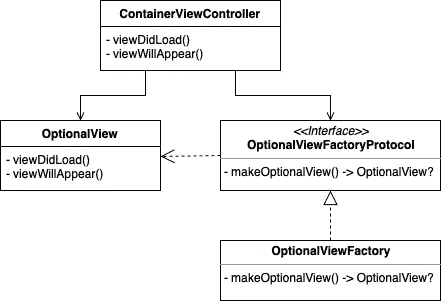
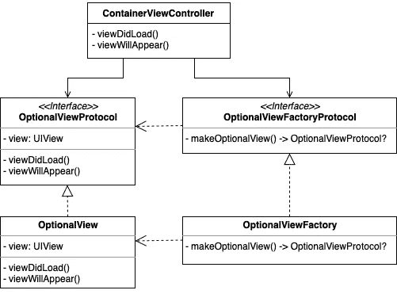
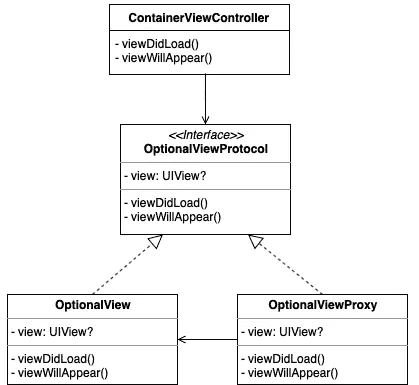

# With UIKit 的可选视图

> 原文：<https://betterprogramming.pub/swift-optional-views-with-the-proxy-and-abstract-factory-patterns-5f24f8cf84b8>

## 如何有效地重用可选视图

西蒙·伯杰在 [Unsplash](https://unsplash.com/s/photos/view?utm_source=unsplash&utm_medium=referral&utm_content=creditCopyText) 上拍摄的照片

各种应用程序中都有可选视图。有 1000 种理由需要根据应用状态、用户档案、功能/产品可用性、A/B 测试等条件显示或隐藏视图。

解决这个问题也有很多方法，但是我们可以根据哪个组件负责这个逻辑，将它们分成三组。

*   容器/可选视图的父视图:它作为第一个选项出现，因为它似乎是最容易和最简单的方式。事实上，在简单的情况下。但是，随着逻辑的增长，或者可选视图在其他地方被重用，它就变得混乱了。
*   可选视图本身:同样，在简单的情况下，可选视图本身中的工厂方法可能是一种简单的方法。然而，视图不应该负责知道它是否应该被显示。应该是断言。
*   其他类/工厂:逻辑来自容器/可选视图的父类，指向一个新类，该类的职责是仅在视图应该显示时实例化视图。

让我们探索第三组，因为它将在更多的情况下为我们服务。

# 具体工厂方法模式

我们可以采取的第一种方法是使用一个具体的[工厂方法模式](https://en.wikipedia.org/wiki/Factory_method_pattern)并维护对工厂和`OptionalView`的引用。

Swift+UIKit 中带具体工厂方法的可选视图

这里有一些可以改进的地方:

*   我们使用的是`OptionalView`的实现，而不是抽象。如果我们需要修改或替换`OptionalView`，保持相同的行为，我们仍然需要修改使用它的每个容器。
*   我们为一个`OptionalView`维护两个引用，并且我们让容器知道我们正在为`OptionalView`使用一个工厂。如果在某个时候，`OptionalView`变得不是可选的，我们可能想要或者需要移除工厂方法模式。在这种情况下，我们还需要修改所有使用`OptionalView`的容器。

# 抽象工厂方法模式

用工厂方法模式对可选视图进行抽象将解决第一个问题。让我们看看如何:

Swift+UIKit 中带抽象工厂方法的可选视图

Swift+UIKit 中带抽象工厂的可选视图

现在我们已经将`OptionalView`的实现从容器中分离出来，但是我们仍然公开了我们正在使用一个工厂来实例化可选视图。

# 代理模式

既然我们对`OptionalView`使用了抽象，那么使用[代理模式](https://en.wikipedia.org/wiki/Proxy_pattern)封装工厂就更容易了，所以容器不需要知道。让我们看看如何:

Swift+UIKit 中带抽象工厂方法代理模式的可选视图

这里我们只是引用了`OptionalView`的抽象，但是我们实际上注入了一个代理。这个代理本身可以作为一个工厂方法，也可以将任务委托给另一个类。

容器不知道关于工厂的任何事情，我们可以删除代理，而根本不需要修改任何容器。

感谢您的阅读。让我知道你的想法。