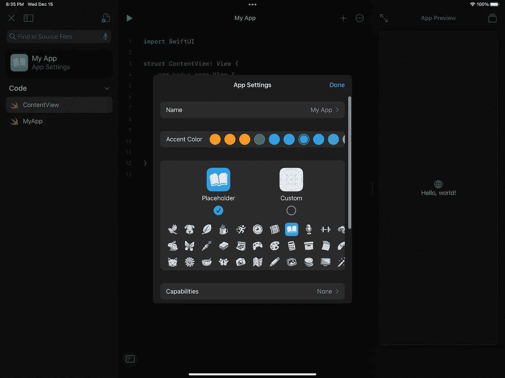
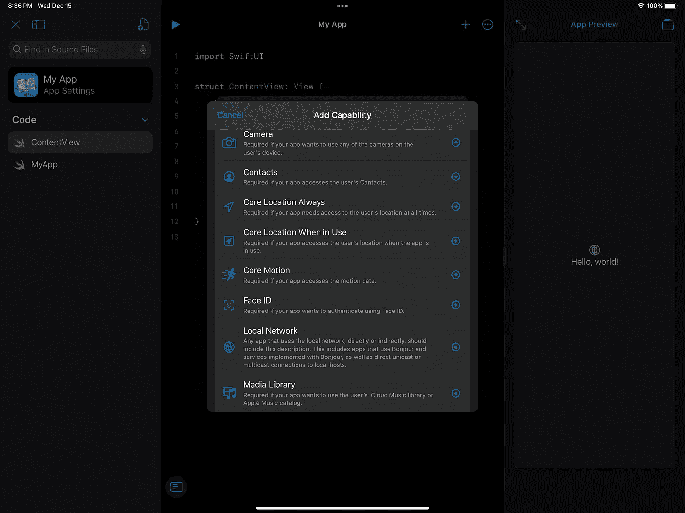
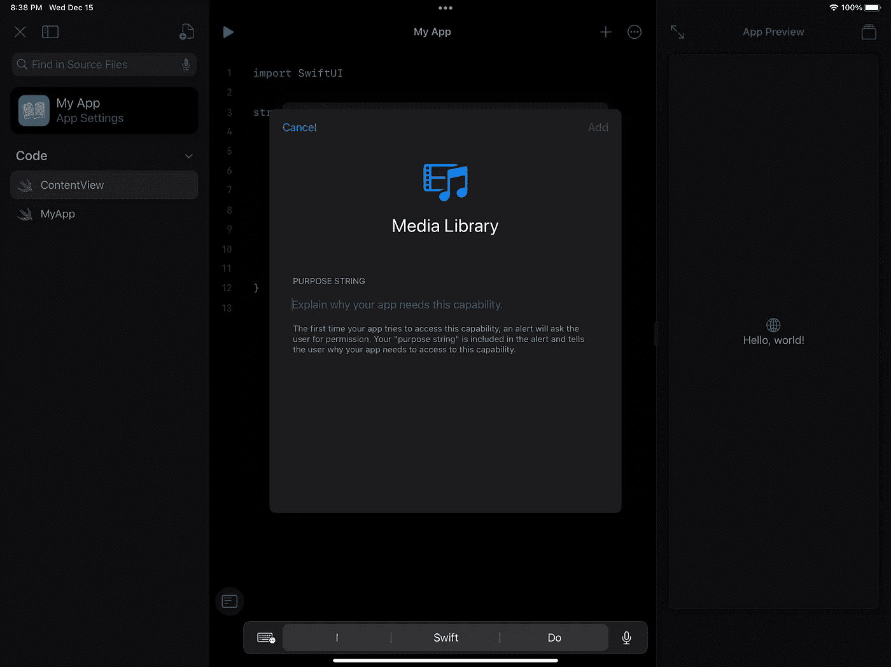

# Swift Playgrounds 4 的初步想法

> 原文：<https://betterprogramming.pub/swift-playgrounds-4-initial-thoughts-b0951547321b>

## Swift Playgrounds 4 发布了，令人印象深刻。

在 [Unsplash](https://unsplash.com?utm_source=medium&utm_medium=referral) 上由 [Shanthi Raja](https://unsplash.com/@shanthiraja?utm_source=medium&utm_medium=referral) 拍摄的照片

自从今年在 WWDC 宣布以来，我一直在等待 [Swift Playgrounds 4](https://developer.apple.com/swift-playgrounds/release-notes/) 。我甚至试图尽可能长时间地推开我的轮子，这样我就可以在我的 iPad Pro 上工作，而不是在我的 Mac 上和 Xcode 里工作。我非常希望把 iPad 变成我的移动设备，在它上面开发应用程序是朝着这个方向迈出的一大步。

我想用 Playgrounds 做的第一件事是打开我现有的一个应用程序，我必须说，当我不能这样做时，我很失望。我有一些理论来解释为什么这不会发生，但让我们继续谈谈其他一些第一印象。

# 创建应用程序

创建一个应用程序很容易，而且有一些简单的入门应用程序，任何人都可以进入并编辑。你不需要苹果开发者许可来编辑它，但是你需要一个许可来最终将应用发布到应用商店。

“图标生成器”非常有趣，我喜欢这些图标！

向应用添加功能也非常容易！在您更改图标的同一个窗口中，添加功能的选项就在那里！

只要填上原因，看起来就可以了。

开始使用 GitHub 上的 Swift 包也相对容易。其实和 Xcode 里一样简单。你只需要添加它的网址，就可以使用它了！

# 为什么我认为导入应用程序有其挑战？

Playgrounds 不支持普通的 Xcode 项目。它需要是一个应用程序包。你可以在最新版本的 Xcode 中打开这些应用程序包，并在它们之间来回移动(我还没有尝试过)，但至少从我在 Playgrounds 周围闲逛的 3 个小时来看，我无法找到在其中打开我的 pure SwiftUI 应用程序的方法。可能还有另一个原因导致它打不开:

> *Swift Playgrounds 不支持 CoreData、CloudKit 或应用内购买功能*

这些只是 Swift Playgrounds 的一些限制，使得它很难推出一个全功能的应用程序。我也没有找到运行测试的方法，这对一些开发人员来说也是一种阻碍。

# 我满意吗？

我对这个版本不太满意，但我认为这是一个很好的开始。我还认为 Swift Playgrounds 的这一更新将使更多的人开始应用开发成为可能，这就是 Swift Playgrounds 的全部意义。

从我的角度来看，我可以在我的 iPad 上启动我的应用程序，也许可以做一些调整，但我不认为我会使用 Swift Playgrounds 作为我的 iOS 和 iPadOS 应用程序的全职 IDE。