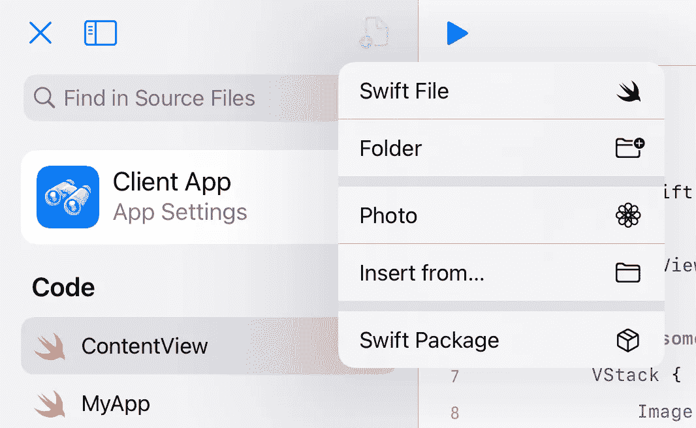
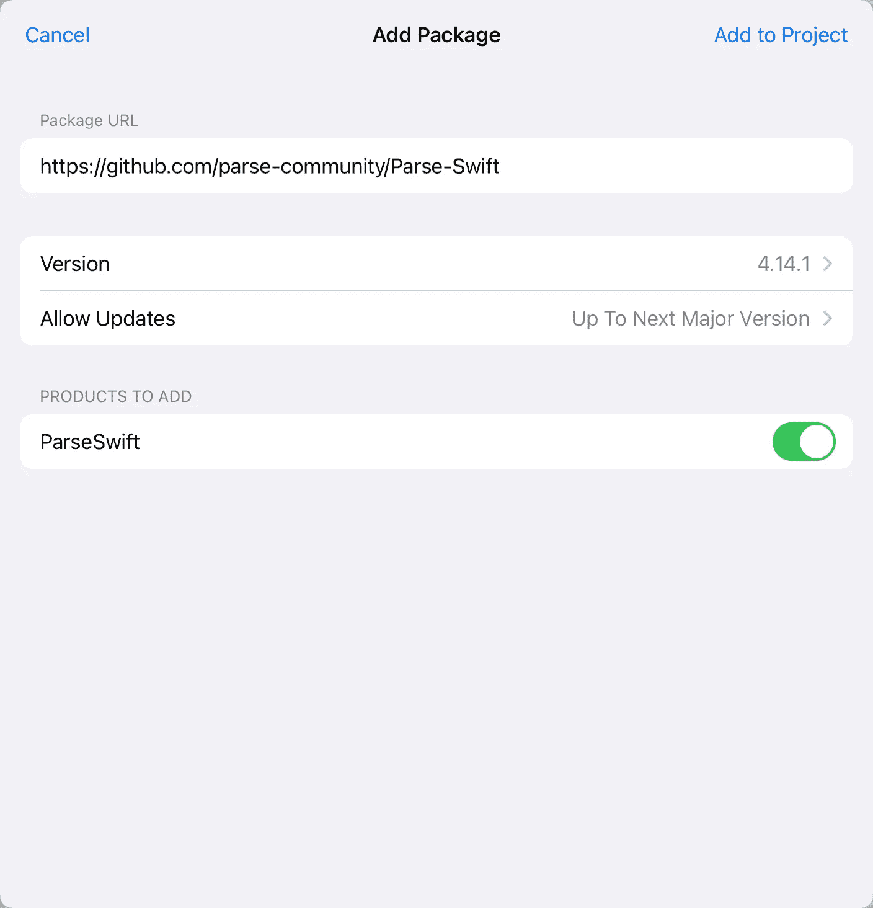
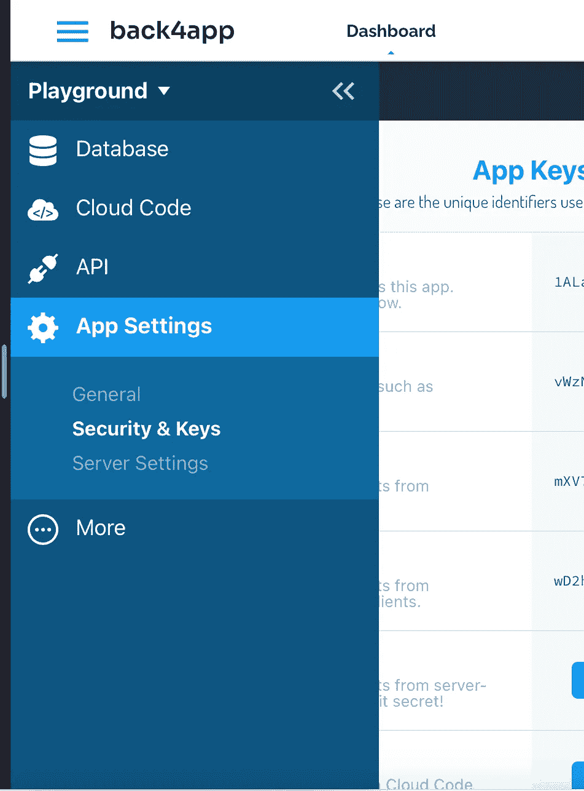
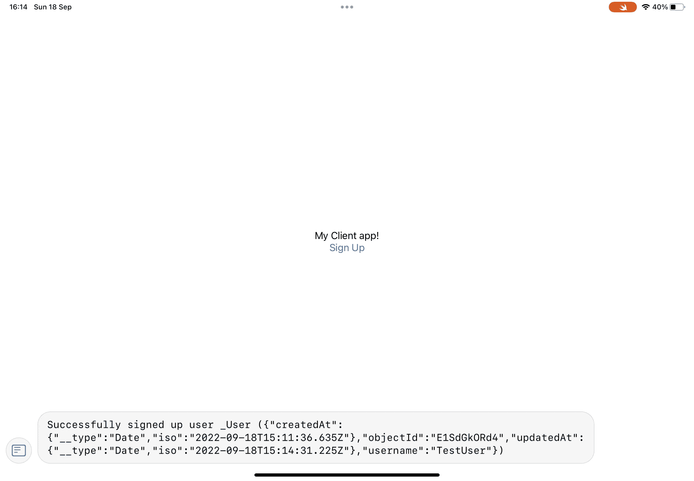
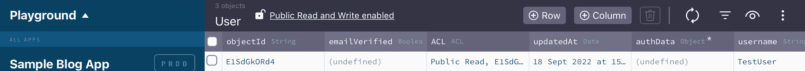

# 在 IPad 上使用 Swift Playgrounds 创建端到端 SwiftUI 应用程序

> 原文：<https://betterprogramming.pub/swift-playgrounds-create-a-full-application-on-ipad-by-adding-a-server-side-back-end-c20c37a411ac>

## 通过添加服务器端后端


照片由[丹尼尔·科尔派](https://unsplash.com/@danielkorpai?utm_source=medium&utm_medium=referral)在 [Unsplash](https://unsplash.com?utm_source=medium&utm_medium=referral)

出于某种莫名其妙的原因，能够在 iPad 上编写 iPad 应用程序一直是我的一个目标。为什么？没人能说清楚。我认为不受 MacBook 束缚的想法。我可以拿着我的平板电脑在任何地方写一些代码。

去年 12 月，随着 Swift Playgrounds 4 的发布，这似乎可能成为现实。这一版本允许用户创建基本的应用程序，编译它们，查看控制台，并且在准备好的时候，甚至将它们提交到应用程序商店。仅此一项就是一大进步。然而，应用程序所需的一些最基本的功能却缺失了。

经过彻底审查，我得出结论，用户可以完全在 iPad 上创建一个 iPad 应用程序，但应用程序本身必须相当简单。

游乐场的 Swift 包裹支持是一项改变游戏规则的举措。简单地将一个包添加到一个项目中，你就可以立即使用框架带来的所有功能。带上洛蒂。通过添加这个框架，我可以将动画抓取到我的应用程序中，作为一个非设计师，我立即拥有了一个看起来专业且有吸引力的应用程序。

经过更多的实验后，我发现只有当包中包含的所有文件都是 Swift 文件时，包才会在 playgrounds 中加载。如果 Objective-C 文件包含在包中，包加载将会失败。这立即减少了可用于 Swift Playgrounds 的兼容包的数量。最大的问题是:没有支持后端服务器的软件包。

BAAS(后端即服务)通常用于处理用户注册、认证和用户管理，将数据存储在数据库中或运行服务器端代码和分析。通过在服务器上运行，用户只需编写所谓的“客户端应用程序”——实际上是一个具有权限的应用程序，可以在服务器上搜索一些信息，并返回显示。这可以扩展到编辑值。

这是大多数应用程序的基础，但直到现在，这在 Swift Playgrounds 中是不可能的。

答案是什么？传球！(不，解析)。

Parse server 是一个开源服务器，主要用于这种类型的应用程序。用户可以托管他们的解析服务器，或者可以使用 back4app(我将在本演示中使用它)等服务为您托管这些服务器。

此外，一个名为`ParseSwift`的专用解析 Swift 包支持与解析服务器的通信，并与 Swift Playgrounds 兼容！

用户第一次有机会在 iPad 上创建与服务器完全集成的本地应用。

# 这是如何实现的？

## 创建解析服务器

首先，您需要一个托管解析服务器的地方。我将方便地跳过这一部分，使用一个名为 back4app 的服务。有一个免费层非常适合开发和学习/试验。当每月有更多的用户和请求时，付费层就发挥作用了。

前往 www.Back4app.com[并报名。(我不是附属机构，你可以谷歌解析服务器，并使用这些服务或托管自己的)。之后，按照说明创建一个应用程序。](http://www.Back4app.com)

## 创建一个 Swift playground 应用程序并添加 ParseSwift 包

如题，打开 Swift Playgrounds，新建一个 app。点击新文件图标，并选择“Swift package”



从“新建文件”菜单添加 Swift 包

在下面的窗口中，输入`ParseSwift`包的地址:[https://github.com/parse-community/Parse-Swift](https://github.com/parse-community/Parse-Swift)



## 初始化 ParseSwift(告诉应用程序服务器在哪里，使用什么密钥)

导航到 Parse-Swift 的 GitHub 地址(见上一步)，您将看到如何使用该框架的简要总结。唯一要做的关键事情是用正确的密钥将您的客户端应用指向服务器。

这是通过下面的代码实现的。文档声明将它放在 AppDelegate 中(对于构建在 Xcode 上的传统应用程序)，但是对于 Playgrounds，这是不同的。将这段代码放在最顶层的某个地方，这样它就可以在应用程序的生命周期内存在。

```
ParseSwift.initialize(applicationId: "xxxxxxxxxx", clientKey: "xxxxxxxxxx", serverURL: URL(string: "https://example.com")!)
```

现在，我将把它放在一个在初始视图出现时执行的函数中:

我们需要在这里输入三条信息来与服务器通信:`applicationId`、`clientKey` 和`serverURL`。这些可以在 Back4app.com 的应用程序设置中找到。



Back4App 键

在应用的仪表盘上，单击菜单，导航至“应用设置”，然后单击“安全性和密钥”在显示的窗口中，将`applicationId` 和`clientKey` 复制到 Swift Playgrounds 的初始化代码中。

在这之后，你只需要`serverURL`。对于 Back4app，这是[https://parseapi.back4app.com/](https://parseapi.back4app.co)。如果您托管了此地址，它将是托管的地址。

就是这样。跨过去。您现在有了一个可以与服务器通信的客户端应用程序！如果您返回到 GitHub 页面查看`ParseSwift`，点击查看代码，在`ParseSwift.playground`文件夹中查找，然后点击页面。您将看到 23 种不同类别的函数用于解析服务器。您可以从用户注册、身份验证开始，然后创建查询和查看结果。

作为本文的总结，我们将创建一个用户来证明我们有通信。这可以在 GitHub 的 3 号游乐场“3-用户-注册”中找到

这给了我们两件事，首先，一个定义用户是什么的结构。代码如下:

第二个是注册用户的功能。我把它放在一个叫做`userSignUp`的函数中。

现在，通过按下应用程序中的按钮来调用功能`userSignUp`。最终的代码应该如下所示:

运行应用程序时，我看到一个空白屏幕，上面有我的注册按钮。按下按钮创建新帐户并打印到控制台，这样我就可以看到退货确认。



我们现在可以检查我们的解析服务器，以确认帐户已创建。



我添加的用户

可能性是无限的。就个人而言，这是只在 iPad 上编程以创建原生应用的最后一大障碍。现在，您可以开始保护服务器上的数据。或者运行服务器端代码，获取并更新其数据，以供您的客户端应用程序显示。

感谢阅读！