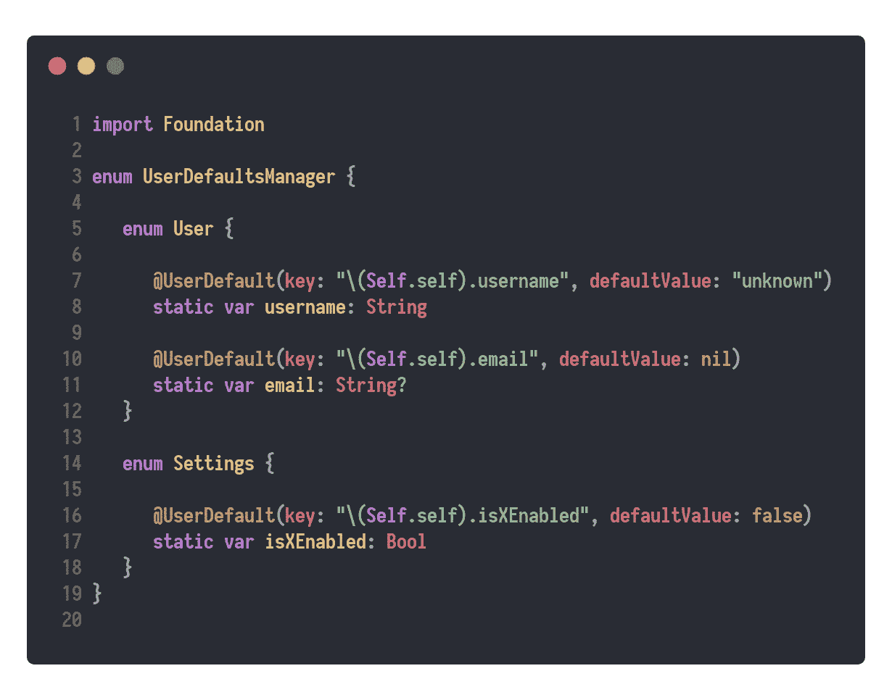
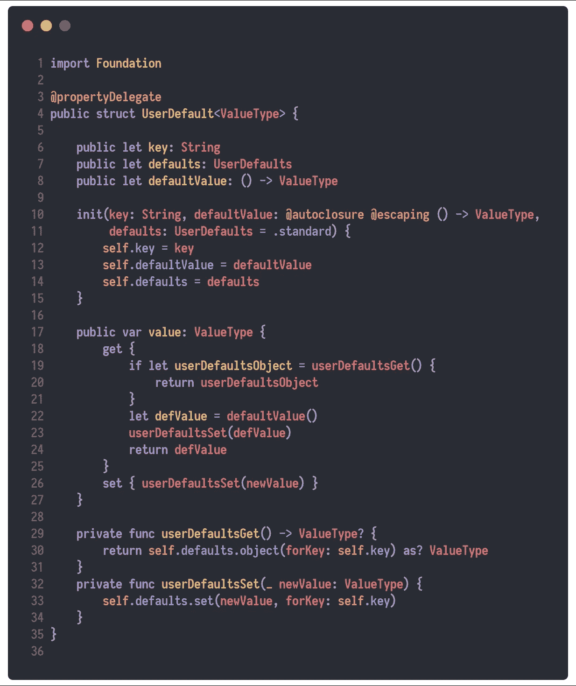
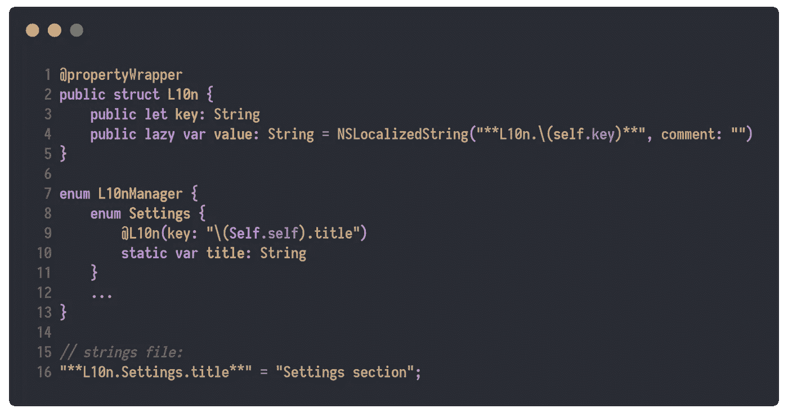

# Swift 属性包装器——强大的新注释(属性)系统

> 原文：<https://betterprogramming.pub/swift-property-delegates-powerful-new-annotations-attributes-system-2e3968b29624>

## 验证属性，使用户默认值易于使用，并创建令人惊叹的 [Swift 属性](https://docs.swift.org/swift-book/ReferenceManual/Attributes.html)

由[克里斯托弗·高尔](https://unsplash.com/@cgower)在 [Unsplash](https://unsplash.com/photos/m_HRfLhgABo) 上拍摄的照片

**编辑**:从 Xcode 11 和 Swift 5.1 的发布开始，属性委托与`@propertyWrapper`一起使用，不再实现“ **value** ”属性，而必须实现“ **wrappedValue** ”。

让我们从一个受[原始提议本身](https://github.com/DougGregor/swift-evolution/blob/property-wrappers/proposals/0258-property-wrappers.md)启发的例子开始，在这个例子中，您可以像在 Java 中一样放置**注释**，并在内部使用定制的 getter 和 setter，这样它就可以保存或检索来自`UserDefaults`的数据。

你可以像使用普通的**计算属性一样使用它，**并且 getter 和 setter 已经在我们的自定义`UserDefault`结构中实现了。

`UserDefaultsManager.User.username = "Daniel"` //示例

# 履行

[http://bit.ly/2KuopwH](http://bit.ly/2KuopwH)

# 属性验证

我们还可以用一种非常简单的方式来验证属性，就像这样:

[http://bit.ly/2KqYJko](http://bit.ly/2KqYJko)

当验证不成功时，它将在内部分配`nil`

`score = -10`

`print(score) // nil`

`score = 30`

`print(score) // Optional(30)`

# **附加示例**

# 从这里去哪里

感谢`@propertyWrapper`带来了无尽的新可能

同样，您可以使用`$propertyNameHere`来访问属性委托变量或方法。

这是一个很短的例子，但是我希望您从现在开始理解并使用这个新特性。感谢阅读。