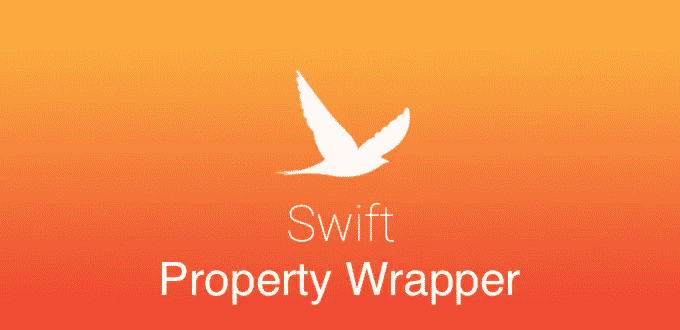

# 自定义 Swift 属性包装

> 原文：<https://betterprogramming.pub/swift-property-wrapper-8a14b137f67>

## 大写字符串、最大和等的属性包装器

图片由作者提供

有了 Swift 5.1，开发人员获得了一个非常有用的工具，属性包装器，它允许我们将行为和逻辑直接附加到我们的属性上。对于附加逻辑，我们可以使用用`@propertyWrapper`属性注释的类或结构。每个属性包装器类型应该包含一个名为`wrappedValue`的存储属性。让我们看几个使用案例，了解我们可以用这种仪器做什么，以及它看起来如何。

# **大写**

假设我们有 string 属性，我们希望文本总是大写。让我们用属性包装器来做这件事:

让我们仔细看看我们做了什么:

1.  我们用`@propertyWrapper`注释创建了结构。
2.  我们用`get`和`set`添加了所需的`wrappedValue`。
3.  我们使用默认的初始化器，它允许我们通过赋值来初始化属性包装器。我们将在下面看到如何使用自定义初始化器。
4.  我们添加了一个带有`@Uppercased`注释的属性。

正如我们所看到的，通过四个简单的步骤，我们可以创建一个属性包装器，并将可重用的属性逻辑保存在一个地方。太棒了。现在让我们通过添加泛型和自定义初始化器来使任务复杂化。

# 最大总和

在这种情况下，我们将使用泛型和自定义初始化器创建一个具有最大限制的`Double`属性。让我们看看代码示例:

正如我们所看到的，这似乎与前面的例子有几个不同之处:

1.  我们添加了一个类型为`Comparable`的泛型值，它有助于将属性包装器用于不同的类型，如`Double`、`Int`和`CGFloat`。
2.  我们将默认初始化器从`wrappedValue`替换为`(initialValue value: Value, maxValue: Value)`。因此，注释看起来有所不同。现在我们必须调用初始化器来初始化属性`@MaxSum(initialValue: 150.0, maxValue: 100.0)`。

现在，属性包装器似乎是一个更强大的工具。像大多数工具一样，它也有局限性。我们不能使用几个属性包装器来理解和规避这个限制。让我们再添加一个简短的属性包装器，从值中删除所有数字。

现在到了极限。如果我们写`@Uppercased @DigitsCleaner var value: String`，我们将得到一个错误，因为不支持多个属性包装器。但是如果您真的需要使用两个属性包装器，您可以再创建一个属性包装器，在这里您可以再添加一个注释。

# 结论

总的来说，我可以说属性包装器是强大的工具，有很大的潜力，可以帮助你的代码更整洁，可读性更好。喜欢使用属性包装器。