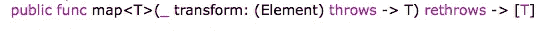

# 使用 Swift 结果类型处理错误

> 原文：<https://betterprogramming.pub/swift-result-type-6dfe1b41c8b4>

## Swift 语言的新成员

## 创建更干净的 API 规范

Nick Tiemeyer 在 Unsplash 上拍摄的照片

在本文中，我们将讨论 Swift 5 中引入的一种结果类型，以及如何使用它来处理错误。让我们借助下面的例子来讨论这个问题:

在讨论 Swift 中的[错误处理时，我们使用了 optionals 和 try catch 来处理错误。](https://heartbeat.fritz.ai/error-handling-in-swift-c7987f9f8659)

当出现故障时， *try/catch* 允许我们交流更多关于出错原因的信息，这就是为什么在处理错误时 try catch 是更好的选择。

有时，我们可能需要在失败的情况下处理除零以外的值，结果类型在这些不太常见的场景中很方便。

结果类型在异步错误处理中非常有用，并被添加到 Swift 5 本地库中。如果您正在编写 Swift 5 代码，此结果类型会隐藏 Swift 点结果类型。

在下面的示例中，我们将为上面提到的代码示例创建自己的结果类型，如下所示:

对于两个泛型关联值，有两种互斥的可能性，如代码所示。

结果类型的核心是成功的`success`类型和必须符合快速错误的`failure`类型。

让我们试着在函数中使用它，如下所示:

当成功值不存在时，该函数要么返回一个`success`值，要么抛出一个`failure`错误。

现在，我们可以转换上面例子中的除法函数，使用我们刚刚创建的`ResultType`:

如你所见，我们不再需要使用投掷了，使用`try?`的额外需求也消失了。

为了获得实际值，我们可以使用`getResult`函数，如下所示:

当我们试图将分子除以零时，执行代码的结果将在控制台上显示如下内容:

正如我们在上面的代码中所做的，能够将操作链接在一起是很有用的。函数式编程方法公开了像`map`和`flatMap`这样的函数，使我们能够进行类似的链接。

让我们试着编写这些函数的自己的版本，这样我们就可以比较不同之处，但是，在我们这样做之前，让我们看看下图中的`map`的声明:

因为我们已经知道了 map 函数的参数列表，所以让我们尝试为我们的自定义 map 函数创建自定义实现。

让我们称这个函数为`mapValues` 并且，由于我们希望这个函数与`ResultType`一起工作，让我们在一个`ResultType`扩展中声明这个函数，如下所示:

正如我们在这里看到的，map 函数是一个通用的类型`T`。它接受一个转换函数作为参数。

用指定的参数值写成参数中的`transform`。

转换从`success`类型进行到通用类型`T` ，然后返回类型`T`的结果。让我们看看当我们将它链接起来时，它们是如何组合在一起的:

我们使用自定义的`mapValues()`函数来转换使用 divide 函数的值。

我们将 1000 除以两次得到一个结果。

执行上述代码的结果会将以下内容打印到控制台:

注意，为了从执行中获得 10.0 作为输出，我们需要调用两次`getResult()`。

这是因为它嵌入在另一个`ResultType`中，很像一个`optional`在一个`optional`中。

为了保持结果的简洁，我们也可以为 flatMap()编写自定义实现。我们将在后续文章中看到这一点。

# 结论

在本文中，我们使用了`ResultType`,并了解了如何对其进行组合以产生其他结果。这对于我们没有东西可扔的异步代码来说是理想的。

我们也可以`ResultType`在函数式编程风格中，我们用`map`示例来演示这一点。结果正式包含在 Swift 5 中。

感谢阅读！