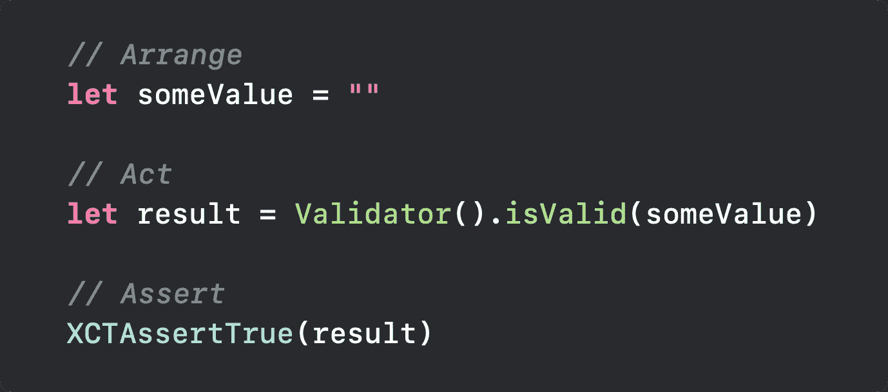

# 快速测试技巧和窍门:构建一个设计良好的测试结构

> 原文：<https://betterprogramming.pub/swift-tests-tips-tricks-well-designed-test-structure-31dfa2fb5282>

## 什么是安排-行动-断言？

本系列的一个主要思想是培养写好测试代码的心态，讨论它为什么重要。因此，让我们深入研究一种非常好的编写测试的方法。

在这篇文章中，我想谈谈安排-行动-断言模式。(你也可以找到这个概念的其他名称，如 AAA、Given-When-Then 或最广为人知的名称 AAA 测试模式。)我们将解释如何用 Swift 语言实现这个测试结构模式。

在我给你看一些例子之前，我真的建议你观看 2017 年 WWDC 关于可测试性工程的会议。我相信这个环节是我写这些关于测试的文章的最大原因——也是我的主要参考。

 [## 可测性工程- WWDC 2017 -视频-苹果开发者

### 单元测试是持续验证您的代码工作正常的必要工具。探索设计技巧…

developer.apple.com](https://developer.apple.com/videos/play/wwdc2017/414/) 

# 什么是安排-行动-断言？

Arrange-Act-Assert (AAA)模式是为被测方法编写单元测试的一种常见方式。我喜欢把它定义为一个伟大的指南，让你更好地编写和组织你的测试。

最好的事情是它为你的测试提供了更好的可读性。当你阅读你的测试结构时，你可以给它一个与你的测试一致的名字。在本文中，我也将谈一点术语——但这还不是重点。

*   单元测试方法的`Arrange`部分初始化对象并设置传递给被测方法的数据值。
*   `Act`部分使用排列好的参数调用测试中的方法。
*   `Assert`部分验证被测方法的行为是否符合预期。

因此，我将向您展示一个如何将这种模式应用到我们的测试中的例子。

这是一个简单测试的例子。基本上，我们想要验证一个类别是否有效。

看一下这个测试，你可以看到它很大，很难阅读，如果有什么，需要改变或添加一些额外的代码。这个测试很难，因为测试的`Arrange`、`Act`和验证都在一行上。

让我们看一个设计良好的测试结构的相同测试，实现这个模式:

正如您所看到的，这个测试的结构更好，定义更好，易于阅读和理解，如果由于某种原因需要修改，也很容易做到。

您可以像我在示例中所做的那样，选择使用注释来帮助您更好地理解您的测试，或者您可以尝试遵循没有注释的结构。

# 最终注释

这种模式在不同的编程语言中使用，可以作为整个技术团队使用的非常好的指南，并为单元测试编写设置一种模式。在我看来，这也是一个很大的好处——特别是如果你的公司有一个定义良好的代码审查过程，在这个过程中，你可以阅读另一种语言的测试，并理解测试的上下文和写作。

希望你喜欢它，并证明对你的项目有用。