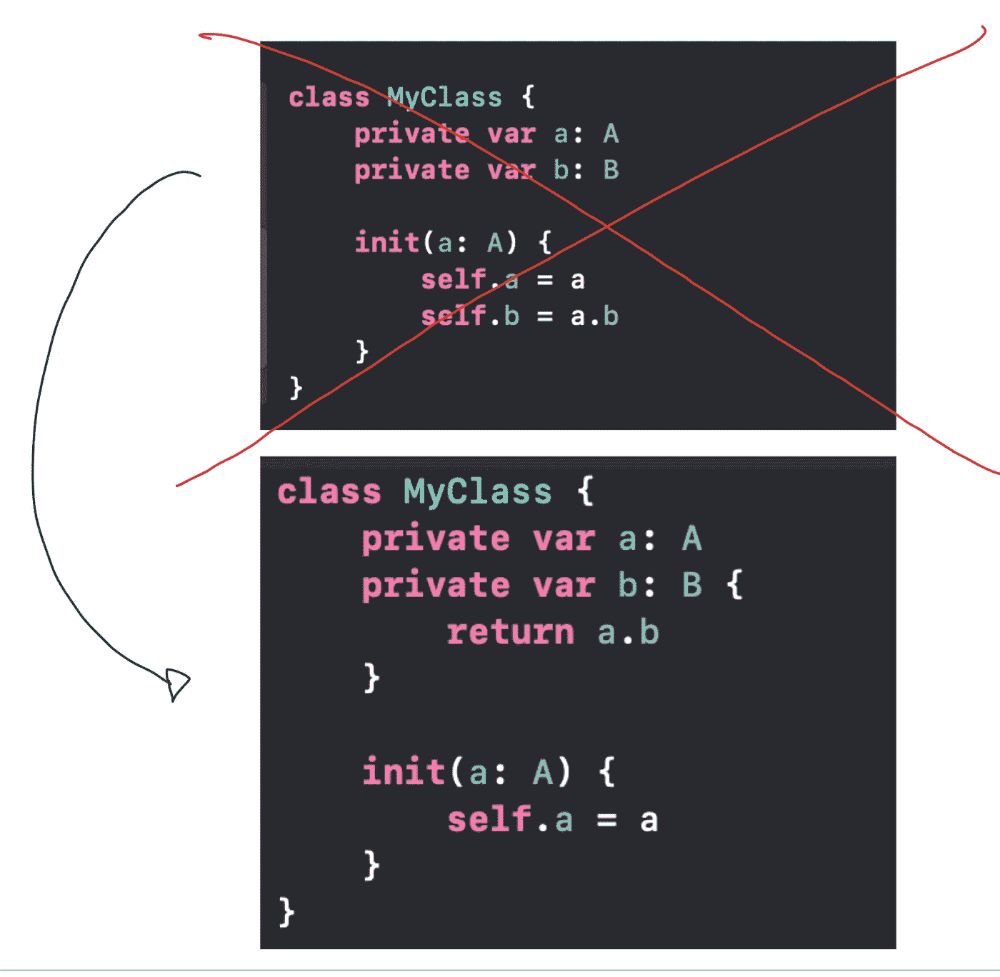
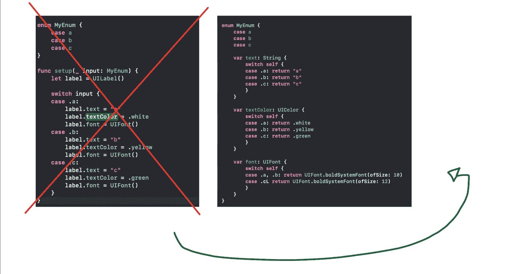
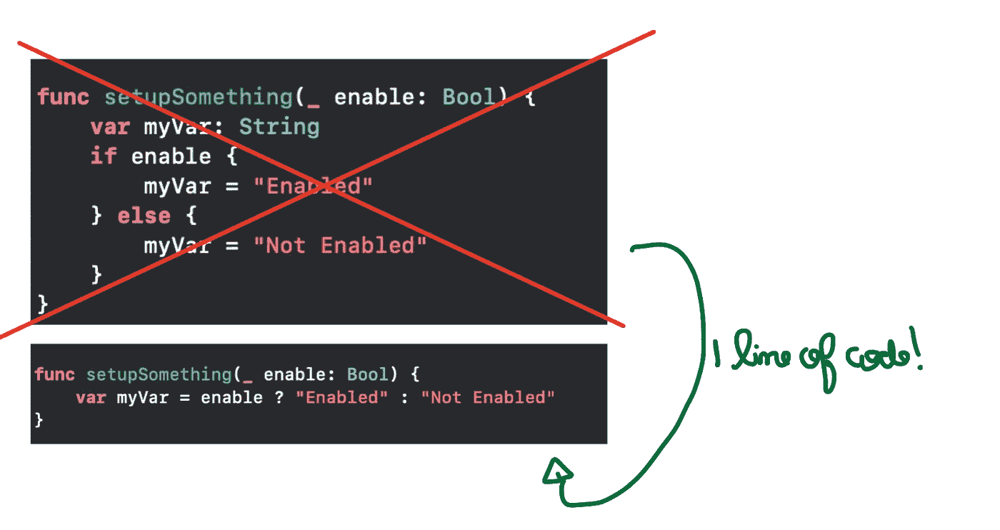

# iOS 开发人员代码审查手册

> 原文：<https://betterprogramming.pub/swift-the-art-of-code-reviewing-e4785da7e0c6>

## 在 Swift 中审查代码的 5 个主要方面——超过 25 个实用技巧

作者图片

当你在团队中工作时，与所有同事建立共同语言是个好主意。

这是非常非常重要的，以确保每个人都可以对你所开发的功能进行改进。很多时候，开发人员从一个团队来来去去。因此，新开发人员最终会修改您的代码、修复 bug、添加特性或记录所有工作。应该考虑一种共同的“语言”,以确保您的所有队友都瞄准同一个目标，并且任何人都能理解该产品如何工作，思维敏捷。

代码审查过程是(或者至少应该是)任何公司拥有的最重要的文化技能之一。这是一个持续的反馈系统，有助于提高代码质量。如你所知，软件产品是一种社会契约。所有团队成员都必须了解它的方方面面，它是如何工作的，它是如何发展的，甚至更重要的是:它将走向何方？

你应该审查代码，不仅是为了尊重架构模式，也是为了提高应用程序的性能，降低复杂性，并确保一个小的代码变化不会破坏一个正常工作的软件。

本文将涵盖代码审查的所有方面，在检查其他人的代码时应该考虑什么，以及如何保持您的项目的可伸缩性——通过 Swift 中的示例。

# 体系结构

几乎每一家技术公司都根据移动世界社区已经记录的知识建立了自己的架构和主要设计模式。

可能是清洁，毒蛇，MVVM，MVP 等。但是你必须记住的第一件事是，每个软件团队都有自己的偏好和构建代码的方式。没有最正确的代码模式。所有架构都有自己的优点和缺点，当你被雇用时，你就签署了一份抽象的合同，牺牲自己来适应组织的工作方式。

当审查某人的代码时，需要仔细观察以确保没有任何东西破坏架构。例如:假设在一个架构中有 3 层:

任何场景中的流程都必须是 A -> B -> C

基本上，`A`实例有一个`B`类型的引用`b`，它有一个`C`类型的引用`c`。那个`c`参考对`A`也有弱参考。任何破坏数据流的东西都必须经过代码所有者的审查。`B`无法向`A`返回任何信息，因为`C`无法与`B`通信。这个项目中的所有模块必须同意这个协议。

说到毒蛇，`View`必须和`Presenter`交流，而且只能和`Presenter`交流，只要`Interactor`不能和`Router`或者`View`交流。

说到干净的雨燕，`Present`不知道`Interactor`就像`Interactor`不跟`ViewController`说话一样，等等。如果你的任何队友违反了这个架构契约，你就不能将这个代码合并到一个 epic 或者开发分支中。您必须请求更改来修复架构。

# 坚实的原则

这与架构和设计解决方案有关，但考虑到它包含了最佳实践，这是一个更严格的规则。基本上，SOLID 告诉我们所有的职责必须在它的所有层中分离:UI 元素必须只有视图/视图模型层知道，业务逻辑必须保存在业务层中，API 元素应该包含在服务层中。

上述任务不应该放在同一个类中——因为这会导致单元测试中的许多问题，使代码混乱，并为项目中的过度工程打开大门。为了避免这种情况，请检查:

*   是否有任何业务逻辑或模型与 UI 一起被注入？
*   除了呈现和更新小部件，你的视图层还做什么工作吗？
*   你的业务层知道 Apple UIKit 吗？
*   您是否正在创建 API 调用并在业务逻辑所在的地方处理后端错误？

如果以上任何一个问题的答案是肯定的，那么代码很有可能违反了坚实的原则。要求您的同事检查这些更改。

# 优化代码

正如我提到的，代码必须总是易于维护，对于其他队友来说，更重要的是对于团队中的新人来说。为了强调这一点，这里有一些技巧可以让你的代码简单易懂，并让一些任务变得更简单:

*   你的类变量是否代表了你注入的属性中的一些数据？如果是，将其转换为计算变量，如下所示:

*   您是否正在创建一个由另一个方法或类同样完成的任务，这种方式浪费了一些代码行？不要浪费这个方法，直接调用它。
*   如果您在代码中转换一些数据，并且有一些错误处理，使用`guard let`而不是`if let`来简化您的数据流:

*   你是否在代码中多次编写一些复杂的任务？将其转换为注入其参数的方法。
*   你有没有一个`enum`案例可以处理多种类型的值？将定制数据转换为 enum 的一些内部变量，如下所示:

基于枚举事例定义的所有这些属性必须是内在的

*   你有一个类代表的模型吗？把它转换成一个结构。
*   你强制解开任何数据吗？宁可使用一个守卫 let 语句来处理它为空的情况。或者可能是带有默认值的合并运算符。
*   您是否只检查 if-else 语句中的一个布尔值？请改用三元运算符:

*   你是否在你的应用程序中多次重复一些文本字符串？将它们集中在一个空间中，就像私有枚举一样。
*   你是不是只在类的某个部分初始化一些数据？以不浪费内存的方式使用惰性变量而不是默认变量
*   一个类的所有不能在外部访问的属性都被声明为私有。
*   你在仔细检查一些可选的吗？比如“guarding let”一个对象和它的一些属性在同一个代码块里？

所有这些提示都是人们对代码的简单性、性能和易读性不够小心的一些最常见的原因。避免成为他们。

# 易测性

当然，您的公司关心其代码的单元测试部分，以避免围绕特性传播错误和 bug，并且单元测试是至关重要的。要保持类的所有特性都是可测试的，请遵循以下提示:

*   确保你的类有一个协议，它的所有接口都指向它被调用的地方。这样，它的行为必须为多种类型的实例实现。
*   该类有任何依赖关系吗？确保这些依赖项有一个接口，可以在不干扰测试的情况下被模拟。
*   将你的类单元任务分成不同的方法，以便所有的方法和它们不同的上下文都可以被测试。

# 用户界面

当然，您没有时间运行您正在审查的所有代码，所以您必须小心任何必须破坏正在创建的接口的事情:

*   这段代码对它的所有组件都设置了约束吗？
*   如果一个视图控制器有一些自定义的主视图类，它是否在`loadView`方法中被赋值？
*   所有的 UI 操作都是在主线程中完成的吗？检查你是如何处理 GCD 的。
*   检查同事是否在拉动式请求描述中填写了一些照片。确保界面以正确的方式工作是很重要的。
*   如果某个设计系统组件正在被实例化，该类中任何已经设置的属性是否会被覆盖？

这破坏了自定义标签的身份

# 特色突破与遗产

如果你在一家非常大的公司工作，多年来已经开发了很多软件，那么你肯定要处理的一件事就是遗留代码。

遗留代码只不过是应用程序的旧结构，仍然用于支持应用程序中的一些功能。通常，这些功能遵循非常旧的代码风格，如旧的架构，甚至一些不再使用的 Swift 资源。在某些情况下，你可能会经常面对一些 Objective-C 文件。

审查在遗留系统上开发的新代码需要你更多的关注，因为，你知道，这就像一个巨大的建筑，任何一个小的基础部件被交换都可能导致整个结构倒塌。如果你改变了应用程序核心部分的一些代码行，你可能会禁用一些基本功能，比如互联网检查或者一些安全机制。

考虑到这一点，当您审查某个核心类或模块被修改的 pull 请求时(不考虑新的属性或方法)，请检查分支并运行您自己的代码，看看是否有任何东西被破坏。另一个建议是向你的同事伸出援手，理解为什么需要改变。或者你可以建议另一种不需要编辑遗留代码的方法。如果真的有必要接触那部分代码，咨询创建核心代码的团队，并与那个人一起决定哪种方式是最好的。

它不一定是遗留代码，如果有人正在修改一个已经在生产中的类，应该注意这种改进可能给你的应用带来的后果。

# 结论

在本文中，我介绍了在审查某人的代码时要考虑的几个方面。正如我告诉你的，每个公司都有自己的解决方案来维护软件的可伸缩性、可测试性，并随着时间的推移而改进。没有最佳解决方案，每个环境都需要自己的资源。

在创建代码模式时，有一些“规则”是必须遵守的。都是为了避免任何 app 经常出现的问题，树立软件工程的良好做法的模式。

我希望你现在是一个更好的代码审查者，并找到自己的方法来提高软件质量。