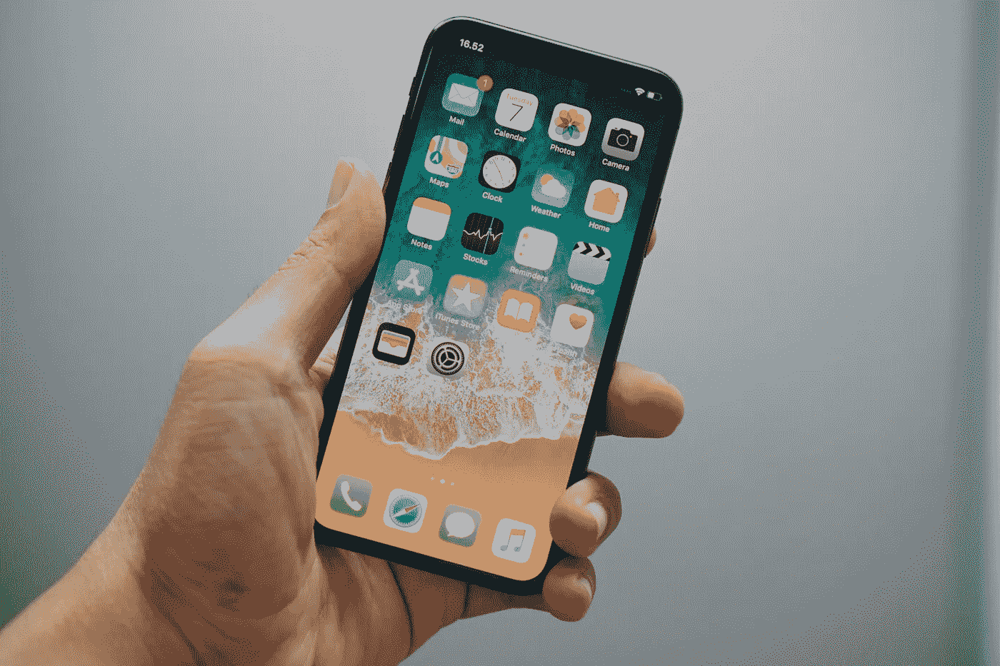
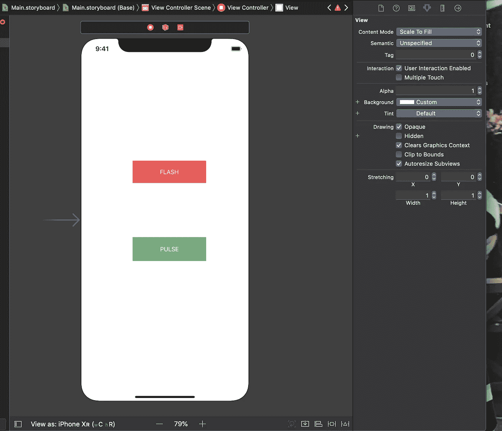

# Swift UIButton 动画

> 原文：<https://betterprogramming.pub/swift-uibutton-animations-6ce016212c6e>

## 学习在 Swift 项目中为任何 UIButton 构建动画



照片由[巴格斯·赫纳万](https://unsplash.com/@bhaguz?utm_source=unsplash&utm_medium=referral&utm_content=creditCopyText)在 [Unsplash](https://unsplash.com/search/photos/iphone?utm_source=unsplash&utm_medium=referral&utm_content=creditCopyText) 上拍摄

您的 Swift 应用程序中的动画可以真正赋予它生命。它可以将应用程序带到另一个层次，并允许用户享受他们的体验。我们将学习如何应用两个不同的动画，我们可以添加到我们的 UIButtons。让我们马上开始制作动画吧！



1.  将两个 UIButtons 拖到项目的情节提要上。
2.  `Control-Drag`将每个按钮放到 ViewController 文件中以创建 IBActions。
3.  调用第一个函数`pulseButtonPressed()`和第二个函数`flashButtonPressed()`。不要忘记使 UIButton 成为发送者。
4.  创建一个名为`UIButtonExtensions`的新 Swift 文件，并在文件顶部导入 UIKit。
5.  对 UIButton 进行扩展。(这是我们所有魔法的归宿。)
6.  在扩展中创建一个函数，并将其命名为`pulsate()`。创建第二个名为 flash()的函数，并输入以下代码。

```
func pulsate() {let pulse = CASpringAnimation(keyPath: "transform.scale")pulse.duration = 0.4pulse.fromValue = 0.98pulse.toValue = 1.0pulse.autoreverses = truepulse.repeatCount = .infinitypulse.initialVelocity = 0.5pulse.damping = 1.0layer.add(pulse, forKey: nil)}func flash() {let flash = CABasicAnimation(keyPath: "opacity")flash.duration = 0.3flash.fromValue = 1flash.toValue = 0.1flash.timingFunction = CAMediaTimingFunction(name: CAMediaTimingFunctionName.easeInEaseOut)flash.autoreverses = trueflash.repeatCount = 2layer.add(flash, forKey: nil)}
```

先说上面的代码。

我们做的第一件事是创建我们的`CASpring`和`CABasicAnimation`。我们希望脉冲动画更有弹性，所以我们想使用`CASpringAnimation`。

*   `keyPath`变换比例将帮助我们改变按钮的大小。
*   持续时间是动画将持续的时间。
*   “从”和“到”值是按钮从动画开始到结束的大小。
*   Autoreverses 将使动画在完成后反转，我们将此设置为`true`。
*   您分配给`repeatCount`的值将是您希望它重复的次数。如果你想让它一直持续下去，你也可以把它分配给`.infinity`。
*   `InitialVelocity`和`damping`与`CASpringAnimation`有关，这决定了你将对你的动画产生多大的弹性效果。
*   最后，我们将在函数的最后一行添加动画到 UIButtons 层。

让我们继续把我们的新动画叫做“函数”。

8.在我们各自的 IBAction 函数中调用`sender.pulsate()`和`sender.flash()`。

```
@IBAction func pulseButtonPressed(_ sender: UIButton) {sender.pulsate()}@IBAction func flashButtonPressed(_ sender: UIButton) {sender.flash()}
```

如果您继续运行您的应用程序，当您按下 ui 按钮时，您应该能够看到每个动画。现在，您可以调整值来制作所需的动画。

你也可以调用`viewDidLoad()`中的动画，如果你想让它们不需要点击任何按钮就可以启动。享受创造你的动画！