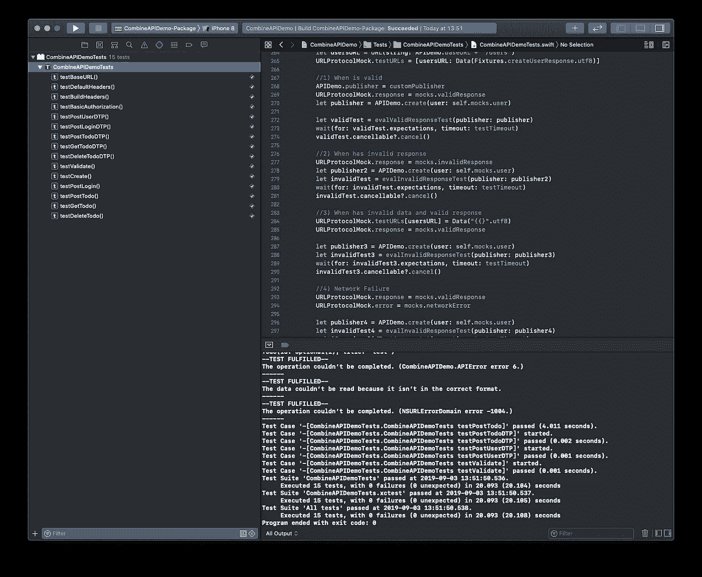

# Swift:使用 URLProtocol 对 DataTaskPublisher 进行单元测试

> 原文：<https://betterprogramming.pub/swift-unit-test-a-datataskpublisher-with-urlprotocol-2fbda186758e>

## 如何使用`URLProtocol`实现对一个`DataTaskPublisher`的单元测试


照片由 [Alina Grubnyak](https://unsplash.com/@alinnnaaaa?utm_source=medium&utm_medium=referral) 在 [Unsplash](https://unsplash.com?utm_source=medium&utm_medium=referral) 上拍摄

在我上一篇文章的[中，我通过组合 API 和`URLSession`实现了一个数据发布器，以及如何将它用作 API 客户端。](https://medium.com/better-programming/upgrade-your-swift-api-client-with-combine-4897d6e408a0)

这一次，我们将为我们的 API 客户端创建一个 Swift 包，并为它实现单元测试。

上一次，我们通过对 Docker 实例进行集成测试，证明了 API 客户机的工作原理。

这一次，通过实现单元测试，我们完成了我们的代码，因此我们可以在将来维护这个库，并证明我们没有错过相关的用例。

对我们的 API 客户机进行完整的单元测试将要求我们证明客户机工作正常，不仅是在服务器可用并提供正确的响应和数据时，而且是在响应无效、数据损坏或出现网络故障时。

注意:您需要 Xcode 11 来完成本教程。

# 快速包裹准备

> " TSwift 包管理器是一个管理 Swift 代码分发的工具。它与 Swift 构建系统相集成，可自动完成下载、编译和链接依赖关系的过程。”— [Swift 软件包管理器文档](https://swift.org/package-manager/)

通过 Swift Package Manager，我们将创建一个定制库并对其进行单元测试。

## 创建新的包

从命令行创建一个目录，在我们的例子中是`CombineAPIDemo`:

```
mkdir CombineAPIDemo
cd CombineAPIDemo
```

初始化您的新包:

```
swift package init
```

包 init 将为一个库创建项目脚手架:

```
Creating library package: CombineAPIDemoCreating Package.swift
Creating README.md
Creating .gitignore
Creating Sources/
Creating Sources/CombineAPIDemo/CombineAPIDemo.swift
Creating Tests/
Creating Tests/LinuxMain.swift
Creating Tests/CombineAPIDemoTests/
Creating Tests/CombineAPIDemoTests/CombineAPIDemoTests.swift
Creating Tests/CombineAPIDemoTests/XCTestManifests.swift
```

现在，我们生成 Xcode 项目:

```
swift package generate-xcodeproj
```

我们会打开它:

```
open CombineAPIDemo.xcodeproj
```

太好了！你的第一个包裹准备好了！现在，您需要添加代码。

## 将代码添加到包中

用下面的代码覆盖`CombineAPIDemo.swift`:

[https://gist . github . com/Andrea-Scuderi/a3 dcdec 30 a 966 da 6 ad 3390 c 66 ad 95732](https://gist.github.com/Andrea-Scuderi/a3dcdec30a966da6ad3390c66ad95732)

我重构了我们在[上一篇文章](https://medium.com/better-programming/upgrade-your-swift-api-client-with-combine-4897d6e408a0)中讨论过的一些类，因此有可能构建一个带有自定义会话的`DataTaskPublisher`，该会话将在单元测试期间注入。

我们的`APIDemo.publisher`现在基于`APIDataTaskPublisher`协议，由类`APISessionDataTaskPublisher`实现。这将允许我们通过对我们的响应使用模拟来改变发布者内部的`URLSession`。

在`APIDemo`类中，我们有三种不同类型的静态函数:

*   Public:我们希望向包消费者显示的函数。
*   内部:我们需要单元测试的功能。
*   Private:作为实用程序使用的函数，由内部函数使用。我们不能直接测试它，因为它们不能被单元测试类访问，但是它们将作为内部函数测试的一部分被测试。

太好了！现在我们有了单元测试的代码。尝试构建它，检查它是否构建正确。

# 让我们深入单元测试

## 返回 DataTaskPublisher 的内部函数

返回`DataTaskPublisher`的内部函数的单元测试将测试所创建的请求是否正确。

```
**func** testPostUserDTP() {
   **let** future = **try**? APIDemo.postUserDTP(user: **self**.mocks.user)
   **let** request =  future?.request
   XCTAssertEqual(request?.url?.absoluteString, APIDemo.baseURL + "/users")......}
```

## 模仿 URLSession

在`Tests\CombineAPIDemoTests`文件夹下添加一个新的 Swift 文件，命名为`URLProtocolMock`，内容如下:

[https://gist . github . com/Andrea-Scuderi/15 e8e 13 e 31 BD 562 e5c 607 b 63 a 54d 60d 5](https://gist.github.com/Andrea-Scuderi/15e8e13e31bd562e5c607b63a54d60d5)

`URLProtocolMock`是用我们定制的响应和数据创建模拟`URLSession`的关键。该类允许传递我们的`Data`、`URLResponse`和`Error`来模拟网络请求的行为。

被嘲笑的`URLSession`将这样创建:

```
**let** config = URLSessionConfiguration.ephemeralconfig.protocolClasses = [URLProtocolMock.**self**]**let** session = URLSession(configuration: config)
```

因此，我们可以创建一个自定义的`APISessionDataPublisher`并将其分配给`APIDemo.publisher`来模拟网络调用。

```
let customPublisher = APISessionDataPublisher(session: session)
APIDemo.publisher = customPublisher
```

我们可以设置我们的回应:

```
**let** usersURL = URL(string: APIDemo.baseURL + "/users")URLProtocolMock.testURLs = [usersURL: Data(Fixtures.createUserResponse.utf8)]
URLProtocolMock.response = mocks.validResponse
```

并创建我们的模拟 API 客户端发布程序。

```
**let** customPublisher = APISessionDataPublisher(session: session)
```

## **实现可复用的测试功能**

对于每个测试调用，我们需要测试客户端的以下条件:

*   有效的回应。
*   由于无效的`URLResponse`导致无效的响应。
*   由于无效的`Data`，响应无效。
*   由于网络故障，响应无效。

下面的代码将展示测试一个通用发布者所需的两个函数的实现，当它是`Valid`或`Invalid`时。

[https://gist . github . com/Andrea-Scuderi/985 f73 a2 fa 2fa 99576 FBC 8882150 af 30](https://gist.github.com/Andrea-Scuderi/985f73a2fa2fa99576fbc8882150af30)

`sink`函数将执行异步网络调用。

我们需要定义我们将返回的所有期望，以便我们可以在测试中等待它们。

以下是如何配置测试以获得有效响应的示例:

```
**//Setup URLSession Mock**
**let** usersURL = URL(string: APIDemo.baseURL + "/users")URLProtocolMock.testURLs = [usersURL:      Data(Fixtures.createUserResponse.utf8)]
URLProtocolMock.response = mocks.validResponse**let** config = URLSessionConfiguration.ephemeral
config.protocolClasses = [URLProtocolMock.**self**]
**let** session = URLSession(configuration: config)**let** customPublisher = APISessionDataPublisher(session: session)APIDemo.publisher = customPublisher**// Create the Publisher
let** publisher = APIDemo.create(user: **self**.mocks.user)**// Test the Publisher**
**let** validTest = evalValidResponseTest(publisher: publisher)
wait(for: validTest.expectations, timeout:testTimeout)
validTest.cancellable?.cancel()
```

## 单元测试 DataTaskPublisher

下面是测试`create`功能的完整示例:

[https://gist . github . com/Andrea-Scuderi/247522 b 550d 2 E0 ba 89 c 85d 7 CB 2 ce 5c 81](https://gist.github.com/Andrea-Scuderi/247522b550d2e0ba89c85d7cb2ce5c81)

# 包扎

用以下内容覆盖`CombineAPIDemoTests.swift`:

[https://gist . github . com/Andrea-Scuderi/7c 756 da a3 c 9 aa 1657 b 72324738583293](https://gist.github.com/Andrea-Scuderi/7c756daa3c9aa1657b72324738583293)

现在，您已经完成了 API 客户端的完整测试。

在 Xcode 中，使用键盘上的 CTRL+U 快捷键运行单元测试，或者从菜单中选择 *Product- > Test。*



仅此而已！感谢阅读全文，我希望你喜欢它。

这里是[完整项目](https://github.com/Andrea-Scuderi/CombineAPIDemo)。

# 参考

[](https://medium.com/better-programming/upgrade-your-swift-api-client-with-combine-4897d6e408a0) [## 使用 Combine 升级您的 Swift API 客户端

### 用 Combine API 和 URLSession 实现一个数据发布器，以及如何将其用作 API 客户端

medium.com](https://medium.com/better-programming/upgrade-your-swift-api-client-with-combine-4897d6e408a0) [](https://github.com/apple/swift-package-manager/blob/master/Documentation/Usage.md) [## 苹果/swift 包管理器

### 简单地说:包是一个带有语义版本标记的 git 存储库，它包含 Swift 源代码和一个…

github.com](https://github.com/apple/swift-package-manager/blob/master/Documentation/Usage.md) [](https://www.hackingwithswift.com/articles/153/how-to-test-ios-networking-code-the-easy-way) [## 如何以最简单的方式测试 iOS 网络代码

### 普遍认为单元测试应该是第一位的:快速、隔离、可重复、自我验证和及时。可悲的是…

www.hackingwithswift.com](https://www.hackingwithswift.com/articles/153/how-to-test-ios-networking-code-the-easy-way) [](https://nshipster.com/nsurlprotocol/) [## NSURLProtocol

### iOS 完全是关于网络的——无论是从服务器读取状态还是向服务器写入状态，将计算卸载到…

nshipster.com](https://nshipster.com/nsurlprotocol/)