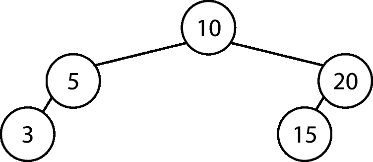
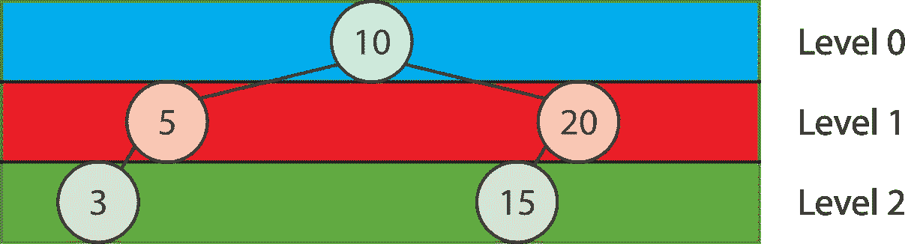

# 使用广度优先搜索解决 LeetCode 问题

> 原文：<https://betterprogramming.pub/swift-using-bfs-for-leetcode-problems-82696faf58d8>

## Swift 中的算法

这棵树的 BFS 输出是 10 5 20 3 15

# 开始之前

## **为什么？**

广度优先搜索树可能看起来很容易，但它们可以扩展到简单矩阵中使用，这通常用于评级为中等或以上的 LeetCode 挑战。

## **先决条件**

按照本文，您应该能够使用插入创建一个二叉树(尽管下面显示了一个简单的实现)。

## **关键词和术语**

*   树:具有根值和左右子树的数据结构
*   矩阵:存储数据的网格
*   单元:矩阵的元素之一

# **树形版本**

遍历上面的树包括依次通过三个级别。虽然任何顺序都是可以接受的，但是该级别中节点的顺序并不重要，节点从左到右显示。

*   等级 0: 10
*   级别 1: 5，20
*   级别 2: 3，15

下面是一个示例实现(和测试)的要点:

这里的实现围绕着创建一个队列，如果有左边或右边的子树，就附加到这个队列。

将其转换为路径长度是很简单的。

# **矩阵版本**

LeetCode 1091。在二进制矩阵中求最短路径需要我们求出一个矩阵(Swift 中用[[Int]]表示)的最短路径(从右上角到右下角)。网格中的单元可以是可用的(0)或被阻止的(1)。

我们可以选择深度优先搜索，但这需要首先遍历所有的可能性，然后选择最短的一个。

矩阵版本增加的复杂性包括:

*   在矩阵中有八个方向可以移动，我们需要确保我们不会越过网格的边界
*   我们需要确认每个单元格是否可以访问(已经被阻止(1)，或者标记为已访问(也是 1)
*   通过将单元格与网格的大小(head coordinate . 0 = = grd . count-1 & & head coordinate . 1 = = grd . count-1)进行比较，我们将知道我们是否已经达到了目标(右下角的单元格)
*   由于每个单元格最多可以有八条路径，我们需要确保每次迭代都从当前单元格中提取每条路径——这可能是整个实现中最复杂的部分

# **简化代码**

通过从剩余的代码中分离出可能的方向，我们可以将它分解成一个变量:

> **设** dir:[[Int]] = [[0，1]，[0，-1]，[1，0]，[-1，0]，[1，-1]，[-1，1]，[-1，-1]，[1，1]]

所以我们可以通过把这些加到当前坐标上来计算下一个候选坐标。一种方法是:

> **设** nextCoordinate =(当前坐标. 0 +方向[0]，当前坐标. 1 +方向[1])

# **算法**

所以基本的想法是这样的:

1.  我们将初始单元格设置为开始(左上角；0,0)
2.  将路径计数设置为 1。
3.  我们获取队列中的元素，对于每个当前单元格:

*   检查是否可以遍历到该单元格(检查它是否为 0)，如果不能，则移动到下一个元素
*   检查我们在目的地。如果是，则返回路径计数
*   将当前单元格标记为 1
*   然后对于每个可能的方向，计算下一个坐标。如果在界限内，则添加到队列中
*   当前迭代完成后，增加路径计数

4.在我们完成所有可能的单元格后，没有解，所以我们返回-1

# 结论

我希望你喜欢这个教程。你可以在下面找到代码和回购。感谢阅读！

## 代码片段:

## 回购:

[https://github . com/stevencurtis/swift coding/tree/master/leet code/swiftusingbfsforleecodeproblems](https://github.com/stevencurtis/SwiftCoding/tree/master/LeetCode/SwiftUsingBFSforLeetCodeProblems)

**想取得联系？在 Twitter 上取得联系:**

 [## 史蒂文·柯蒂斯(@stevenpcurtis) |推特

### 史蒂文·柯蒂斯的最新推文(@stevenpcurtis)。一边学习计算硕士，一边开发 iOS 应用程序…

twitter.com](https://twitter.com/stevenpcurtis)