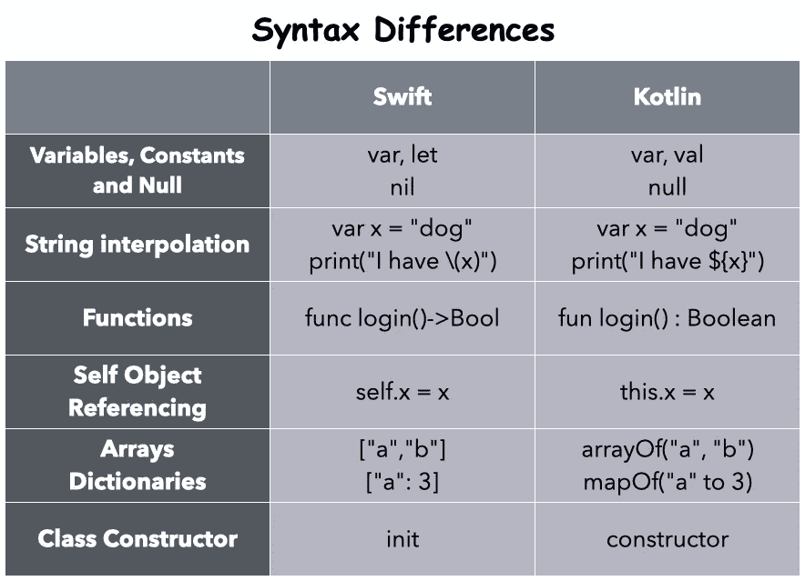

# 斯威夫特与科特林:你应该知道的异同

> 原文：<https://betterprogramming.pub/swift-vs-kotlin-the-similarities-and-differences-you-should-know-b2f1be201888>

## 比较移动开发的两种主流语言


照片由 [Teo Zac](https://unsplash.com/@teo?utm_source=medium&utm_medium=referral) 在 [Unsplash](https://unsplash.com?utm_source=medium&utm_medium=referral) 上拍摄

iOS 和 Android 之间的霸权之战已经持续了十年。不管你选择什么样的生态系统，开发人员都无法停止比较这两种主要用于构建原生移动应用程序的语言。

Swift 由苹果开发，于 2014 年首次出现。另一方面，Kotlin 由 JetBrains 团队设计，并于 2011 年首次亮相。但直到 2017 年谷歌将其作为 Android 开发的官方语言，它才得到应有的重视。

Swift 和 Kotlin 带来了更多的函数式编程，并且可以分别与它们的面向对象前辈 Objective-C 和 Java 进行互操作。了解 Swift 和 Kotlin 之间的明显相似性和主要差异应该有助于您在它们之间轻松切换。

让我们比较一下它们的语法、风格和实现。



# 可选和可空类型

Swift 和 Kotlin 努力确保您不会意外地遇到空指针异常。

两者都使用一种包装器类型，让您可以安全地访问底层值。Swift 称这种类型为`Optional` s，而 Kotlin 称之为 nullables。你需要做的就是在变量类型后设置一个`?`。

```
**//Swift**
var id: String? = "007"
print(username) //Optional(007)
username = nilvar password : String = nil //invalid**//Kotlin**
var number: String? = "123"
print(username) // 123
```

如您所见，Kotlin 可空字符串在实际使用时，打印出与不可空类型相同的字符串。与 Swift 不同，它不将自己包装在可选的包装器中。这种差异是由于`Optional`在 Swift 中的实现方式——它们本质上是一个枚举。

另一方面，Kotlin nullables 固有地包含一个`null`类型检查器，当生成字节码时，编译器使用它来为您处理`null`引用。

## 可选链接与安全调用

在 Swift 和 Kotlin 中都需要在查询属性或调用函数的对象后放置一个`?`。在 Swift 中，这种行为被称为*可选链接，*而在 Kotlin 中，它被称为*安全调用。*

```
//Swift
print(string?.length) // prints Optional("3")//Kotlin
print(string?.length) //prints 3
```

## **可选处理**

Swift 有一个 nil-coalescing 操作符，`??`，它让您安全地展开一个值(如果它存在的话),或者当值为空时提供一个默认值。在 Kotlin 中，使用`?:` Elvis 操作符也可以做到这一点。

```
//Swift
let id: Int? = nil
var x = id ?? -1 //prints -1//Kotlin
val x: String? = "foo"
val y: String = x ?: "bar"
```

如果您想优雅地处理`Optional`并对展开的值应用一些额外的操作，您可以在 Kotlin 中使用一个简单的`null`检查器或智能转换(`is` 或`as`)。另一方面，Swift 为我们提供了可读性更强的`if let`和`guard let`语句。

```
//Swift
let name: String? = nil
if let name = name {
  print(name)
} else {
  print("name is nil")
}guard let name = name else{ return }
//use name in the rest of the scope....
```

虽然 Kotlin 没有类似的可选绑定语法，但它确实提供了一个`let()` lambda 函数，该函数仅在值不可为空时执行操作。但是这不同于`if let`和`guard let`方法，因为它不允许您访问作用域中的局部变量，如下所示:

```
//Kotlin
name?.let { name ->
    if (name is String) {
        //If name is not not null
    }
}
```

## 强制包装和隐式包装

虽然 Swift 和 Kotlin 都不推荐使用强制解包或非空断言，但对于 Swift 来说，这样做的语法是`!`，对于 Kotlin 来说是`!!`。

```
//Swift
var string : String? = nil
string**!.**lowercased() //crashes//Kotlin
var string : String? = null
string**!!.**toLowerCase() //crashes
```

Swift 中的隐式包装指示编译器忽略安全展开，因为该属性将始终有一个可用的值。在 Kotlin 中，通过在变量声明中使用`lateinit`关键字也可以做到这一点:

```
//Swift
var string: String!//Kotlin
lateinit var string : String
```

Kotlin 和 Swift 都允许使用`as?`安全施法。

# 控制流程

`if-else`、`for`和`switch`是大多数语言中可用的基本控制流语句。

## 如果-否则

在 Swift 中，条件周围的括号不是必需的，但是在`if-else`条件周围设置花括号是强制性的。相反，科特林做的正好相反。它仍然受到 Java 问题的困扰，并且让您在单行条件中不用花括号，因此由于悬空的`else`问题而造成了歧义。

```
//Swift
if i == 0{
}//Kotlin
if(i == 1)
  return true
```

## 对于循环

科特林和斯威夫特都有意识地远离 C 风格的`for`循环，而是更加重视`for in`循环。此外，它们还提供了使用范围操作符创建`for`循环的方法。

```
//Swift
for i in 0..5 {
  print(i)
}for i in 0..<5 {
  print(i)
}//Kotlin
for (i in 1..5) {
  print(i)
}for (x in 0 until 5) println(x)
```

Kotlin 中的`until`操作符类似于 Swift 中的`..<`。两者都不包括最后一个值。在`for`循环迭代中还有一种增加或减少值的替代方法。

Swift 为我们呈现了一个`stride`操作符，它有两个变体:`stride(from:to:by:)`(不包括`to`值)和`stride(from:through:by:)`(包括直通值)。

科特林为我们提供了`step`来控制增量，以及`downTo`来以相反的顺序创建步骤。

```
//Swift
for i in stride(from: 0, to: 1, by: 0.2) {
    print(i)
}for i in stride(from: 5, through: 0, by: -1) {
    print(i)
}//Kotlin
for (i in 0..1 step 0.2) print(i)for (i in 5 downTo 0 step 1) print(i)
```

## 交换语句

Swift 中的`switch`语句在 Kotlin 中被称为`when`。虽然 Swift `switch`需要详尽，但 Kotlin 的`when`语句不需要(除非该语句返回值)。

```
//Swift
let x = 2
switch x {
  case 0:
    print("x is 0")
  case 1:
    print("x is 1")
  default:
    print("x is neither 0 nor 1")
}//Kotlin
val x = 2when (x) {
    0 -> print("x is 0")
    1 -> print("x is 1")
    else -> {
        print("x is neither 0 nor 1")
    }
}
```

`switch`和`when`语句都非常强大，提供的不仅仅是嵌套条件——模式匹配、多案例和类型转换。在 Swift 中，通过使用`case let`或范围操作符，您可以进行部分匹配。以下示例显示了带有`Optional` s 和多个案例的模式匹配。

```
 let name : String? = "Anupam"
let password : Int = 123let info = (name, password)switch info {
case let (.some(name), .some(password)):
    print("\(name) password is \(password)")
case let (.some(name), nil):
    print("\(name) cannot recall the password.")
case (.none, .some(_)):
    print("Some password but no name.")
case (.none, _):
    print("No username or password. ")
}
```

Kotlin 为我们提供了`in`(参数范围)和`is`(智能转换)操作符，同时还允许您在`when`语句中不传递任何参数。

```
val x = 20
when (x) {
    in 0..7, 8, 9 -> print("single digit")
    10 -> println("10")
    in 11..99 -> print("double digits")
    !in 100...999 -> print("four or more digits")
    else -> print("three digits")
}when{
   x > 5 -> print("Greater than 5")
   else  -> print("Anything")
}
```

# 类、函数、构造函数和继承

尽管 Kotlin 和 Swift 中的类和函数的基本声明几乎相同，但还是有一些对比差异。

```
//Swift
class Vehicle {
    var numberOfWheels = 2
    func describeMe() -> String {
        return "Classy"
    }
}//Kotlin
class Vehicle {
    var numberOfWheels = 2
    fun describeMe() : String {
        return "Classy"
    }
}
```

默认情况下，上面定义的 Kotlin 类、函数和属性是`final`。这意味着它们不能被遗传。为了允许子类化或覆盖，我们需要将它们声明为`open class`和`open fun`。

此外，Swift 函数支持内部和外部参数名，这极大地提高了函数的可读性。在 Kotlin 中，可以使用`fun sum(**vararg** numbers: Int)`指定可变数量的参数，而在 Swift 中，使用以下签名:`func sum(_ numbers: Int**...**)`。

Kotlin 和 Swift 中的构造函数以不同的方式实现。Kotlin 允许您在类头本身中声明主构造函数，并带有设置默认值的选项。在类体中使用`constructor`关键字声明二级构造函数。如果类包含一个主构造函数，那么次构造函数必须使用`this`来引用它。此外，还有一个`init`块，每当类被初始化时它就运行。

默认情况下，构造函数参数是`val`，除非您将它们指定为`var`。对于 Kotlin 中的子类，如果没有定义主构造函数，则次构造函数必须使用`super`关键字来调用基类或委托给另一个使用`this`的构造函数。

在 Swift 中，`init`块实际上代表了主构造函数。它是一个指定的初始化器，负责设置这个类的所有属性。Swift 还有一个被称为`convenience`初始值设定项的二级初始值设定项——它通过让您为一些属性分配默认值来指定一级初始值设定项。

Swift 实际上通过包含`required`和自动初始化器继承抢了 Kotlin 的风头。在任何初始化式上设置的`required`关键字强制你在子类中实现该初始化式。自动初始化器继承遵循两条规则:

*   不要在子类中定义任何指定的初始化器——它们会被自动继承
*   实现基类的所有指定的初始化器。所有方便的初始化器都将被隐式继承。

# 结构和数据类

Kotlin 的主构造函数语法使得创建数据类——用于存储数据——变得容易。但是 Kotlin 没有办法像 Swift 中的结构那样创建一个自定义类型来按值传递数据。

```
//Swift
struct Point {
  let lat: Double
  let lng: Double
}var point = Point(lat: 23.33, lng: 75.55)//Kotlin
data class Point(val lat: Double, val lng: Double)
```

# 关闭

Lambda 表达式不仅仅是没有名字的函数。闭包是一种 lambda 类型，它允许您捕获定义范围之外的值。在 Swift 和 Kotlin 中，闭包的返回类型都是在`->`之后指定的。Kotlin 为单值闭包提供了一个`it`参数，可以对`->`进行转义。相反，Swift 让你使用`$0`、`$1`、`$2`等等。

虽然 Swift 闭包可以定义为`escaping`和`non-escaping`，但 Kotlin 闭包默认为`escaping`。这与两种语言的内存管理系统有很大关系——Swift 使用自动引用计数，而 Kotlin 使用垃圾收集器。

```
//Swift
var square = { (x: Int) -> Int in
  return x * x
}var cube = {  $0 * $0 * $0}//Kotlin
var result = 0
myList = listOf(1,2,3,4,5,6,7,8,9,10)
myList.forEach { result+=it }
```

# 扩展ˌ扩张

Swift 中的扩展允许您向类、结构、枚举和协议添加额外的功能，而无需实际扩展它们。在 Kotlin 中，扩展更像是 Java 的静态方法。

```
//Swift
extension Double {
    var km: Double { return self * 1_000.0 }
}//Kotlin
val Double.km: Double get() = this * 1000
```

**注意:** Kotlin 默认为所有属性声明提供了`get()`和`set(value)`方法。另一方面，Swift 使用更加灵活的 computed property 语法，包括`get{}`和`set{}`以及属性观察器`didSet` 和`willSet`，当值发生变化时会被触发。

# 接口和协议

Kotlin 中的接口在 Swift 中被称为*协议*。两者都负责定义该类可以遵循的一组函数或属性。不同之处在于 Kotlin 允许我们在接口中设置默认实现。作为 Swift 的变通办法，您可以在协议上使用扩展。

同样对于泛型，Swift 允许您在协议中定义一个`associatedType`；而对于 Kotlin，您可以在定义中使用泛型类型`T`。

```
//Kotlin
interface MyInterface {
 var myVariable**:** Int
 get() = 0 fun printMe()
 fun implementMe() {
 // do stuff here
 }
}//Swift
protocol MyProtocol {
  var myVariable: Int {get}

  func printMe()
  func implementMe()}

extension MyProtocol {
  var myVariable: Int {
    return 0
  }
}
```

# 列举

Kotlin 中的枚举是一个类，它保存一组自定义数据类型的常量。另一方面，在 Swift 中，`enum` s 是一等公民，让我们可以为每个案例指定任何类型的相关价值。另一方面，Kotlin 的每种类型只能有一个对象。

```
//Swift
enum AppVersion {
    case Name(String)
    case Version(Int)
}//Kotlin Enum
enum class Week(var shortform: String) {     
Monday("MON"),     
Tuesday("TUE"),     
Wednesday("WED") 
}var x = Week.Monday     
println(x.shortform) //prints MON
```

现在，Kotlin 确实有一个解决方法，就是使用*密封类和*来创建不同类型的实例。但是同样，密封类是一个引用类型，它完全复制了 Swift 的值类型。

```
//Kotlin Sealed Class
sealed class AppVersion {     
class Name(var shortHand: String) : AppVersion()     
class Version(var number: Int) : AppVersion()     
}
```

# 结束语

最后，Swift 中的`lazy`允许您将属性的初始化推迟到首次访问。在 Kotlin 中，同样可以使用 delegated properties `by`特性来实现。而在 Swift 中，`lazy`是一个只适用于可变属性的关键字——`by lazy`接受 lambda 函数，只适用于不可变的属性(一旦设置就不能更改)。

```
//Swift
**lazy** var name = "ABC"//Kotlin
val name **by lazy** { "ABC" }
```

我希望上面提到的 Swift 和 Kotlin 的语法和语言实现之间的比较有助于您实现跨平台的平稳过渡。

这是一个总结。感谢阅读。