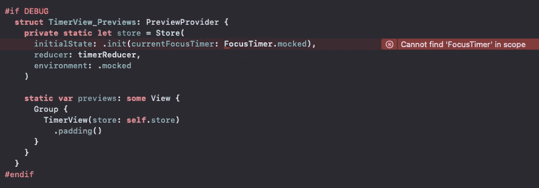
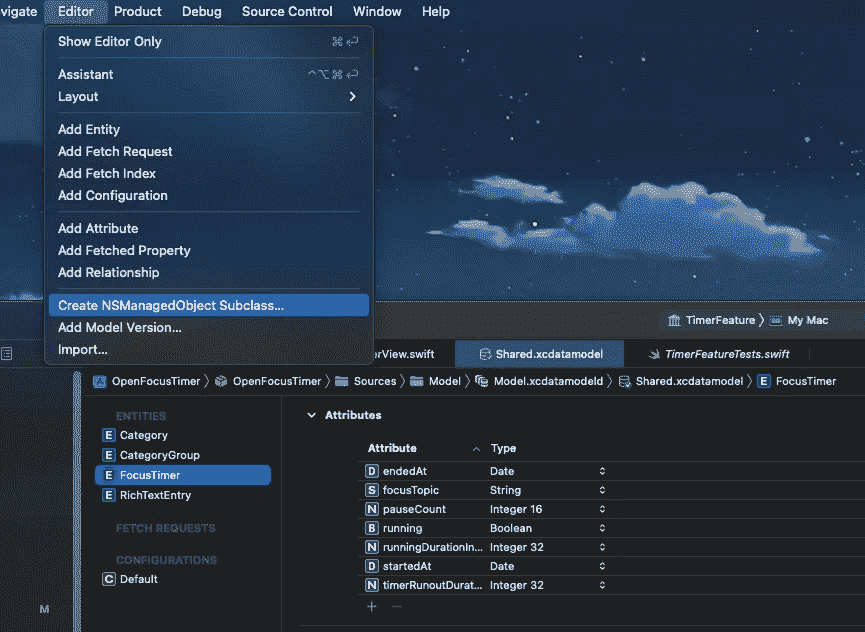
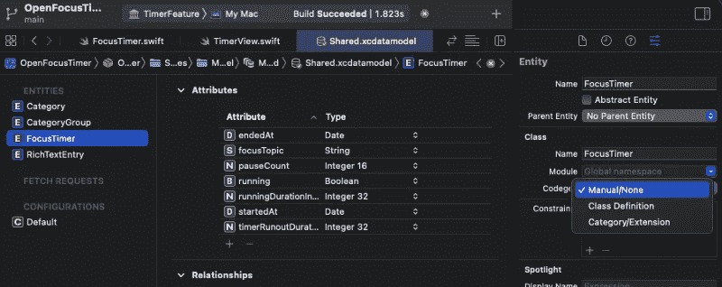
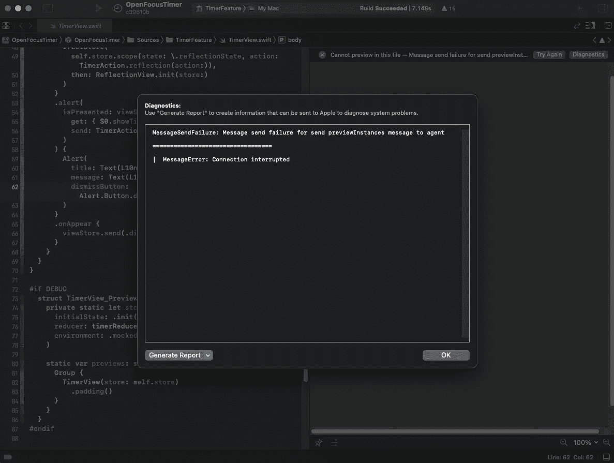
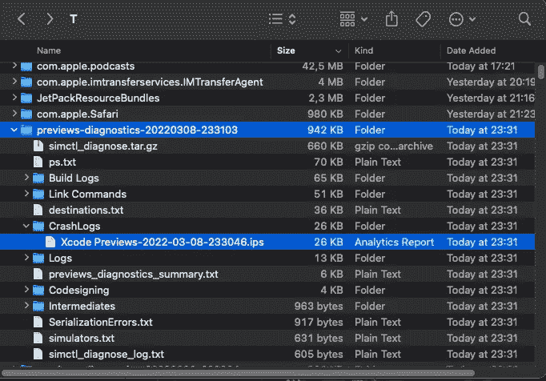
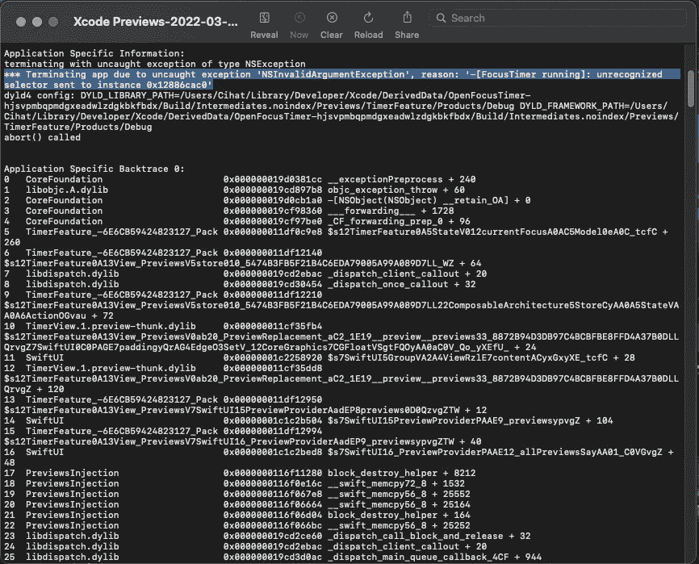
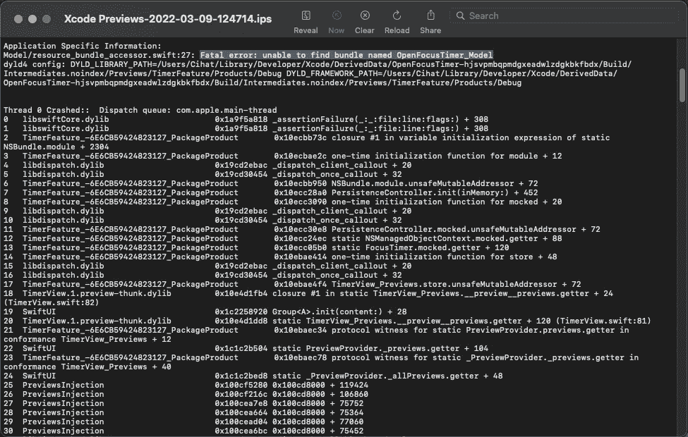

# swift pm+CoreData:swift ui 预览失败？这里有 5 个技巧可以修正

> 原文：<https://betterprogramming.pub/swiftpm-coredata-failing-swiftui-previews-5-tips-to-fix-feef1bfa3f88>

## 修复 Xcode 错误，该错误导致 SwiftUI 预览在使用 SwiftPM 模块化的应用程序和使用 CoreData 的应用程序中失败


在 [Unsplash](https://unsplash.com?utm_source=medium&utm_medium=referral) 上由[詹姆斯·温斯科特](https://unsplash.com/@tumbao1949?utm_source=medium&utm_medium=referral)拍摄的照片

自从我在 Xcode 中使用 Point-Free 的[模块化方法](https://www.pointfree.co/episodes/ep171-modularization-part-1)为[打开焦点定时器](https://github.com/FlineDevPublic/OpenFocusTimer)设置项目以来，我的 SwiftUI 预览就无法正常工作——启用 CoreData 复选框以获得我的模型层的良好起点。这很烦人，毕竟获得更快的构建和更可靠的 SwiftUI 预览是我首先选择将我的应用模块化成小块的主要原因之一。

所以在[我的一个流](https://youtu.be/OMhzx3zdrJw?t=6415)(这是我在 Twitch[上直播时完全公开开发的开源应用](https://www.twitch.tv/Jeehut))中，我决定解决这个问题，一劳永逸地修复 SwiftUI 预览错误。我失败了:

感谢 Twitter 上伟大的 Swift 社区的帮助，我找到了问题的根源:

**SwiftUI 预览在引用 CoreData 模型时遇到麻烦**。

但是，虽然我认为这只是一个路径问题，可以通过一个简单的解决方法来解决，但事情并没有那么简单。是的，这涉及到路径问题，但是在解决预览时，我遇到了多种级别的失败。在这个过程中，我学会了如何调试 SwiftUI 预览。让我分享一下我的经验…

# #1:包清单中的显式依赖关系

重要的事情先来。使用 Point-Free 的模块化方法意味着您将有一个`Package.swift`文件需要手动管理。对于每个模块，您将添加一个`target`、一个`testTarget`和一个`library`条目，并且对于每个目标，您将需要指定依赖项。Xcode 除了识别您在该文件中所做的更改之外，在这里没有任何帮助。对于许多包，清单文件可能会显著增长，目前我还不知道有什么帮助可以让这变得更容易。这是我现在的清单:

手动管理这个文件的问题不仅仅是手工工作。Xcode 似乎在依赖关系方面表现得不一致:例如，当你以模拟器为目标进行正常构建时，依赖关系的依赖关系似乎会自动链接到你的目标。因此，例如，如果我的`TimerFeature`正在导入`Utility`，但它没有被列为`TimerFeature`目标下的一个依赖项，如果另一个依赖项，例如`Model`也依赖于`Utility`，Xcode 可能仍然能够正确编译，因此 Xcode 可以间接访问`TimerFeature`内的`Utility`，因为`TimerFeature`将`Model`列为其依赖项。

虽然这听起来非常有用，但它可能会变得非常令人沮丧，因为 SwiftUI 预览的工作方式不同。据我所知，对他们来说，这种可传递的隐式导入不起作用。运行测试似乎也是如此(至少有时是这样)。换句话说:始终仔细检查每个目标的`dependencies`，并且不要忘记将您在目标中创建的每个`import`添加到您的`Package.swift`清单文件中的相关目标，这一点很重要。

也许，将来会有人编写一个工具来帮助简化这个过程。🤞

# # 2:Xcode 无法可靠地拾取生成的代码

我遇到的另一个问题是，即使我的构建成功了，Xcode 也会(在向我显示“构建成功”对话框后)在编辑器中显示一个错误，在`PreviewProvider`中指出它找不到`FocusTimer`:



错误说明尽管“导入模型”并成功构建，但在范围内找不到“FocusTimer”。

虽然不一定是一个拦截器，但这让我觉得 SwiftUI 预览也可能由于生成的代码而失败。为了解决这个问题，我选择让 Xcode 一次性生成代码文件，并将它们显式添加到我的包中。这可以通过打开`.xcdatamodel`文件，然后点击`Editor`并选择`Create NSManagedObject Subclass...`来完成:



请注意，每次对模型进行更改时，您都需要删除并重新创建这些生成的文件(无论如何，您应该很少这样做，以防止数据库迁移问题)。此外，在 Xcode 中选择型号并将`Codegen`设置为`Manual/None`。



完成后，编辑器不再显示错误。

# #3: SwiftUI 诊断！= SwiftUI 崩溃报告

对于那些(像我一样)想知道当 SwiftUI 预览失败时按下`Diagnostics`按钮后如何利用这样的错误的人来说，这里有一个学习:



点击“诊断”，只显示“信息错误:连接中断”。

这条错误消息对我们有什么帮助，它不是很有用:

> 向代理发送 previewInstances 消息的消息发送失败
> ====
> 消息错误:连接中断

要了解更多详细信息，请阅读模式标题下方的灰色小文本:

> 使用“生成报告”来创建可发送给 Apple 以诊断系统问题的信息。

这个暗示很有误导性。听起来这一步只对帮助苹果分析问题有用。但是我们也可以用！只需点击“生成报告”按钮，并在下拉列表中选择“在 Finder 中显示”。然后 Xcode 会生成一份报告，并打开 Finder 应用程序，生成的文件夹会高亮显示，如下所示:



查看突出显示的文件夹的内容将显示许多文件，这些文件包含有关 SwiftUI 预览版本的不同种类的详细信息。对调试最有用的文件位于文件夹`CrashLogs`中，在那里你可以找到一个或多个`.ips`文件，我们可以通过双击在 Xcode 中轻松打开它们:



Xcode 预览的内容。带有正确错误控制台输出的 ips 文件。

这个文件的内容看起来更像构建失败时我们在 Xcode 控制台中得到的错误输出，包括构建失败的原因，甚至是失败时发生的一堆调用。它指出:

> 由于未捕获的异常“NSInvalidArgumentException”而终止应用程序，原因:“- **[FocusTimer 正在运行]:无法识别的选择器**被发送到实例 0x12886cac0”

现在我们有了一个可以开始调试的地方，我们知道由于某种原因 SwiftUI 预览无法访问我们的`FocusTimer`模型的`running`属性。这是连接 CoreData 的关键，否则我不得不胡乱猜测为什么预览会失败。

我认为 Xcode 应该立即在诊断屏幕中显示这个堆栈跟踪，这会帮助我节省一些时间。可能在 Xcode 14？🤞

# #4:模拟中的内存中 ManagedObjectContext

在尝试了一些不同的东西之后，我找到了`unrecognized selector`问题的根本原因:这与我如何创建我的模仿的`FocusTimer`对象以便在`PreviewProvider`中使用有关:

> **顺便说一下:**是的，我将所有与 SwiftUI 预览相关的代码(包括`*PreviewProvider*`)放在`*#if DEBUG*`指令中。这确保了我永远不会在我的生产代码中意外调用我只为 SwiftUI 预览编写的代码。

我不假思索地在我的`FocusTimer`上调用了`.init`方法，它是`NSManagedObject`的子类，因为我认为这是初始化空`FocusTimer`的最简单方法。但是在`NSManagedObject`上没有`init`方法，相反`NSManagedObject`本身是`NSObject`的子类，并且 [init()](https://developer.apple.com/documentation/objectivec/nsobject/1418641-init) 被定义在那个级别上。这并没有创建一个合适的 CoreData 模型，相反我们需要调用`NSManagedObject`的 [init(context:)](https://developer.apple.com/documentation/coredata/nsmanagedobject/1640602-init) 方法。

幸运的是，当创建一个新的 Xcode 项目并启用`CoreData`复选框时，Xcode 会创建一个`PersistenceController`文件，该文件带有一个接受`inMemory: Bool`参数的 init 方法:

这很重要，因为我们不想在我们的预览中创建实际的数据库(这可能会导致另一个错误，使我们的预览失败)，相反，我们只想使用一个内存中的数据库，它永远不会真正持久化(尽管名称为`PersistenceController`)。

请注意，我必须用以下 3 行代码替换创建`container`的第一行代码，以便在将 CoreData 模型代码提取到单独的 SwiftPM 模块时，从正确的路径加载 CoreData 模型:

接下来，我将这个`mocked`属性添加到`PersistenceController`中:

现在，我通过调用正确的 init 方法来调整`FocusTimer`模拟:

这修复了 SwiftUI 预览中的`unrecognized selector`错误！🎉

但这还没有结束，还有一个非常奇怪的 Xcode 错误需要修复…

# #5: Bundle.module 在预览中不工作

最后，在应用了前面的所有步骤后，我遇到了这样一个错误:

> 致命错误:找不到名为 OpenFocusTimer_Model 的包



谢天谢地，这里前面提到的 Twitter 上 Swift 社区的一位好心开发者的[指针](https://twitter.com/NiklasBuelow/status/1499160862220857349?s=20)帮了我，它在 StackOverflow 上给我指出了一个有[这个答案](https://stackoverflow.com/a/65789298/3451975)的帖子。

基本上就是说目前 Xcode(或者 SwiftPM)有一个 bug？)使得`Bundle.module`在 SwiftUI 预览中指向错误的路径。为了解决这个问题，他们建议添加一个带有自定义搜索的`Bundle`扩展。下面是为适应我的编码&注释风格而稍微调整的完整代码:

> 当复制和粘贴这段代码时，确保将`packageName`和`targetName`变量相应地调整到您的包&目标名称。

请注意，我将变通方法包装到了一个`#if DEBUG`中，以确保我的生产代码不会意外地使用这个路径搜索，而是依赖于官方的`Bundle.module`。此外，我从 StackOverflow 上找到的工作区代码中删除了`fatalError`,因此万一它在自定义搜索路径中找不到包，它不会失败，而是将`return Bundle.module`作为后备。这应该使代码更有弹性，即使在未来的 Xcode 版本中修复了这个错误，也能继续工作，但自定义搜索路径可能不再工作。

现在，我必须在`PersistenceController`中做的最后一个更改是用对新`Bundle.swiftUIPreviewsCompatibleModule`的调用替换对`Bundle.module`的调用:

最后，我的 SwiftUI 预览又开始工作了！

```
**Want to Connect?**You can also find me on 👾 [Twitch](https://www.twitch.tv/Jeehut), on 🎬 [YouTube](https://www.youtube.com/channel/UCtg6Ck7oYa_9k1oSTmFGNRw) and on 🐦 [Twitter](https://twitter.com/Jeehut).
```