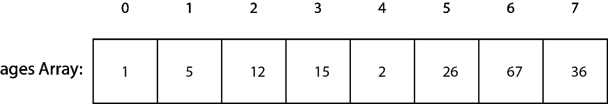
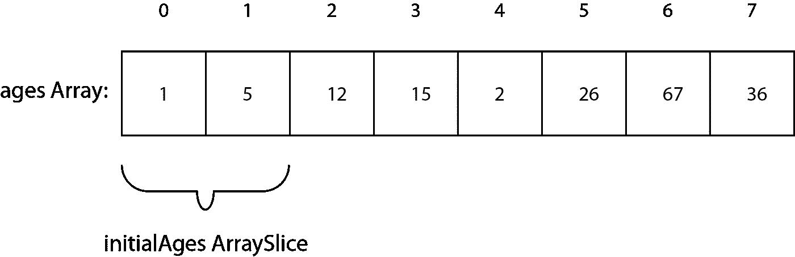
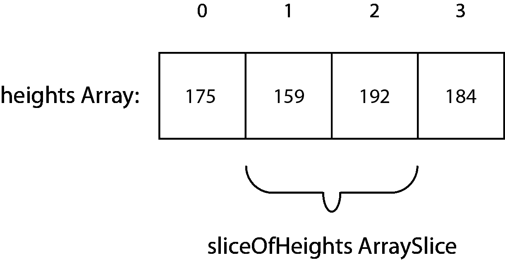
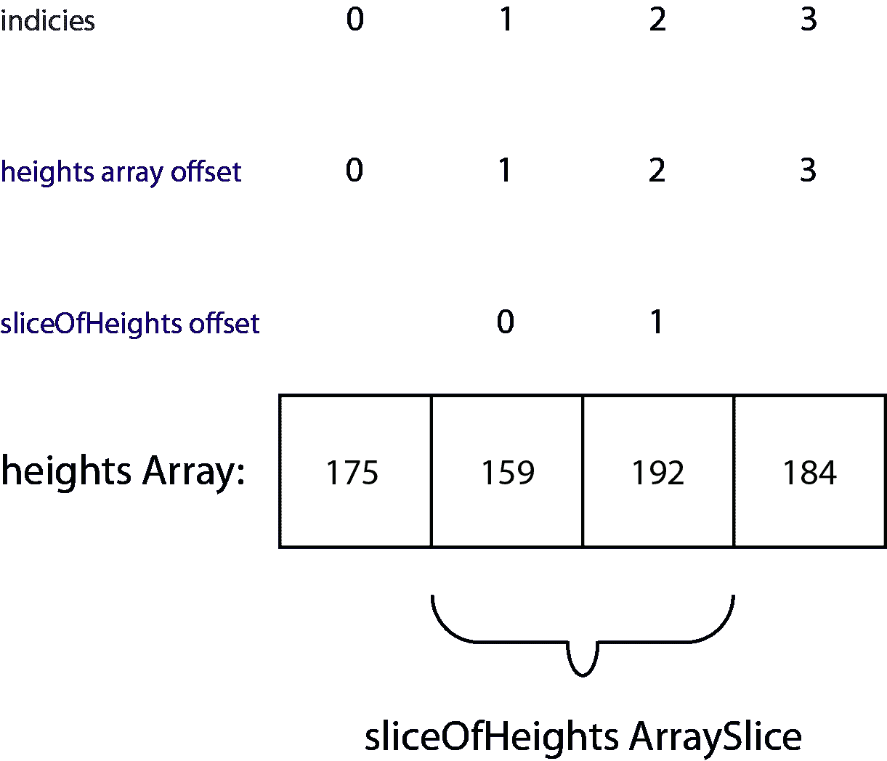
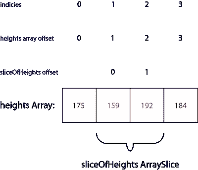

# Swift 数组切片:它们是什么，如何使用？

> 原文：<https://betterprogramming.pub/swifts-arrayslices-920d2e1a6332>

## Swift 不完全数组数据类型指南


Pierre Bamin 在 [Unsplash](https://unsplash.com/s/photos/array?utm_source=unsplash&utm_medium=referral&utm_content=creditCopyText) 上拍摄的照片

一个`ArraySlice`是一个现有数组的视图。但是为什么呢，这对你的代码意味着什么呢？

难度:初级|简单| **普通** |挑战

(本文后面会对内存位置进行一些讨论，但是除此之外，还有一些相当不错的图表可以帮助您。)

# 先决条件

*   数组的一些知识。
*   在后面的小节中，您需要了解数组范围。
*   一些关于[订阅](https://medium.com/@stevenpcurtis.sc/your-own-subscript-in-swift-5ac0a87410af)的知识，以及[苹果指南](https://docs.swift.org/swift-book/LanguageGuide/Subscripts.html)会很有用。
*   本文后面会用到一些字符串插值。
*   对 Swift 中引用的一些理解。

# 术语

*   数组:一系列有序的相同类型的对象。
*   `ArraySlice`:一个`Array`、`ContiguousArray`或`ArraySlice`实例的一部分，它使得在更大的数组上执行操作变得更快更有效。
*   集合:可以被遍历(次数不限)并可以通过索引下标访问的元素序列。
*   枚举:集合中项目的完整有序列表。
*   Index:元素在数组中的位置
*   Indices:赋予数组的数字位置。
*   整数:没有小数部分的数字，即小数点后没有数字。
*   Offset:在数组或其他数据结构中，offset 是一个整数，表示数据结构的起点和所讨论的对象之间的距离。
*   下标:访问数组(或任何集合或列表，取决于语言)中成员的快捷方式。

# 切片是什么？

想象一个数组应该很简单。也许我们正在调查学校里学生的年龄。

简单。

```
letages = [1,5,12,15,2,26,67,36]
```

用一个相当简洁的图表来展示(在盒子的顶部标出`array`中的位置):



现在，当然，斯威夫特的类型推断已经帮助我们解决了这个问题。也就是说，我们已经创建了一个`Integer`的`Array`，所以实际的`Array`如下所示:

```
letages: [Integer] = [1,5,12,15,2,26,67,36]
```

现在我们可以通过使用`Array`的`subscript(_:)`函数获取一个范围来获取第一个元素。

厉害！

# 使用数组的下标(_:)函数

我们可以使用订阅来访问一个`collection`的成员元素。考虑到以上定义的我们的年龄`array`

```
letinitialAges = ages[0...1]
```

每个人都喜欢这种技术——现在我们应该小心我们在这种情况下实际做了什么。这里的*不是*新的`initialAges`T5 的新存储，而是对现有`array`的一种看法。

等等。什么？

另一张图将帮助我们了解机器上`ages`和`intialAges`之间的关系。



我们可以围绕`arrays`和`arrayslices`更深入地了解一些细节，并实际使用 Swift 来帮助我们。

证据就在内存分配中。

我们期待`initialAges`(也就是上面定义的`ArraySlice`)。

为此，我们期望`*initialAges*`使用与初始`array`相同的*内存位置* 。也就是说，`agesArray` 和`initialAges`都在你的主机内存的同一个位置吗？

我们可以查一下。

```
ages.withUnsafeBytes {
    print ($0)
}initialAges.withUnsafeBytes{
    print ($0)
}
```

这会将以下内容打印到控制台(请记住，由于各种原因，实际内存位置在您的机器上会有所不同):

```
UnsafeRawBufferPointer(start: 0x00006000025c0620, count: 64)UnsafeRawBufferPointer(start: 0x00006000025c0620, count: 16)
```

`ages`和`initialAges`起始位置相同，但长度不同！

正如我们所料，`initialAges`只是`array`上的一个视图。

也就是说，`ArraySlice`没有*而不是* 创建副本(也没有采用任何优化，比如写时复制来实现这一点)，而是一个到现有数组的视图。

# 数组切片的索引

上面定义的`ArraySlice`(以及同样的`Array`)具有用于各个位置定位的`indices`。

对于这个例子，我为数组使用了一个新的例子，一个`heights`在那个`array`的中间两个元素上有一个`ArraySlice`视图。



与任何数组一样，您可以遍历它，而如上所示的`heights`则不能。

```
for i in 0...3 {
    print (height[i])
}
```

这将打印 175、159、192 和 184。

当我们试图从`sliceOfHeights` `ArraySlice`中打印同样的内容时，我们得到了一个出`index`的错误。这并不奇怪，因为视图中只有两个元素。

那么，如果我们试图遍历前两个元素呢？

```
for i in 0...1 {
    print (sliceOfHeights[i])
}
```

这是*还是*产生指数越界错误！

为什么？索引从最初的`array`开始编号。让我们再看一下图表。

数组顶部的索引位置(0…3)适用于*`heights`和`sliceOfHeights`，意味着 0 确实存在于`heights`(并存储 175)中，但不存在于`sliceOfHeights` (因为`sliceOfHeights`直到索引 1 才开始)。*

**

*那么，解决办法是什么呢？这里有一个*不足*的解决方案:*

## *相对解决方案*

*以下`enumeration`解决方案是相对解决方案:*

```
*foritem insliceOfHeights.enumerated() {
    print(item.offset)
}*
```

*尽管这确实有效，但它确实提供了一个有点混乱的结果(因为`slideOfHeights`的偏移量是一个相对数字)。*

*因此输出为 0 和 1，因为根据定义项目`offset`是相对的*。**

*在下图中，绝对值用绿色显示，而报复性的用相当吸引人的蓝色标记。*

**

## *绝对解决方案*

*或者，我们可以生成一个输出我们的`array`和`arrayslice`的`indices`的解决方案，我们将使用 Swift 的`startIndex`和`endIndex`如下:*

```
*fori insliceOfHeights.startIndex ..< sliceOfHeights.endIndex {
    print ("index: \(i), value: \(sliceOfHeights[i])")
}*
```

*它打印以下内容:*

```
*index: 1, value: 159
index: 2, value: 192*
```

*因此，打印到控制台的索引代表(绝对)`indices`，因此，该值按预期打印出来(在下图中以红色显示)。*

**

# *内存:说明数组切片和数组之间的关系*

*`ArraySlice`保存对数组的强引用。因此，如果你存储一个`ArraySlice`，`Array`将持续存在(即使`array`的生命周期应该已经结束)。*

*这意味着一件事:小心使用`ArraySlice`，确保那些`Arrays`不会留在你机器的内存中。*

# *结论*

*`ArraySlices`很有用，实际上与适用于任何`collection`的 Slice 非常相似。*

# *扩展你的知识*

*   *苹果有一个[下标指南](https://docs.swift.org/swift-book/LanguageGuide/Subscripts.html)。*