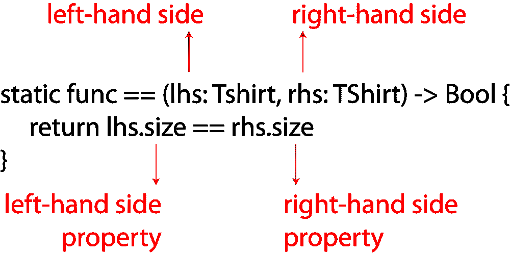
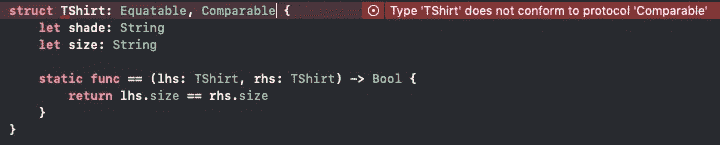

# Swift 的等价和可比协议

> 原文：<https://betterprogramming.pub/swifts-equatable-and-comparable-protocols-54811114a5cf>

## 您的 Swift 类型何时应该等同或可比？


照片由[查尔斯“鸭子”尤纳斯](https://unsplash.com/@unitasphotography?utm_source=unsplash&utm_medium=referral&utm_content=creditCopyText)在 [Unsplash](https://unsplash.com/s/photos/equals?utm_source=unsplash&utm_medium=referral&utm_content=creditCopyText) 拍摄

“等值”是指相等，“可比”是指对象之间的比较。这很重要，因为我们如何确定两个复杂的对象是相同的？在许多情况下，这是你应该决定的事情。

难度:初级|简单| **普通** |挑战

# 先决条件:

*   能够产生一句“你好，世界！”iOS 应用(指南[此处](https://medium.com/@stevenpcurtis.sc/your-first-swift-application-without-a-mac-79598ad839f8))

# 术语

Comparable:一个协议，可以使用关系运算符`<`、`<=`、`>=`和`>`应用于一个类型

Equatable:可以应用于类型以允许值相等的协议

操作数:对其执行运算符的值

# 这个例子

我们创造了一个`struct`来代表一个人。

```
struct Person {
    let name: String
    let age: Int
    let parent: Bool
}
```

然后，我们创建两个人:


```
let dave = Person(name: "Dave", age: 22, parent: false)
let karen = Person(name: "Karen", age: 32, parent: true)
```

然后可以把它放入一个人的数组中，就像大多数物体一样:

```
let people = [dave, karen]
```

问题是我们是否能有效地比较我们的人。

# 比较

我们可以把`dave`，和`karen`比作两个人。

但是这种比较意味着什么呢？


我们可以比较他们的名字:

```
dave.name == karen.name // is false
```

这解析为 false(因为名称不相等，分别是“Dave”和“Karen”的`Strings`)。

同样，我们知道这两个人的年龄是一样的:

```
dave.age == karen.age // is true
```

但这些人中只有一个是父母:

```
dave.parent == karen.parent // is true
```

实际上，我们通过依次调查每个属性来决定类型`Person`是否相同。这很棘手，因为如果我们决定一个人是相同的 ***只有*** 如果所有的属性都是相同的，我们可能会写出如下的`If`语句:

```
if dave.name == karen.name && dave.age == karen.age && dave.parent == karen.parent {
    print ("The same")
}
```

呃。


事情不应该是这样的！

# 平等街


我们可以使用`contains`协议扩展方法，而不是像上面那样使用笨拙的`if`语句:

```
people.contains{ obj -> Bool in 
    return obj.name == dave.name
         && obj.age == dave.age
         && obj.parent == dave.parent
} 
```

对于上面表示的人`array`，返回 true。

但是我们可以做得更好——这只适用于戴夫这个人。我们需要*提取*这个，这样就很容易找到*任何*人。

```
let person = Person(name: "Dave", age: 22, parent: **false**)people.contains{ obj -> Bool in 
    return obj.name == person.name
         && obj.age == person.age
         && obj.parent == person.parent
}
```

这还是不太好。一定有更简单的方法。更简单的方法是使用`Equatable`协议。因此我们必须让我们的**对象**符合这个协议。

# 符合等效协议

让我们建立一个符合`Equatable`协议的新例子。


平等很重要！

这与我们上面的对象没有太大的不同；特别是，我们将有一只新的狗`Struct`。这些狗也将有一个名字，年龄和布尔声明，如果狗是父母。

```
struct Dog {
    let name: String
    let age: Int
    let parent: Bool
}
```

如您所见，这目前不符合`Equatable`协议。为此，我们将协议的名称放在对象名称之后(在本例中为`struct`)。

```
struct Dog: Equatable {
    let name: String
    let age: Int
    let parent: Bool
}
```

我们可以创造一些狗:

```
let millie = Dog(name: "Millie", age: 5, parent: false)
let bear = Dog(name: "Bear", age: 5, parent: true)
```

我们现在可以测试两个狗对象(`operands`)之间的相等性，这使得下面的语句有效！

```
millie == bear
```

如果对象相等，操作数的所有属性都相等，这是没有问题的。但是如果我们有一个操作数不完全是这样的呢？

# 向类型添加==运算符函数

让我们想象一下，我们有一堆 t 恤，并且只对我们的尺寸，中号感兴趣(如果你拿了一件不同尺寸的 t 恤，想象你是中号的，特别是因为你正在中号上阅读这篇文章)。


为了便于阅读，我把所有的属性都做成`String`:

```
struct TShirt: Equatable {
    let shade: String
    let size: Int
}
```

我们可以声明几件衬衫，并将它们放入衣服数组:

```
let redM = TShirt(shadeL "Red", size: "Medium")
let redS = TShirt(shadeL "Red", size: "Small")
let yellowM = TShirt(shadeL "Yellow", size: "Medium")
let yellowS = TShirt(shadeL "Yellow", size: "Small")let clothes = [redM, redS, yellowM, yellowS]
```

现在我声明所有中号衬衫都是一样的。看，我不在乎你衬衫的颜色(冲我来)。

所以我们添加一个**静态函数**来使

```
struct TShirt: Equatable {
    let shade: String
    let size: Int static func == (lhs: T-shirt, rhs: TShirt) -> Bool {
         return lhs.size == rhs.size
    }
}
```

这导致只有相同尺寸的衬衫是相等的。我们可以使用以下内容对此进行测试:

```
redM == redS //false
redM == yellowM //true
redS == yellowS //true
yellowS == yellowM //false
redM == yellowS //false
```

有几件事值得一提。我们在 t 恤衫上声明的静态函数:

```
static func == (lhs: Tshirt, rhs: TShirt) -> Bool {
     return lhs.size == rhs.size
}
```

这里有几件事值得注意。

`lhs`代表左手边，`rhs`代表右手边。所以当我们比较两个 t 恤对象时，我们假设第一个是左手对象，第二个是右手对象。

下图显示了该静态函数的组件:



`contains`现在可以像我们预期的那样工作:如果数组中有一件中号 t 恤，我们询问数组中是否包含另一件中号 t 恤，这将返回 **true** 。

```
var clothesArray: [TShirt] = []
clothesArray.append(redM)
clothesArray.append(redS) //false
clothesArray.append(yellowM) //true
```

# 整理


分类回收！

我们可以按照如下定义对数组进行排序:

```
var clothes = [redM, redS, yellowM, yellowS]
```

按大小，通过以下方式:

```
clothes.sorted(by: {$0.size < $1.size})
```

但是，如果我们希望我们的衣服总是按大小排序，我们可以使用可比协议。

# 通过实现可比较的协议进行排序

如果我们尝试将可比较的协议实现为:

```
struct TShirt: Equatable, Comparable {
    let shade: String
    let size: Int static func == (lhs: T-shirt, rhs: TShirt) -> Bool {
         return lhs.size == rhs.size
    }
}
```

我们将得到一个错误，表明我们当前不符合协议。太好了。这是真的。



您实际上可以让编译器为您添加协议存根，但是在任何情况下，我们都可以将我们的对象修改为:

```
struct TShirt: Equatable, Comparable {
    let shade: String
    let size: Int static func == (lhs: TShirt, rhs: TShirt) -> Bool {
         return lhs.size == rhs.size
    }

    static func < (lhs: TShirt, rhs: TShirt) -> Bool {
         return lhs.size < rhs.size
    }
}
```

然后，我们可以使用以下方法对衣服数组进行排序:

```
clothes.sorted()
```

# 附件


如果你想用 Swift `Class`做同样的实验，过程是相似的。如果希望声明多个属性相等，可以使用& &操作符，如果希望对多个属性进行排序，可以使用||操作符。

最好用一个例子来说明这一点:

```
class Animal: Equatable, Comparable {
    let name: String
    let type: String
    let age: Int init(name: String, type: String, age: Int) {
         self.name = name
         self.type = type
         self.age = age
    } static func == (lhs: Animal, rhs: Animal) -> Bool {
          return lhs.name == rhs.name 
             && lhs.type == rhs.type 
             && lhs.age == rhs.age
    } static func < (lhs: Animal, rhs: Animal) -> Bool {
          return lhs.name < rhs.name ||
             lhs.type < rhs.type ||
             lhs.age < rhs.age
    }
```

我知道是动物，但动物很好，对吧？

# 结论

向类型添加 equatable 和 comparable 相当容易。它确实提供了使代码更容易阅读的机会，上面的例子和解释给了你(我希望)这背后的一些概念，让你知道这是如何工作的，以及如何在你自己的代码中实现它。

一如既往，快乐编码！