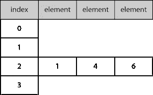
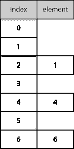

# Swift 中有什么可散列的？

> 原文：<https://betterprogramming.pub/swifts-hashable-fd57e6cd6426>

## 集合或字典中的条目需要是可散列的


[Ales Nesetril](https://unsplash.com/@alesnesetril?utm_source=medium&utm_medium=referral) 在 [Unsplash](https://unsplash.com?utm_source=medium&utm_medium=referral) 上拍摄的照片。

集合或字典中的项目需要符合可散列协议。这篇文章探讨的正是这一点！

# 先决条件

*   能够产生一句“你好，世界！”iOS 应用([指南](https://medium.com/swlh/your-first-ios-application-using-xcode-9983cf6efb71))。
*   假设您对协议有所了解([指南](https://medium.com/@stevenpcurtis.sc/protocols-in-swift-f46c31283b18))。
*   了解与 Swift 同等和可比协议的一致性([指南](https://medium.com/@stevenpcurtis.sc/swifts-equatable-and-comparable-protocols-54811114a5cf))。
*   了解扩展的使用([指南](https://medium.com/@stevenpcurtis.sc/extensions-in-swift-68cfb635688e))。

# 术语

*   哈希:也称为哈希或校验和，是哈希算法的结果。
*   可散列:如果一个对象的散列值在对象的生命周期内是相同的，那么这个对象就是可散列的。
*   哈希表:将键映射到值的数据结构。
*   哈希算法:用于生成哈希的算法。
*   集合:值的无序集合(其中所有的值都是同一类型)。
*   类型:可以处理的数据类型的表示(例如，整数或字符串)。

# 动机

如果您希望将元素存储在一个集合或字典中，那么您需要遵循 Hashable 协议。尽管 Swift 可以综合一致性，但了解其工作原理以及我们如何手动符合协议是非常有利的。

这篇文章就是来帮你解决的！

# 常见哈希算法

MD5、SHA-1 和 SHA-2 很常见`hashing algorithms`。它们以单向函数的形式将数据映射到一个`hash`，这个函数应该是不可行的。

一个扩展是使用一个`hashing algorithm`来索引一个`hash table`中的数据。

## 哈希表

一个整数索引可以被计算为一个`hash table`中的一个位置，正如我们将看到的，有一个理论围绕着散列表以及它们如何在 Swift 中实现。

哈希表是一个数组。当一个数组被输入到哈希表中时，该键用于通过哈希函数计算该元素的数组索引。

散列函数的选择极其重要。

所有元素都存储在同一索引中的哈希表的功能类似于链表。访问一个特定的元素需要花费 *O(n)* 。



哈希表的糟糕实现。

一个明显更好的实现是每个元素(尽可能接近)都有自己的索引。这需要一个好的散列函数来处理多个索引的情况(实际的崩溃)。



Swift 有自己的内置`hashValue`。应该注意的是，这些值不能保证在程序的执行过程中是相等的。

# 创建你自己的哈希类型

要求保存在字典中或设置在 Swift 中的类型符合`Hashable`类型。

如果我们为人员类型创建一个结构:

```
struct Person {
    var name: String
    var age: Int
}
```

我们还不能将它添加到集合或字典中。以下内容:

```
var personSet = Set<Person>()
personSet.insert(me)
```

生成不受欢迎的错误:“类型‘Person’不符合协议‘has hable’。”"

这是相当令人失望的。然而，它清楚地表明我们需要这个特殊的结构来符合`Hashable`协议。

## 符合可散列协议

为此，我们可以使该结构符合`Hashable`协议:

```
struct Person: Hashable {
    var name: String
    var age: Int
}
```

通过这样做，可以将`Person`添加到集合或字典中。

精彩！


从 Swift 4.1 开始就是如此。`Hashable`自动合成`hashValue`。每次启动应用程序时，Hasher 都会生成随机的种子值，从而提供一些安全保护，因为每次执行 Swift 程序时，生成的哈希值会有所不同。

所有这些？太棒了。

但是如果我们想自己实现呢？很明显，就大多数情况下的性能而言，这种合成已经足够好了，但是如果有许多冲突，您可能希望创建自己的方法来符合协议。

## 手动符合可散列协议

你可能想要手动符合`Hashable`。例如，如果您只是想要一个*属性来符合协议。*

我们可以将它放入包含`combine(_:)`函数的扩展中:

现在上面的`hasher.combine(_:)` 部分采用了`Hasher`结构，并在每次被调用时增加一个值(上面有两次调用)。现在`Hasher`结构创建了一个`Integer`哈希值。因为您不拥有这个`Hasher`，所以您不会使用`finalize()`生成最终值，如果您想要创建自己的散列生成器，您会这样做。

## 创建自己的哈希函数

因为一个`Hasher`生成一个`Integer`哈希值:

```
var hasher = Hasher()
hasher.combine(james)
hasher.combine(ahmed)
let hash = hasher.finalize()
```

`hash`(如果打印)返回值 *-479264489210986059* 。

# 覆盖 NSObject 子类上的哈希

在 Swift 中子类化 NSObject 为您带来了 Objective-C 运行时的灵活性以及 Objective-C 的性能，这是因为 NSObject 是大多数 Objective-C 对象的根类。

这意味着在一些特定的情况下，你可能必须继承 NSObject 的子类，比如 KVO,`[addObserver(_:forKeyPath:options:context:)](https://developer.apple.com/documentation/objectivec/nsobject/1412787-addobserver)`要求观察者是 NSObject 的子类——这是不可避免的！

现在 NSObject 已经符合 Hashable 协议，但是如果我们希望覆盖 hash 怎么办？

如果一个值相等，我们需要重写，并使它完全依赖于我们给定的哈希值。

现在，像这样将值传递给构造函数是…一个有趣的选择。你需要用不同的方式来计算散列值。

尽管如此，这意味着你可以设置两个名字和年龄相同的人(这是可能的——而且他们不是同一个人！)

```
let testPerson = Person(name: "James", age: 32, hashVal: 5)
let testPerson2 = Person(name: "James", age: 32, hashVal: 4)
(testPerson == testPerson2) // false
```

但是我们可以确定，两个散列相同的人是同一个人，他们应该是同一个人

```
let testPerson = Person(name: "James", age: 32, hashVal: 5)
let testPerson2 = Person(name: "James", age: 32, hashVal: 5)
(testPerson == testPerson2) // true
```

精彩！拿着那个东西！

# 结论

当我们在集合或字典中存储元素时，我们需要符合`Hashable`协议。合成一致性通常适用于大多数情况，但也可以手动符合协议，并选择哪些值将在哈希函数中组合。

您甚至可以选择符合 NSObject 的类如何生成散列，这意味着您可以控制一切！

我希望这篇文章能让您了解这是如何工作的，以及您如何在自己的项目中遵循该协议。

# 扩展你的知识

*   维基百科有一篇关于[哈希函数](https://en.wikipedia.org/wiki/Cryptographic_hash_function)的文章，还有一篇关于[哈希表](https://en.wikipedia.org/wiki/Hash_table)的文章。
*   苹果有关于[哈希结构](https://developer.apple.com/documentation/swift/hasher)的文档。