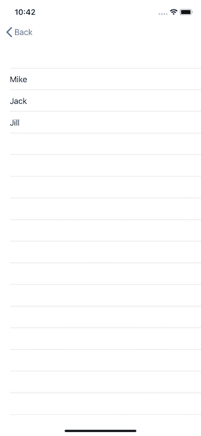

# SwiftUI 和如何不初始化可绑定对象

> 原文：<https://betterprogramming.pub/swiftui-101-how-not-to-initialize-bindable-objects-6e539d1b5344>


## 或者只是在 init()不是你的朋友的时候

如果你和我一样，在苹果全球开发者大会之后的几天里，通常会有很多很多*很多*样本和演示程序被创建，这些程序是为了理解和测试苹果几天前发布的大量概念、代码和库而编写的。

事实上，我有时觉得自己有点像一条试图吞下大象的蟒蛇。

不管怎样，除了深呼吸和潜水，你还能做什么？

# 意想不到的

所以你写代码，写更多的代码，偶尔停下来，用头撞最近的平面。你删除一切，重新开始，写更多的代码。

然后你撞上了一个意想不到的行为。你停下来想，“是我吗…还是我刚刚发现了一个 bug？”

毕竟，我们正在测试 beta 代码，经常会发现大量的 bug。没有人可以幸免，即使是苹果。

然而，在这种情况下，我意识到我发现的不是一个 bug——但它很容易变成一个 bug。(后来我确定*是*的一个错误，而且比我最初认为的更糟糕，因为真正的问题在于苹果对`NavigationButton`的实现。)

不管怎样，这仍然是一个很好的例子，说明了如何正确地使用 [SwiftUI](https://developer.apple.com/xcode/swiftui/) 的 BindableObject 作为视图模型，所以让我们开始吧。

**注意:从 Xcode Beta 5 开始，BindableObject 被 ObservableObject、ObservedObject 和 Published 所取代。**

虽然“对象的数据已更改”机制已经更新，但下面描述的过早初始化问题仍然存在。

# 可绑定对象

让我们从`BindableObject`开始，根据苹果的文档，它是“作为视图模型的对象”。(从字面上看，这就是目前所有的文档。)

长话短说，苹果已经认识到了巨大的视图控制器问题，并且正在鼓励(我所说的鼓励很大程度上是指*要求*)开发者使用模型和视图模型。

这里有一个实现，可以归结为这个讨论。

我们的`InitListViewModel`是一只`BindableObject`。可绑定对象*需要*有一个`didChange`变量，这是一个组合的*主题*。这通常是一个`PassthroughSubject`，稍后我们会解释为什么会这样。

归结起来，`didChange` publisher 只是为模型指定一种方式来通知视图它的数据已经改变。当状态发生变化时，视图会自动重新生成并重新显示任何受更新数据影响的视图。

在本例中，`InitListViewModel`数据是一个简单的字符串数组。

当 ViewModel 初始化时，它调用我们的`load`方法来获取我们的数据。通常这是一个 API 调用，但是为了这个演示的目的，我们将使用一个`DispatchQueue.main.asyncAfter`块来模拟一个网络 API 调用。

注意，在程序块的末尾，我们做了一个`self.didChange.send(self)` *，*，这是我们的神奇通知触发发生的时候，我们的视图被告知要更新。

# 景色

我们的观点非常简单。

我们的`InitListView`包含一个单独的`*@ObjectBinding*` 变量，该变量包含我们的`BindableObject` ViewModel。该对象在初始化时被传递给视图。

我们的视图主体返回一个非常简单的`List`对象，它观察我们的`viewModel`上的`list`变量。我们的列表是使用初始的空数组构建的，然后，两秒钟后，当我们的`didChange`通知被发送时，列表被自动重建。

以根用户`InitListView`运行这段代码，您会看到一个空列表，几秒钟后会看到一个简短的名字列表。

# 现在是虫子

为了更好地查看我们的 bug，我们需要能够来回切换到我们的`InitListView`，所以让我们创建一个新的屏幕来启动我们的旧屏幕:

我们有一个启动我们的`InitListView`的`NavigationButton`，包含在一个`NavigationView`中。请注意，ViewModel 是作为参数创建并传递给视图的。

现在将我们项目的根视图切换到`InitMenuView`并重新运行它。快速点击`List Sample`按钮，您应该会看到之前看到的内容。


首次运行更新后的屏幕。

一个空列表，然后显示我们的老朋友迈克、杰克和吉尔的更新。

现在，点击后退按钮，然后再次点击`List Sample`按钮。



屏幕后再次点击列表样本按钮。

我们的数据显示**马上**。

刚刚发生了什么？

# WTF？(搞什么鬼)

当我第一次看到这个的时候，我的第一反应是我的`InitListViewModel`由于某种原因没有被发布，我有一个 bug。

我花了一些时间试图弄清楚如何发布视图模型。没有欢乐。

我花了更多的时间试图找出如何重新创建和/或重新分配我的视图模型到我的视图的对象绑定参数。没有欢乐。

然后我注意到了别的东西。重新运行应用程序…然后在第一次点击按钮之前等待几秒钟。这样做，你不会看到一个空屏幕，而是一个充满数据的屏幕。

就在那时，天开始亮了。

# 疯狂背后的方法

如果你停下来想想，这是怎么回事就很清楚了。SwiftUI 中几乎每个视图都是一个结构。结构*在创建时必须*初始化。

当我们初始化`InitListView` 时，我们的`InitListViewModel`也被创建并作为参数传递给视图。

**即其** `**init**` **方法在那个时间点被称为**。

这又调用了我们的`load`方法。我们的“API”调用在那时进行，并在两秒钟后返回。

但是这什么时候发生呢？

在我们`InitMenuView`*`NavigationButton`*的时候我们指定了我们的`destination`。**

```
**NavigationButton(destination: InitListView(model: InitListViewModel()) )**
```

**`InitListViewModel`在那个时间点被初始化。**

# **结果**

**这有相当大的影响。制作一个有十几个导航按钮的主屏幕，有十几个目的地，**，每一个都将在启动时初始化。****

**创建一个包含 100 个列表项的可公开列表视图，滚动它，**每个目的地都会被初始化。****

**幸运的是，有一个解决方案，虽然在这个时候它只是一个局部的。**

# **生命周期管理**

**SwiftUI 提供了一组在视图生命周期中调用的视图修改器，其中之一就是`onAppear`。**

**让我们重构我们的代码。我们将保持 ViewModel 中的所有内容不变，但是删除了`init`函数。**

**我们将添加一个`onAppear`修饰符到我们的主列表中，用一个闭包直接调用我们的视图模型的`load`函数。**

**这类似于我们在 UIKit 中管理事件的方式，我们经常从`viewDidLoad`调用或配置我们的视图模型。**

**运行新代码，等待几秒钟，然后点击`List Sample`。您将看到我们预期的空白屏幕，然后是我们的数据屏幕。成功！**

**对吗？**

# **另一个问题**

**嗯，我们解决了第一个问题，但现在我们有了另一个问题。**

**点击后退按钮，然后再次点击`List Sample`，你会看到我们加载的数据…现在我们有了一个更隐蔽的问题。**

**我承认，这个问题还没有找到解决方案，因为我还没有找到“重置”视图模型的好方法。`NavigationButton`目的地只是坐在那里，有一个初始化的视图，它显然计划永远保留。**

**是的，您可以编写一些代码来清空数组，但是这样做没有任何作用，因为它只是假设视图状态没有改变。试图清空数组并在视图出现之前调用`self.didChange.send(self)` *会导致应用程序崩溃。(又一个 bug？)***

**太悲伤了。**

# **完成处理程序**

**我本可以把第一个“bug”记为根本不是 bug。这就是 Swift 的工作方式。**

**然而，第二个问题让我相信这毕竟是一个 bug。**

## **怎么修？**

**一个简单的解决方案(对苹果来说)是改变导航按钮之类的东西的性质。每个问题都源于视图结构过早初始化的事实。**

**因此，如果我正在编写这个 API，我将引入一个`NavigationButton`的变体，它将工厂闭包作为它的目的地参数，并且该闭包将在每次被调用时返回一个新的视图和一个新的视图模型。**

**问题解决了。每次你按下按钮，你会得到一个新的，工厂新鲜的视图实例。更重要的是，你不会过早地初始化几十、几百或几千个愚蠢的东西。(你能想象这在一个列表里吗？)**

**现在，*可能*有几次你实际上*想要*保持给定屏幕的状态，为此你可以保留现有的方法签名。毕竟，这就是选项卡视图能够维护每个单独选项卡视图的状态的方式。**

**顺便说一下，初始化问题是为什么我们通常想在代码中使用`PassthroughSubject`。在我们准备好之前，我们不想要任何视图更新。**

**无论如何，**这里的底线是，您需要*非常*清楚您将什么代码放入了 SwiftUI 视图** **和视图模型**的初始化函数中，因为这些代码可以而且将会被调用，而且经常是在您最不期望的时候。**

# **实验数字电视系统**

*   **评论中指出，作为一条规则，视图构造函数不应该有副作用。这并没有修复我们的`NavigationButton`错误，但是指出了一个事实，我们的`onAppear`解决方案看起来是正确的。**
*   **早期版本在视图内部使用了一个`@State` 变量，而不是一个`@ObjectBinding`变量，但这只是将初始化从视图内部推到视图外部，结果基本相同。**
*   **Xcode 11 Beta 2 刚刚退出，也出现了同样的问题。**
*   **从 Xcode 11 Beta 3 开始， *NavigationButton* 已被弃用，并被替换为 *NavigationLink* 。 *NavigationLink* 看起来与 *NavigationButton* 工作方式相同，具有相同的基本行为(包括视图初始化问题)。**

**下次见。**