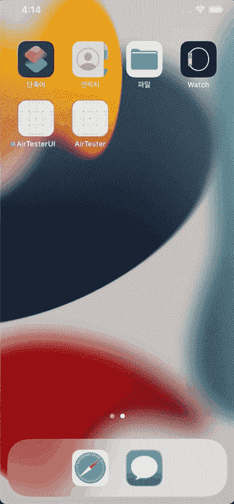

# 在 SwiftUI 中观察应用生命周期的 3 种方法

> 原文：<https://betterprogramming.pub/swiftui-3-ways-to-observe-apps-life-cycle-in-swiftui-e9be79e75fef>

马克西姆·霍普曼在 [Unsplash](https://unsplash.com?utm_source=medium&utm_medium=referral) 上的照片

在 UIKit 中有些事情并不困难，但是在 SwiftUI 中。跟踪应用的生命周期就是其中之一。我们不得不编写额外的代码来跟踪状态，如`AppDelegate`(或`SceneDelegate`)中提供的[应用程序将进入前台](https://developer.apple.com/documentation/uikit/uiapplicationdelegate/1623076-applicationwillenterforeground)或[应用程序将进入后台](https://developer.apple.com/documentation/uikit/uiapplicationdelegate/1622997-applicationdidenterbackground)。

事实上，除了将应用程序转回过去的版本，还有一些可能的解决方案可以让 SwiftUI 变得更加简单。我想在这篇文章中介绍一下我是如何处理这个问题的，并向你展示一些例子。

# 摘要

1.  把`AppDelegate`和`SceneDelegate`带回来(iOS 13+)
2.  `scenePhase`、`.onChange`和`.onOpenUrl` (iOS 14+)
3.  `NotificationCenter` (iOS 4+)和`Combine` (iOS 13+)

# 参考

 [## 管理应用的生命周期

苹果开发者文档—developer.apple.com](https://developer.apple.com/documentation/uikit/app_and_environment/managing_your_app_s_life_cycle) 

# 1.将 AppDelegate 和 SceneDelegate 带回来(iOS 13+)

一种方法是将`AppDelegate`和`SceneDelegate`带回来。对于那些在 SwiftUI 推出之前一直在开发 iOS 应用的人来说，这可能是最熟悉的方式。这里有一个例子:

你可以这样使用`AppDelegate`

也可以跳过`SceneDelegate`。然后，你会回到甚至更老式的方法，只使用`AppDelegate`来管理事件。

我不确定这些代表还能支持多久，但目前来看，这似乎不是什么大事。

# 2.配合使用 scenePhase。onChange (iOS 14+)

在 iOS 13 中从 UIKit 过渡到 SwiftUI 真是让人头疼。与 UIKit 相比，很多特性没有实现，构建视图组件真的很烦人。

无论如何，在 iOS 14 中，苹果对 SwiftUI 进行了几项改进。`scenePhase`和`.onChange`就是那些东西的零件。让我给你看一个例子。

你可以在[官方文件](https://developer.apple.com/documentation/swiftui/scenephase)中查看关于`scenePhase`的更多细节。

如你所见，它非常容易使用。然而，有一个关键的缺点是`scenePhase`只提供三种状态:`active`、`inactive`、`background`。

对于那些想象出完美替代`AppDelegate`的人来说，这将是一个很大的失望。除此之外，可用性(iOS 14 +)是另一个让开发者不愿使用的壁垒。

## + `onOpenURL` (iOS 14+)

自从**通用链接**推出以来，它已经成为打开应用程序的常用方式。您可能知道，`SceneDelegate`或`AppDelegate`一直在处理由 url 事件打开的*。这也意味着，在 SwiftUI 中，我们应该找到其他方法来获得这个事件。*

幸运的是，苹果从 iOS 14 中提供了方法`onOpenURL`，使我们能够在项目中的任何地方获得 opened by url 事件。

想要更多细节，查看[官方文件](https://developer.apple.com/documentation/SwiftUI/View/onOpenURL(perform:))

有兴趣可以看看[通用链接](https://developer.apple.com/ios/universal-links/)和[自定义方案链接](https://developer.apple.com/documentation/xcode/defining-a-custom-url-scheme-for-your-app)。

# 3.通知中心(iOS 4+)

这是用 Swift 观察生命周期事件的另一种传统方式。在类`UIApplication`中，iOS 提供了几个通知([UIApplicationDelegate | Apple Developer Documentation](https://developer.apple.com/documentation/uikit/uiapplicationdelegate))。

特别地，在该文档中，类别**处响应 App 生命周期事件**的通知与生命周期事件相关。你所要做的就是为你的目的选择一个合适的通知。

我将向您展示两个例子，在应用程序进入或确实进入每种状态时得到通知。

## A.notification center+add observer(iOS 4+)

`Using #selector`和`@objc func`接收通知

为了展示它是如何工作的，我给出了 3 秒钟的延迟来改变文本

这很容易理解。在给定的选项中选择合适的`Notification`，并使用`addObserver`将其添加到`NotificationCenter`中。如你所见，它工作得很好。

## B.通知中心+联合收割机(iOS 13+)

正如你在 [her](https://developer.apple.com/documentation/combine/routing-notifications-to-combine-subscribers) e 中看到的，苹果提供了一种从 iOS 13 将`Notifications`路由到`Combine`用户的方式。

看起来使用`addObserver`并没有什么优势，但实际上它拥有非常强大的功能。有了这个，你就可以写一个像下面这样的`Publisher`函数了。

发布者将进入前台事件

通过用`enum`对事件进行分类，并将其作为参数提供给函数，可以使它更有用。

通过包装该方法，您还可以以多种方式利用它。

现在我们有了一个非常有用的生命周期观察器，你可以根据自己的需要添加更多的特性。

你可以根据自己的需要选择其中之一，但我个人更喜欢最后一种使用`Combine`的方法。`Publisher`肯定比其他的更有优势，因为它与 SwiftUI 配合得很好，而且苹果一直在试图扩展对`Combine`的支持。

感谢阅读！