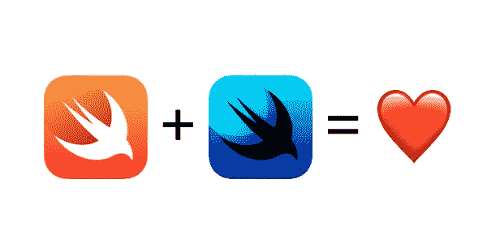

# SwiftUI，它美丽的 API 之旅(第 1 部分)

> 原文：<https://betterprogramming.pub/swiftui-a-tour-into-its-beautiful-api-part-1-b098b38e77>

## 一个新的跨平台声明式 UI 框架

就在几天前，苹果在 WWDC19 上展示了[*swift ui*T5。一个承诺彻底改变我们在每个苹果平台上做 UI 的方式的框架:iOS，watchOS，iPadOS，tvOS 和 macOS。](https://developer.apple.com/documentation/swiftui)

它提供了抽象概念来轻松地描述和漂亮地组合视图、控件、布局和事件处理。一切都进行得非常迅速。

# UIKit 有什么问题？

实际上没有。

[UIKit](https://getuikit.com/) 效果很好，值得一个大大的掌声。由于它的灵活性、正确性和架构，到目前为止，AppStore 中有 210 万个应用程序！

然而，我们每天都在努力让我们的应用变得更好。我们努力改进我们的开发工作流程，这样以前比较难的东西现在可以更容易、更快地开发出来。

需要一个复杂的应用程序(甚至是一个简单的应用程序)来管理不同的状态，不仅是业务逻辑，还有 UI。每当你为你的下一个照片分享应用程序加载和显示壮观的图像，或者为你的下一个平滑注册流程启用/禁用邮件文本字段时，用户界面需要管理许多不同的状态。

管理国家是困难的。

一个小错误可能会导致用户界面不同步、按钮损坏，或者更糟，导致意外行为。

# SwiftUI 如何帮助我们？

SwiftUI 从命令式范式转变为纯粹的**声明式**范式，遵循类似项目的方法，如 [*Flutter*](https://flutter.dev) 、 [React Native](https://facebook.github.io/react-native/) 或 J [etpack Compose](https://developer.android.com/jetpack/compose) 。由于它与操作系统和 Swift 语言的深度集成，它非常容易使用，功能强大，速度快。

声明式用户界面意味着能够“描述”你的用户界面应该是什么样子，而不需要确切地告诉“如何”。因此，这个框架能够，也将会找到最好的方法来做这件事。

想想必须做一个比萨饼。您可以:

*   按照我意大利祖母的食谱，一步一步地，按照明确的顺序。小心——犯错误或不遵守命令很可能会导致不好的结果。
*   在披萨店要一份你最喜欢的披萨，描述你喜欢的方式。厨师会知道怎么准备，怎么做，所以你只要好好享受就好了。

为了在 SwiftUI 中描述我们的视图，我们将遵循`View`协议，该协议通过`body`属性定义了单一的真实来源。

我们将使用`body` computed 属性来声明我们的 UI。每当数据依赖项(即`ViewModel`或状态)更新时，SwiftUI 的渲染引擎将读取`body`来相应地更新 UI。基本上消除了手动同步 UI 的需要。

# 它是如何工作的(以及对快速进化的赞美)

让我们定义一个`CustomView`,它显示一个文本以及它接收到的点击次数。

如果您对这段代码感到困惑，它是完全合法的，因为它包含了 Swift 5.1 编译器的几个新功能。值得提及和欣赏的特性。

## 属性包装器( [SE-0258](https://github.com/apple/swift-evolution/blob/master/proposals/0258-property-delegates.md) )

`@State`叫做属性糖纸。它所做的是“包装”一个属性，这样一个常见的行为就可以由类似于`State`的类型来实现。一个例子是`@Lazy`属性包装器，被定义为表现为`lazy`修饰符。或者，如本例所示，`@State`可用于在其包装属性改变时触发渲染引擎。

## 不透明类型(SE-0244)

`some`是我们如何在 Swift 5.1 中定义不透明类型。不透明类型隐藏了具体类型，有点像返回协议，但本质上是不同的。例如，编译器可以保证返回的类型必须始终相同。这使得能够返回带有关联类型的`some`协议，或者能够在两次返回`var shape: some Shape`之间使用`Equatable`。如果你想了解更多的细节，我强烈建议你看一下这个提议。

## 省略回车( [SE-0255](https://github.com/apple/swift-evolution/blob/master/proposals/0255-omit-return.md) )

对于单个表达式，我们可以省略关键字`return`。使您能够做以下事情:

## 函数生成器

目前[正在讨论](https://forums.swift.org/t/pitch-function-builders/25167)，函数构建器使得创建 DSL 变得容易。如果没有这个提议，SwiftUI 看起来会更加庞大，因为我们需要将每个组件传递给类似于构建器的东西。

因此，我们不用这段代码来设置两个垂直对齐的文本，而是用如下代码:

肯定更啰嗦。

# 结论

这些是 Swift 5.1 的主要特性，使 SwiftUI 变得难以置信的简洁和强大。在接下来的第二部分中，我们将看到更多关于 SwiftUI 的 API——如何布局视图，如何通过修饰符改变其外观等等。感谢阅读。