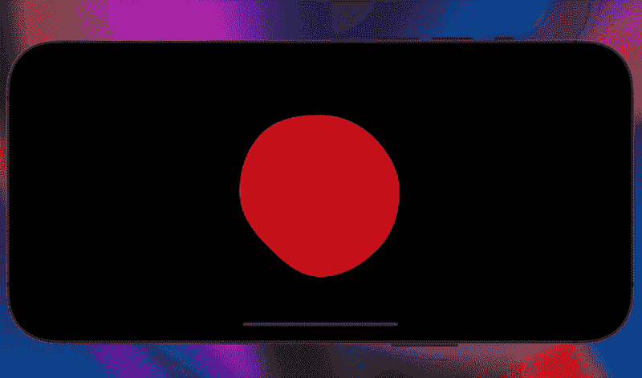
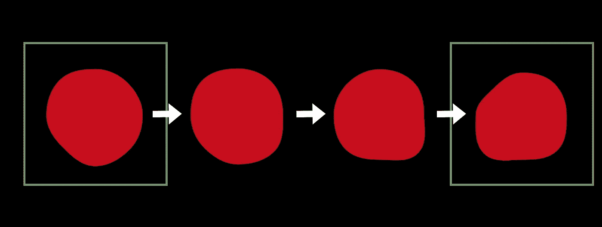
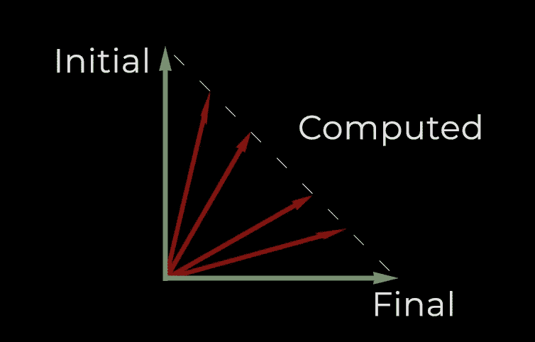
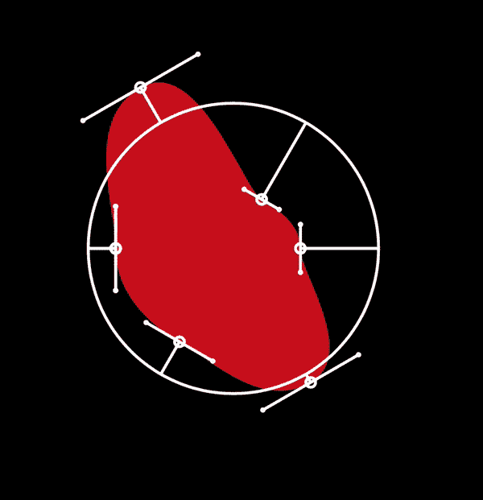
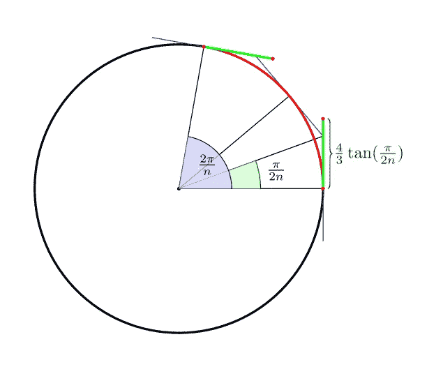
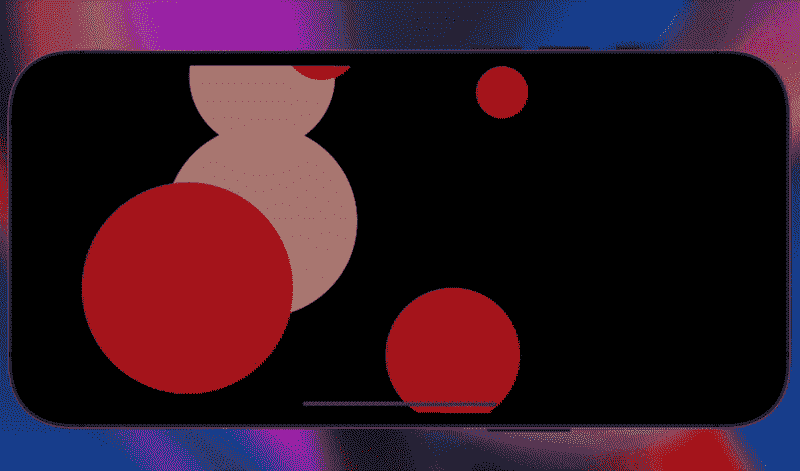

# SwiftUI 高级动画:变形形状

> 原文：<https://betterprogramming.pub/swiftui-advanced-animation-morphing-shapes-239a42200181>

## 我将展示如何使用带有 Accelerate 库的矢量算法协议来有效地激活复杂的 SwiftUI 视图

常规的`.animate()`函数已经提供了一种强大的视图动画方式。然而，它的使用仅限于简单的转换。

在本指南中，我将展示如何使用带有`Accelerate`库的`VectorArithmetic`协议来快速计算复杂的 SwiftUI 视图。

# 灵感

在本指南中，我们将制作一个受熔岩灯泡泡启发的*变形球体*动画。某种晃动的熔岩气泡。

> 💡所提出的技术可以用于其他更复杂的动画

摇摆气泡

# 创建自定义动画

你可能认为动画是两种状态之间的转换。而且这个过渡一定要平稳！为了显示这个平滑的过渡，SwiftUI 需要知道如何在阶段之间进行绘制。

两种形状(状态)之间的平滑变化

## 动画向量

动画的关键思想是用可以不断变化的属性来表示对象的状态。

例如，如果我们试图为一个物体的定位制作动画，而它有整数坐标，那么创建一个物体从一个坐标平滑移动到另一个坐标的中间帧是不可能的。相反，如果对象的位置由浮点变量表示，那么我们可以逐渐改变对象的坐标，直到获得新的坐标。

更复杂的动画也是如此。但是通常情况下，状态不能用单个浮点变量来表示。在这种情况下，我们将使用`AnimatableVector`。它代表一个数学向量，符合`VectorArithmetic`协议。

> 💡如果两个动画阶段由符合`VectorArithmetic`协议的对象表示，则 SwiftUI 可以计算中间向量并绘制过渡。

`AnimatableVector`非常简单。我们存储一个坐标数组，并为它们定义基本的数学运算。在下面的代码中，Accelerate 用于快速计算。

当向量只包含几个值时，Accelerate 会引入过多的开销。所以，如果你的动画可以用几个值来表示，那么考虑重写没有加速的操作符。

## 摇摆气泡

所以，正如我已经说过的，我们需要用`AnimatableVector`来定义动画的阶段，这样 SwiftUI 将能够神奇地绘制所有的中间帧。

要用一个圆做到这一点，我们首先需要设法让它能够*摆动。*这是通过曲线逼近来实现的。为了制作变形效果，我们将使用`AnimatableVector`来修改每个特定点的半径。

就是这样。

向量的第一个坐标将表示第一个近似点的距离必须增加多少。第二个是为了第二点等等。

你可以在下面的一张 gif 中看到每个特定点的半径是如何变化的，SwiftUI 是如何平滑变化的。还会显示曲线的控制点。\

# 履行

动画的概念确定了。是时候编码了！

如我所说，主要思想是用曲线近似一个圆。有一个控制点的近似值:`(4/3)*tan(pi/(2n))`用`n`线段从一个圆中的一个点的距离。

https://stack overflow . com/questions/1734745/如何用贝塞尔曲线创建圆

我们将把圆表示为符合`Shape`协议的对象。为了让 SwiftUI 知道制作什么动画，您需要定义`animatableData`属性。这就是 SwiftUI 将要用来制作帧间动画的东西。

一点点线性代数和所有的点坐标都算出来了。需要对`CGVector`和`CGPoint`进行一些更高级的操作:

最后，实现`Shape`:

最后，我们可以在视图中使用这个形状。为了制造抖动效果，我们需要改变负责半径修改的向量。

这可以通过定时器来完成。

## 使用计时器

我们将在计时器的回调中随机改变变形向量。此外，一次改变所有的点看起来很奇怪，所以我们将只制作其中一部分的动画。

# 结果

例如，创建的气泡可以被组合和动画化以在屏幕上漂移。此外，在本指南的过程中，我们创建了您可以在项目中使用的`AnimatableVector`结构。

请随意分享您的结果！

更多摇摆的泡沫

查看我的博客 iOS 部分，了解更多有用的技巧:

 [## 亚历克斯·德雷莫夫| iOS

### 我的最爱之一。这里我写的是 Swift 和 iOS 开发

alexdremov.me](http://alexdremov.me/tag/ios/) 

# 参考

*   [https://stack overflow . com/questions/1734745/how-to-create-circle with-bézier-curves](https://stackoverflow.com/questions/1734745/how-to-create-circle-with-bézier-curves)
*   [https://developer . apple . com/documentation/swift ui/animatable/animatabledata-swift . property-6 nydg](https://developer.apple.com/documentation/swiftui/animatable/animatabledata-swift.property-6nydg)