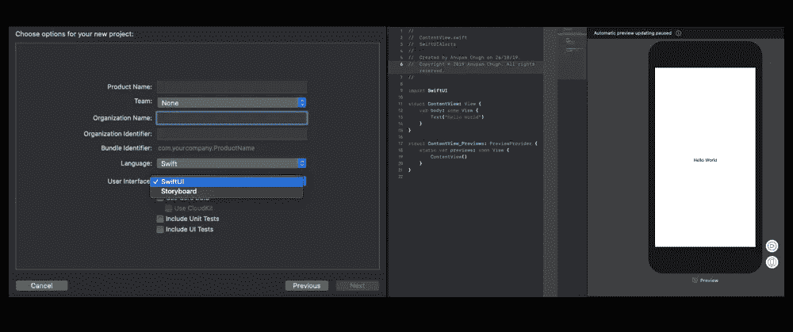
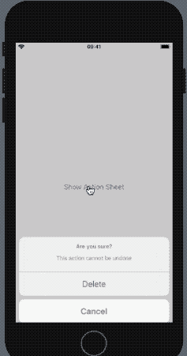
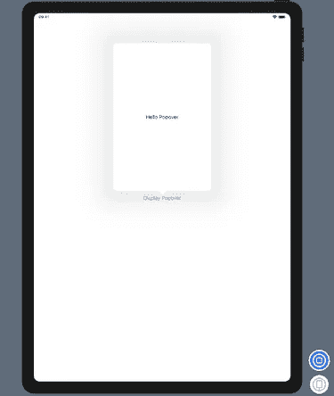
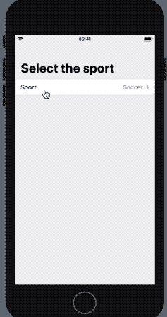
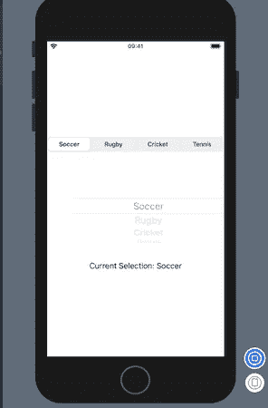
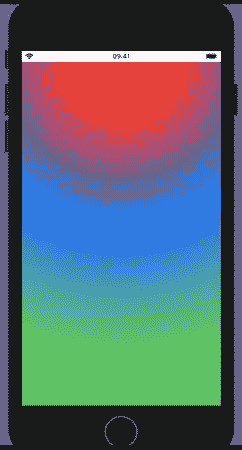

# SwiftUI 警报、选择器和渐变

> 原文：<https://betterprogramming.pub/swiftui-alerts-pickers-and-gradients-29b9ee5ff8f3>

## 快速完成工作的九个例子


图片来自 [Pixabay](https://pixabay.com/?utm_source=link-attribution&utm_medium=referral&utm_campaign=image&utm_content=396825) 的 [Bing N.](https://pixabay.com/users/bngdesigns-213864/?utm_source=link-attribution&utm_medium=referral&utm_campaign=image&utm_content=396825)

[SwiftUI](https://developer.apple.com/xcode/swiftui/) 自苹果 2019 年 WWDC 发布以来，一直是人们谈论的话题。这种声明式用户界面构建工具包已经存在，从长远来看，应该会给界面构建器和故事板带来激烈的竞争。

成为仅支持 Swift 的框架并不是它唯一的优势。它的声明性语法允许一次定义所有状态，这对开发人员来说是一大福音。

而且，你不用担心跨团队的可维护性(故事板，你在看这个吗？)或代码库增加时的可读性。

凭借其易于使用的拖放(或仅在代码中)界面和实时预览，构建 UI 比以往任何时候都更容易和更快！此外，它支持与 UIKit 的互操作性。

我可以继续谈论它的优点，但是让我们下次再谈吧。

在接下来的部分中，我们将在 SwiftUI iOS 应用程序中实现不同种类的警报控制器、选择器视图和渐变。

首先，您需要 Mac Catalina、Xcode 11 和 iOS 13 或更高版本作为部署目标，以便将 SwiftUI 集成到您的应用程序中。

# 入门指南

启动新的 Xcode 单视图应用程序。从向导中选择 SwiftUI 作为用户界面类型。这是你完成设置后看到的。



左边是你选择的。你看到的就是对的

默认情况下，会创建两个结构。一个`ContentView`用于布局视图的内容和布局。`Preview`用于在视图中显示。

在我们深入 SwiftUI 之前，让我们看一下一个重要的属性包装器。

## 什么是状态？

结构内部的属性可以用关键字`State` **标记。**这样做允许我们修改那些属性，并随后更新我们的视图。对 state 属性的任何更改都会触发视图的更新。

# SwiftUI 警报

SwiftUI 中的警报主要分为以下三种类型:

*   警报对话框
*   行动表
*   松饼

## 警报对话框

我相信你已经在 UIKit 中制作了无尽的警报控制器。SwiftUI 警报有一种更简单的方式来创建警报，并以声明的方式定义操作，如下所示:


SwiftUI 警报

`showingAlert`是一个可绑定属性，根据按钮点击显示警告。

## 行动表

动作表不再是 SwiftUI 中的一种风格。它们有一个独立的语法，类似于报警控制器。下面是一个例子和说明:



## 松饼

弹出式菜单基本上是工具提示。和 iPhones 上的莫代尔床单区别不大。它需要一个`arrowEdge` 属性来显示特定方向的箭头。

这里有一些定义了不同预览的示例代码。



SwiftUI popover 的 iPad Pro 预览版

接下来让我们驶向 pickers！

# SwiftUI Pickers

选择器是用于选择选项的 UI 组件。SwiftUI 中的选取器可以采用不同的方式进行设计，例如:

*   导航视图样式。
*   车轮选择器。
*   分段选取器。
*   日期选取器样式。

在接下来的部分中，我们将讨论其中的一些选取器样式。

## 导航视图样式

下面是一个嵌入在表单中的导航视图选择器样式的例子。



## 分段选取器样式

下面的代码展示了一个`SegmentedPickerStyle`的例子。

在`Segmented`和`WheelPicker`风格之间切换比以往更加容易。



现在让我们驶向我们的最后一站！渐变。

# SwiftUI 渐变

在 SwiftUI 中添加渐变非常容易。目前，SwiftUI 支持三种渐变:

*   线性渐变-沿轴应用颜色。
*   径向渐变-根据与边缘的距离应用颜色。它可以从中心、顶部、底部等。
*   角度渐变—也称为圆锥渐变，颜色会随着角度的变化而应用。

## 径向梯度



径向梯度

## 线性和角度渐变

`LinearGradients`需要设置起点和终点，如下图所示。

```
LinearGradient(gradient: colors, startPoint: .leading, endPoint: .bottomTrailing)
```

`AngularGradients`要求通过原点。它可以是中心、顶部、底部、前导或任何随机点。可选地，我们也可以通过`angles`来绘制渐变。

```
AngularGradient(gradient: colors, center: .center, angle: .degrees(200))
```

# 结论

我们船的旅程是从警报开始的。处理不同的风格，然后绕道到 pickers，最后以 SwiftUI 中的渐变结束。SwiftUI 已经存在，并将在未来几年内迅速被采用。

这一次到此为止。我希望你喜欢它。