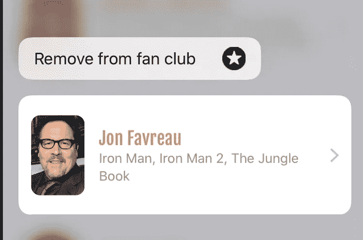
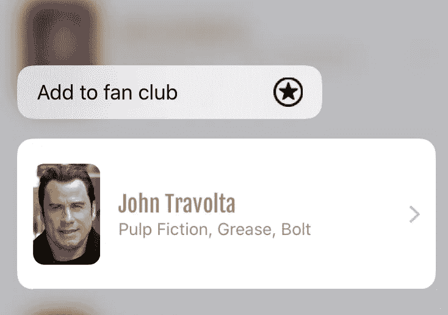
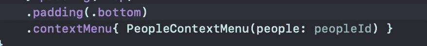
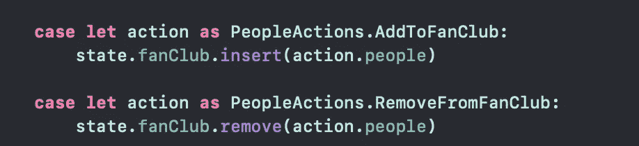
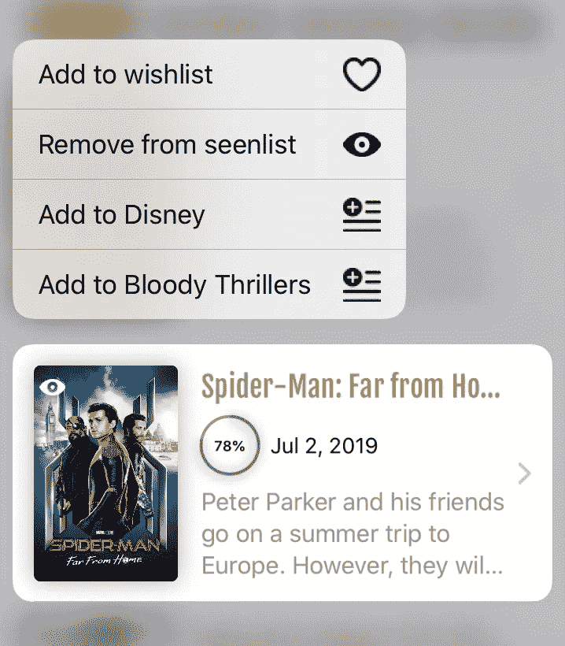
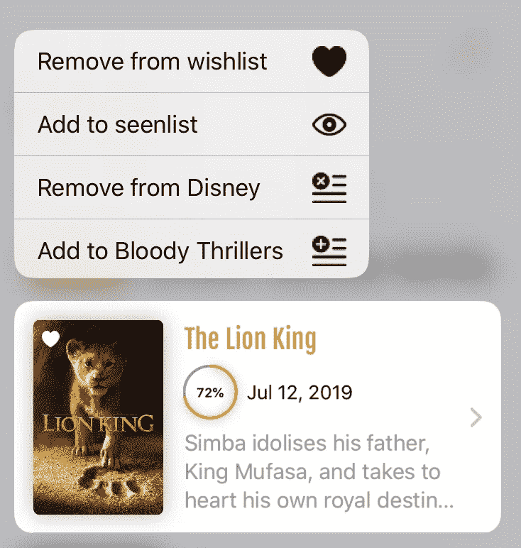

# SwiftUI 和 Redux——干净的代码和独立的小组件

> 原文：<https://betterprogramming.pub/swiftui-and-redux-clean-code-and-small-independent-components-6f46a5eb46b3>

## 如何使用 Redux 库并将其集成到您的 SwiftUI 应用程序中

[船员](https://unsplash.com/@crew?utm_source=unsplash&utm_medium=referral&utm_content=creditCopyText)在 [Unsplash](https://unsplash.com/search/photos/computer-library?utm_source=unsplash&utm_medium=referral&utm_content=creditCopyText) 上拍照

Redux 真的很酷，SwiftUI 更酷，在同一个应用程序中拥有两者简直是人间天堂。所以，再一次，我会试着让你相信这是最好的(或者最差的)SwiftUI 应用架构。

 [## Dimillian/SwiftUIFlux

### 在这个小指南中，我将使用 Combine BindableObject 作为 Redux 的一个非常简单的实现的例子…

github.com](https://github.com/Dimillian/SwiftUIFlux) 

在过去的几周里，我发展了我的小而简单的 Redux SwiftUI 库。我添加了一个自述文件，几乎没有解释如何让它在你的应用程序中工作，但无论如何我有一个[工作示例](https://github.com/Dimillian/MovieSwiftUI)。

更重要的是，我添加了`StoreProvider`、`StoreConnector`和`ConnectedView`。

我对 Alexey Demedeckiy 感激不尽，因为新增加的内容很大程度上受到了他早期 SwiftUI 和 Redux 工作的启发。我已经将它添加到我的库中，并用它重构了部分电影 SwiftUI。它在我现有的 Redux 架构上创造了奇迹。

我不会在本文中谈论 Redux 概念，这是一个关于如何使用该库并将其集成到您的 SwiftUI 应用程序中的教程。

当然，它将向您概述所有这些是如何一起工作的，但它更多的是关于组件架构。解释可以参考我之前第一段链接的文章。

也就是说，让我们深入研究代码。

任何 SwiftUI 项目都会有一个`[SceneDelegate](https://developer.apple.com/documentation/uikit/uiwindowscene)`——这是 iOS 13/macOS 10.15 以来的一个新类，它管理你的应用的 windows 实例和呈现。

这基本上是新的入口点，您将在这里初始化您的根视图层次结构。

在我们的例子中，我们还将创建我们的 Redux initial `state`并将其提供给我们的`store`，然后使用`StoreProvider`将其包装在我们的根视图周围。

在幕后，`StoreProvider`只是一个 SwiftUI 视图的花哨名称，它将我们的`store`设置为内容视图的`environmentObject`。

这本来可以用`HomeView().environmentObject(store)`来完成，但是有了这个包装器意味着我可以安全地开发底层 API，而不用接触代码。

使用 SwiftUI，您只需要在视图层次结构中注入您的`environmentObject`一次，如果它是在根上完成的，就像这里一样。目前还有一个关于`.sheet`的错误，它没有被正确通过，但是应该会在接下来的几个测试版中得到解决。

# 创建电抗组件

现在让我们来看看如何制作一个组件，或者一个视图，对`AppState`中的变化做出反应。

正如你将`dispatch` `action`(为了获取数据或者因为用户触发了你的应用程序中的某些东西，它需要更新它的状态)，你的`state`将会改变。而且，随着属性在存储中的更新，您的组件应该根据它的需要进行更新。

我们以一个我在 app 很多地方使用的可重用组件为例:`PeopleContextMenu`。

让我给你看两张图片:

这是当你强制触摸任何演员/导演等时你会得到的上下文菜单。这样您就可以将此人添加到您的粉丝俱乐部。

这是一个独立的观点。它唯一需要的是一个人的 ID，由此，它可以管理它的 UI 状态，并在用户点击它时分派动作。

我们要做的第一件事就是让它符合`[ConnectedView](https://github.com/Dimillian/SwiftUIFlux/blob/master/Sources/SwiftUIFlux/connector/ConnectedView.swift)`。

`ConnectedView`是由 [SwiftUIFlux](https://github.com/Dimillian/SwiftUIFlux) 提供的一个协议，通过实现新的`body`函数，它将把您的视图包裹在一个响应您的`AppState`变化的视图周围，因为它是作为`@EnvironmentObject`注入的。

我们需要定义的第二件事是`Props`。这很简单；我们只需要一个`Bool`就能知道这个人是不是我们粉丝俱乐部的。

然后，我们有我们的`people` ID 常量，它是在外部构造视图时传递的，就像这样:

现在有趣的部分是，`map(state:dispatch:)`是一个当你想要符合`ConnectedView`时需要实现的函数。

在你的视野中，这是你唯一能接触到你的`AppState`的地方。您需要从您的`AppState`派生的任何数据、属性和计算都应该在这里完成，以使您的状态属性为 UI 做好准备。

它将在新的`body(props:)`函数被调用之前被调用，所以就在视图被实际渲染之前。

在我们的例子中，我们只需要一个`Binding<Bool>`。属性包装器允许我们提供一个从我们的状态派生的值，并且如果它在我们的组件中的任何地方发生了变化，就执行一个动作。

它之所以工作是因为`Binding`属性包装器公开了一个初始化器，在那里你可以将函数作为参数传递给`getValue`和`setValue`，这就是我们在这里所做的。

因此，这个组件的所有逻辑都包装在这里，然后在 reducer 中完成实际的状态突变。

但是，对于组件的 UI 部分，它所能看到和访问的只是一个漂亮的`props.isInFanClub`布尔值。

然后，调用`body(props:)`函数，并允许您返回带有传递的视图属性的组件 UI。正如你在我们的例子中看到的，它只是一个带有一个`HStack`的`Button`，提供了一个`Image`和一个`Text`。

当我们触摸`Button`时，我们通过切换`props.isInFanClub`的`boolean`值来触发`action`。

好了，现在，无论你想让一个`ContextMenu`允许用户添加一个演员到它的粉丝俱乐部，只需一行代码就可以将这个组件添加到想要的视图中。它是一个包装精美的小组件。

通过注入外部道具，它在两种状态下都是完全可测试的，并且很容易在 [Xcode](https://developer.apple.com/xcode/) 画布中预览。

这是一个简单的组件。下面是一个更复杂的代码；这也是一部`ContextMenu`，不过是电影版的。

我提供了完整的代码，因为它揭示了一些你可以用道具做的事情。

在这里，我传递函数来完成我在`map(state:dispatch:)`函数中的动作。我也可以用一个`Binding<Bool>`来做这件事，但是为了这个例子的目的，我用了另一种方法。

我还将视图主体拆分成多个函数，以便于阅读代码，因此正如您所见，您可以自由地将您的道具转发到您需要的任何地方。

希望这篇文章能对 SwiftUI + Redux 有所启发！