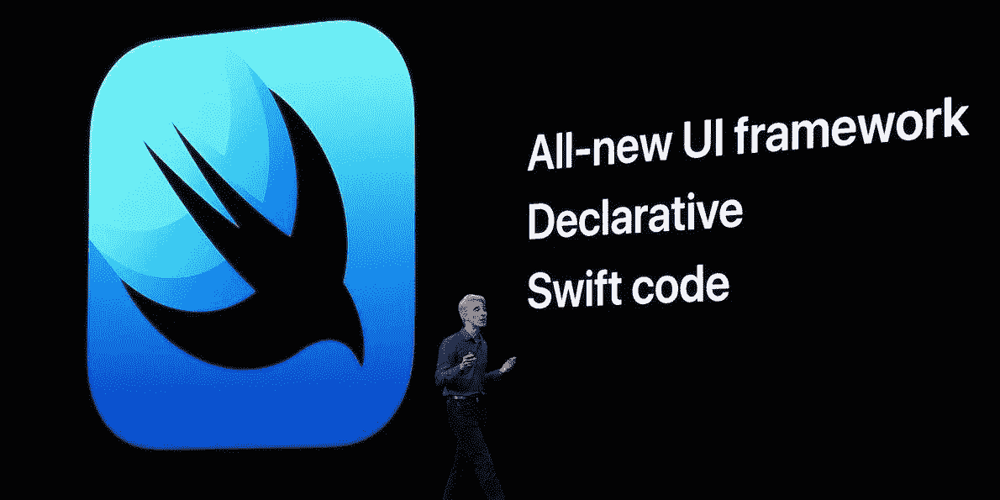
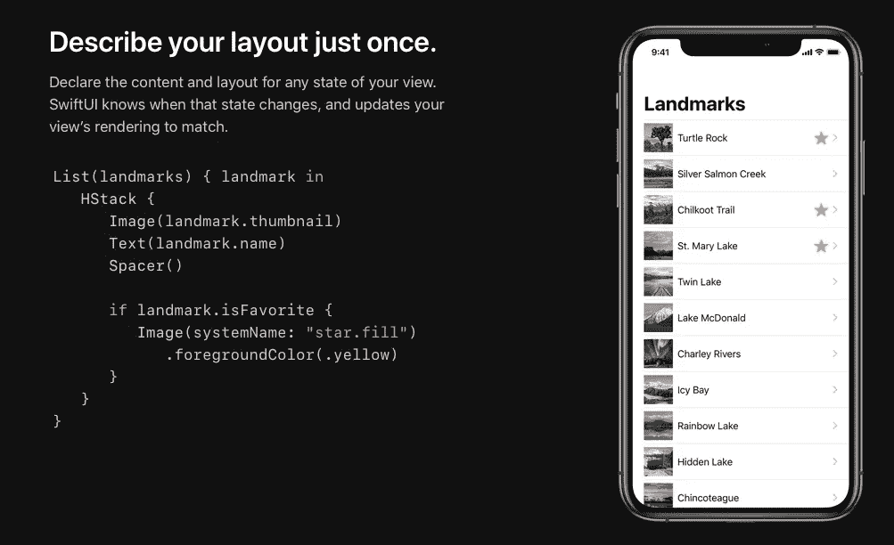

# SwiftUI 和 UIStackView 问题

> 原文：<https://betterprogramming.pub/swiftui-and-the-uistackview-problem-34381ffaa71f>

## 或者苹果如何在 SwiftUI 上犯了一个重大错误…

我记得在 2015 年 WWDC 奥运会期间观看 UIStackView 的介绍时，我感到非常兴奋。我观看了自动布局会议的奥秘，变得更加兴奋。

最后，您可以专注于编写代码和创建接口，而不必花费一半的时间来设置 AutoLayout 约束。它甚至可以自动管理视图的显示和隐藏——用动画！你可以*最终*让电脑做电脑擅长的事情，让它帮我管理我的布局！

最后，你可以…等等。什么？仅在 iOS 9 中支持？！

我的希望如此之高，最终还是破灭了。

## iOS 开发者的第 22 条军规

如果你是专业的 iOS 开发者，那么你和我一样清楚这个问题。毕竟很少有一个应用能写到*只有*支持当前版本的 iOS。

不是每个客户都会立即升级到最新最好的 iOS 版本。事实上，并不是每个客户*都能*升级到最新最好的版本。他们的手机根本不被支持。

的确，正如在主题演讲中提到的那样，今天 85%的用户都在 iOS 12 上。但那句话中的关键短语是“今天的基地”。它并没有立即发生。这需要时间。事实上，快九个月了。

所以，如果你*幸运的话，*你的店做“当前减一”，这意味着你写的代码支持当前版本的 iOS，减一。在 UIStackView 的例子中，应该是 iOS 9 和 iOS 8。

可惜当时我们做的是“当前减二”，也就是说要支持 iOS 9、iOS 8、*和* iOS 7。见鬼，我们还在支持 iOS 6！

根据这个标准，我甚至需要整整两年的时间才能考虑使用我的新工具。

你知道这是怎么回事，不是吗？

## SwiftUI 简介

在 WWDC 19 大会上，苹果推出了 SwiftUI，我敢肯定不止一个开发者惊讶地张大了嘴巴。至少，我知道我的是这样。

引用苹果公司的话，“SwiftUI 是一种创新的、极其简单的方式，利用 Swift 的力量在所有苹果平台上构建用户界面。”

SwiftUI 使用声明性语法，因此您可以简单地说明您的用户界面应该做什么。

据说 SwiftUI 还通过提供自动界面布局、自动支持黑暗模式、自动支持可访问性、自动从右到左语言支持和国际化来节省开发人员的时间。几乎全自动。

SwiftUI 甚至为 Apple Watch、tvOS 和 macOS 应用程序提供了原生框架，因此您编写的方法甚至大部分代码都可以跨平台。

还有很多很多。我口水流得太多了，以至于在苹果公司的国情咨文演讲中，我不得不跑去拿了一条毛巾。

然后，我又一次被这个小字打动了。iOS 13 中支持。

我们又看到了。

## 问题是

我是说，我明白问题所在。SwiftUI 主要基于仅在 Swift 5.1 语言和运行时支持的功能。特定于领域的语言，不透明的返回类型。属性包装。

它还严重依赖于 Combine，这是苹果新的反应式框架，也只在 iOS 13 上可用。

加上 iOS 13 增加的其他新功能，比如 SF 符号。

我是说，我*明白*这个问题…

…这并不意味着我喜欢它。或者我认为它应该存在。

## 竞争

苹果为 iOS 上的 Swift 开发者引入了一种新的范式。SwiftUI 承诺让开发人员比以往走得更远、更快。

要是他们能*使用那些工具就好了。*

更糟糕的是，从很多方面来看，苹果在这一点上完全落后。

许多开发人员放弃了特定于 iOS 的开发，转而支持跨平台工具，如 React Native。

在声明式框架领域，Google 宣布了 Jetpack Compose，这是他们自己的向后兼容框架，用于在 Kotlin 中快速创建和开发 Android 应用程序。

其他人，包括相当多的 Android 开发者，已经接受了 [Flutter](https://flutter.dev/docs/resources/faq) ，

Flutter 是谷歌的另一个声明性框架，允许开发者为 Android 和 iOS 创建应用。谷歌甚至承诺支持桌面和网络应用。

我使用过 Flutter，虽然我认为 SwiftUI 已经消除了 Flutter 的许多缺点并锉掉了粗糙的边缘，但事实仍然是我今天还可以使用它*。*我今天可以编写并支持 iOS 12 应用*。*

见鬼，Flutter 支持 iOS 8。没错。iOS 8。今天。

## 漂亮女人

还记得电影经典《风月俏佳人》中的一个场景吗？女主角看到一个装满耀眼珠宝的盒子……然后，当她伸手去拿时，盒子啪的一声关上了。

感觉就是那样。

苹果向我们展示了一套闪亮的新工具……然后啪的一声合上了盒子。

## 向后兼容性

听着，我知道在 iOS 12 上支持 SwiftUI 可能很难。支持 iOS 11 甚至是不可能的。有些事情它可能做不了或者支持不了。

好吧。我明白了。但是有什么选择呢？

再等一年，或者两年，直到有足够多的开发者可以夕阳他们现有的代码，最终迁移到 SwiftUI？再给谷歌一年时间来改善和巩固 Flutter 及其不断增长的跨平台成功故事？

在这个过程中，强化了这样一种观点:显然只有谷歌拥有支持之前版本 iOS 所需的技术诀窍和专业知识？在一个甚至不是他们自己的平台上？

或者徒劳地希望一些开发人员会决定孤注一掷，完全抛弃他们现有的所有代码，并在 SwiftUI 中完全重写他们当前的应用程序？

所有这一切都给了苹果公司的其他开发者足够的时间来对他们最终能够做的所有酷的事情感到沮丧和幻灭……

是的，我个人可能会在今天开始用 SwiftUI 编写一个新的应用程序，并计划在秋季发布。

然而，在工作中呢？我的团队可能要到明年年底才能开始使用 SwiftUI。

你的呢？2020 年？后年 2021 年？甚至后来？？？

## 完成块

鉴于上述情况，我认为苹果应该站出来，想办法让 iOS 开发者进入乐土。

创造一种方式，让我们能够在我们的*现有的*应用中使用和集成 SwiftUI 和 Combine。让我们开始使用这些工具编写*新的*应用，同时继续支持那些尚未升级到最新最好的手机和操作系统的用户。

在主题演讲期间(以及几乎每场会议期间)，有一句话被一遍又一遍地重复。“那就是[Combine | SwiftUI | Xcode 11]。我们等不及要看你用它做什么了！”

可悲的是，苹果可能不得不这么做:等待。

因为尽管 SwiftUI 有潜力激励开发者，给他们创造未来应用的能力…

这正是许多应用程序注定要存在的地方。

在未来。

你呢？同意吗？不同意？迫不及待想用 SwiftUI？切换到颤振？

我真的很想知道，所以请在下面的评论中给我留言。

与此同时呢。

嘿，至少我们终于可以使用 UIStackViews 了…