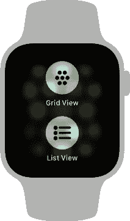
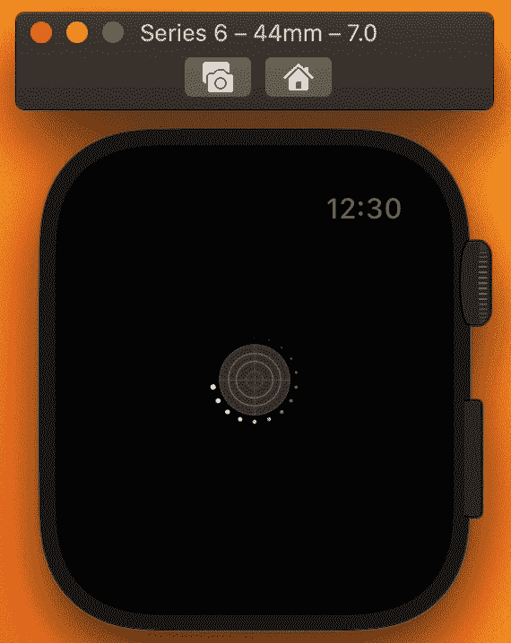
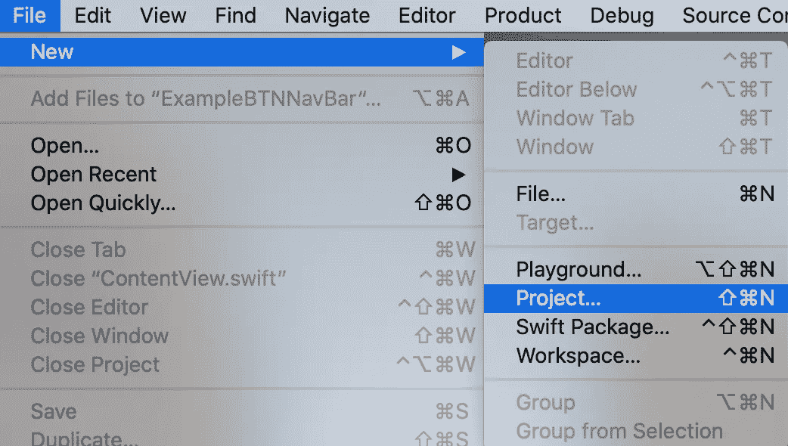

# SwiftUI 和 WatchOS:导航栏下面的动作按钮

> 原文：<https://betterprogramming.pub/swiftui-and-watchos-action-buttons-beneath-the-navigation-bar-2c62d0168c4c>

## 更新您的 watchOS 应用程序，以符合新的 Apple 指南

图片来自[苹果开发者](https://developer.apple.com/news/?id=gq4ajl5z)。

众所周知，watchOS 7 的推出扼杀了原力触控。事实上，在 watchOS 7 之前的 watchOS 版本中，人们可以按住显示屏打开与当前屏幕相关的隐藏菜单。

现在，苹果建议从我们的应用程序中删除隐藏的菜单，检查每个项目，以确定它是否提供信息，或者它执行一个动作。

在他们的[人机界面指南](https://developer.apple.com/design/human-interface-guidelines/watchos/elements/menus/)中，他们为可操作项目提供了一些替代方案。其中一个是在导航栏下面放一个动作按钮。

图片来自[苹果开发者](https://developer.apple.com/design/human-interface-guidelines/watchos/elements/menus/)。

在这个设计中，人们向下拖动以显示按钮。尽管这样的按钮在屏幕第一次打开时是不可见的，但人们可以很容易地发现它，因为拖动是一种非常常见的手势。例如,“邮件”会将“撰写”按钮从隐藏菜单重新定位到收件箱邮件列表上方的位置。撰写按钮是不碍事的，直到人们在屏幕上向下拖动来刷新消息列表。

在本文中，我们将研究这个解决方案。这是我们的应用程序的外观:

应用程序在运行

让我们首先创建一个新的 SwiftUI watchOS 项目:

选择 WatchOS，然后观看**App:**

# 创建彩色列表

让我们导航到`ContentView.swift`并在垂直方向上创建十个彩色圆圈`ScrollView`:

我们用`@State`标记了`colors`，这是一个 Color 类型的数组，因为我们稍后需要用我们将要放在导航栏下面的按钮来修改它。

然后，为了隐藏按钮，我们需要在我们的`ScrollView`中嵌入一个名为`ScrollViewReader`(在 watchOS 7 和 iOS 14 中引入)的结构:

`ScrollViewReader`结构提供了一个名为`scrollTo()`的方法，只需提供锚就可以移动到父`ScrollView`中的任何视图。这样，我们可以在`onAppear`方法内将`scrollTo()`值设置为列表的第一个元素(`scrollTo(0)`)，该方法在视图出现时执行。

我们还引入了一个新的`@State changed`来在需要的时候编辑`colors`数组。

完成我们的应用程序的最后一步是创建一个`Button`，并将其放在`ForEach`循环之前。

如果我们现在运行我们的应用程序，“改变颜色”按钮应该是隐藏的，我们应该能够在拖动时显示它:

应用程序在运行

感谢阅读！我希望你喜欢这个小教程，你学到了一些新的东西。你可以在 [GitHub](https://github.com/andreac30/BTNNavBar) 上找到已经完成的项目。