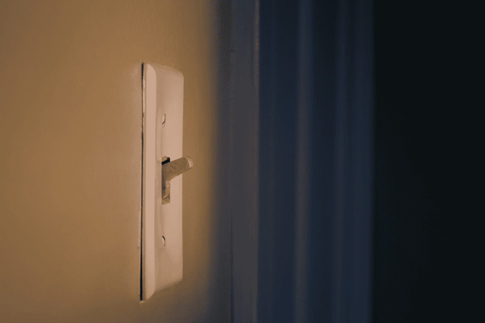
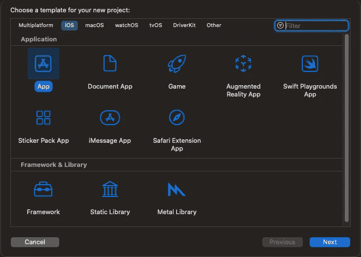
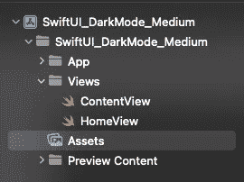
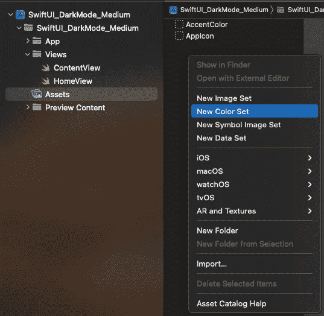
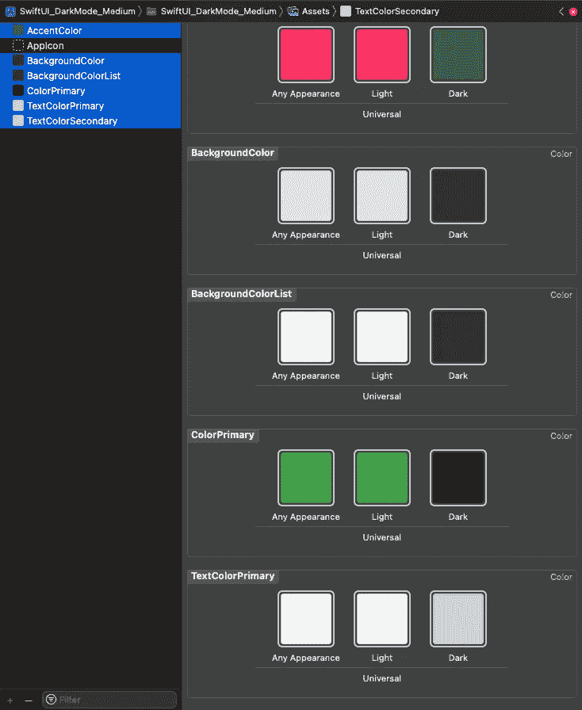
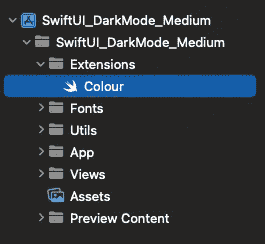
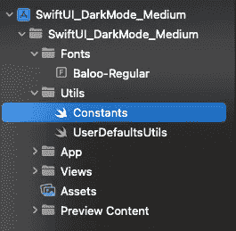
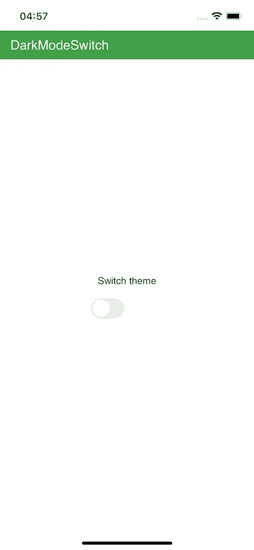
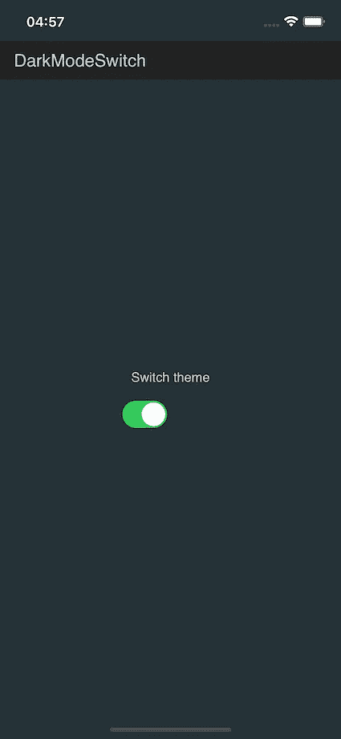

# 切换 SwiftUI 应用主题

> 原文：<https://betterprogramming.pub/swiftui-app-theme-switch-241a79574b87>

## 定制不仅仅是黑暗模式



[斯蒂夫·约翰森](https://unsplash.com/@steve_j?utm_source=medium&utm_medium=referral)在 [Unsplash](https://unsplash.com?utm_source=medium&utm_medium=referral) 上的照片

这篇短文将解释如何动态地改变 SwiftUI 应用程序的主题，以及使其工作所需的所有东西。

首先，让我们创建 Xcode 项目和资源，我们将在一个简单的视图上使用它们来演示暗/亮主题之间的切换，并检查系统是否正在使用暗/亮主题。

打开 Xcode，新建一个类似`File-> New -> Project`的项目。选择 iOS 作为模板。



接下来，创建您的标识符，并选择 SwiftUI 作为接口，Swift 作为语言。

创建完项目后，让我们将视图组织到文件夹中，并添加一些颜色资源来区分亮暗模式。

所以首先在我们项目的根目录下创建一个名为`Views`的文件夹，并将`ContentView.swift`移动到其中。在同一个文件夹中创建一个新的`HomeView.swift`。



接下来，让我们创建我们的颜色`Assets`。点击资产，并在导航栏上点击右键- >新建颜色集。



让我们把新的颜色集命名为“Accent”。让我们再添加三组颜色，并命名为:

*   `BackgroundColor`
*   `BackgroundColorList`
*   `ColorPrimary`
*   `TextColorPrimary`
*   `TextColorSecondary`



在我们创建了我们的颜色集之后，我们必须创建一个扩展来使用我们的自定义颜色和修改器。

创建文件夹`Extensions`并添加`Color.swift`扩展名。



```
**extension** Color {
 **static** **var** theme: Color  {
   **return** Color("theme")
 } **static** **var** BackgroundColor: Color  {
   **return** Color("BackgroundColor")
 } **static** **var** BackgroundColorList: Color  {
   **return** Color("BackgroundColorList")
 } **static** **var** ColorPrimary: Color  {
   **return** Color("ColorPrimary")
 } **static** **var** Accent: Color  {
   **return** Color("AccentColor")
 } **static** **var** TextColorPrimary: Color  {
   **return** Color("TextColorPrimary")
 } **static** **var** TextColorSecondary: Color  {
   **return** Color("TextColorSecondary")
 }
}
```

接下来，让我们创建一个名为`Fonts`的新文件夹，并将我们喜欢的字体复制/粘贴到其中。



另外，创建一个名为`Utils`的新文件夹，并在其中添加`Constants.swift`和`UserDefaultsUtils.swift`类文件。这些将是我们获取和设置应用程序主题的单例类。

`Constants.swift`:

```
**import** Foundation**class** Constants {
  **public** **static** **let** DARK_MODE = “DARK_MODE”
  **public** **static** **let** LIGHT_MODE = “LIGHT_MODE”
}
```

`UserDefaultsutils.swift`:

```
**import** Foundation**class** UserDefaultsUtils {**static** **var** shared = UserDefaultsUtils()
 **func** setDarkMode(enable: Bool) {
 **let** defaults = UserDefaults.standard
   defaults.set(enable, forKey: Constants.DARK_MODE)
 } **func** getDarkMode() -> Bool {
 **let** defaults = UserDefaults.standard
 **return** defaults.bool(forKey: Constants.DARK_MODE)
 }
}
```

所以让我们给我们的`HomeView.swift`添加一些代码。

首先，我们将添加一个环境变量来表示当前使用的系统配色方案。

第二，我们将使用状态属性`isDarkModeOn`来保存窗口的主题状态，并保存到`UserDefaults`中以备后用。

```
@Environment(\.colorScheme) private **var** colorScheme: ColorScheme
@State **private** **var** isDarkModeOn = **false**
```

接下来让我们添加两个函数:

1.  用于设置应用程序打开时的主题
2.  在切换时更改主题。

```
**func** setAppTheme(){
  //**MARK: use saved device theme from toggle** isDarkModeOn = UserDefaultsUtils.shared.getDarkMode()
  changeDarkMode(state: isDarkModeOn) //**MARK: or use device theme
  if** (colorScheme == .dark)
  {
    isDarkModeOn = **true** } **else**{
    isDarkModeOn = **false** }
  changeDarkMode(state: isDarkModeOn)*/
}**func** changeDarkMode(state: Bool){
  (UIApplication.shared.connectedScenes.first **as**? 
  IWindowScene)?.windows.first!.overrideUserInterfaceStyle = state ?   .dark : .light
  UserDefaultsUtils.shared.setDarkMode(enable: state)
}
```

最后是我们的 HomeView.swift body。

```
**var** ToggleThemeView: **some** View {Toggle("Dark Mode", isOn: $isDarkModeOn).onChange(of: isDarkModeOn) { (state)  **in**changeDarkMode(state: state)}.labelsHidden()}**var** body: **some** View {
  NavigationView {
   ZStack {
    Color.BackgroundColorList.edgesIgnoringSafeArea(.all)
    VStack(alignment: .leading) {
      Text("Switch   theme").foregroundColor(Color.TextColorSecondary).padding(10).font(F  ont.custom("Baloo-Regular", size: 15))
      ToggleThemeView
 }
 .background(Color.BackgroundColorList)
 .font(Font.custom("Baloo-Regular", size: 20))
 .navigationBarTitle("", displayMode: .inline)
 .navigationBarItems(
 leading:
   Text("DarkModeSwitch").font(Font.custom("Baloo-Regular", size: 20)))
   .navigationBarBackButtonHidden(**true**)
   foregroundColor(Color.TextColorPrimary)
  }
 }
  .background(Color.BackgroundColorList)
  .navigationViewStyle(StackNavigationViewStyle())
  .onAppear(perform: {
  setAppTheme()
 })
}
```

因此，如果我们打开我们的应用程序，第一个主题将是光。我们可以切换到黑暗，或使用默认的设备主题。



就是这样。该代码可以在 GitHub 存储库中找到:

[](https://github.com/kenagt/SwiftUI_DarkMode_Medium) [## GitHub-kenagt/swift ui _ dark mode _ Medium:swift ui 黑暗模式主题开关，使用设备配色方案…

### 此时您不能执行该操作。您已使用另一个标签页或窗口登录。您已在另一个选项卡中注销，或者…

github.com](https://github.com/kenagt/SwiftUI_DarkMode_Medium)