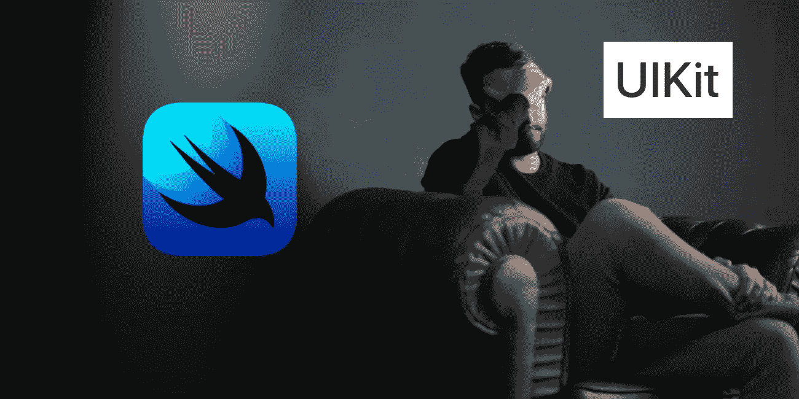

# SwiftUI 包:在反应式世界中使用 UIKit

> 原文：<https://betterprogramming.pub/swiftui-baggage-using-uikit-in-a-reactive-world-45fd0eb64e62>

## UIKit 是你无法摆脱的前任，但你可以让它工作

尼克·舒利亚欣在 [Unsplash](https://unsplash.com/s/photos/sad?utm_source=unsplash&utm_medium=referral&utm_content=creditCopyText) 拍摄的照片

围绕 SwiftUI 的炒作和兴奋令人敬畏。在 [Twitter](https://twitter.com/search?q=%23swiftui&src=typed_query) 、[子 Reddits](https://www.reddit.com/r/swift/) 、播客、[堆栈溢出](https://stackoverflow.com/questions/tagged/swiftui)，当然，就在[媒体](https://medium.com/search?q=swiftui)上，一切都在热烈讨论。是的，虽然有很多理由可能坚持现在就发布 SwiftUI 应用程序，但毫无疑问，iOS 社区已经开始在他们的一些项目中采用它。

即使所有的宣传、刺激、项目和 100 天的 SwiftUI 马拉松都在进行，房间里仍然有一头大象。它的名字叫 UIKit。

SwiftUI 还是年轻新鲜的(从字面上理解就是刚生产一个多月)。虽然有证据表明苹果正在他们平台的最新版本中使用 SwiftUI，但这并不意味着他们已经覆盖了所有版本。这不应该是一种期望，也不应该很快成为现实。更不用说我们已经了解和喜爱的所有开源框架、pods 和软件包，它们可能永远不会离开它们的 UIKit 身份。

# 可代表的:不完全是装的

与 SwiftUI 一起发布的还有一个苹果提供的解决方案。`UIViewRepresentable`和`UIViewControllerRepresentable`是为将 UIKit 元素包装在`View`中而设置的协议，以及在您的元素和 SwiftUI 代码之间设置交互的存根。

这意味着你的`UIView`是一个真实的`UIView`，它存在于一个真实的 SwiftUI `View`中。然而(不要政治化)，代表和直接的面对面交流是不一样的。尤其是当代表性的模型(或者，在这种情况下，协议)被制作成“一刀切”时。

让我们通过一个简单的例子来理解我的意思。

# LinkPresentation:调整大小很重要

[LinkPresentation](https://developer.apple.com/documentation/LinkPresentation) 是 iOS 13 中 devs 的新功能，它开放了苹果在消息中用于链接预览的内容。`LPLinkView`是一个`UIView`，这有几个原因。首先，它使现有项目可以使用它(即使是 iOS 13+)。第二，在 SwiftUI 出现之前，它显然已经存在于消息中了，所以这里并不是重新发明轮子。

没问题！我们就用`UIViewRepresentable`把它包起来:

就这样，对吗？完成，故事结束，拜拜。

呃…就这样？

**错了！**那是，可惜，*不是*它。虽然我们的 UIView 可能在`makeUIView`协议中处理获取完成(或者，甚至`updateUIView`)，但是没有任何东西告诉 SwiftUI 我们想要重绘或调整大小，即使我们在 UIKit 中调用了一个。因为 SwiftUI 依赖于状态，所以我们需要使用一个`State`属性来触发重绘。

现在，我们将看到 LinkPresentation 的辉煌之处:

这还差不多…但是我不喜欢我们是怎么走到这一步的

# 感觉不对，但我知道这是对的

这其实是 SwiftUI 和 UIKit 之间最好的解决方案…尽管感觉不对。原因是因为我在两个世界之间挣扎，我被迫意识到继续前进意味着放手。

更具体地说，我的大脑的旧 UIKit 版本正在寻找一个协议，在那里我可以手动调用我的`Representable`的刷新，就像我在`ViewController`中一样。但是，真的，我需要接受这是一个`View`并且需要被如此对待。

假设`LinkPresentation`被实现为 SwiftUI `View`。我想象我们将把`LPLinkMetadata`包装成一个`State`属性。这样，当我们的 fetch 回调设置这个`State`时，它就作为我们的 redraw 触发器。我们本质上是在 SwiftUI 中使用绑定。在一个反应式框架中，我们为我们的 UI 设置了一个反应。

事实是，通过将一个`State`属性附加到我们的`Representative`上，这实际上是正确表示 UIView 的必要的最后一步。

# 不能退出 U(IKit)

UIKit 永远不会消失。好了，我说了。经验丰富的开发人员可以松一口气，新手可以尽情地发泄。

首先，我见过现在生产中还在使用 xib 的 app。然后是用 UIKit 编写的极其复杂和令人印象深刻的 UIViews(如代码，而不是故事板)。最后，已经有大量的 UI 包/包被编写出来，并且来源于外界。

是的，随着时间的推移，将会有新的应用程序，新的软件包，以及那些将处理转换。但是任何认为 SwiftUI 将会把 UIKit 从 App Store 中彻底清除的人都非常兴奋。我明白了，我*爱* SwiftUI。我想更爱它。我们只需要给它时间成长。