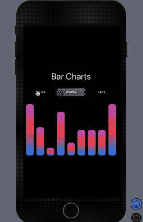

# SwiftUI 条形图

> 原文：<https://betterprogramming.pub/swiftui-bar-charts-274e9fbc8030>

## 用渐变创建美丽的形状


我们将实现什么

SwiftUI 是镇上的话题。声明式 UI 模式将会继续存在，构建酷而棒的 UI 比以往任何时候都更容易。之前，我们实现了带有警告、选择器和渐变的[swift ui](https://medium.com/better-programming/swiftui-alerts-pickers-and-gradients-29b9ee5ff8f3)。现在，该是一些自定义视图的时候了！

本文的目标是用 SwiftUI 构建条形图。为此，我们将使用 SwiftUI 形状和渐变。此外，我们将把不同的条形图形状绑定到分段选择器视图。

# 先睹为快

在我们深入研究 SwiftUI 实现之前，先看一下我们将要构建的内容:


声明:以上统计并不完全代表我的中等统计。

# 履行

首先，您需要在 SwiftUI 中创建新的 Xcode 项目。在您的`ContentView`中添加以下代码:

在上面的代码中，我们构建了一个`ZStack`来添加视图。在里面，我们为`Text`、`Picker`和`Horizontal Stack`设置了一个垂直堆栈。

两个状态`pickerSelection`和`barValues`是相关的。基于`pickerSelection`值，相应的条形图值和形状被稍微调整(注意条形图的`cornerRadius`是如何变化的)。

条形图使用一个水平堆栈来显示每个单个条形图视图，我们将在下面看到。

要更改 SwiftUI 中的分段选择器控件样式，我们需要在 init 方法中添加必要的`UIKit`内容。

# 构建条形图视图

为了构建我们的自定义栏视图，我们需要使用 SwiftUI 的`Shape API`。支持多种形状，如`Circle`、`Capsule`、`Rounded Rectangle`等。

下面给出了构建条形图视图的代码:

这里，我们使用了两个与底部对齐的`RoundedRectangles`(你也可以使用形状`Capsule`)。一个充当容器，具有固定的高度，另一个具有基于它所保存的值的动态高度。

# 用渐变填充自定义视图

我们可以通过添加渐变作为填充颜色来进一步美化我们的条形图。以下代码向`BarView`添加了一个`LinearGradient`:

```
RoundedRectangle(cornerRadius: cornerRadius).fill(LinearGradient(gradient: Gradient(colors: [.purple, .red, .blue]), startPoint: .top, endPoint: .bottom)).frame(width: 30, height: value)
```

作为回报，我们在 SwiftUI 预览中获得了新的条形图外观，如下所示:



使用 SwiftUI 的*条形图的完整源代码可以在这个 [GitHub 库](https://github.com/anupamchugh/iowncode/tree/master/SwiftUIBarCharts)中获得。*

# 下一步是什么

使用 SwiftUI 构建条形图既快速又简单。接下来，我们将探索 SwiftUI 中其他很酷的图表:饼图、圆环图和折线图。

这就结束了这一小段。我希望你喜欢读它。