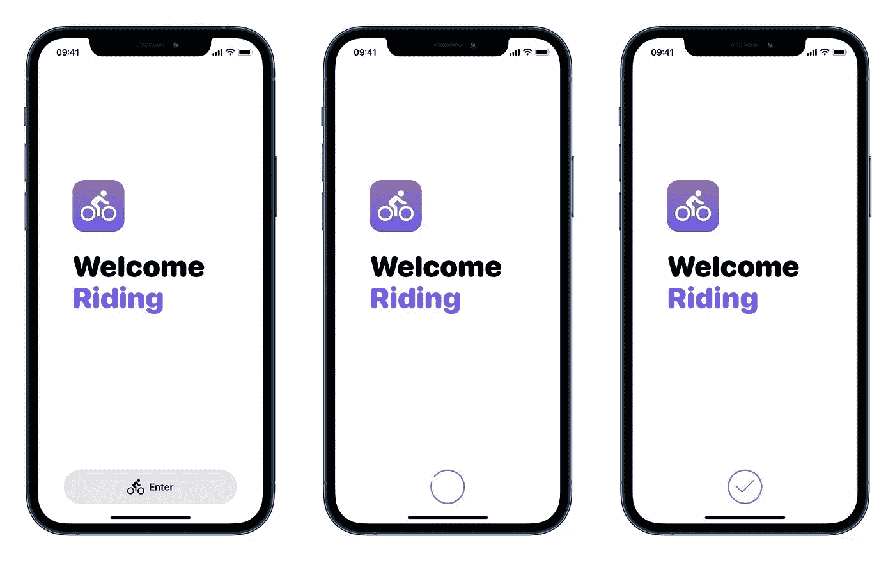
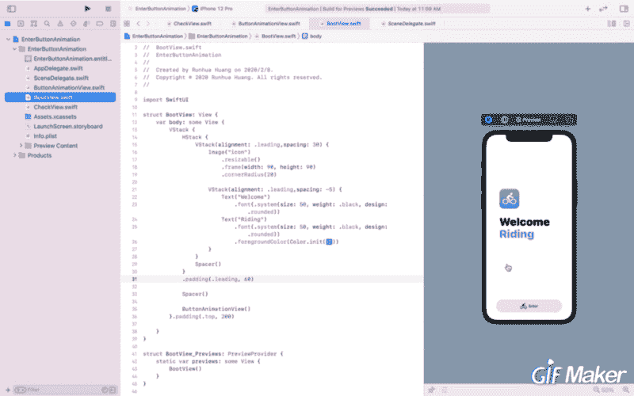
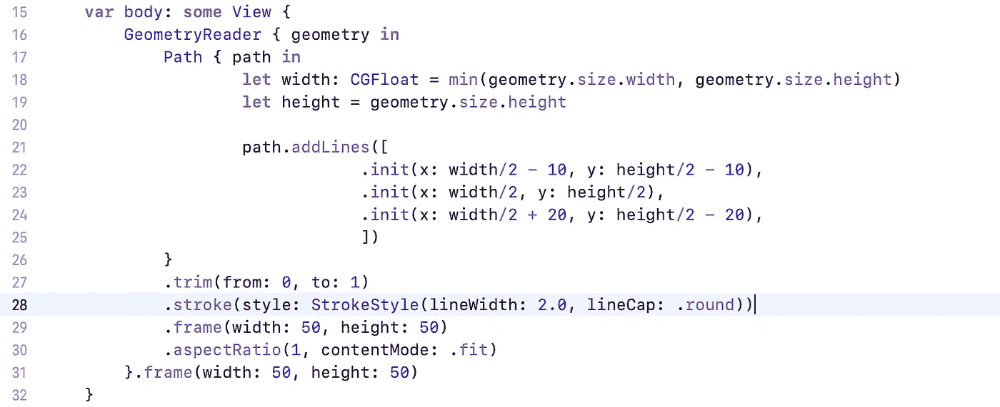
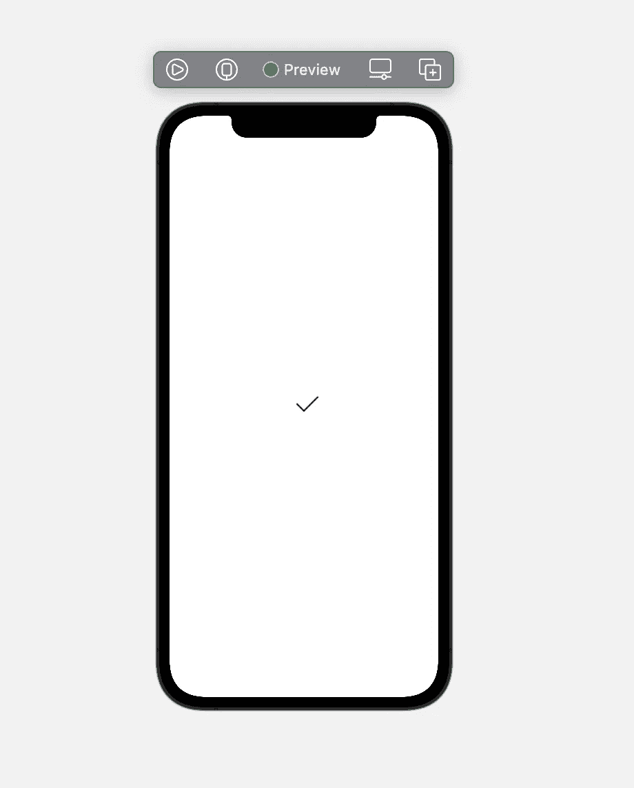
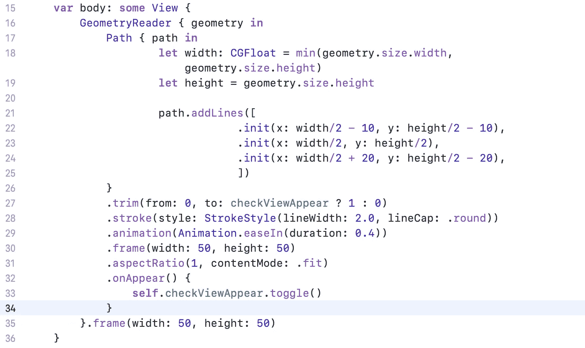
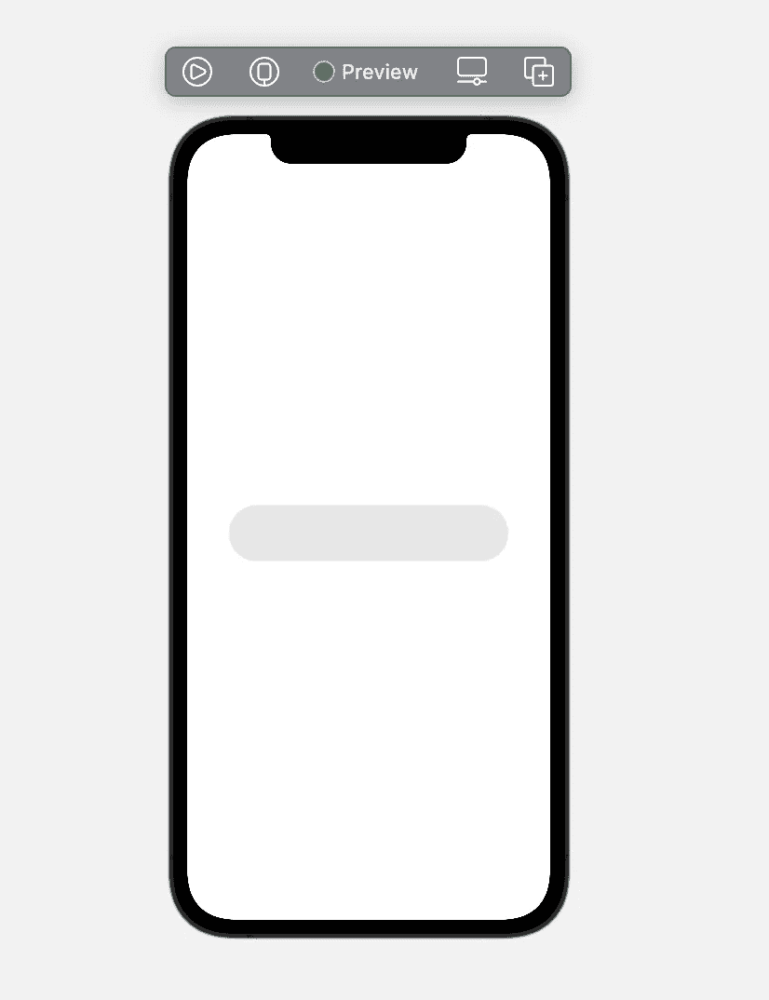
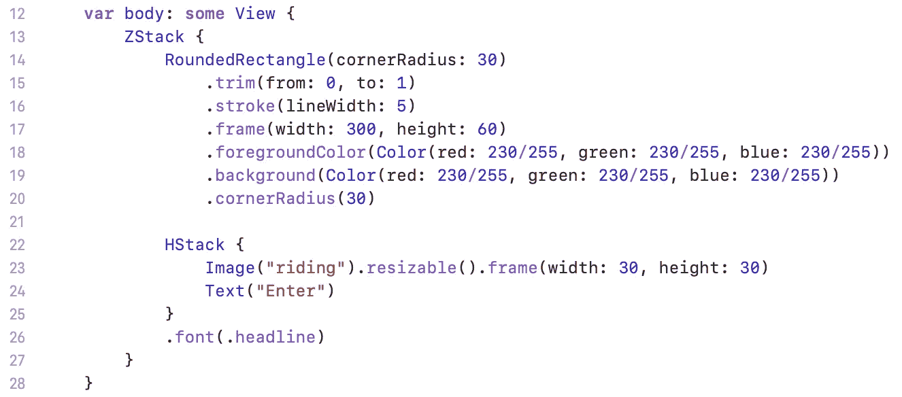
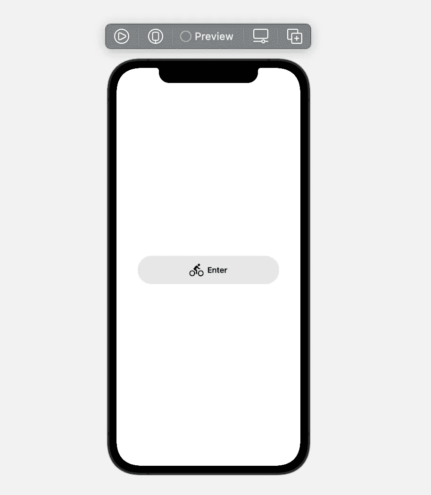
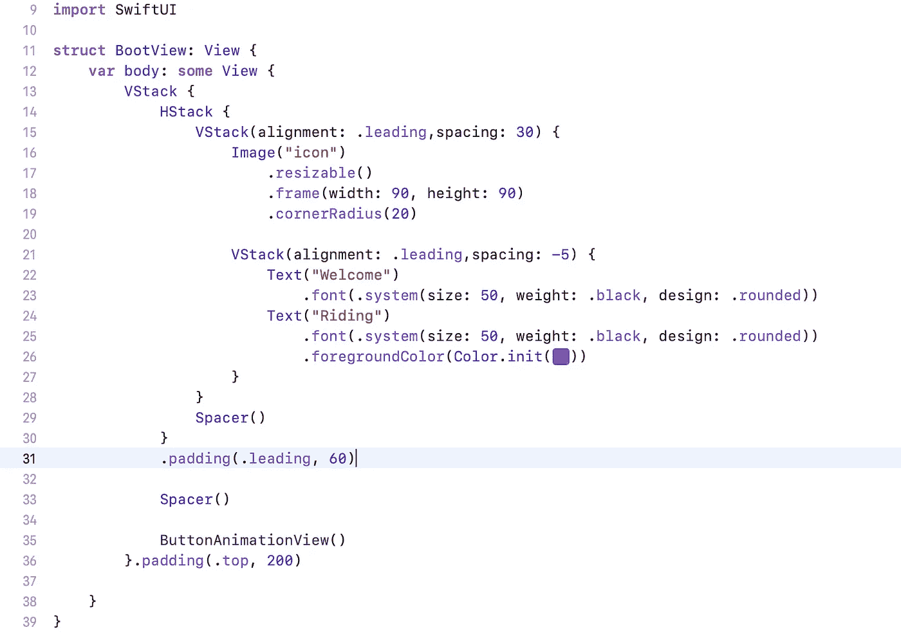

# 在 SwiftUI 中构建类似应用商店的下载动画

> 原文：<https://betterprogramming.pub/swiftui-basic-animation-combat-e9218479888a>

## SwiftUI 基础动画战斗



SwiftUI 无疑是苹果迄今为止最完美的杰作之一。通过使用 SwiftUI，我们可以用更简洁的代码实现非常复杂的功能。

最近学习了一些动漫方面的知识。有了这个最新的框架，我们可以轻松实现非常流畅的动画效果。

前一张图片是我接下来将引导您完成的演示。和我们从 app Store 下载 App 时的动画差不多，只是有些地方不一样。点击输入按钮，按钮将变成一个装载圆圈。当系统完成加载时，会出现一个勾号，表示动画结束。

想了解详情可以参考下面的 GIF。



## 复选标记

我们先来画一下复选标记的动画。

创建一个新的 SwiftUI 文件，我将其命名为`CheckView`，你可以将其设置为任何名称。画图的时候需要用到`[Path](https://developer.apple.com/documentation/swiftui/path)`类。

画线的原理其实很简单。在数学中，我们知道两点定义一条直线。为了画出复选标记的形状，我们需要三个点来实现。由于不在一条直线上的三个点可以确定一个三角形，所以画完三角形后，我们只需选择它的两条边就可以成功地画出勾号的形状。

使用`addLines(_ lines: [CGPoint])`功能，您可以添加想要放置的点。

为了更好地布局勾号，我们需要使用`[**GeometryReader**](https://developer.apple.com/documentation/swiftui/geometryreader/)` 绘图工具。`**GeometryReader**` **，**用苹果的话说，就是一个容器视图，把它的内容定义为自己大小和坐标空间的函数。此视图向其父布局返回灵活的首选大小。

让我们将复选标记放在视图的中心。



通过这段代码，您会看到模拟器上出现一个紫色的小勾号。



但是我们如何让它移动呢？

我们需要一个类型为`Bool`的变量，我将其设置为`checkViewAppear`。我们需要在主体之前声明这个变量。

```
@State **private** **var** checkViewAppear = **false**
```

注意`.animation()`函数可以给勾号添加动画，所以在我们的路径后面添加这个函数，并修改`.trim(from:, to :)`中的参数。



实例方法`onAppear(perform:)` 让您有机会添加一个在该视图出现时要执行的动作。

现在点击实时预览，当复选标记出现时，您将看到动画。

## 按钮视图

创建一个新的 SwiftUI 视图，我将其命名为`ButtonAnimationView.swift` *。*

看看我们稍后将创建的视图。它包含一个圆角矩形作为背景视图，圆角矩形上方是一个包含图像视图和文本视图的`HStack`视图。那么我们就从`ZStack`视图开始吧。


这里我们创建一个圆角矩形，如下图所示:



现在添加包含图像视图和文本视图的`HStack`视图。



现在按钮视图已经完成，我们只需要添加动画到视图中。

让我们回到之前展示过的 gif，我们会看到在我们点击按钮后，视图变成了圆形视图。还有呢？圆形视图的颜色不同于按钮视图。

为了处理这种变化，我们需要一个属性包装器类型，它可以读取和写入一个值，当这个值被写入另一个值时，它可以改变视图。我设置了`downloadButtonTapped`:

```
@State **private** **var** downloadButtonTapped = **false**
```

现在，点击按钮时，更改按钮视图的宽度。

```
RoundedRectangle(cornerRadius: 30)
    ···
    .frame(width: **self**.downloadButtonTapped ? 60 : 300, height: 60)
    ···
```

点击按钮后，视图的背景色将变成白色，而`foregroundColor`将变成紫色:

```
RoundedRectangle(cornerRadius: 30)
    ···
    .foregroundColor(**self**.downloadButtonTapped ? .purple : Color(red: 230/255, green: 230/255, blue: 230/255))
    .background(**self**.downloadButtonTapped ? .white : Color(red: 230/255, green: 230/255, blue: 230/255))
    ···
```

现在使用实例方法`onTapGesture(count:perform:)` 添加一个当圆角矩形视图识别出点击手势时要执行的动作。

```
RoundedRectangle(cornerRadius: 30)
    ···
    .onTapGesture {
        withAnimation(.default) {
            **self**.downloadButtonTapped = **true** }
    }
```

要在轻击手势后隐藏`HStack`视图，我们只需要检查`downloadButtonTapped`的值是否等于`true`。

```
**if** !downloadButtonTapped {
    HStack {
        Image("riding").resizable().frame(width: 30, height: 30)
        Text("Enter")
    }.font(.headline)
}
```

打开实时预览，您将看到显示圆角矩形视图如何变成圆形视图的动画。

现在我们需要使圆圈缺少一小部分，并旋转起来。添加两个新的属性包装类型:

```
@State **private** **var** loading = **false** @State **private** **var** fullcircle = **false**
```

更改以下代码以使圆不完整:

```
RoundedRectangle(cornerRadius: 30)
    .trim(from: 0, to: **self**.fullcircle ? 0.95 : 1)
    ···
```

添加实例方法`rotationEffect(_:anchor:)` 就在*`**onTapGesture**`*方法之前旋转圆形视图:**

```
**RoundedRectangle(cornerRadius: 30)
    ···
    .rotationEffect(Angle(degrees: **self**.loading ? 0 : -1440))
    ···**
```

**并更新`onTapGesture` 的方法:**

```
**RoundedRectangle(cornerRadius: 30)
    ···
    .onTapGesture {
        withAnimation(.default) {
            **self**.downloadButtonTapped = **true
            self**.fullcircle = **true** }
    }**
```

**您可能会感到困惑，`loading`属性没有包含在`onTapGesture`方法中。因为旋转动画是在圆角矩形视图变成圆形视图的动画之后——如果给`onTapGesture`方法添加属性，你会发现这个动画不是我们需要的，而且动画的时长太短。**

**为了处理圆形旋转动画，我们需要一个新函数`startProcessing()`。让我们创建它:**

```
****struct** ButtonAnimationView: View {
    **···
    private** **func** startProcessing() {
        withAnimation(Animation.linear(duration: 5)) {
            **self**.loading = **true** }
    }
}**
```

**什么时候调用这个函数？显然，在图像视图和文本视图消失后，需要在`HStack`视图中添加`onDisappear`方法:**

```
****if** !downloadButtonTapped {
    HStack {
        Image("riding").resizable().frame(width: 30, height: 30)
        Text("Enter")
    }.font(.headline)
     .onDisappear() {
         **self**.startProcessing()
     }
}**
```

**现在，您将在点击圆角矩形视图后看到旋转动画。**

## **组合检查视图和按钮视图**

**在旋转动画的几秒钟之前，`CheckView`会出现在圆形视图的上方。它们甚至会同时完成。所以我们需要一个新的属性包装器类型来显示`CheckView`何时显示:**

```
**@State **private** **var** completed = **false****
```

**在`startProcessing`方法中，我们假设动画将在 5 秒内完成，所以我们现在假设 4 秒后`CheckView`将显示:**

```
****struct** ButtonAnimationView: View {
    **···
    private** **func** startProcessing() {
        withAnimation(Animation.linear(duration: 5)) {
            **self**.loading = **true** } DispatchQueue.main.asyncAfter(deadline: .now() + 4) {
            **self**.completed = **true
            self**.fullcircle = **false** }    
    }
}**
```

**现在将`CheckView`添加到`ZStack`视图中:**

```
****if** completed {
    CheckView()
        .offset(x: -5, y: 9)
        .foregroundColor(.purple)
}**
```

**现在在现场预览中，您将看到完整的动画。**

## **启动视图**

**创建一个名为`BootView.swift`的新 SwiftUI 文件，检查该视图中将包含什么。一个图像、两个不同颜色的文本视图和`ButtonAnimationView`。**

**创建这样的视图很简单，所以我只把代码放在这里。**

****

# **演示链接**

**整个项目已经上传到 [Github](https://github.com/HuangRunHua/EnterButtonAnimation) ，感觉下载起来很轻松。**