# SwiftUI —基本组件

> 原文：<https://betterprogramming.pub/swiftui-basic-components-ac2c62dc7b95>

## SwiftUI 中 UI 组件的简单介绍

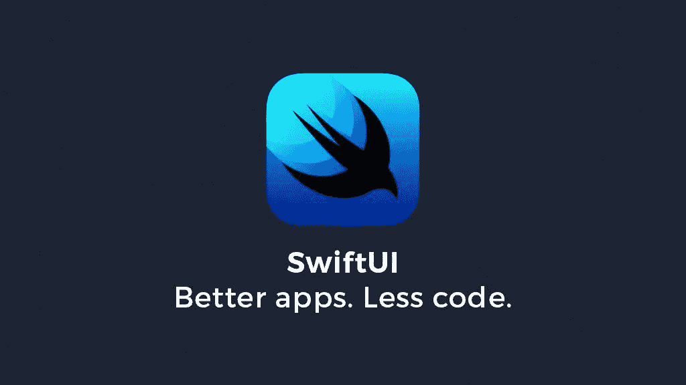

我将使用 SwiftUI 呈现一系列 UI 组件。每个组件将用几行简单的文字来描述。你可能会发现这篇文章作为指南很有用。

# 内容

*   用户输入:切换、滑块、文本字段、选择器、日期选择器和分段控件
*   容器:滚动视图、表格和表单
*   演示者:警报、行动表和弹出窗口
*   SwiftUI 示例项目

# 触发器

Toggle 的目的很简单:它用于绑定一个属性。在某些情况下，我们可以用它来改变屏幕，显示或隐藏其他视图。

SwiftUI —切换

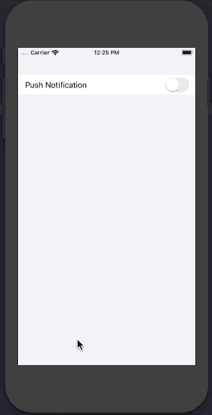

iPhone 截图

# 文本字段

要使用文本字段，我们只需要指定一个占位符(字符串)和一个绑定。

SwiftUI —文本字段

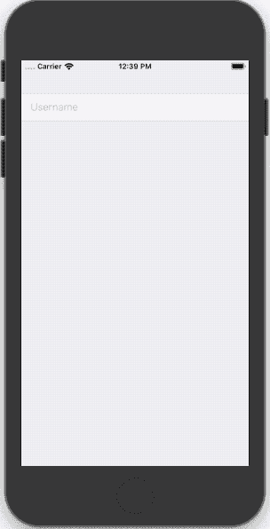

# 采摘者

Picker 在 SwiftUI 中有一个加号。在表单中使用它，应用程序将导航到一个详细的选项列表视图。

如果我们想用经典的内联样式显示 picker，我们只需添加行`.pickerStyle(.wheel)`。

SwiftUI —选取器

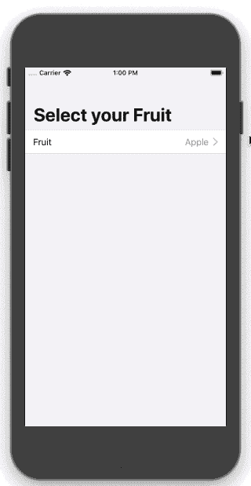

# 分段控制

分段控件是在同一个屏幕上显示不同视图的好工具。

SwiftUI —分段控制

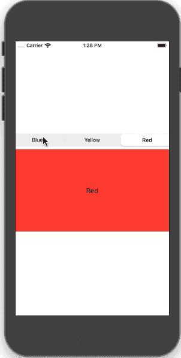

# 容器

## 滚动视图

通过`ScrollView`视图实现:

SwiftUI —滚动视图

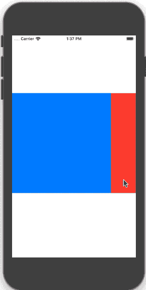

## 项目清单

要在 SwiftUI 中显示表格，我们应该使用列表视图。该列表可以根据您的需要显示静态或动态内容。然而，它使用起来很简单，因为我们不需要写很多代码来注册单元格或告诉它有多少行等等。

使用对象数组(可识别协议)和内容块中的子视图:

SwiftUI —列表

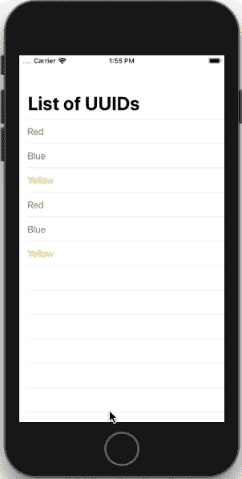

## 形式

SwiftUI 的表单像容器一样工作，所以我们可以在其中添加其他视图，它们会自动调整它们的行为和样式。

我们可以用截面视图分离输入组件:

SwiftUI —表单

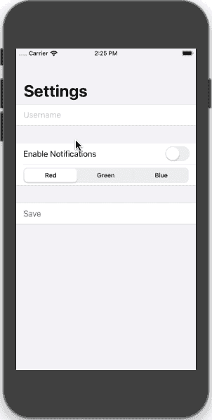

# 介绍会；展示会

这一部分展示了我们展示信息的一些方法。

## 警报

要创建一个简单的提醒，我们必须定义一个标题和消息，并添加一个解除按钮。

为了显示警报，我们添加了一个可绑定的条件来决定警报是否可见。

例如，下面的代码使用了一个`showingAlert`(布尔值)来跟踪是否应该显示警告:

SwiftUI —警报

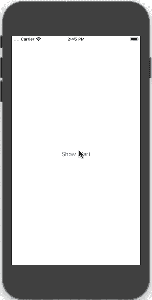

## 行动表

ActionSheet 的实现与 Alert 相同。

SwiftUI —行动表

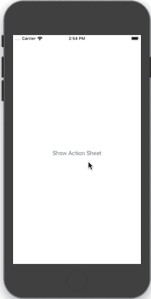

## 波普沃

按照 Alert 使用的相同逻辑，如果我们想要显示弹出窗口，我们必须传递一个布尔绑定来控制弹出窗口的可见性并指定内容:

SwiftUI — Popover

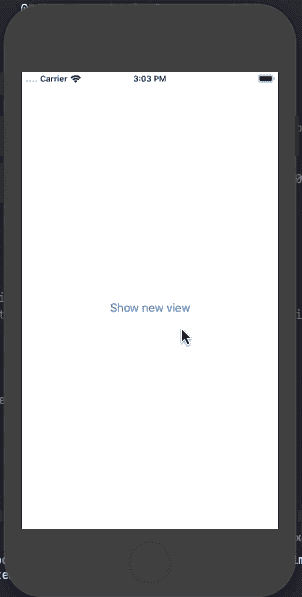

# SwiftUI 应用程序

如果您想查看之前的示例和 SwiftUI 的其他组件，我已经创建了一个示例项目，从中我们可以看到如何使用 SwiftUI 创建一个应用程序。这是资源库链接:[https://github . com/lucasPelizza/SimpleSwiftUIExample/tree/master](https://github.com/lucasPelizza/SimpleSwiftUIExample/tree/master)

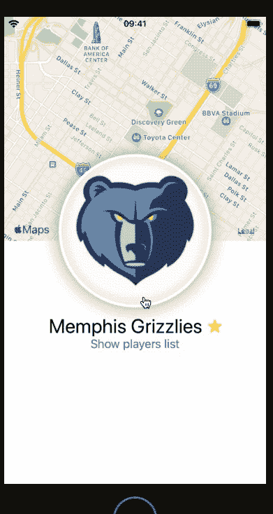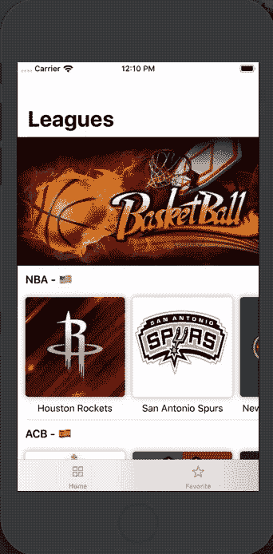

SwiftUI 示例

# 最后的话

我希望这篇文章对你有帮助！