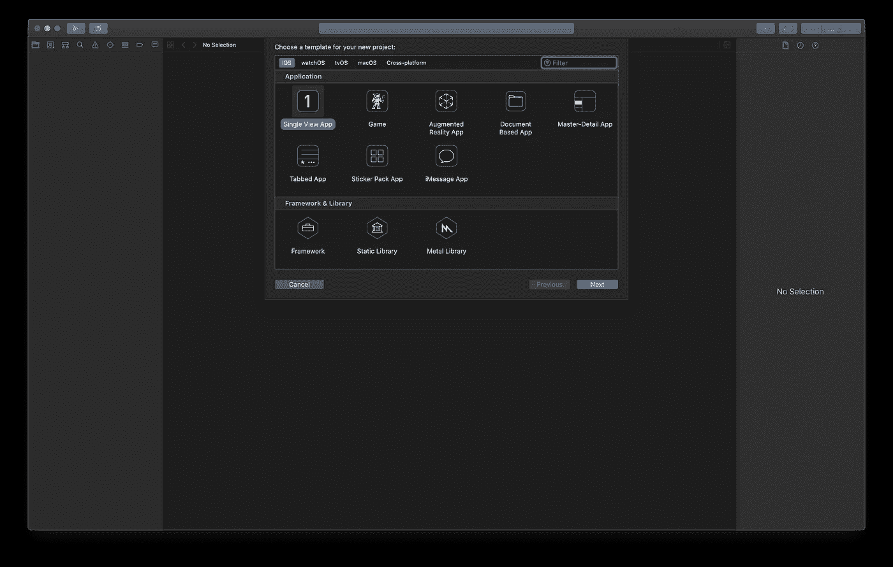
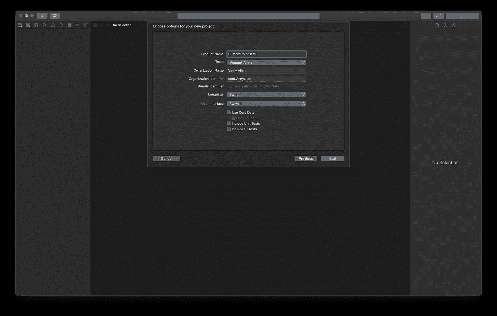
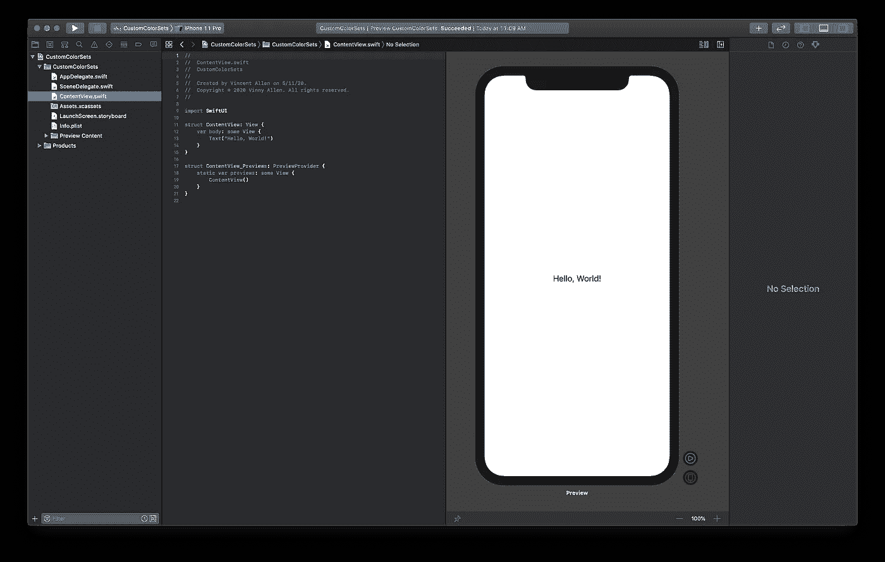
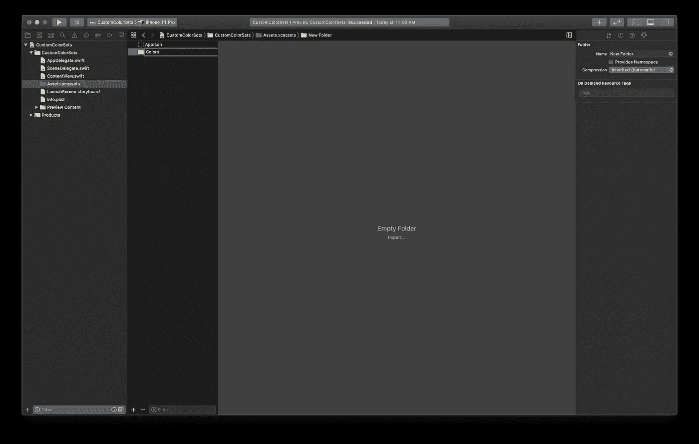
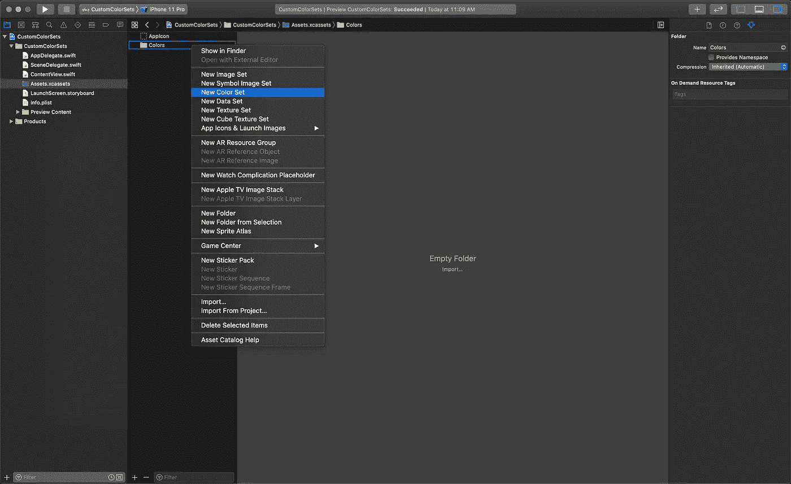
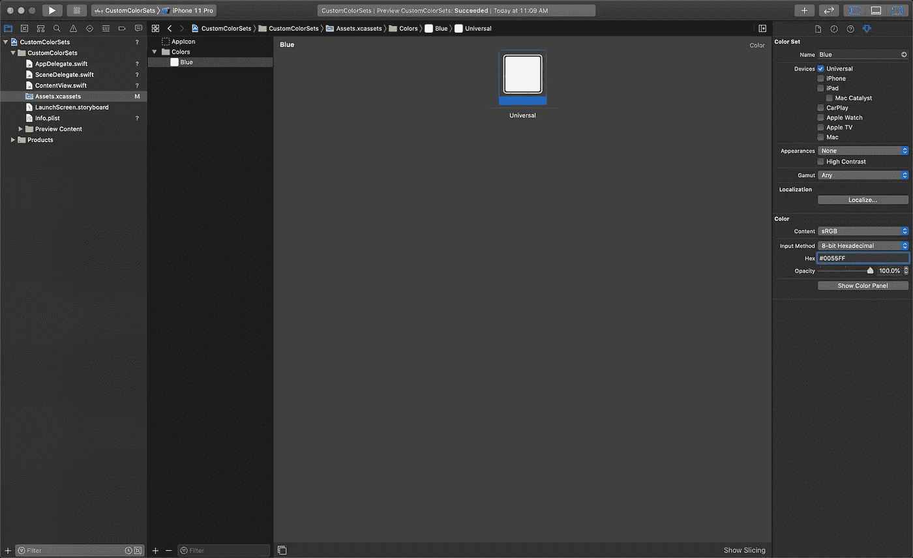
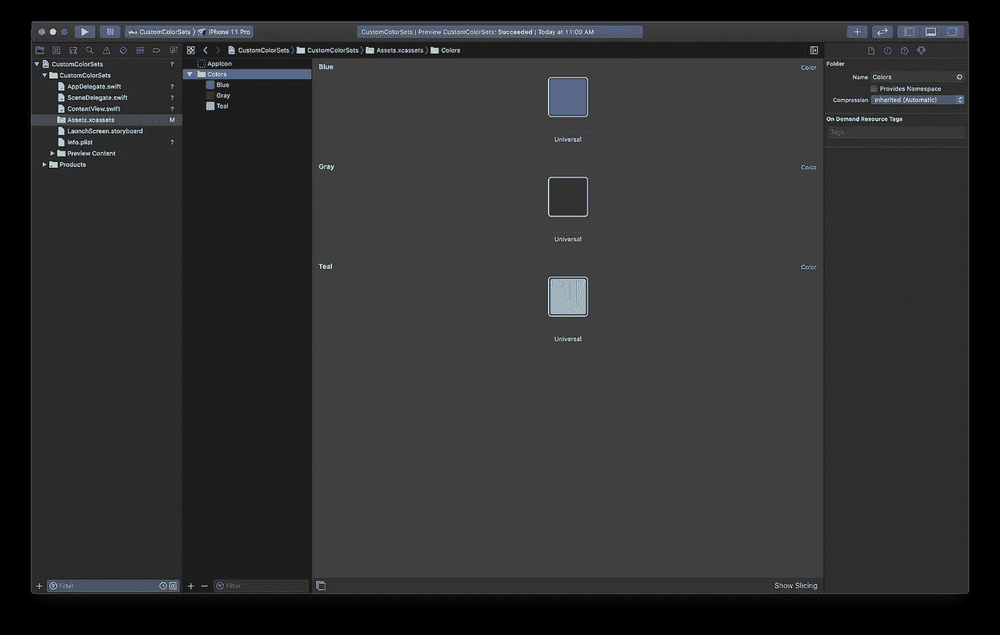
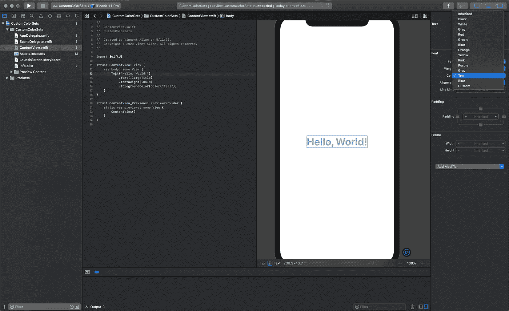

# 如何在 SwiftUI 中使用和定义自定义颜色

> 原文：<https://betterprogramming.pub/swiftui-basics-custom-color-sets-c882ab88f194>

## 在 SwiftUI 中创建和使用自定义颜色变量

# 创建新项目(或使用现有项目)

打开 Xcode 并选取“创建新的 Xcode 项目”选择“单视图应用程序”



点击“下一步”,为您的产品命名。确保您的语言设置为“Swift ”,并且您的用户界面设置为“SwiftUI”



点击“下一步”选择您的项目文件位置，然后单击“创建”在预览窗口中单击“继续”来构建您的项目。您现在应该会看到与下面屏幕相同的视图:



导航到您的`Assets.xcassets`文件夹。这是您的所有项目资源(如图像、应用程序图标文件和颜色)所在的位置。

右键单击“应用图标”下的空白区域，选择“新建文件夹”，并将其命名为“颜色”(这一步不是必需的，但有助于保持整洁)。



右键单击刚刚创建的文件夹，然后选择“新建颜色集”颜色集是声明颜色值的实例变量。在该设置中，您可以为暗模式、亮模式或任何模式定义该颜色的变化，以及为不同的设备类型定义变化。我将在另一篇文章中讨论这个问题。



让我们从导入我们的原色集开始。选择颜色样本。在右侧的“颜色集属性”面板中，您将看到您的选项。

命名您的第一种颜色，并选择“8 位十六进制”作为输入法。这仅仅是我的偏好，但是我认为从 Sketch 复制和粘贴会更容易。

将您的十六进制代码粘贴到十六进制字段:



现在，您应该可以在样本中看到预览的颜色。

根据需要重复此步骤，以包含您的所有品牌颜色:



# 使用您的新颜色集

有两种方法可以在 Swift UI 中使用您的自定义颜色。

*   在设备预览中选择您的对象。选取属性检查器下的“颜色”。您的自定义颜色现在显示在列表的底部！



SwiftUI 的伟大之处在于，您在设备预览中所做的更改将会反映在您的代码中。

*   您可以通过调用以下命令来调用您的新颜色集:

```
Color("YourColorName")
```

要更改文本颜色，请将此属性添加到文本对象中:

```
.foregroundColor(Color("YourColorName"))
```


感谢阅读！期待更多 SwiftUI 基础知识文章即将发布。

# 更多 SwiftUI 基础知识

*   [SwiftUI 基础:导入自定义字体](https://medium.com/@VinnyAllen/swiftui-basics-importing-custom-fonts-b6396d17424d)