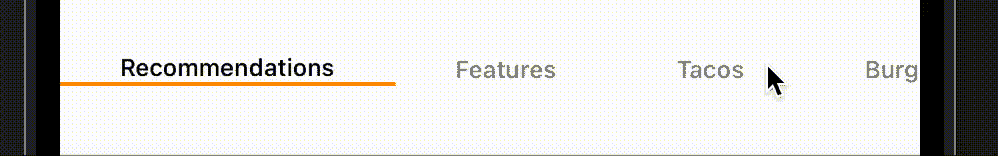
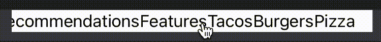
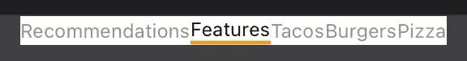
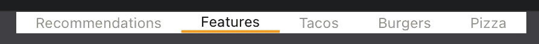
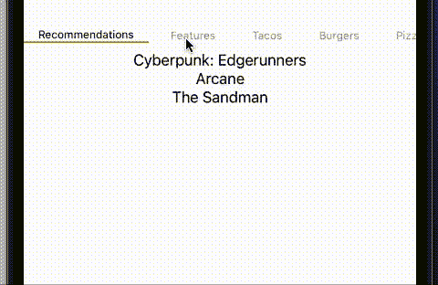

# 在 SwiftUI 中构建水平过滤器视图

> 原文：<https://betterprogramming.pub/swiftui-basics-horizontal-filter-view-fb031fbe7e40>

## scroll view+h stack+enum

许多应用程序需要一个水平过滤器来显示不同类别的内容。UIKit 包含了大量构建这些视图的方法，从自己构建解决方案到导入完整的第三方 SDK 来处理它。

另一方面，SwiftUI 仍然相对较新(尽管已经是第三年)。毫不奇怪，在生产环境中，您可能很难以简单、可伸缩和可定制的方式复制这种行为。

本文旨在向您展示一种快速且易于理解的方法，您可以在 SwiftUI 中完全复制水平过滤器视图。

我们开始吧！

重要的事情先来！我们需要几样东西:

1.  表示我们要显示的项目的枚举
2.  表示我们的水平过滤器容器的视图。
3.  一个`Binding`变量，用于跟踪所选的过滤器
4.  我们希望在容器中显示的项目数组

上面的代码将产生一些可以编译的东西，还没有显示任何东西，但是确实给了我们一个很好的基础。

添加了一个`ScrollView`作为第一个视图元素，因为我们希望所有的过滤器项目都可以在其范围内滚动，接下来是用于创建过滤器水平列表的`HStack`。

你可能会注意到我们的枚举符合`CaseIterable`这允许我们使用`allCases`变量来返回枚举的所有情况，按照它们作为数组声明的顺序。

让我们继续讨论遍历我们的`FilterCategory`枚举并填充我们的`HStack`的逻辑。

在我们刚刚创建的`HStack`中添加下面的代码，这将迭代数组中的每一项，并创建一个`Text`视图，其内容是当前 enum 的`rawValue`(“推荐”、“特性”等)。).您还可以看到添加了一个修饰符`onTapGesture`来改变当前的`selectedItem`

如果您现在运行这段代码，您应该会看到以下内容:

我们有一个可滚动的水平列表。

虽然我们还没有完成，我们有一些视觉上的东西可以与你互动，但它看起来不太好，当然也不能清楚地表明你选择了哪个项目。让我们现在就解决这个问题！

是时候创建一个新视图来表示我们的单个过滤器项目了。我们想要的东西，显示标题(枚举字符串值)的黑色，如果被选中，灰色，如果没有提供一些视觉对比，以及一个漂亮的明亮的下划线，真正显示哪个是当前的过滤器。

这里有一点需要解释，让我们来分解一下:

*   我们已经创建了一个新的`View`来包含我们对水平过滤器项目的逻辑和定制。// 1
*   我们有一个常数用于存储过滤器类别// 2
*   所选过滤器的绑定变量// 3
*   用于垂直排列`Text`元素的`VStack`和下划线// 4 的`Rectangle`
*   一个`Text`元素，显示过滤项的 rawValue，带有一些基本的字体定制，但带有一些嵌入的逻辑，根据常量是否匹配选定的过滤器来改变文本的颜色。// 5
*   一个`if`语句，使用我们刚刚实现的改变`Text`颜色的相同逻辑来显示/隐藏`Rectangle`。
*   最后，我们创建了一个高度固定的`Rectangle`，它的颜色设置为明亮的`.orange`

这看起来更好！但是，还不完全是这样，在设置了`Text`元素的字体之后，添加以下内容。

好多了！

这基本上涵盖了它的实现，允许您选择不同的元素并更新所选的过滤器，但您可能会问，这在什么情况下有用？与独立视图相比，它如何在应用程序中实现？

下面是一个简单的示例，使用我们构建的内容来展示如何基于所选的过滤器切换内容:

水平过滤器视图的 SwiftUI 实施到此结束，最终演示如下:

注意:要在生产中使用这个实现，为水平视图和视图项创建视图模型是值得的。