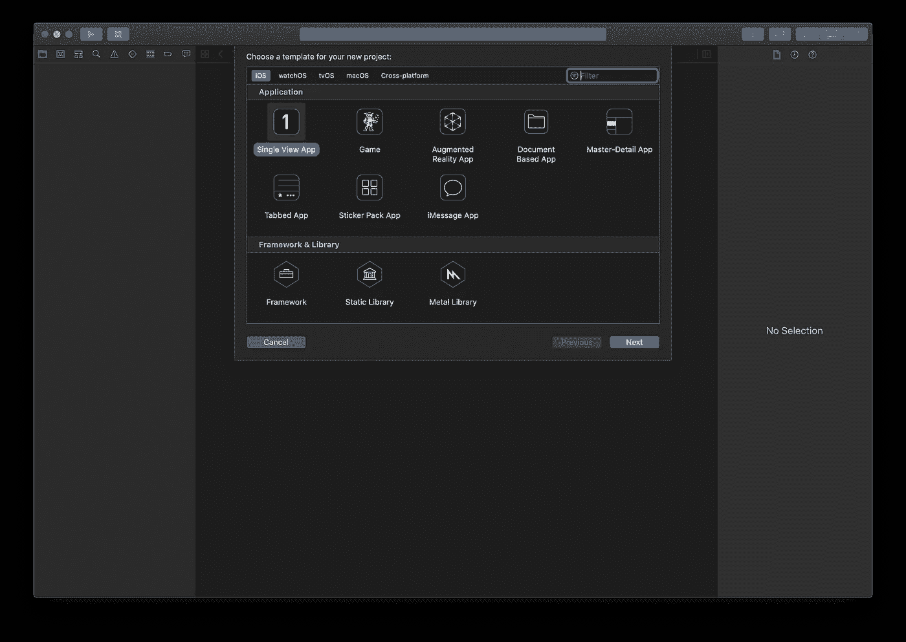
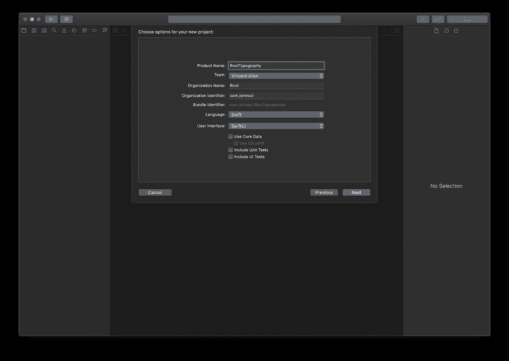
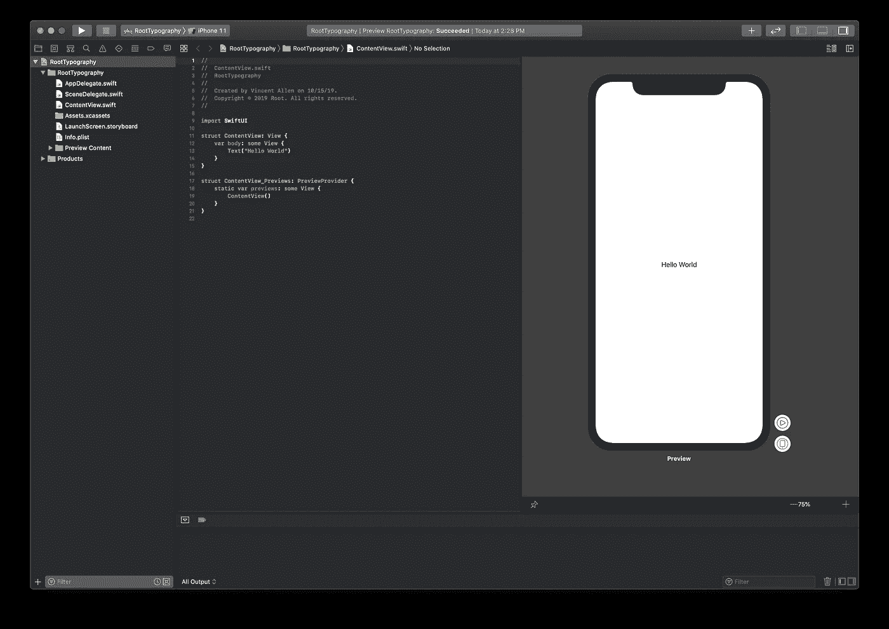
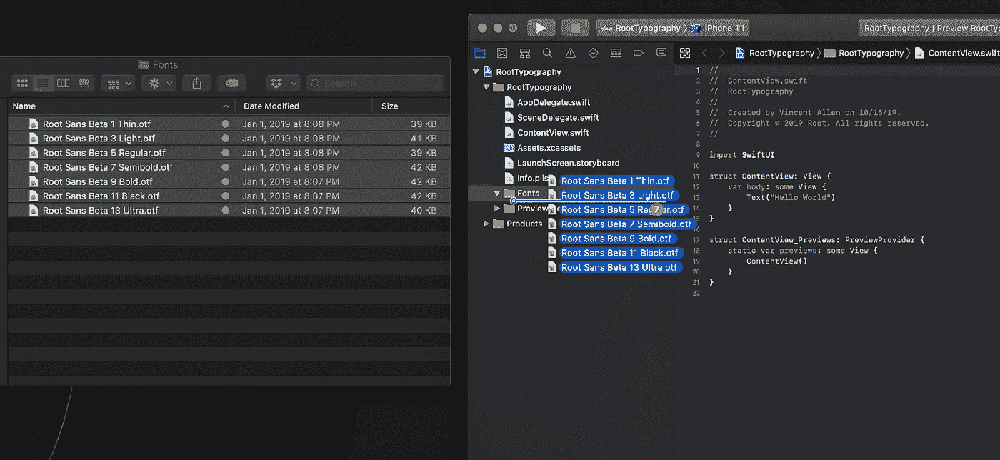
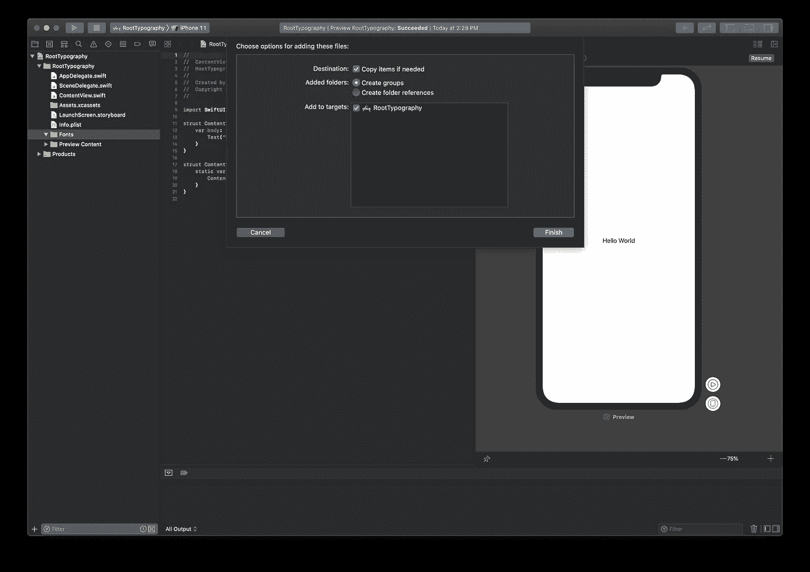
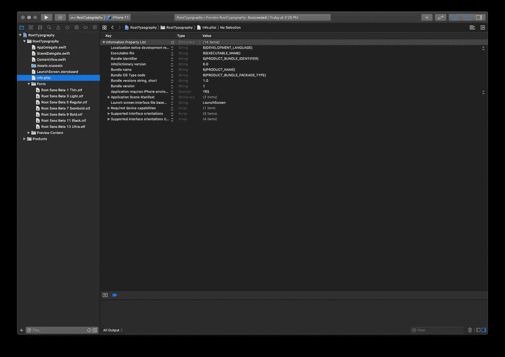
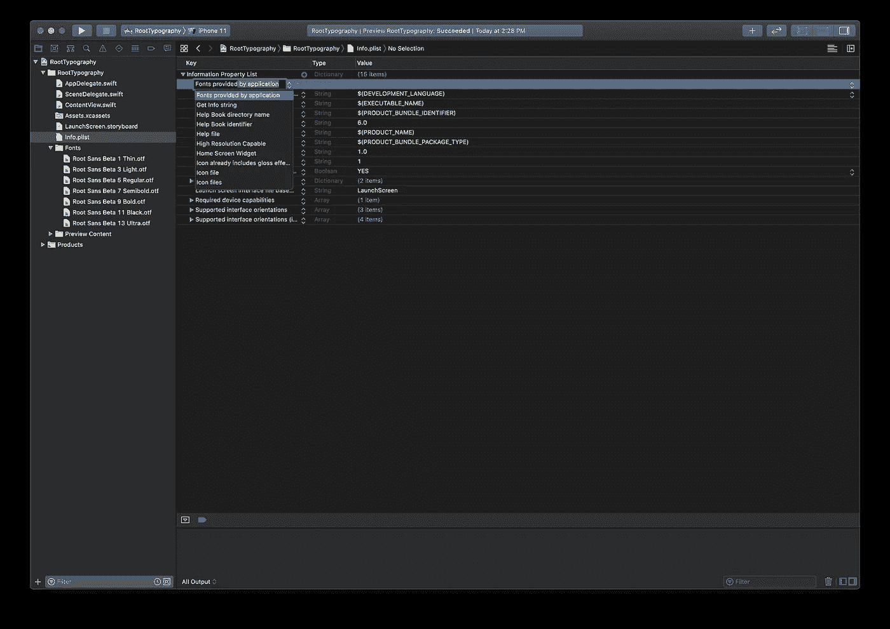

# 如何在 SwiftUI 中使用自定义字体

> 原文：<https://betterprogramming.pub/swiftui-basics-importing-custom-fonts-b6396d17424d>

## 在 SwiftUI 应用程序中导入和显示自定义字体


由[拍摄的耶鲁安穴獭](https://unsplash.com/@jeroendenotter?utm_source=unsplash&utm_medium=referral&utm_content=creditCopyText)在 [Unsplash](https://unsplash.com/s/photos/font?utm_source=unsplash&utm_medium=referral&utm_content=creditCopyText)

# 创建新项目(或使用现有项目)

打开 Xcode 并选取“创建新的 Xcode 项目”选择“单视图应用程序”



点击“下一步”,为您的产品命名。确保您的语言设置为“Swift”，用户界面设置为“SwiftUI”



点击“下一步”选择您的项目文件位置，然后单击“创建”在预览窗口中单击“resume”来构建您的项目，现在您应该会看到与下面的屏幕相同的视图。



# 添加您的自定义字体文件

下一步是将自定义字体文件复制到项目中。SwiftUI 支持文件格式`.otf`和`.ttf`。

在你的项目目录中创建一个名为`Fonts`的新组，并将你将要使用的字体文件拖到这个文件夹中。



## 重要的

然后会出现一个对话框提示您。确保在“添加到目标”下检查您的项目名称这将确保您的字体在构建时被编译为资源。



# 将字体添加到 Info.plist

您的字体文件现已成功添加到您的项目中。现在你必须告诉你的项目去寻找它们。导航到`Info.plist`。



单击“信息属性列表”旁边的“+”图标，搜索“应用程序提供的字体”按回车键。这将创建一个新的数组来存放你的字体名称。



接下来，单击刚刚创建的新阵列旁边的“+”图标。

为您希望支持的每个字体文件创建一个项目，并在字符串字段中输入与字体文件名完全相同的名称。该字符串还应该包括字体文件的扩展名。


# 应用您的字体

就是这样！现在，您可以使用自定义字体文本修改器来应用字体。输入显示的字体名称，不包括扩展名。

```
.font(.custom("Your-Font-Name", size: 48))
```


感谢阅读！期待更多 SwiftUI 基础知识文章即将发布。