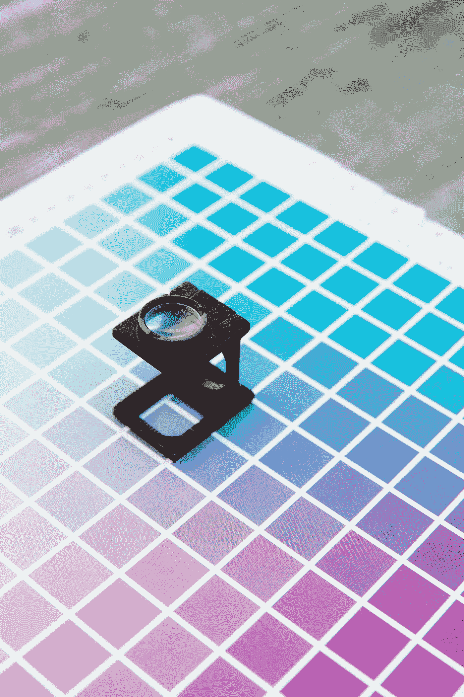
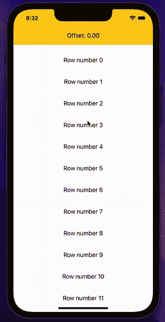

# SwiftUI:计算 ScrollViews 中的滚动偏移量

> 原文：<https://betterprogramming.pub/swiftui-calculate-scroll-offset-in-scrollviews-c3b121f0b0dc>

## 了解如何在 SwiftUI ScrollView 中计算实时偏移量



由 [Markus Spiske](https://unsplash.com/@markusspiske?utm_source=medium&utm_medium=referral) 在 [Unsplash](https://unsplash.com?utm_source=medium&utm_medium=referral) 上拍摄的照片

SwiftUI，创建用户界面的新的声明式方法，确实是一个令人惊叹的框架。有了完整的实时预览，很多事情都可以马上完成，但有时，复制 UIKit 中很常见的东西会变得很麻烦。滚动视图偏移量就是其中之一！

在 UIKit 中，每个`UIScrollView`都有一个属性，允许我们轻松地读取视图本身的偏移量:

```
var contentOffset: CGPoint { get set }
```

它返回一个带有 x 和`y`值的结构。超级简单，超级方便！

遗憾的是，SwiftUI 今天缺少了这个简单的属性。所以我们必须发明一种方法来获取这个值。

在本教程结束时，您将能够创建类似于以下内容的内容:



作者图片

SwiftUI 框架经常允许(或迫使)我们跳出框框思考问题，这是一个很好的机会。

让我们首先构建一个非常简单的 UI，它有一个很长的列表和一个`Text`标签，不能显示真实的偏移值(当然我们稍后会添加这个特性)，正如你可以看到的`verticalOffset` var 从来没有改变:

为了达到上面视频的效果，我们将编写一个`View`代码，它的行为与 SwiftUI `ScrollView`完全一样，但会以某种方式广播其偏移量的实时值。

首先，我们需要创建一个符合协议`PreferenceKey`的新结构。

苹果官方文档给了我们这个协议的定义如下:

> 由视图产生的命名值。
> 具有多个子视图的视图自动将其给定首选项的值组合成对其祖先可见的单个值。

说我们允许一个视图与包含它的视图对话并传递值是一种复杂的方式。

为了符合该协议，必须实现属性和函数，两者都是静态的:

```
static var defaultValue: Self.Value { get }static func reduce(value: inout Self.Value, nextValue: () -> Self.Value)
```

默认值将是我们的偏移量 a `CGPoint`，起始值为`0,0`。

让我们创建`OffsetPreferenceKey`结构，就像这样:

干得好，现在是时候创建我们的版本了。
让我们创建一个 struct，它具有 SwiftUI `ScrollView`的相同属性，但是多了一个东西，`onOffsetChanged`一个当`scrollview`修改其位置时触发的闭包:

正如你所看到的，我使用了一个通用的 var 内容来传递`ScrollView`的所有内容。如定义中所述，结构`T`的类型为`View`。

现在让我们看看`body`属性的实现:

*   在第 2 行，我创建了一个`ScrollView`
*   第 3 行的`GeometryReader`包含一个空视图，而`Color.Clear`没有尺寸。我们需要跟踪一个视图的位置，使用一个无量纲的视图是一个聪明的想法。在其中，我设置了`OffsetPreferenceKey`键，将帧本身的原点作为值传递。我已经使用了`coordinateSpace(name:)`来允许另一个函数找到并操作我们的`Color`视图，并操作与该视图相关的维度。
*   我把原点位置传递给外界，当这个值改变时，在第 15 行启动闭包。
*   在第 12 行，我使用了传递给初始化器的`content`。

这是整个结构:

就这么定了！我们有了全新的`OffsettableScrollView`,它将能够在偏移值改变时传递它！

现在是时候用最后连接的`Text`来修改我们的原始内容视图了:

结束了！正如你所看到的是超级容易和超级干净了！

我希望你喜欢这篇文章。如果你对视频版感兴趣，我的 YouTube 频道上也有这个指南:

编码快乐！