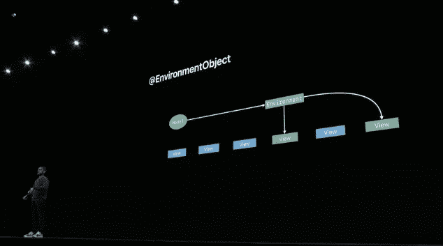

# SwiftUI:选择应用架构

> 原文：<https://betterprogramming.pub/swiftui-choosing-an-application-architecture-6ec9289f8e8f>

## 如果不知道自己需要什么，就很难决定。


Patrick Schneider 在 [Unsplash](https://unsplash.com/?utm_source=unsplash&utm_medium=referral&utm_content=creditCopyText) 上的照片

SwiftUI 软件开发的声明式方法使得为 iOS、Mac 和苹果生态系统的其余部分编写现代应用程序变得非常非常容易。

但是 SwiftUI 并非没有自己的挑战和问题，其中一个问题就是我们应该在全新的 SwiftUI 应用程序中使用什么样的架构？

这是一个经常被问到的问题，也是一个经常被回答的问题——也许没有人会感到惊讶。事实上，有很多很多关于这个主题的文章、书籍和演讲。

不幸的是，其中相当一部分是由渴望将自己喜欢的架构引入 SwiftUI 的人完成的。因此，我们面临着铺天盖地的文章告诉我们为什么应该使用 MVVM，或反应/Redux，或清洁，或毒蛇，或 TCA。或者根本没有。

鉴于我自己写的关于这个问题的文章，我想在这方面我和其他人一样有罪。

然而，问题仍然存在:我们应该选择哪一个？

我们如何决定？

我们用什么标准来做选择？

什么标准…真的吗？

你看，随着最后一个问题，地平线上开始出现一丝曙光。也许，只是也许，如果我们知道另一个问题的答案，回答我们的架构问题会更容易:

我们希望我们的架构解决什么问题？

## 定义问题

物理学家有句老话:时间是阻止一切事情同时发生的东西。

既然时间存在，既然一切*不会同时发生，我们人类决定创造一些计量单位，以便更好地组织事物。*

分钟和秒钟之类的东西。我们进一步聚合和分组为小时和天、月和年等不同的时间段。共同的单位，一个共同的*框架*我们可以用它来讨论时间。来管理它。去*了解*它。

同样，虽然我们可以用一大块代码来编写我们的应用程序，但是作为软件开发人员，我们选择了用代码来编写应用程序。相反，我们试图将我们的应用程序分解成更容易理解的小单元。我们试图编写具有良好定义的角色、行为和责任的类、结构和函数。这是一个观点。那是一个模型。这里的代码是一个提供模型的服务。诸如此类。

应用程序架构基本上可以归结为我们用来决定如何将代码分割成所有这些独立组件的规则。为什么那部分去*那里*，为什么这部分去*这里*。

多年来，我们制定了一些指导方针来帮助我们。类似于*单一责任原则、*开闭原则、依赖倒置原则、和*关注点分离*的思想。

如果这还不够的话，我们甚至还增加了一些高级概念，如*单一事实来源*、*函数式编程*和*单向数据流*。

这些想法中的一些可以很好地结合在一起。其他的会增加额外的复杂性，实际上甚至会使一个简单的程序更难编写、理解和维护。还有一些不过是善意的尝试，试图在 Swift 和 iOS 上强加在其他语言和其他平台上发现的限制和问题。

应用程序架构——任何应用程序架构——都试图将所有这些规则和指导方针整理和平衡成一组我们可以使用和遵循的最佳实践。

如果我们的努力成功了，如果我们很好地选择了我们的组件和架构，我们最终会得到一个功能强大、优雅、易于理解的软件。

所以。如果我们要为 SwiftUI 定义一个理想的架构…我们到底想从它那里得到什么？

## 性能和兼容性

如果有人问我这个问题，我的首要标准之一将是它需要与 SwiftUI 本身很好地协同工作。

除了用简单的声明性接口定义我们的布局，SwiftUI 还带来了另一个主要概念:状态，以及一条数据的单一真实来源的概念。


WWDC 19“通过 SwiftUI 的数据流”演示

更新状态，程序自动显示变化，在这个过程中重新配置和动画。

然而，有些人将单一来源的真理发挥到了极致。他们问，如果一个给定的数据应该有一个真实的来源，那么为什么不为整个应用程序提供一个真实的来源呢？

这是基于 React/Redux 背后的概念的体系结构的基础，虽然这个概念乍一看似乎合乎逻辑，但当应用于 SwiftUI 时，它并非没有缺陷。

我在 SwiftUI 中的[深入内部视图、状态和性能中详细描述了这一点，但底线是 SwiftUI 可以非常有效地确定任何给定数据变更的后果，并且它只会重绘受该变更影响的界面部分。](https://medium.com/swlh/deep-inside-views-state-and-performance-in-swiftui-d23a3a44b79)

然而，创建单个全局状态，我们可能会在较大的应用程序中遇到性能问题，在这些应用程序中，对该状态的更改需要 SwiftUI 在每次发生*任何*更改时检查和/或重建整个视图树(即整个应用程序)中的每个依赖项。

正如苹果在 SwiftUI 演示中的*数据流所指出的，另一种方法是将状态绑定到尽可能低的视图层次结构中。*



WWDC19“通过 SwiftUI 的数据流”演示

当我们在层次结构的底层绑定时，我们极大地减少了所需的界面更新和渲染的数量，因为任何给定的状态变化只会影响视图树的一小部分。

大型全局状态的另一个缺点是，如果您将该状态导入到单个视图中，那么每个人都可以看到所有内容。因此，在不遍历视图中的每一行代码的情况下，您如何确定给定视图可能正在访问或操作什么信息呢？

不太好。

您可以编写额外的代码来过滤状态，使之适合正在讨论的视图…但是您基本上是在编写更多的代码来解决您自己创造的问题。

有点不太理想的情况。

如果你对 SwiftUI 幕后发生的事情感兴趣，我强烈建议你阅读 SwiftUI 文章中的[深层观点、状态和性能，但同时我认为我们可以利用上述问题来排除那些类型的架构。](https://medium.com/swlh/deep-inside-views-state-and-performance-in-swiftui-d23a3a44b79)

那么下一步是什么？

## 简单

SwiftUI 为编写应用程序带来了一种简单的声明式方法。也许更确切地说，是*简洁*。你可以用很少的代码完成很多工作。

因此，给我们自己和我们的应用程序增加过于正式的架构的负担将是一种耻辱，这又一次显著地增加了我们需要编写的代码量。

尤其是样板代码。这可能只是个人偏好，但我讨厌样板代码。此外，我也认为更多的代码会导致更多的错误，因为更多的代码会给那些小傻瓜更多的藏身之处。由于样板代码是样板，为了避免重新输入所有内容，它往往会被复制和粘贴很多次…这反过来会导致您的代码中出现偷偷摸摸的复制/粘贴错误。

对我来说，这倾向于排除过于正式的架构，如 VIPER，它坚持将应用程序的每一部分都分解成视图、交互器、呈现器、实体和路由器。VIPER 架构在很大程度上是基于 SOLID 的*单一责任原则*，但从我的角度来看，它倾向于将这一思想发挥到极致。

VIPER 传统上是与基于 UIKit 的应用程序配对的，在这种情况下，我们很不幸地倾向于为应用程序中的每个屏幕创建一个大的 UIViewController。制作不同的视图、xib 和嵌套视图控制器通常是非常麻烦的工作，所以我们经常懒得这么做。

因此，我们寻找一种方法，将尽可能多的逻辑和用户交互移出视图控制器……我们做到了，每一个都进入了它自己的小部分。

VIPER 创建了许多小的活动部件，因此为管理 VIPER 应用程序而编写的代码中有很大一部分是为了管理 VIPER 本身。

在 SwiftUI 的 [*VIPER 中，我写了很多关于这个主题的内容。求你了。*号](/viper-for-swiftui-please-no-ee61ce99694c)

好的，那么使用另一个 UIKit 通用的架构怎么样，比如 MVP？

## MVP:模型-视图-演示者。

MVP 是许多 UIKit 应用程序中使用的经典架构模式。

这里大部分逻辑从 ViewController 转移到一个称为 Presenter 的对象。给定屏幕的大部分业务逻辑都是在那里执行的，当需要更改时，presenter 向给定视图发送消息，告诉它需要更改和重绘。

这是经典的面向对象的消息传递方法……当您试图将它与 SwiftUI 一起使用时，它会有一些缺点。

首先也是最重要的是，与 UIKit 不同，SwiftUI 视图不是视图。它只是我们界面的一个定义。那个定义*可能*生成一个视图，或者它可能只是在一个视图上创建一个层。也可能是别的什么。

例如，你在代码中看到`HStack`和`VStack`，你可能*认为*正在创建一个`UIStackView` …但事实并非如此。在 SwiftUI `HStack`和`VStack`中，“视图”主要作为布局引擎的指令。它们不是堆栈视图。

因此，从一个演示者到一个特定视图的消息传递是不可能的。目标“对象”首先并不是一个真正的对象，演示者不能持有对它的引用，整个方案很快就分崩离析了。

没有。MVP 也不是很合适。

那么什么是？

## 查看合成

如果有一件事在 WWDC 的各种 SwiftUI 会议中反复出现，那就是 SwiftUI 视图是极其轻量级的，创建它们几乎没有性能损失。

因此，在 SwiftUI 中，您可以根据应用程序的需要创建尽可能多的独特和特殊用途的视图，这是您的独特优势。

我已经在 SwiftUI 合成的[最佳实践](/best-practices-in-swiftui-composition-282b02772a24)和 SwiftUI 的[视图合成](https://medium.com/swlh/structural-decomposition-in-swiftui-8892e512b18e)中写了很多关于这个概念的文章，所以如果你想知道更多，我建议你把这些文章添加到你的阅读列表中。

但是这里关键的一点是，如果我们用较小的视图和视图组件构建我们的应用程序，那么我们就不需要像 VIPER 或 MVP 这样的解决方案通常会产生的额外的复杂性。

## 测试

然而，有可能把钟摆摆得太远，并根据目前所说的一切决定我们根本不需要任何*架构。只要把我们所有的代码塞进一堆小视图里，然后就完事了。*

考虑以下观点。

```
struct OrderDetailsRowView: View {
    var item: OrderItem
    var body: some View {
        HStack {
            if item.quantity == 1 {
                Text(item.name)
            } else {
                Text("\(item.name) $(\(item.quantity, specifier: "%.2f") @ $\(item.price, specifier: "%.2f")")
            }
            Spacer()
            Text("$(\(item.total, specifier: "%.2f")")
        }
    }
}
```

这是 SwiftUI 中小型专用视图的一个很好的例子。除了所有的逻辑和格式都被塞进了视图体之外，这也许很棒。

这使得我们很难编写测试用例来确保这个视图的输出是正确的。

## 关注点分离

经常提出的主要架构是 MVVM(模型-视图-视图模型)。

也就是说，它实际上应该写成 Model-View Model-View(MVMV ),因为视图模型是应用程序数据(模型)和视图需求(布局)之间的中介。

当使用视图模型时，我们希望将尽可能多的逻辑移出视图，留下非常容易理解的代码。

这是关注点分离的一个很好的例子。我们将业务逻辑放在围栏的一边，而将所有视图表示和布局放在另一边。

这可以用一个例子来更好地说明，所以让我们考虑一个不同的 SwiftUI 视图，它是我们前面的`OrderDetailsRowView`视图的父视图:

```
struct OrderDetailsView: View { @StateObject var vm = OrderDetailsViewModel() var body: some View {
     Form {
        if vm.message.hasMessage {
            StatusMessageView(type: vm.message)
        }        LabelValueRowView(label: "Order", value: vm.dateValue)

        ForEach(vm.items) { item in
            OrderDetailsRowView(item: item)
        }                if vm.hasDiscount {
            LabelValueRowView(label: "Subtotal", value: vm.subtotal)
            OrderDetailsDiscountView(value: vm.discount)
        }                LabelValueRowView(label: vml.totalLabel, value: vm.total)                Button("Order Again") {
            self.vm.reorder()
        }
     }
     .onAppear {
        vm.load()
     } }
}
```

注意，这个视图中的所有东西都是由视图模型驱动的。

所有条件值和计算值都来自视图模型。有几个`if`语句控制某些元素的可见性，但是同样，这些*决策*背后的逻辑是在模型中制定的。视图只是执行它们。

当状态改变时，比方说通过点击“Order Again”按钮，视图再次基于视图模型重新生成

因此，如果我们测试我们的视图模型，如果我们看到期望的输出，如果*我们的视图正确地绑定到我们的视图模型，那么我们可以相当有把握地说我们的屏幕——以及我们的代码——是正确的。*

## 测试专用视图

虽然我个人认为 MVVM 非常适合 SwiftUI，但在某些情况下，甚至 *it* 也可能有些矫枉过正。*不是每个视图都需要不同的视图模型。*

例如，我们可以重构原始的细节行视图，如下所示。

```
struct OrderDetailsRowView: View { var item: OrderItem var body: some View {
        HStack {
            Text(itemDescription)
            Spacer()
            Text(itemTotal)
        }
    } var itemDescription: String {
        if item.quantity == 1 {
            return item.name
        } else {
            return "\(item.name) (\(item.formattedQuantity) @ \(item.formattedPrice))"
        }
    } var itemTotal: String {
        item.formattedTotal
    }
}
```

给定这个视图体，很容易理解我们显示的是两个数据片段，从业务逻辑的角度来看，没有什么会出错的。

随着条件逻辑和格式分解成不同的变量，可以用一个条目实例化视图*本身*，用*测试*我们的逻辑，看它是否正确，然后用两个条目创建另一个视图并测试它。

```
func testOrderDetailsRowView() { let view1 = OrderDetailsRowView(item: OrderItem.mock1)
    XCTAssert(view1.itemDescription == "Soft Drink")
    XCTAssert(view1.itemTotal == "$1.99") let view2 = OrderDetailsRowView(item: OrderItem.mock2)
    XCTAssert(view2.itemDescription == "Cheeseburger (2 @ $4.99)")
    XCTAssert(view2.itemTotal == "$9.98")}
```

同样，我们只需要将尽可能多的逻辑从视图主体的*移出*，并将其放入我们可以从视图外部的*看到的变量和函数中。*

因为，套用一句军事格言:如果我们能看到它，我们就能测试它。

也就是说，如果一个给定的视图开始变得太大，我会开始考虑如何将它分成更小的视图，或者开始将我的条件代码和格式转移到一个专用的视图模型中。

如果一个给定的视图需要处理 API 请求、处理错误和错误消息、管理空列表等边缘情况，那么我肯定会转向专用的视图模型。

*有关使用网络请求逻辑正确设置虚拟机的更多信息，请参见:* [*在 SwiftUI 中使用视图模型协议？你做错了。*](/swiftui-view-models-are-not-protocols-8c415c0325b1)

## SwiftUI 架构的标准

总而言之，我选择 SwiftUI 架构的标准如下…

1.  无论应用程序大小如何，它都必须是高性能的。
2.  它必须与 SwiftUI 行为和状态管理兼容。
3.  它应该简洁、轻量、适应性强、灵活。
4.  它鼓励 SwiftUI 视图合成。
5.  它支持测试。

换句话说，它让 SwiftUI 成为 SwiftUI。

## 完成块

看起来好像是我牵着你的手，带你走上了站在 MVVM 祭坛前的道路(公平地说，这正是我所做的)。但至少我们现在知道了*为什么*我们会在它面前，基于我们所做的选择。

你同意我的标准吗？你自己有吗？同意我的结论还是我错过了什么？不管怎样，我都想知道，所以请在下面的评论区给我留言。

```
**Want more interesting stories?**Feel free to check out the other articles in my [SwiftUI Series](https://michaellong.medium.com/the-swiftui-series-abc180690a9d).
```